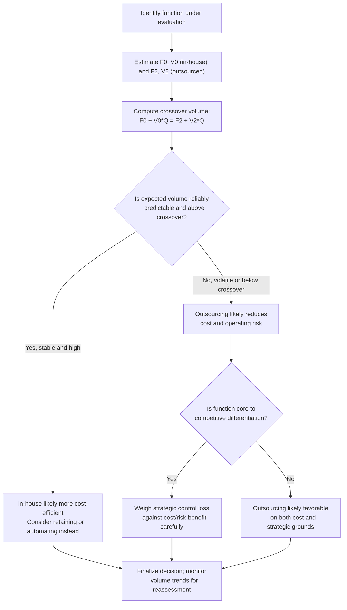

## Outsourcing and Variabilizing Fixed Costs

### Conceptual Foundation

Outsourcing — contracting an external party to perform a function previously handled in-house — is one of the primary mechanisms by which firms deliberately convert fixed costs into variable costs, a process often termed **cost variabilization**. Where automation moves the cost structure toward the fixed end of the spectrum (converting variable labor into fixed capital costs), outsourcing typically moves it in the opposite direction: converting fixed internal costs (salaried staff, owned equipment, dedicated facilities) into variable, usage-based, or contractually flexible expenses paid to a third party. This makes outsourcing a direct lever for **reducing operating leverage (DOL)** and managing business risk.

**Key Points**

- Outsourcing typically replaces fixed internal costs with variable or semi-variable per-unit or per-transaction fees paid to a supplier.
- This shift lowers DOL, reducing EBIT sensitivity to sales fluctuations and lowering the breakeven volume.
- The tradeoff is usually a higher cost per unit at high volume (the outsourcing partner embeds its own margin and fixed-cost recovery into the price), exchanging some scale efficiency for flexibility.
- Variabilization is a risk-management strategy as much as a cost strategy — it is often pursued specifically to reduce exposure to demand uncertainty, not solely to cut costs.

---

### The Mechanical Effect on Cost Structure

Before outsourcing, an in-house function might be structured as:

$$\text{Total Cost} = F_0 + V_0 \cdot Q$$

Where $F_0$ includes salaried staff, dedicated equipment depreciation, and facility overhead tied to the function.

After outsourcing, the function is typically restructured as:

$$\text{Total Cost} = F_2 + V_2 \cdot Q, \quad \text{where } F_2 < F_0 \text{ and often } V_2 > V_0$$

The outsourcing arrangement eliminates or substantially reduces the fixed internal cost base ($F_2 < F_0$), replacing it with a per-unit or per-transaction fee that scales with volume ($V_2$), which frequently exceeds the prior internal variable cost since the external provider must recover its own costs and margin.

**Worked Example:**

A firm currently operates an in-house customer service department:

- Fixed costs (salaried staff, facility, systems): $F_0 = \$600{,}000$
- Variable cost per unit of service (marginal cost of additional call volume): $V_0 = \$4$
- Effective "price" or cost-avoidance benchmark per unit isn't directly comparable here since this is a cost center; instead compare total cost at varying volumes.

**Current in-house total cost at three volume levels:**

| Volume (Q) | In-house Total Cost |
| --- | --- |
| 100,000 | $600{,}000 + 4(100{,}000) = \$1{,}000{,}000$ |
| 150,000 | $600{,}000 + 4(150{,}000) = \$1{,}200{,}000$ |
| 50,000 | $600{,}000 + 4(50{,}000) = \$800{,}000$ |

**Proposed outsourcing arrangement:** eliminates the fixed department cost, replaced with a per-unit outsourced fee of $V_2 = \$7$ and a small residual fixed cost for vendor management: $F_2 = \$50{,}000$.

| Volume (Q) | Outsourced Total Cost |
| --- | --- |
| 100,000 | $50{,}000 + 7(100{,}000) = \$750{,}000$ |
| 150,000 | $50{,}000 + 7(150{,}000) = \$1{,}100{,}000$ |
| 50,000 | $50{,}000 + 7(50{,}000) = \$400{,}000$ |

**Crossover volume:**

$$600{,}000 + 4Q = 50{,}000 + 7Q \implies 550{,}000 = 3Q \implies Q = 183{,}333$$

**Interpretation:** Below approximately 183,333 units of volume, outsourcing is the lower-cost option despite the higher per-unit fee, because the firm avoids carrying the large fixed cost base. Above that volume, keeping the function in-house becomes cheaper due to the lower marginal cost once fixed costs are already covered. This example illustrates the classic variabilization tradeoff: outsourcing wins at lower or more uncertain volumes; owning the fixed asset wins at high, reliably sustained volumes.

---

### Effect on Operating Leverage

Using the in-house structure at $Q = 100{,}000$ as a reference point (treating this as a cost center, DOL concepts are typically expressed for profit-generating operations — but the underlying fixed/variable sensitivity concept still applies directly to cost volatility):

**In-house fixed cost proportion at Q=100,000:** $600{,}000 / 1{,}000{,}000 = 60\%$ of total cost is fixed.

**Outsourced fixed cost proportion at Q=100,000:** $50{,}000 / 750{,}000 = 6.7\%$ of total cost is fixed.

This dramatic shift in the fixed-cost proportion is the essence of variabilization: total cost becomes far more responsive to actual volume, meaning that if demand falls unexpectedly, the outsourced cost structure shrinks nearly proportionally, while the in-house structure remains largely burdened by its fixed base regardless of the volume decline. Applied within a broader profit-generating operation (rather than an isolated cost center), this same mechanism directly reduces DOL, since a smaller proportion of total costs are fixed relative to the contribution margin.

---

### Comparative Framework

| Dimension | In-House (Fixed-Heavy) | Outsourced (Variable-Heavy) |
| --- | --- | --- |
| Cost behavior | Largely fixed regardless of volume | Scales closely with volume |
| Cost per unit at high volume | Lower (fixed costs spread over more units) | Higher (embedded vendor margin) |
| Cost per unit at low volume | Higher (fixed costs spread over fewer units) | Lower (few fixed costs to spread) |
| Downside protection in a downturn | Weak — fixed costs persist | Strong — costs contract with volume |
| Operating leverage impact | Raises DOL | Lowers DOL |
| Control and quality oversight | Direct control | Indirect, contract/SLA-dependent |
| Flexibility to scale up quickly | Constrained by hiring/capacity limits | Often faster, limited by vendor capacity |
| Strategic/IP sensitivity | Full internal control retained | Some loss of direct control over process/data |

---

### Strategic Considerations Beyond Pure Cost Comparison

1. **Demand volatility is the central driver.** Variabilization is most valuable precisely when future volume is uncertain or cyclical — the firm pays a volume-based premium in exchange for avoiding the risk of carrying unused fixed capacity during a downturn, or being unable to scale quickly during a demand surge.
2. **Core versus non-core function distinction.** Firms typically outsource functions that are not central to competitive differentiation (e.g., payroll processing, IT support, logistics) while keeping core, strategically differentiating functions in-house, since outsourcing entails some loss of direct control and institutional knowledge retention. [Inference: this is a commonly cited strategic heuristic, though actual outsourcing decisions in practice weigh many additional factors including quality risk, data security, and switching costs]
3. **Quality and service-level risk.** Outsourced arrangements depend on the vendor's own performance and reliability; service-level agreements (SLAs) and contractual protections become the primary mechanism for managing this risk, replacing the direct managerial oversight available with an in-house function.
4. **Reversibility and switching costs.** Outsourcing arrangements are often easier to unwind or renegotiate than fixed capital investments, offering more strategic optionality — though rebuilding in-house capability after an extended outsourcing period can itself carry meaningful cost and time. [Inference]
5. **Interaction with financial leverage.** Because variabilization lowers DOL, it can create *additional capacity* for financial leverage under a firm's total risk tolerance ($DTL = DOL \times DFL$) — a firm reducing its operating risk through outsourcing may, in principle, be able to sustain a somewhat higher DFL for the same overall DTL target.

---

### Diagram: Variabilization Cost Structure Shift (svg_diagram)

<svg xmlns="http://www.w3.org/2000/svg" viewBox="0 0 760 400" font-family="Arial, sans-serif">
<text x="380" y="26" text-anchor="middle" font-size="17" font-weight="bold">Outsourcing: Fixed-to-Variable Cost Shift (svg_diagram)</text>
<line x1="80" y1="360" x2="700" y2="360" stroke="black" stroke-width="2" />
<line x1="80" y1="360" x2="80" y2="60" stroke="black" stroke-width="2" />
<text x="390" y="385" text-anchor="middle" font-size="13">Volume (Q)</text>
<text x="30" y="210" text-anchor="middle" font-size="13" transform="rotate(-90 30 210)">Total Cost ($)</text>

<line x1="80" y1="260" x2="700" y2="130" stroke="#c0392b" stroke-width="2.5" />
<text x="580" y="120" font-size="12" fill="#c0392b">In-House (high F, lower V)</text>
<line x1="80" y1="260" x2="700" y2="260" stroke="#c0392b" stroke-width="1" stroke-dasharray="4,2" />

<line x1="80" y1="340" x2="700" y2="90" stroke="#27ae60" stroke-width="2.5" />
<text x="580" y="80" font-size="12" fill="#27ae60">Outsourced (low F, higher V)</text>
<line x1="80" y1="340" x2="700" y2="340" stroke="#27ae60" stroke-width="1" stroke-dasharray="4,2" />

<circle cx="470" cy="167" r="5" fill="black" />
<line x1="470" y1="167" x2="470" y2="360" stroke="black" stroke-width="1" stroke-dasharray="3,3" />
<text x="480" y="180" font-size="11" font-weight="bold">Crossover volume</text>
<text x="150" y="320" font-size="11" fill="#555">Below crossover: outsourcing cheaper</text>
<text x="500" y="110" font-size="11" fill="#555">Above crossover: in-house cheaper</text>
</svg>

---

### Decision Workflow

---

### Common Analytical Pitfalls

- **Comparing costs only at current volume** without solving for the crossover volume, which can lead to an incorrect conclusion if current volume happens to sit near the crossover point or is expected to shift materially.
- **Ignoring the risk-reduction value of variabilization** by evaluating outsourcing purely as a cost-minimization exercise, missing its role in reducing DOL and business risk exposure — a benefit that may justify a higher per-unit cost even when in-house is marginally cheaper at expected volume.
- **Underestimating switching and re-onboarding costs** if the firm later decides to reverse an outsourcing decision and rebuild in-house capability. [Inference]
- **Overlooking quality/control tradeoffs** by focusing solely on the cost-structure mathematics, without weighing the strategic importance and differentiation value of the function being considered for outsourcing.

---

### Related Topics

- Degree of Operating Leverage (DOL) and its relationship to cost structure choices
- Automation and Its Effect on the Fixed Variable Mix (the inverse variabilization direction)
- Capital Intensive versus Labor Intensive Cost Structures
- Make-or-buy decision analysis and vertical integration tradeoffs
- Capital structure implications of high/low operating leverage
- Service-level agreement (SLA) design and vendor risk management
- Core competency theory and strategic outsourcing frameworks