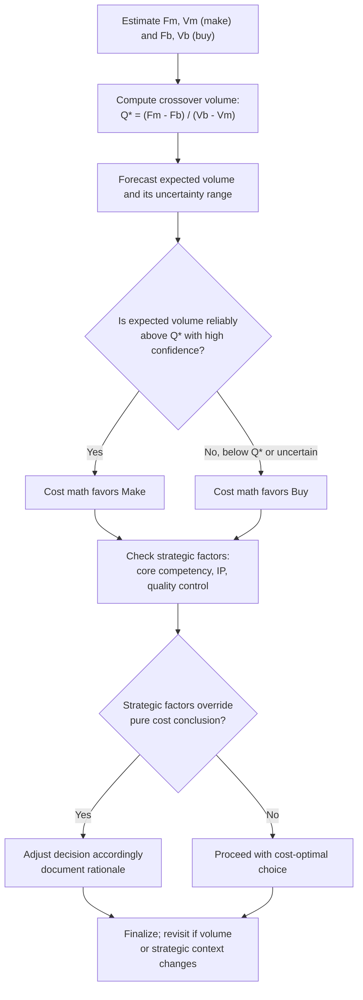

## Make or Buy Decisions and Cost Structure Impact

### Conceptual Foundation

The make-or-buy decision is the choice a firm faces between producing a component, product, or service internally ("make") versus purchasing it from an external supplier ("buy"). While often framed as a pure cost-minimization problem, the decision has a direct and often underappreciated **cost structure** dimension: making internally typically requires fixed investment in capacity (equipment, facilities, dedicated staff), while buying externally converts that same requirement into a variable, per-unit purchase cost. This connects the make-or-buy decision directly to operating leverage, breakeven economics, and business risk — situating it as a close relative of the automation and outsourcing decisions covered elsewhere in this chapter, but framed specifically around the sourcing of a discrete input rather than an entire function.

**Key Points**

- "Make" decisions typically embed fixed costs (capacity investment, dedicated overhead) recovered across produced volume.
- "Buy" decisions typically convert that same requirement into a variable per-unit cost paid to a supplier.
- The financially optimal choice depends on expected volume relative to a calculable crossover point, not on unit cost comparisons alone.
- Beyond cost, the decision carries strategic dimensions: capacity utilization, quality control, supplier dependency, and flexibility under demand uncertainty.

---

### The Core Analytical Framework

**Make (internal production) total cost:**

$$TC_{make} = F_m + V_m \cdot Q$$

Where $F_m$ is the fixed cost of the capacity required to make the item (equipment, dedicated facility space, supervisory staff) and $V_m$ is the variable cost per unit to produce it internally (direct materials, direct labor, variable overhead).

**Buy (external purchase) total cost:**

$$TC_{buy} = F_b + V_b \cdot Q$$

Where $F_b$ is typically minimal or zero (perhaps a small fixed cost for supplier management or quality inspection) and $V_b$ is the per-unit purchase price paid to the supplier, which is usually higher than $V_m$ since the supplier embeds its own fixed-cost recovery and profit margin into the price.

**Indifference (crossover) volume** — the volume at which the two options cost the same:

$$F_m + V_m \cdot Q^* = F_b + V_b \cdot Q^* \implies Q^* = \frac{F_m - F_b}{V_b - V_m}$$

**Decision rule:**

- If expected volume $Q > Q^*$: making internally is the lower-cost option (fixed investment is spread over enough units to be worthwhile).
- If expected volume $Q < Q^*$: buying externally is the lower-cost option (avoids carrying underutilized fixed capacity).

---

### Worked Example

A firm is deciding whether to manufacture a component internally or purchase it from a supplier.

**Make option:**

- Fixed cost of dedicated tooling and equipment: $F_m = \$450{,}000$ per year
- Variable cost per unit (materials, direct labor): $V_m = \$12$

**Buy option:**

- Fixed cost (quality inspection setup): $F_b = \$20{,}000$ per year
- Variable cost per unit (supplier price): $V_b = \$19$

**Step 1 — Compute crossover volume:**

$$Q^* = \frac{450{,}000 - 20{,}000}{19 - 12} = \frac{430{,}000}{7} = 61{,}429 \text{ units}$$

**Step 2 — Evaluate at illustrative volumes:**

| Volume (Q) | Make Total Cost | Buy Total Cost | Lower-Cost Option |
| --- | --- | --- | --- |
| 40,000 | $450{,}000 + 12(40{,}000) = \$930{,}000$ | $20{,}000 + 19(40{,}000) = \$780{,}000$ | Buy |
| 61,429 | $450{,}000 + 12(61{,}429) \approx \$1{,}187{,}148$ | $20{,}000 + 19(61{,}429) \approx \$1{,}187{,}151$ | Approximately equal (crossover) |
| 90,000 | $450{,}000 + 12(90{,}000) = \$1{,}530{,}000$ | $20{,}000 + 19(90{,}000) = \$1{,}730{,}000$ | Make |

**Interpretation:** Below approximately 61,429 units, buying is the financially superior choice; above this volume, making internally becomes cheaper because the fixed tooling investment is spread over enough units to overcome its higher initial cost. This is the same crossover logic that underlies outsourcing and automation decisions — the make-or-buy framework is essentially this same analysis applied at the level of an individual component or input.

---

### Cost Structure and Risk Implications

| Dimension | Make (Internal) | Buy (External) |
| --- | --- | --- |
| Fixed cost burden | Higher — dedicated capacity investment | Lower — minimal fixed commitment |
| Variable cost per unit | Typically lower | Typically higher (supplier margin embedded) |
| Effect on operating leverage (DOL) | Raises DOL | Lowers DOL |
| Exposure to demand volatility | Higher — fixed costs persist if volume falls short | Lower — costs scale down with reduced volume |
| Capacity utilization risk | Present — underutilized capacity if demand disappoints | Absent — pay only for what is purchased |
| Flexibility to change volume quickly | Constrained by internal capacity limits | Often more flexible, limited by supplier capacity |
| Quality and process control | Full internal control | Dependent on supplier quality and reliability |
| Supply chain/dependency risk | Lower — self-sufficient | Higher — exposed to supplier pricing, disruption, or discontinuation |

The cost-structure effect here mirrors the fixed-versus-variable tradeoff seen throughout this chapter: making raises DOL and requires higher, more predictable volume to justify; buying lowers DOL and provides a hedge against demand uncertainty, at the cost of a higher per-unit price and reduced control.

---

### Beyond Pure Cost: Strategic Dimensions

A make-or-buy decision driven purely by the crossover-volume calculation can miss important non-cost factors that frequently dominate the decision in practice:

1. **Strategic importance / core competency.** Components central to a firm's competitive differentiation (proprietary technology, unique quality attributes) are often made internally even when the pure cost math might favor buying, to protect intellectual property and maintain control over a source of competitive advantage. [Inference: this is a widely cited strategic heuristic, but the actual weight given to it varies by firm and industry]
2. **Supplier reliability and switching costs.** Buying introduces dependency on a supplier's own operational reliability, pricing stability, and willingness to continue supplying — risks that must be weighed against the cost savings, particularly for critical inputs with few qualified alternative suppliers.
3. **Quality control requirements.** Components with tight tolerances or safety-critical specifications may warrant internal production even at higher cost, to maintain direct oversight of the production process — though robust supplier quality agreements can mitigate this concern in many cases.
4. **Intellectual property and confidentiality.** Sharing proprietary designs or processes with an external supplier carries some risk of IP leakage, which may favor making internally for sensitive components. [Unverified: the actual magnitude of this risk depends heavily on contract terms, industry norms, and jurisdiction-specific IP protections]
5. **Capacity flexibility for demand surges.** Buying can allow a firm to scale output quickly by increasing supplier orders, whereas internal capacity expansion may require lead time for new equipment or facility investment.
6. **Existing capacity utilization.** If a firm already has underutilized internal capacity (sunk fixed costs already being incurred regardless), the effective $F_m$ relevant to a *new* make-or-buy decision may be much lower than a full-cost allocation would suggest — a classic capital budgeting consideration around relevant (incremental) versus sunk costs.

---

### Interaction With Volume Forecasting Uncertainty

Because the decision hinges on expected volume relative to $Q^*$, forecast uncertainty itself becomes a decision input:

- **High confidence, high expected volume, above $Q^*$:** Strong case for making internally to capture scale efficiency.
- **High confidence, low expected volume, below $Q^*$:** Strong case for buying to avoid underutilized fixed capacity.
- **High uncertainty, volume could fall on either side of $Q^*$:** Buying is often the more prudent default, since it avoids the risk of committing to fixed capacity that may go underutilized if demand disappoints — the asymmetry favors the more flexible option under genuine uncertainty. [Inference]
- **Phased approach:** Some firms buy initially while demand is being validated, then transition to making internally once volume has proven durable and predictably above $Q^*$ — a sequencing strategy that manages risk during the uncertain early period.

---

### Diagram: Make vs. Buy Crossover Analysis (svg_diagram)

<svg xmlns="http://www.w3.org/2000/svg" viewBox="0 0 760 400" font-family="Arial, sans-serif">
<text x="380" y="26" text-anchor="middle" font-size="17" font-weight="bold">Make vs. Buy Crossover Analysis (svg_diagram)</text>
<line x1="80" y1="360" x2="700" y2="360" stroke="black" stroke-width="2" />
<line x1="80" y1="360" x2="80" y2="60" stroke="black" stroke-width="2" />
<text x="390" y="385" text-anchor="middle" font-size="13">Volume (Q)</text>
<text x="30" y="210" text-anchor="middle" font-size="13" transform="rotate(-90 30 210)">Total Cost ($)</text>

<line x1="80" y1="270" x2="700" y2="130" stroke="#8e44ad" stroke-width="2.5" />
<text x="590" y="120" font-size="12" fill="#8e44ad">Make (high F_m, lower V_m)</text>
<line x1="80" y1="270" x2="700" y2="270" stroke="#8e44ad" stroke-width="1" stroke-dasharray="4,2" />

<line x1="80" y1="345" x2="700" y2="95" stroke="#16a085" stroke-width="2.5" />
<text x="590" y="85" font-size="12" fill="#16a085">Buy (low F_b, higher V_b)</text>
<line x1="80" y1="345" x2="700" y2="345" stroke="#16a085" stroke-width="1" stroke-dasharray="4,2" />

<circle cx="440" cy="180" r="5" fill="black" />
<line x1="440" y1="180" x2="440" y2="360" stroke="black" stroke-width="1" stroke-dasharray="3,3" />
<text x="450" y="195" font-size="11" font-weight="bold">Q* (crossover)</text>
<text x="150" y="330" font-size="11" fill="#555">Below Q*: Buy is cheaper</text>
<text x="500" y="115" font-size="11" fill="#555">Above Q*: Make is cheaper</text>
</svg>

---

### Decision Workflow

---

### Common Analytical Pitfalls

- **Using average or fully-allocated cost instead of incremental/relevant cost** for the make option, particularly when existing capacity is already partially sunk — this can materially misstate $F_m$ and skew the crossover calculation.
- **Ignoring the operating leverage consequence** of choosing to make internally, treating it as a pure cost decision without recognizing the DOL increase and associated business risk exposure.
- **Failing to stress-test the decision against a demand downside scenario**, particularly when volume is near the crossover point, where a modest forecast error can flip the economically preferable choice.
- **Underweighting strategic and non-cost factors** — a decision that is marginally cheaper on pure cost grounds may not be optimal once supplier dependency risk, IP protection, or quality control needs are properly weighed. [Inference]

---

### Related Topics

- Outsourcing and Variabilizing Fixed Costs (the function-level analog of make-or-buy)
- Automation and Its Effect on the Fixed Variable Mix
- Degree of Operating Leverage (DOL) and cost structure sensitivity
- Capital Intensive versus Labor Intensive Cost Structures
- Relevant costing and sunk cost considerations in capital budgeting
- Supplier risk management and vendor qualification frameworks
- Capacity planning and utilization analysis