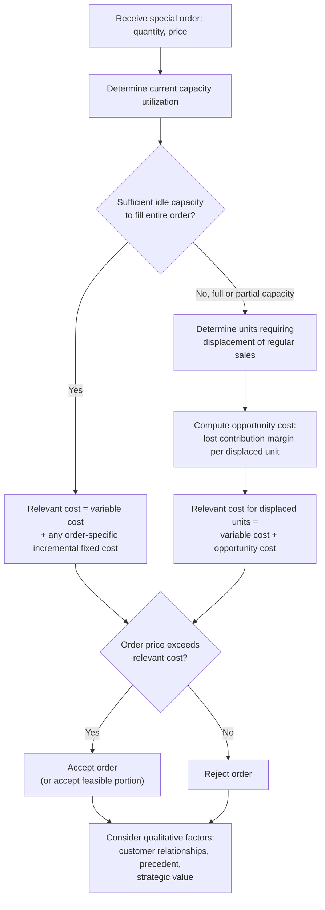

## Special Order Acceptance and Rejection Analysis

### Conceptual Foundation

Special order analysis is a short-term managerial accounting decision framework used to evaluate whether a firm should accept a one-time order at a price that typically differs from — often below — its normal selling price. The analysis hinges on **relevant costing**: distinguishing costs that will actually change as a result of accepting the order (incremental or relevant costs) from costs that will be incurred regardless of the decision (fixed and sunk costs). This makes special order analysis one of the clearest practical applications of the fixed-versus-variable cost distinction covered throughout this chapter.

**Key Points**

- The central decision rule: accept the order if the incremental revenue exceeds the incremental (relevant) cost, provided the firm has available idle capacity.
- Existing fixed costs are almost always irrelevant to the decision, since they will be incurred whether or not the special order is accepted.
- The analysis fundamentally differs depending on whether the firm has idle capacity or is operating at full capacity, since the latter introduces an opportunity cost.
- Special order pricing below normal price is not "predatory" or automatically value-destructive — it can be rational precisely because fixed costs are already covered by regular volume.

---

### The Core Decision Framework

**Basic rule (with idle capacity available):**

$$\text{Accept if: } \quad \text{Order Price} > \text{Relevant Variable Cost per Unit}$$

More completely, considering any incremental fixed costs specific to the order (e.g., special tooling, additional shipping, custom packaging):

$$\text{Accept if: } \quad Q_{order} \times (P_{order} - V) - F_{incremental} > 0$$

Where:

- $Q_{order}$ = quantity requested in the special order
- $P_{order}$ = price offered for the special order
- $V$ = variable cost per unit (relevant, incremental)
- $F_{incremental}$ = any additional fixed costs specifically caused by accepting the order (not otherwise incurred)

**Critical principle:** existing (allocated) fixed costs that the firm incurs regardless of the special order — factory overhead, existing equipment depreciation, salaried supervisory staff already in place — are **not relevant** to this decision, because they do not change based on whether the order is accepted. Including them in the analysis (e.g., via a fully-allocated per-unit cost) is a common and significant analytical error that can cause a firm to incorrectly reject a profitable order.

---

### Worked Example — Idle Capacity Available

A firm manufactures a product with the following normal-volume cost structure:

- Normal selling price: $P = \$50$
- Variable cost per unit: $V = \$28$
- Fixed manufacturing costs: $F = \$400{,}000$ per year
- Normal production and sales volume: 30,000 units
- **Fully-allocated cost per unit** at normal volume: $28 + (400{,}000/30{,}000) = 28 + 13.33 = \$41.33$
- Current capacity: 40,000 units (10,000 units of idle capacity available)

A customer offers a special order for 8,000 units at $\$35$ per unit — below both the normal price and the fully-allocated cost per unit of $41.33.

**Naive (incorrect) analysis using fully-allocated cost:**

$35 - 41.33 = -\$6.33$ per unit → appears to be a loss, suggesting rejection.

**Correct analysis using relevant (variable) cost:**

$$\text{Incremental profit} = 8{,}000 \times (35 - 28) = 8{,}000 \times 7 = \$56{,}000$$

**Conclusion:** the order should be **accepted**. Since idle capacity exists (10,000 units available, order requires only 8,000), the fixed costs of $400,000 are already being incurred regardless of this decision — they do not increase because of the order. The order price of $35 exceeds the relevant variable cost of $28 by $7 per unit, generating $56,000 of incremental profit that would not otherwise be earned. The naive analysis using fully-allocated cost incorrectly treats fixed costs as if they were caused by the order, leading to an erroneous rejection recommendation.

---

### Worked Example — No Idle Capacity (Opportunity Cost Applies)

Using the same firm, but now assume the firm is already operating at full capacity (40,000 units) selling entirely to regular customers at $50 per unit. Accepting the 8,000-unit special order at $35 would require displacing 8,000 units of regular sales.

**Opportunity cost of displaced regular sales:**

Contribution margin lost per displaced unit $= 50 - 28 = \$22$

**Relevant decision comparison per unit:**

$$\text{Special order price} - \text{Variable cost} - \text{Opportunity cost per unit} = 35 - 28 - 22 = -\$15$$

**Conclusion:** the order should be **rejected**. Even though the special order price ($35) exceeds variable cost ($28), accepting it would force the firm to forgo $22 of contribution margin per unit from displaced regular sales — a total opportunity cost of $8{,}000 \times 22 = \$176{,}000$, far exceeding the $8{,}000 \times 7 = \$56{,}000$ incremental margin the special order itself would generate. This demonstrates why the capacity situation is the single most important factor determining the correct decision, and why the same order that should be accepted under idle capacity should be rejected at full capacity.

---

### Decision Framework Summary

| Capacity Situation | Relevant Comparison | Typical Decision Rule |
| --- | --- | --- |
| Idle capacity available (order fits within excess capacity) | Order price vs. variable cost per unit (+ any incremental fixed costs) | Accept if order price exceeds relevant variable cost |
| No idle capacity (order requires displacing regular sales) | Order price vs. variable cost PLUS opportunity cost of displaced contribution margin | Accept only if order price exceeds variable cost by more than the lost contribution margin per unit |
| Partial capacity (order partly fits idle capacity, partly requires displacement) | Blended analysis — idle-capacity units use variable cost only; displaced units use variable cost + opportunity cost | Accept the idle-capacity portion if profitable; evaluate the displaced portion separately using opportunity cost |

---

### Additional Relevant Factors Beyond the Immediate Calculation

1. **Price discrimination and regular customer relationships.** Accepting a special order at a price below the normal selling price risks regular customers learning of the discount and demanding similar pricing, potentially eroding the firm's regular price structure. This risk is typically managed by ensuring special orders are genuinely distinguishable (different market segment, private label, geographically separate, one-time nature) from regular sales. [Inference: the practical significance of this risk varies substantially by industry, customer concentration, and how easily information about pricing terms could spread between customer segments]
2. **Incremental fixed costs specific to the order.** Special orders sometimes require additional fixed costs not otherwise incurred — special tooling, additional quality certification, custom packaging design — which must be included as relevant costs even though "regular" fixed costs are excluded.
3. **Long-term strategic relationship potential.** A special order may represent an opportunity to establish a relationship with a new customer or enter a new market segment, providing option value beyond the immediate order's profitability — a qualitative factor that can support acceptance even at a marginal or slightly negative直接ly-calculated benefit. [Speculation: whether this strategic value justifies accepting an order below relevant cost depends entirely on firm-specific strategic priorities and cannot be generalized]
4. **Capacity constraints beyond the immediate period.** If accepting the order would constrain the firm's ability to accept other, potentially more profitable orders later in the same period, this represents a genuine opportunity cost that should be factored into the decision even under nominally "idle" capacity.
5. **Contribution margin per unit of the constraining resource.** When multiple products compete for the same limited capacity, the relevant comparison shifts to contribution margin per unit of the scarce resource (e.g., machine hours, labor hours) rather than per unit of output — a refinement of the basic framework relevant when capacity constraints are resource-specific rather than simple unit-volume limits.

---

### Diagram: Special Order Decision Logic (svg_diagram)

<svg xmlns="http://www.w3.org/2000/svg" viewBox="0 0 780 380" font-family="Arial, sans-serif">
<text x="390" y="26" text-anchor="middle" font-size="17" font-weight="bold">Special Order Decision Logic (svg_diagram)</text>
<rect x="300" y="50" width="180" height="50" rx="6" fill="#34495e" opacity="0.15" stroke="#34495e" stroke-width="1.5" />
<text x="390" y="80" text-anchor="middle" font-size="13" font-weight="bold">Special Order Offer</text>
<line x1="390" y1="100" x2="390" y2="140" stroke="black" stroke-width="1.5" marker-end="url(#arrow5)" />
<text x="500" y="125" font-size="12" font-weight="bold">Is idle capacity available?</text>
<line x1="330" y1="150" x2="180" y2="200" stroke="black" stroke-width="1.5" />
<line x1="450" y1="150" x2="600" y2="200" stroke="black" stroke-width="1.5" />
<rect x="60" y="200" width="240" height="70" rx="6" fill="#2ecc71" opacity="0.15" stroke="#2ecc71" stroke-width="1.5" />
<text x="180" y="225" text-anchor="middle" font-size="12" font-weight="bold">Yes — Idle Capacity</text>
<text x="180" y="243" text-anchor="middle" font-size="11">Compare: Order Price vs.</text>
<text x="180" y="258" text-anchor="middle" font-size="11">Variable Cost only</text>
<rect x="480" y="200" width="240" height="70" rx="6" fill="#e74c3c" opacity="0.15" stroke="#e74c3c" stroke-width="1.5" />
<text x="600" y="225" text-anchor="middle" font-size="12" font-weight="bold">No — Full Capacity</text>
<text x="600" y="243" text-anchor="middle" font-size="11">Compare: Order Price vs.</text>
<text x="600" y="258" text-anchor="middle" font-size="11">Variable Cost + Opportunity Cost</text>

<text x="180" y="300" text-anchor="middle" font-size="11" fill="#555">Fixed costs already covered —</text>

<text x="180" y="315" text-anchor="middle" font-size="11" fill="#555">irrelevant to this decision</text>

<text x="600" y="300" text-anchor="middle" font-size="11" fill="#555">Displaced regular sales'</text>

<text x="600" y="315" text-anchor="middle" font-size="11" fill="#555">lost margin must be included</text>

</svg>

---

### Decision Workflow

---

### Common Analytical Pitfalls

- **Using fully-allocated (absorption) cost per unit instead of relevant variable cost**, causing profitable orders to appear unprofitable and leading to incorrect rejection — the single most common error in special order analysis.
- **Ignoring opportunity cost when capacity is constrained**, leading to acceptance of an order that actually destroys value by displacing more profitable regular sales.
- **Failing to identify order-specific incremental fixed costs** (e.g., new tooling, certification, custom packaging) that genuinely are relevant even though existing fixed costs are not.
- **Overlooking the price-discrimination and precedent risk** of accepting below-normal pricing, which is a legitimate qualitative consideration even when the immediate incremental-cost math favors acceptance. [Inference]
- **Treating the accept/reject decision as purely binary** when a partial acceptance (filling only the idle-capacity portion of a large order) may be the actual profit-maximizing choice.

---

### Related Topics

- Relevant costing and differential (incremental) analysis in short-term decisions
- Contribution margin analysis and cost-volume-profit (CVP) modeling
- Opportunity cost concepts in capacity-constrained decision making
- Contribution margin per unit of scarce/constraining resource (multi-product capacity allocation)
- Full absorption costing vs. variable (direct) costing for internal decision-making
- Pricing strategy and price discrimination considerations
- Make or Buy Decisions and Cost Structure Impact (a related short-term relevant-costing framework)