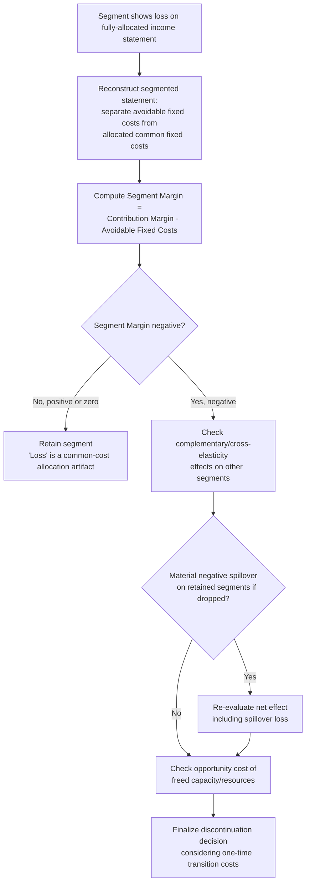

## Product Line and Segment Discontinuation Analysis

### Conceptual Foundation

Product line and segment discontinuation analysis is a short-term managerial decision framework used to evaluate whether an underperforming product line, division, or segment should be dropped. As with special order analysis, the central discipline is **relevant costing**: correctly distinguishing costs that will actually disappear if the segment is discontinued (avoidable costs) from those that will persist regardless (unavoidable, allocated, or common fixed costs). A segment that appears unprofitable under a fully-allocated income statement may, on relevant-cost analysis, actually be contributing positively to overall firm profit — making this one of the areas where naive interpretation of accounting reports most frequently leads to poor decisions.

**Key Points**

- The correct decision rule: discontinue only if the segment's avoidable fixed costs exceed its contribution margin; otherwise, keep it.
- Common (allocated) fixed costs that will continue regardless of the discontinuation decision are irrelevant and must be excluded from the analysis.
- A segment showing a "net loss" under full-cost allocation may still be generating positive contribution margin and should often be retained.
- The analysis must also account for complementary effects — a segment discontinuation can reduce demand for other, retained products (cross-elasticity effects).

---

### The Core Decision Framework

**Segmented income statement — the starting point:**

|  | Segment A | Segment B | Segment C | Total |
| --- | --- | --- | --- | --- |
| Sales | $S_A$ | $S_B$ | $S_C$ | $\sum S$ |
| Variable costs | $V_A$ | $V_B$ | $V_C$ | $\sum V$ |
| **Contribution margin** | $CM_A$ | $CM_B$ | $CM_C$ | $\sum CM$ |
| Avoidable (traceable/direct) fixed costs | $F_{A,dir}$ | $F_{B,dir}$ | $F_{C,dir}$ | $\sum F_{dir}$ |
| **Segment margin** | $SM_A$ | $SM_B$ | $SM_C$ | $\sum SM$ |
| Allocated common fixed costs | (allocated) | (allocated) | (allocated) | $F_{common}$ |
| **Net income (fully allocated)** | (may show loss) | (may show loss) | (may show loss) | $\sum SM - F_{common}$ |

**Decision rule:**

$$\text{Discontinue segment if: } \quad CM_{segment} < F_{avoidable}$$

Equivalently, using **segment margin** (contribution margin minus that segment's own directly traceable/avoidable fixed costs):

$$\text{Discontinue if: } \quad SM_{segment} < 0$$

**Critical principle:** a segment's allocated share of common fixed costs (corporate overhead, shared facility costs, shared administrative salaries) is **not relevant**, because these costs will continue to be incurred by the firm regardless of whether the segment is dropped — they will simply be reallocated across the remaining segments, not eliminated. Discontinuing a segment based on a fully-allocated net loss, when its segment margin is actually positive, typically makes the firm worse off, since the segment's positive contribution toward covering common costs is lost while the common costs themselves do not decrease.

---

### Worked Example

A firm has three product lines with the following annual figures:

|  | Product A | Product B | Product C | Total |
| --- | --- | --- | --- | --- |
| Sales | $800,000 | $500,000 | $300,000 | $1,600,000 |
| Variable costs | $480,000 | $350,000 | $240,000 | $1,070,000 |
| **Contribution margin** | $320,000 | $150,000 | $60,000 | $530,000 |
| Direct (avoidable) fixed costs | $150,000 | $100,000 | $80,000 | $330,000 |
| **Segment margin** | $170,000 | $50,000 | **-$20,000** | $200,000 |
| Allocated common fixed costs (by sales %) | $100,000 | $62,500 | $37,500 | $200,000 |
| **Net income (fully allocated)** | $70,000 | -$12,500 | **-$57,500** | $0 |

At first glance, both Product B and Product C appear unprofitable on a fully-allocated basis, suggesting both might be candidates for discontinuation.

**Correct relevant-cost analysis:**

- **Product C:** Segment margin is **-$20,000** (contribution margin of $60,000 is less than its $80,000 of avoidable fixed costs). Discontinuing Product C would **eliminate this $20,000 loss** and increase total firm profit by $20,000, since the $80,000 of avoidable fixed costs would genuinely disappear while the $37,500 of common costs previously allocated to Product C would simply shift to being allocated across A and B (not eliminated, but also not increased in total). **Recommendation: discontinue Product C.**
- **Product B:** Segment margin is **positive at $50,000**, despite showing a fully-allocated net loss of -$12,500. This net loss is an artifact of common cost allocation, not a reflection of Product B's actual incremental contribution to firm profit. If Product B were discontinued, the firm would **lose $50,000 of segment margin**, while the $62,500 of common costs allocated to it would not disappear — they would simply be reallocated to Products A and C, making the firm as a whole $50,000 worse off. **Recommendation: retain Product B**, despite its fully-allocated "loss."

**Verification — total firm profit if only Product C is discontinued (and common costs are NOT reduced, only reallocated):**

New total contribution margin $= 320{,}000 + 150{,}000 = 470{,}000$

Remaining avoidable fixed costs $= 150{,}000 + 100{,}000 = 250{,}000$

Common fixed costs (unchanged in total) $= 200{,}000$

New total net income $= 470{,}000 - 250{,}000 - 200{,}000 = \$20{,}000$

This confirms firm profit **rises** from $0 to $20,000 by dropping only Product C — exactly the $20,000 negative segment margin that was being incurred. Had Product B also been dropped based on its misleading fully-allocated loss, the firm would have foregone its $50,000 segment margin contribution, making the firm worse off overall.

---

### Comparative Summary: What to Look At vs. What to Ignore

| Item | Relevant to Discontinuation Decision? | Reasoning |
| --- | --- | --- |
| Segment's contribution margin | Yes | Directly measures what is lost if the segment is dropped |
| Segment's directly traceable/avoidable fixed costs | Yes | These genuinely disappear if the segment is discontinued |
| Allocated common/corporate fixed costs | No | These persist regardless; only their *allocation basis* changes, not their total |
| Sunk costs (e.g., past R&D, already-depreciated equipment) | No | Already incurred; irrelevant to a forward-looking decision |
| Complementary sales effects on other segments | Yes | A discontinued segment may reduce demand for retained products (see below) |
| Opportunity cost of freed capacity/resources | Yes, if a genuine alternative use exists | Relevant if freed resources can be redeployed to a more profitable use |

---

### Complications Beyond the Basic Framework

1. **Complementary/cross-elasticity effects.** If discontinuing Product C would reduce customer traffic or cross-sell opportunities for Products A and B (e.g., a "loss leader" or a product that anchors a broader customer relationship), the true relevant analysis must account for this spillover reduction in the retained segments' contribution margin — not just the discontinued segment's own numbers in isolation. [Inference: the magnitude of this effect is highly situation-specific and requires demand-side analysis beyond the accounting figures alone]
2. **Opportunity cost of freed capacity.** If discontinuing a segment frees up capacity, facility space, or personnel that can be redeployed to a more profitable use (a new product line, expanded capacity for a retained segment), this potential benefit should be added to the discontinuation case — transforming the decision from a pure "avoid a loss" analysis into a "reallocate to a better use" analysis.
3. **Employee and severance costs.** Discontinuation may trigger one-time costs (severance, contract termination penalties, asset write-offs/disposal costs) that are relevant *incremental* costs of the decision itself, distinct from the ongoing avoidable fixed costs being evaluated.
4. **Timing and phase-out considerations.** Some avoidable fixed costs may not be immediately eliminable (e.g., a facility lease with remaining term, equipment that cannot be immediately sold) — the true avoidable cost may only be realized after a transition period, which should be reflected in the timing of expected benefits.
5. **Strategic and market signaling considerations.** Discontinuing a product line can affect brand perception, competitive positioning, or customer relationships in ways not directly captured in the segment margin calculation, and may warrant qualitative judgment alongside the quantitative analysis. [Speculation: the materiality of this factor depends entirely on the specific market and brand context and cannot be generalized across situations]

---

### Diagram: Segment Discontinuation Decision Logic (svg_diagram)

<svg xmlns="http://www.w3.org/2000/svg" viewBox="0 0 780 380" font-family="Arial, sans-serif">
<text x="390" y="26" text-anchor="middle" font-size="17" font-weight="bold">Segment Discontinuation Decision Logic (svg_diagram)</text>
<rect x="290" y="50" width="200" height="50" rx="6" fill="#34495e" opacity="0.15" stroke="#34495e" stroke-width="1.5" />
<text x="390" y="80" text-anchor="middle" font-size="12" font-weight="bold">Segment shows fully-allocated net loss</text>
<line x1="390" y1="100" x2="390" y2="140" stroke="black" stroke-width="1.5" marker-end="url(#arrow6)" />
<text x="500" y="125" font-size="12" font-weight="bold">Compute Segment Margin</text>
<text x="500" y="140" font-size="11">(CM − avoidable fixed costs)</text>
<line x1="330" y1="155" x2="180" y2="205" stroke="black" stroke-width="1.5" />
<line x1="450" y1="155" x2="600" y2="205" stroke="black" stroke-width="1.5" />
<rect x="60" y="205" width="240" height="80" rx="6" fill="#2ecc71" opacity="0.15" stroke="#2ecc71" stroke-width="1.5" />
<text x="180" y="230" text-anchor="middle" font-size="12" font-weight="bold">Segment Margin ≥ 0</text>
<text x="180" y="250" text-anchor="middle" font-size="11">"Loss" is a cost-allocation</text>
<text x="180" y="265" text-anchor="middle" font-size="11">artifact — segment covers</text>
<text x="180" y="280" text-anchor="middle" font-size="11">its own avoidable costs</text>
<rect x="480" y="205" width="240" height="80" rx="6" fill="#e74c3c" opacity="0.15" stroke="#e74c3c" stroke-width="1.5" />
<text x="600" y="230" text-anchor="middle" font-size="12" font-weight="bold">Segment Margin &lt; 0</text>
<text x="600" y="250" text-anchor="middle" font-size="11">Segment fails to cover its</text>
<text x="600" y="265" text-anchor="middle" font-size="11">own avoidable costs —</text>
<text x="600" y="280" text-anchor="middle" font-size="11">genuine candidate to drop</text>

<text x="180" y="315" text-anchor="middle" font-size="12" font-weight="bold" fill="`#27ae60`">RETAIN</text>

<text x="600" y="315" text-anchor="middle" font-size="12" font-weight="bold" fill="`#c0392b`">Check complementary effects, then DISCONTINUE</text>

</svg>

---

### Decision Workflow

---

### Common Analytical Pitfalls

- **Relying on fully-allocated net income to make the discontinuation decision**, the single most common and consequential error in this analysis — as shown in the worked example, this can lead to dropping a segment that is actually helping cover common costs.
- **Assuming common fixed costs disappear when a segment is dropped**, when in reality they are typically only reallocated across remaining segments, not eliminated in total.
- **Ignoring complementary sales effects**, treating each segment as fully independent when demand interdependencies may exist between product lines or divisions.
- **Failing to account for one-time discontinuation costs** (severance, asset disposal, contract termination) that are genuinely relevant incremental costs of the decision itself.
- **Overlooking the opportunity cost (or lack thereof) of freed capacity**, which can meaningfully change the value of discontinuation beyond simply eliminating a loss. [Inference]

---

### Related Topics

- Relevant costing and differential (incremental) analysis in short-term decisions
- Special Order Acceptance and Rejection Analysis (a closely related relevant-costing framework)
- Contribution margin analysis and segmented income statements
- Common cost allocation methods and their limitations for decision-making
- Full absorption costing vs. variable (direct) costing for internal reporting
- Opportunity cost analysis in capacity redeployment decisions
- Cross-elasticity of demand and complementary product analysis