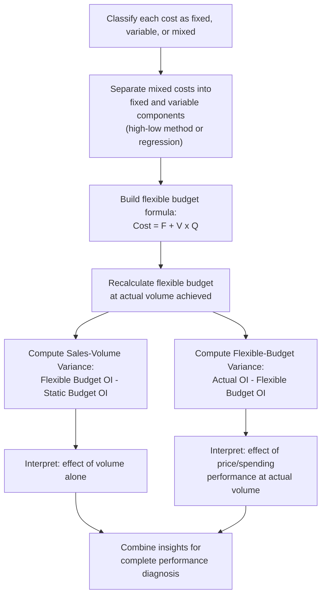

## Flexible Budgeting and Cost Structure

### Conceptual Foundation

A flexible budget is a budgeting approach that adjusts revenue and cost expectations based on actual activity volume, rather than remaining fixed at a single planned output level. Its analytical power derives directly from the fixed-versus-variable cost distinction: because fixed costs do not change with volume while variable costs scale with it, a flexible budget can isolate whether a variance between actual and planned results stems from a genuine volume difference, a spending/efficiency difference, or both — a distinction a static (fixed) budget cannot make. This makes flexible budgeting one of the most direct practical applications of cost structure classification in operational management and performance evaluation.

**Key Points**

- A flexible budget recalculates the *variable* cost and revenue components at the actual volume achieved, while holding *fixed* costs constant at the budgeted amount, regardless of volume.
- This separation allows a **flexible-budget variance** (spending/efficiency, isolated from volume effects) to be distinguished from a **sales-volume variance** (the effect of actual volume differing from planned volume).
- Static budget comparisons, which do not adjust for volume, conflate these two effects and can produce misleading performance conclusions.
- The technique depends entirely on having correctly classified costs as fixed or variable — misclassification undermines the entire variance analysis.

---

### Static Budget vs. Flexible Budget

**Static (master) budget:** prepared for a single planned level of activity, and never adjusted regardless of what volume actually occurs.

**Flexible budget:** prepared as a formula, allowing costs and revenue to be recalculated for any actual volume level:

$$\text{Flexible Budget Cost} = F + V \cdot Q_{actual}$$

$$\text{Flexible Budget Revenue} = P \cdot Q_{actual}$$

Where $F$ is budgeted fixed cost (unchanged), $V$ is budgeted variable cost per unit, $P$ is budgeted price per unit, and $Q_{actual}$ is the actual volume achieved — not the originally planned volume.

**Why this matters:** if a firm planned to sell 10,000 units but actually sold 12,000, a static budget comparison would show costs "over budget" simply because more units were produced — even if the firm performed with perfect cost efficiency at that higher volume. The flexible budget removes this distortion by asking "what should costs have been, given that 12,000 units were actually produced?"

---

### Worked Example

A firm's static (master) budget, prepared for a planned volume of 10,000 units:

|  | Static Budget (planned Q = 10,000) |
| --- | --- |
| Sales ($P = \$50$) | $500,000 |
| Variable costs ($V = \$30$) | $300,000 |
| Contribution margin | $200,000 |
| Fixed costs | $120,000 |
| Operating income | $80,000 |

**Actual results** at an actual volume of 12,000 units:

|  | Actual Results (Q = 12,000) |
| --- | --- |
| Sales | $570,000 (actual price realized: $47.50/unit) |
| Variable costs | $372,000 (actual: $31/unit) |
| Contribution margin | $198,000 |
| Fixed costs | $125,000 |
| Operating income | $73,000 |

**Naive static budget comparison:** Operating income of $73,000 actual vs. $80,000 budgeted looks like a $7,000 unfavorable variance — but this comparison conflates the fact that volume was 20% higher than planned with any actual spending or pricing performance issues, making it impossible to tell whether the shortfall reflects a real operational problem or is simply a byproduct of the volume difference.

**Step 1 — Construct the flexible budget at actual volume (Q = 12,000):**

|  | Flexible Budget (Q = 12,000) |
| --- | --- |
| Sales ($50 \times 12{,}000$) | $600,000 |
| Variable costs ($30 \times 12{,}000$) | $360,000 |
| Contribution margin | $240,000 |
| Fixed costs (unchanged) | $120,000 |
| Operating income | $120,000 |

**Step 2 — Decompose the total variance:**

$$\text{Sales-Volume Variance} = \text{Flexible Budget OI} - \text{Static Budget OI} = 120{,}000 - 80{,}000 = \$40{,}000 \text{ Favorable}$$

This reflects the benefit of selling 2,000 more units than planned, at budgeted margins — a genuinely favorable outcome from higher volume alone.

$$\text{Flexible-Budget Variance} = \text{Actual OI} - \text{Flexible Budget OI} = 73{,}000 - 120{,}000 = \$47{,}000 \text{ Unfavorable}$$

This isolates the effect of actual price and cost performance *at the volume actually achieved*, separate from the volume effect itself — revealing a real $47,000 shortfall attributable to selling at a lower-than-budgeted price ($47.50 vs. $50) and/or incurring higher-than-budgeted variable and fixed costs.

**Interpretation:** the static budget comparison ($7,000 unfavorable) badly understated the operational problem. The firm actually benefited substantially from higher volume (+$40,000) but this gain was more than offset by real spending/pricing inefficiencies (-$47,000) — a $47,000 problem masked by a seemingly modest $7,000 headline variance. Without decomposing via the flexible budget, management might have concluded performance was only mildly disappointing, when in fact there is a significant underlying cost or pricing issue to investigate.

---

### Further Decomposition: Price and Efficiency Variances

The flexible-budget variance can itself typically be decomposed further into price/rate variances and efficiency/quantity variances for individual cost and revenue line items — a standard extension in variance analysis, though the specific decomposition mechanics for direct materials, direct labor, and overhead variances are a distinct, more granular topic beyond this immediate framework. [Note: this content focuses on the flexible-budget-vs-static-budget distinction at the cost-structure level; further decomposition into price/rate and efficiency/quantity variances follows established standard costing variance formulas]

---

### Comparative Summary

| Aspect | Static Budget | Flexible Budget |
| --- | --- | --- |
| Volume basis | Fixed at originally planned level | Recalculated at actual volume achieved |
| Fixed cost treatment | Budgeted amount, unadjusted | Budgeted amount, held constant regardless of volume |
| Variable cost treatment | Budgeted amount at planned volume | Recalculated: $V \times Q_{actual}$ |
| Usefulness for performance evaluation | Limited — conflates volume and spending effects | High — isolates genuine spending/pricing performance from volume effects |
| Dependency on cost classification accuracy | Lower (less analytically demanding) | High — requires accurate fixed/variable split to be meaningful |

---

### Why Cost Structure Classification Is the Foundation of This Technique

The entire flexible budgeting technique rests on the ability to correctly classify each cost as fixed, variable, or mixed (semi-variable):

- **Fixed costs** are held constant in the flexible budget regardless of actual volume — an error here (treating a cost that actually varies with volume as fixed, or vice versa) directly distorts the sales-volume variance and flexible-budget variance calculations.
- **Variable costs** are scaled proportionally to actual volume — accuracy of the assumed variable cost *rate* ($V$) is essential, since this rate is what "should have been spent" at actual volume is compared against.
- **Mixed (semi-variable) costs** — costs with both a fixed and variable component (e.g., utilities with a base charge plus usage-based charges, or a sales force with base salary plus commission) — must first be separated into their fixed and variable elements (using techniques such as the high-low method or regression analysis) before they can be correctly incorporated into a flexible budget formula.

Misclassifying a mixed cost as purely fixed or purely variable introduces a systematic bias into every subsequent flexible budget calculation involving that cost — a widely recognized limitation of the technique in practice. [Inference]

---

### Diagram: Static vs. Flexible Budget Variance Decomposition (svg_diagram)

<svg xmlns="http://www.w3.org/2000/svg" viewBox="0 0 780 380" font-family="Arial, sans-serif">
<text x="390" y="26" text-anchor="middle" font-size="17" font-weight="bold">Static vs. Flexible Budget Variance Bridge (svg_diagram)</text>
<rect x="30" y="80" width="180" height="60" rx="6" fill="#3498db" opacity="0.15" stroke="#3498db" stroke-width="1.5" />
<text x="120" y="105" text-anchor="middle" font-size="12" font-weight="bold">Static Budget OI</text>
<text x="120" y="123" text-anchor="middle" font-size="11">(planned volume)</text>
<line x1="210" y1="110" x2="290" y2="110" stroke="black" stroke-width="1.5" marker-end="url(#arrow7)" />
<text x="250" y="95" text-anchor="middle" font-size="11" font-weight="bold">Sales-Volume</text>
<text x="250" y="130" text-anchor="middle" font-size="11" font-weight="bold">Variance</text>
<rect x="290" y="80" width="200" height="60" rx="6" fill="#f39c12" opacity="0.15" stroke="#f39c12" stroke-width="1.5" />
<text x="390" y="105" text-anchor="middle" font-size="12" font-weight="bold">Flexible Budget OI</text>
<text x="390" y="123" text-anchor="middle" font-size="11">(actual volume, budgeted rates)</text>
<line x1="490" y1="110" x2="570" y2="110" stroke="black" stroke-width="1.5" marker-end="url(#arrow7)" />
<text x="530" y="95" text-anchor="middle" font-size="11" font-weight="bold">Flexible-Budget</text>
<text x="530" y="130" text-anchor="middle" font-size="11" font-weight="bold">Variance</text>
<rect x="570" y="80" width="180" height="60" rx="6" fill="#e74c3c" opacity="0.15" stroke="#e74c3c" stroke-width="1.5" />
<text x="660" y="105" text-anchor="middle" font-size="12" font-weight="bold">Actual OI</text>
<text x="660" y="123" text-anchor="middle" font-size="11">(actual volume, actual rates)</text>

<text x="120" y="180" font-size="11" fill="#555">Isolates effect of volume</text>

<text x="120" y="196" font-size="11" fill="#555">difference alone</text>

<text x="530" y="180" font-size="11" fill="#555">Isolates effect of price/cost</text>

<text x="530" y="196" font-size="11" fill="#555">performance, volume held constant</text>

<line x1="30" y1="240" x2="750" y2="240" stroke="#999" stroke-width="1" stroke-dasharray="4,3" />
<text x="390" y="265" text-anchor="middle" font-size="12" fill="#555">Total variance (Actual OI − Static Budget OI) = Sales-Volume Variance + Flexible-Budget Variance</text>
</svg>

---

### Flexible Budgeting Analysis Workflow

---

### Common Analytical Pitfalls

- **Relying solely on static budget comparisons** for performance evaluation, which conflates volume effects with genuine spending or pricing performance — as shown in the worked example, this can dramatically understate or overstate the real operational issue.
- **Misclassifying mixed (semi-variable) costs** as purely fixed or purely variable, introducing systematic bias into the flexible budget's cost projections at any volume other than the original planning volume.
- **Treating fixed costs as if they should scale with volume** in the flexible budget, which defeats the purpose of the technique — fixed costs are held constant precisely so that volume effects can be isolated elsewhere.
- **Failing to further decompose the flexible-budget variance** into price/rate and efficiency/quantity components when deeper diagnosis is needed, stopping the analysis at a level too aggregated to pinpoint the specific root cause.
- **Assuming linear cost behavior across the entire relevant range**, when in reality large volume changes may involve step-fixed costs or changing variable cost rates that a simple linear flexible budget formula does not capture. [Inference]

---

### Related Topics

- Fixed, variable, and mixed cost classification methods (high-low method, regression analysis)
- Sales-volume variance and flexible-budget variance decomposition
- Standard costing and price/rate vs. efficiency/quantity variance analysis
- Contribution margin analysis and cost-volume-profit (CVP) modeling
- Degree of Operating Leverage (DOL) as a related application of fixed/variable cost classification
- Responsibility accounting and performance evaluation frameworks
- Budgetary control systems and management by exception