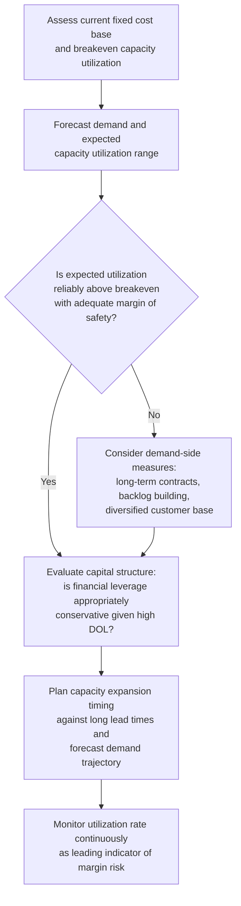

## Capital Intensive Manufacturing Cost Structures

### Conceptual Foundation

Capital intensive manufacturing refers to production environments where a large proportion of total cost derives from fixed investments in plant, equipment, and automated processes, relative to variable inputs like direct labor and per-unit materials. Industries such as semiconductor fabrication, automotive assembly, steel and chemical processing, and heavy machinery production exemplify this cost structure. Understanding its specific characteristics is essential because it represents one of the clearest real-world manifestations of high operating leverage, and the strategic, financial, and operational implications that follow from it recur across this entire class of industries.

**Key Points**

- Fixed costs in capital intensive manufacturing are dominated by depreciation, equipment financing, facility overhead, and often long-term maintenance contracts.
- Variable costs are typically limited to direct materials, energy consumption tied to output, and a smaller proportion of labor than in labor intensive settings.
- This structure produces high Degree of Operating Leverage (DOL), high breakeven volumes, and strong sensitivity to capacity utilization rates.
- Capital intensive manufacturers typically require substantial scale to be profitable, making capacity utilization one of the most closely monitored operational metrics in the industry.

---

### Typical Cost Composition

| Cost Category | Classification | Notes |
| --- | --- | --- |
| Equipment depreciation | Fixed | Often the single largest cost category; tied to large upfront capital investment |
| Facility costs (owned plant, utilities baseline) | Fixed | Substantial fixed overhead from large-scale physical infrastructure |
| Equipment financing/lease payments | Fixed | Debt service or lease obligations on capital assets, independent of output |
| Maintenance contracts (preventive/scheduled) | Largely fixed | Often contracted on a fixed annual basis regardless of usage intensity |
| Skilled technical/engineering staff | Largely fixed | Salaried specialists required to operate and maintain complex equipment, not easily scaled with short-term volume changes |
| Direct materials | Variable | Scales directly with units produced |
| Energy/utilities tied to production volume | Variable (with a fixed baseline component) | Often a mixed cost — a fixed baseline plus a usage-based variable component |
| Direct production labor (where automation is partial) | Variable, but a shrinking proportion vs. labor intensive alternatives | Diminishes as automation increases within the capital intensive model |
| Quality control/testing (volume-driven) | Variable | Scales with units tested/inspected |

---

### Financial and Operational Consequences

**High Degree of Operating Leverage (DOL):**

Because fixed costs dominate the cost base, capital intensive manufacturers exhibit substantially higher DOL than labor intensive counterparts at comparable revenue levels — recall the general relationship:

$$DOL = \frac{Q(P-V)}{Q(P-V) - F}$$

With $F$ large relative to the contribution margin pool, DOL values in capital intensive manufacturing frequently run well above 2.0–3.0 near typical operating volumes, meaning EBIT swings sharply with relatively modest changes in sales volume — a defining characteristic that connects directly to the operating leverage framework covered earlier in this material.

**Elevated breakeven volume:**

$$Q_{BE} = \frac{F}{P-V}$$

The large fixed cost base pushes breakeven volume higher, meaning capital intensive manufacturers typically need to operate at a substantial fraction of maximum capacity just to reach profitability — often 60-80% of theoretical capacity in many heavy manufacturing contexts, though the specific threshold varies significantly by industry and facility design. [Unverified: exact breakeven capacity utilization thresholds vary substantially by specific industry, facility, and product mix, and should be verified against current industry-specific data for any particular analysis]

**Capacity utilization as the central operating metric:**

Because so much cost is fixed and already committed regardless of output, the percentage of theoretical maximum capacity actually being utilized becomes the single most important operational lever affecting profitability. Small changes in utilization rate can produce disproportionately large swings in operating margin, since the fixed cost base must be absorbed whether the plant runs at 50% or 95% of capacity.

**Reduced short-run flexibility:**

Capital intensive manufacturers cannot easily or cheaply adjust their fixed cost base in response to demand fluctuations — idling a plant still incurs most fixed costs (depreciation continues, financing obligations persist, skilled staff retention is often prioritized to avoid losing specialized expertise), while ramping up typically requires long lead times for capacity expansion (permitting, construction, equipment procurement and installation).

---

### Strategic Implications Specific to Capital Intensive Manufacturing

1. **Cyclicality management.** Given high DOL and limited short-run flexibility, firms in this category often place significant emphasis on demand forecasting, order backlogs, and long-term customer contracts to reduce the volatility of capacity utilization, since utilization volatility translates directly and disproportionately into earnings volatility.
2. **Conservative capital structure tendency.** As established under the broader discussion of capital structure implications of high operating leverage, capital intensive manufacturers often maintain relatively conservative financial leverage to avoid compounding already-high business risk with additional financial risk — though this tendency varies by sub-industry, particularly where demand is more stable or contractually secured (e.g., certain utility-adjacent manufacturing). [Inference]
3. **Vertical integration and long-term contracts.** Securing stable input supply (raw materials) and stable demand (long-term customer agreements) can meaningfully de-risk the high fixed-cost investment by improving the predictability of both revenue and input costs.
4. **Capacity planning and expansion timing.** Because capacity additions involve long lead times and large capital commitments, capital intensive manufacturers face significant execution risk in timing expansion decisions relative to actual demand realization — overbuilding capacity ahead of demand can be costly, while underbuilding can cede market share to competitors during demand upswings.
5. **Technology and obsolescence risk management.** Given the scale of capital investment, these firms must carefully weigh the risk of technological obsolescence against the multi-year payback periods typical of major capital investments, often requiring ongoing capital expenditure planning well beyond the immediate production cycle. [Inference: the specific obsolescence risk profile varies considerably across sub-industries depending on the pace of technological change in that specific manufacturing domain]

---

### Comparative Position Within the Broader Cost Structure Spectrum

| Dimension | Capital Intensive Manufacturing (this topic) | Labor Intensive Alternatives | Service/Low-Fixed-Cost Businesses |
| --- | --- | --- | --- |
| Typical DOL | High (often 2.5+) | Low to moderate | Low |
| Breakeven volume | High | Low to moderate | Low |
| Capacity utilization sensitivity | Very high — central operating metric | Lower — labor scales more directly with volume | Minimal |
| Financial leverage capacity (given DOL) | Constrained — should be lower, all else equal | Higher relative capacity | Highest relative capacity |
| Response speed to demand shocks | Slow — long capacity lead times | Faster — hiring/layoffs adjust more quickly | Fastest |

This positions capital intensive manufacturing at one extreme of the cost structure spectrum discussed throughout this material — the practical, industry-specific instantiation of the "high fixed cost, high operating leverage" case examined more abstractly under earlier operating leverage and capital structure topics.

---

### Diagram: Capacity Utilization and Profitability Sensitivity (svg_diagram)

<svg xmlns="http://www.w3.org/2000/svg" viewBox="0 0 760 380" font-family="Arial, sans-serif">
<text x="380" y="26" text-anchor="middle" font-size="17" font-weight="bold">Capacity Utilization Sensitivity in Capital Intensive Manufacturing (svg_diagram)</text>
<line x1="80" y1="340" x2="700" y2="340" stroke="black" stroke-width="2" />
<line x1="80" y1="340" x2="80" y2="60" stroke="black" stroke-width="2" />
<text x="390" y="365" text-anchor="middle" font-size="13">Capacity Utilization (%)</text>
<text x="30" y="200" text-anchor="middle" font-size="13" transform="rotate(-90 30 200)">Operating Margin</text>

<line x1="330" y1="60" x2="330" y2="340" stroke="black" stroke-width="1" stroke-dasharray="4,3" />
<text x="330" y="355" text-anchor="middle" font-size="11">Breakeven Utilization</text>

<path d="M 80 300 Q 200 320 330 260 T 700 100" stroke="#c0392b" stroke-width="2.5" fill="none" />
<text x="600" y="90" font-size="12" fill="#c0392b">Margin rises steeply</text>
<text x="600" y="106" font-size="12" fill="#c0392b">above breakeven utilization</text>

<text x="180" y="290" font-size="11" fill="#555">Losses persist below</text>

<text x="180" y="305" font-size="11" fill="#555">breakeven utilization</text>

<text x="390" y="60" text-anchor="middle" font-size="11" fill="#555">Small utilization swings near breakeven produce large margin swings —</text>

<text x="390" y="76" text-anchor="middle" font-size="11" fill="#555">the defining operational risk of this cost structure</text>

</svg>

---

### Capital Intensive Manufacturing Risk-Management Workflow

---

### Common Analytical Pitfalls

- **Benchmarking capital intensive manufacturers against labor intensive peers using the same leverage or margin thresholds**, without recognizing the structurally different DOL and breakeven dynamics at play.
- **Underestimating the earnings impact of modest utilization declines**, given how steeply operating margin can move near the breakeven utilization threshold in a high-DOL structure.
- **Layering high financial leverage onto an already high-DOL cost structure** without adjusting for the compounding effect on total risk (see capital structure implications of high operating leverage).
- **Treating capacity expansion as a simple linear scaling decision**, when in reality large discrete capacity additions can create step-changes in fixed costs and DOL rather than smooth incremental change. [Inference]

---

### Related Topics

- Degree of Operating Leverage (DOL) and its formula and derivation
- Capital structure implications of high operating leverage
- Capital Intensive versus Labor Intensive Cost Structures
- Automation and Its Effect on the Fixed Variable Mix
- Capacity planning and utilization analysis in manufacturing operations
- Breakeven analysis and margin of safety concepts
- Cyclicality and industry-level risk benchmarking in capital-intensive sectors