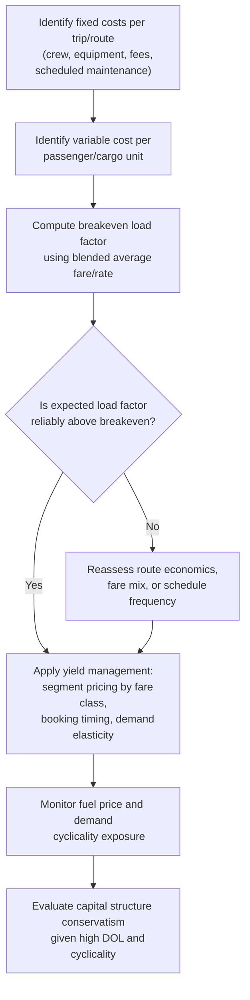

## Airline and Transportation Cost Structures

### Conceptual Foundation

Airlines and broader transportation providers (rail, shipping, freight, ground logistics) represent one of the most extensively studied real-world examples of high fixed cost, high operating leverage business models. A flight, train run, or shipping voyage incurs the substantial majority of its total cost — aircraft/vessel ownership or lease, crew, scheduled maintenance, fuel burn largely tied to the trip rather than the load, airport/port fees — regardless of how many passengers or how much cargo actually fills the available capacity. This produces a cost structure where the marginal cost of serving one additional customer on an already-scheduled trip is remarkably low relative to the trip's total cost, making load factor (capacity utilization) the central determinant of profitability.

**Key Points**

- The overwhelming majority of a single trip's cost is fixed relative to passenger or cargo count once the trip is scheduled to occur.
- This produces very low marginal cost per additional passenger/unit of cargo, enabling aggressive yield management and price discrimination strategies.
- Load factor (percentage of capacity utilized) functions analogously to capacity utilization in manufacturing — a central profitability lever given the fixed-cost-dominated structure.
- The industry is characterized by high operating leverage combined with significant demand cyclicality and external cost shocks (fuel prices, regulatory costs), producing a historically volatile earnings profile. [Unverified: current profitability and volatility levels vary by carrier, region, and time period, and should be checked against current data for any specific analysis]

---

### Typical Cost Composition (Airline Example)

| Cost Category | Classification | Notes |
| --- | --- | --- |
| Aircraft ownership/lease payments | Fixed | Committed regardless of load factor on any given flight |
| Flight crew salaries (pilots, cabin crew) | Largely fixed per flight | Crew is scheduled and paid based on flight operation, not passenger count |
| Airport landing/gate fees | Largely fixed per flight | Typically charged per aircraft movement, not per passenger |
| Scheduled maintenance | Fixed/step-fixed | Tied to flight hours/cycles rather than passenger load |
| Fuel | Largely fixed per flight, with some variable component | Dominated by aircraft weight and route distance; incremental passenger weight has only a marginal effect |
| Ground crew and airport operations overhead | Largely fixed | Staffing levels tied to flight schedule, not load factor |
| Passenger meals/service (where provided) | Variable | Scales with passenger count |
| Booking/distribution fees | Variable | Often scales per ticket sold |
| Baggage handling | Variable (partially) | Scales with passenger/bag volume, though base infrastructure is fixed |

This composition explains why airlines are frequently cited as a canonical example of high operating leverage: the incremental cost of an additional passenger occupying an otherwise-empty seat is very low (essentially meals, minor fuel weight, and distribution fees), while the trip's total cost is overwhelmingly fixed once the decision to operate the flight has been made.

---

### Load Factor as the Central Profitability Driver

**Breakeven load factor** — the percentage of seats that must be filled (at average fare) to cover the flight's total cost — is a standard industry metric analogous to the breakeven volume concept covered under general operating leverage:

$$\text{Breakeven Load Factor} = \frac{F}{\text{Seats} \times (P - V)}$$

Where $F$ is the flight's total fixed cost, Seats is total capacity, $P$ is average fare, and $V$ is variable cost per passenger.

**Worked Example:**

A flight has:

- 180 seats
- Fixed cost of operating the flight: $F = \$54{,}000$
- Average fare: $P = \$150$
- Variable cost per passenger: $V = \$20$

$$\text{Breakeven passengers} = \frac{54{,}000}{150 - 20} = \frac{54{,}000}{130} = 415.4 \implies \text{practically, } 416 \text{ passengers}$$

Since this exceeds the 180-seat capacity, this simplified example shows the flight would be unprofitable at these assumed figures — illustrating how sensitive the breakeven calculation is to the specific fare, cost, and capacity assumptions used; real-world airline economics involve blended fare classes and cost allocation across a broader network rather than a single isolated flight's numbers. [Inference: single-flight breakeven calculations like this are illustrative of the underlying mechanism but real airline profitability is generally assessed at the network/route level with blended average fares across multiple fare classes, not on a single simplified fare assumption]

**Revised example with more realistic blended economics:**

Using a blended average fare of $P = \$320$ per passenger (representing a mix of fare classes) and the same cost structure:

$$\text{Breakeven passengers} = \frac{54{,}000}{320-20} = \frac{54{,}000}{300} = 180 \text{ passengers}$$

$$\text{Breakeven load factor} = \frac{180}{180} = 100\%$$

This illustrates why airlines historically operate with load factor targets often in the 75-85%+ range with careful yield management across fare classes — small changes in the breakeven load factor assumption (driven by blended fare mix) dramatically change the economics, which is why fare-class pricing and yield management are central to airline profitability rather than a peripheral consideration. [Unverified: specific typical load factor targets and thresholds vary by carrier, route, and time period and should be checked against current industry data]

---

### Yield Management and Price Discrimination

Because the marginal cost of an additional passenger is low relative to the trip's fixed cost, airlines (and transportation providers generally) have strong incentives to fill otherwise-empty capacity even at steeply discounted prices, provided the price still exceeds variable cost — the same short-run relevant-costing logic covered under special order analysis and pricing strategy elsewhere in this material. This underlies the extensive use of:

- **Fare class segmentation** — different prices for economy, premium economy, business, and first class, capturing varying levels of willingness to pay for the same flight.
- **Advance-purchase and last-minute pricing** — leisure travelers booking well in advance typically pay lower fares, while business travelers booking close to departure (with less price sensitivity and tighter scheduling needs) often pay substantially more.
- **Dynamic pricing algorithms** — continuously adjusting prices based on booking pace, remaining capacity, and time until departure, aiming to maximize total revenue captured across the full range of a flight's willingness-to-pay distribution.

---

### Cyclicality and External Shock Exposure

Transportation industries, and airlines especially, face a combination of high operating leverage and pronounced exposure to external shocks that amplify earnings volatility beyond what operating leverage alone would suggest:

1. **Fuel price volatility** — a major cost component subject to global commodity price swings largely outside the firm's control, directly affecting the cost structure's variable and semi-fixed components. [Inference: fuel cost as a proportion of total operating cost varies by carrier and time period]
2. **Demand cyclicality** — air travel demand is closely tied to macroeconomic conditions (business travel especially), creating correlated exposure between the industry's inherent cyclicality and its high fixed-cost structure — a particularly unfavorable combination, since downturns in demand coincide with a cost structure poorly suited to rapid adjustment.
3. **Regulatory and security cost changes** — evolving safety, security, and environmental regulations can impose new largely fixed compliance costs.
4. **Exogenous shocks** — events such as pandemics, geopolitical disruptions, or extreme weather can cause severe, rapid demand declines against a cost base that cannot be quickly reduced, historically producing some of the most severe episodes of industry-wide financial distress. [Unverified: this is a well-documented historical pattern in the industry, but specific current exposure and resilience measures vary by carrier and should be checked against current conditions for any specific analysis]

---

### Strategic and Financial Implications

| Consideration | Airline/Transportation-Specific Manifestation |
| --- | --- |
| Capital structure conservatism | High DOL combined with demand cyclicality historically argues for caution regarding financial leverage, though actual industry leverage levels have varied considerably over time and by carrier [Unverified] |
| Fleet flexibility | Leasing (vs. owning) aircraft can provide some flexibility to adjust fleet size in response to demand shifts, partially mitigating the inflexibility of pure ownership |
| Network and hub strategy | Route network design affects the fixed-cost efficiency of the overall system, not just individual flights, since aircraft and crew utilization can be optimized across a broader schedule |
| Ancillary revenue strategies | Baggage fees, seat selection, and other ancillary charges add variable, demand-responsive revenue streams that can improve margin without requiring additional base fare increases |
| Hedging strategies | Fuel price hedging is commonly used to manage exposure to a major, largely uncontrollable variable/semi-fixed cost component [Inference: hedging practices and effectiveness vary by carrier and market conditions] |

---

### Diagram: Airline Cost Structure and Load Factor Sensitivity (svg_diagram)

<svg xmlns="http://www.w3.org/2000/svg" viewBox="0 0 760 380" font-family="Arial, sans-serif">
<text x="380" y="26" text-anchor="middle" font-size="17" font-weight="bold">Load Factor and Flight Profitability (svg_diagram)</text>
<line x1="80" y1="340" x2="700" y2="340" stroke="black" stroke-width="2" />
<line x1="80" y1="340" x2="80" y2="60" stroke="black" stroke-width="2" />
<text x="390" y="365" text-anchor="middle" font-size="13">Load Factor (%)</text>
<text x="30" y="200" text-anchor="middle" font-size="13" transform="rotate(-90 30 200)">Flight Profit/Loss</text>
<line x1="80" y1="260" x2="700" y2="260" stroke="#999" stroke-width="1" stroke-dasharray="4,2" />
<text x="90" y="252" font-size="10" fill="#555">Zero profit line</text>
<line x1="400" y1="60" x2="400" y2="340" stroke="black" stroke-width="1" stroke-dasharray="4,3" />
<text x="400" y="355" text-anchor="middle" font-size="11">Breakeven Load Factor</text>
<path d="M 80 320 L 700 90" stroke="#2980b9" stroke-width="2.5" />
<text x="580" y="100" font-size="12" fill="#2980b9">Profit rises steeply above breakeven</text>
<text x="180" y="300" font-size="11" fill="#c0392b">Losses below breakeven load factor</text>

<text x="390" y="60" text-anchor="middle" font-size="11" fill="#555">Nearly all cost is fixed per flight — each additional</text>

<text x="390" y="76" text-anchor="middle" font-size="11" fill="#555">filled seat above breakeven contributes almost entirely to profit</text>

</svg>

---

### Analytical Framework for Transportation Cost Structures

---

### Common Analytical Pitfalls

- **Using a single average fare rather than blended fare-class economics** when estimating breakeven load factor, which can produce misleadingly pessimistic or optimistic conclusions given how sensitive the breakeven calculation is to this assumption.
- **Treating fuel cost as purely variable**, when in practice much of fuel consumption per flight is tied to aircraft weight and route distance rather than passenger count specifically, making it more accurately a largely fixed-per-flight cost with a modest variable component.
- **Evaluating individual flight profitability in isolation** without considering network effects — a flight that appears marginal on a standalone basis may be essential to overall network connectivity and hub economics.
- **Underestimating the compounding effect of demand cyclicality and high operating leverage**, which together have historically produced some of the most severe episodes of industry financial distress relative to other industries with comparable operating leverage but less correlated demand cyclicality. [Inference]

---

### Related Topics

- Degree of Operating Leverage (DOL) and breakeven analysis
- Pricing Strategy Under Different Cost Structures (yield management and price discrimination)
- Special Order Acceptance and Rejection Analysis (short-run marginal pricing logic)
- Capital structure implications of high operating leverage
- Capital Intensive Manufacturing Cost Structures (a related high-fixed-cost industry archetype)
- Fuel and commodity price hedging strategies
- Network and hub-and-spoke route economics in transportation