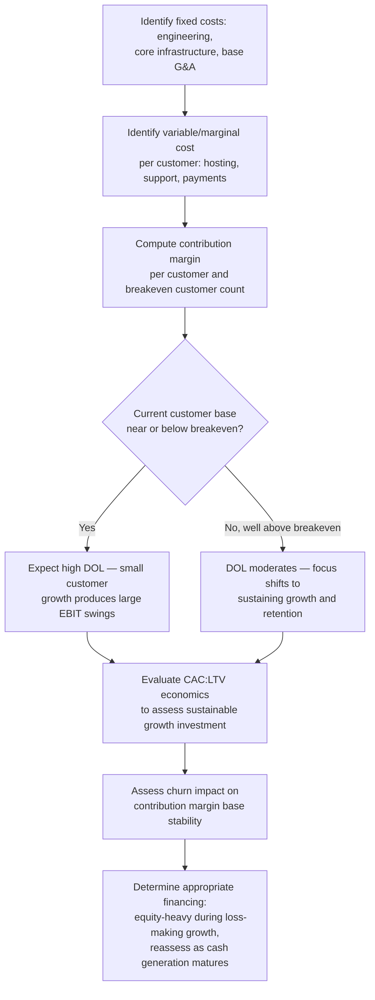

## Software as a Service and Digital Platform Cost Structures

### Conceptual Foundation

Software as a Service (SaaS) and digital platform businesses represent a distinctive cost structure archetype characterized by very high fixed costs concentrated in product development, combined with extremely low marginal cost per additional customer or transaction. Unlike capital intensive manufacturing (where fixed costs are physical plant and equipment) or airlines (where fixed costs are tied to discrete scheduled trips), SaaS fixed costs are dominated by upfront and ongoing software engineering investment, while the cost of serving one additional customer — hosting, incremental storage, minimal support — approaches near-zero at scale. This produces some of the most extreme operating leverage profiles found in any industry, with direct implications for growth strategy, pricing, unit economics, and capital structure.

**Key Points**

- Fixed costs are dominated by engineering, product development, and core infrastructure investment — largely independent of customer count.
- Variable/marginal cost per additional customer (cloud hosting, incremental support, payment processing) is typically very low relative to price, especially at scale.
- This produces very high theoretical operating leverage, meaning revenue growth can translate into disproportionately large profit growth once fixed costs are covered — the flip side being that customer acquisition and retention economics become the central strategic battleground rather than unit production cost.
- Early-stage SaaS/platform businesses often operate at a loss deliberately, prioritizing growth and market share over near-term profitability, given the eventual operating leverage payoff at scale. [Inference: this is a widely observed strategic pattern in the industry, though its appropriateness depends heavily on financing availability, competitive dynamics, and the specific unit economics of the business]

---

### Typical Cost Composition

| Cost Category | Classification | Notes |
| --- | --- | --- |
| Engineering/product development salaries | Fixed | The dominant cost category; largely independent of customer count in the short run |
| Core cloud infrastructure (base capacity) | Fixed | Baseline hosting, database, and platform costs that don't scale linearly with small customer changes |
| Sales and marketing (base team) | Largely fixed | Salaried sales/marketing staff, though variable components (commissions, ad spend) also exist |
| General & administrative overhead | Fixed | Corporate functions, largely independent of customer volume |
| Incremental cloud hosting/compute per customer | Variable | Scales with usage, though often a small fraction of price per customer at scale |
| Customer support (variable/marginal) | Variable | Scales with customer count and support ticket volume, though often partially automated |
| Payment processing fees | Variable | Typically a percentage of transaction/subscription value |
| Sales commissions | Variable | Scales with new customer acquisition/revenue booked |

**Key distinction from other high-fixed-cost industries:** in capital intensive manufacturing and airlines, the fixed cost is tied to *physical capacity* that must be built or scheduled in discrete increments. In SaaS, the fixed cost (engineering investment) is largely a **one-time or ongoing development cost** that, once incurred, can serve a very large and scalable customer base without proportional additional investment — a structural feature often described as software's near-zero marginal cost of reproduction/distribution.

---

### The Extreme Operating Leverage Dynamic

**Illustrative comparison at increasing scale:**

A SaaS company has:

- Fixed costs (engineering, core infrastructure, base G&A): $F = \$4{,}000{,}000$ annually
- Price per customer (annual subscription): $P = \$1{,}200$
- Variable cost per customer (hosting, support, payment processing): $V = \$150$

Contribution margin per customer $= 1{,}200 - 150 = \$1{,}050$

| Customer Count | Revenue | Total Variable Cost | Contribution Margin | EBIT | DOL (at this point) |
| --- | --- | --- | --- | --- | --- |
| 3,000 | $3,600,000 | $450,000 | $3,150,000 | -$850,000 | N/A (loss) |
| 4,000 | $4,800,000 | $600,000 | $4,200,000 | $200,000 | 21.0 |
| 5,000 | $6,000,000 | $750,000 | $5,250,000 | $1,250,000 | 4.2 |
| 8,000 | $9,600,000 | $1,200,000 | $8,400,000 | $4,400,000 | 1.9 |

**Interpretation:** at 3,000 customers, the firm operates at a loss despite substantial contribution margin, because fixed costs are not yet covered. Crossing breakeven ($4,000,000 / $1,050 ≈ 3,810 customers) triggers a dramatic swing into profitability, and near this breakeven point DOL is extremely high (21.0 at 4,000 customers) — meaning further customer growth produces enormous *percentage* EBIT growth. As the customer base scales further beyond breakeven, DOL declines toward more moderate levels (1.9 at 8,000 customers) as fixed costs become a proportionally smaller part of the cost base — following the same general DOL behavior established under operating leverage, but often more extreme in magnitude than in physical-capacity-constrained industries, since SaaS marginal cost per unit is characteristically much lower relative to price.

---

### Customer Acquisition Cost (CAC) and Lifetime Value (LTV) as Central Metrics

Because per-customer marginal cost is low, the primary economic battleground in SaaS shifts from production cost efficiency (the focus in manufacturing) to **customer acquisition and retention economics**:

- **Customer Acquisition Cost (CAC):** the fully-loaded cost (sales, marketing) to acquire one new customer — functions similarly to an upfront "investment" per customer, recovered over the customer's subscription lifetime.
- **Customer Lifetime Value (LTV):** the total contribution margin expected from a customer over their expected relationship duration, a function of subscription price, retention/churn rate, and expansion revenue (upsells).
- **LTV:CAC ratio:** a standard health metric for subscription businesses, since it reframes the fixed-cost-recovery question at the level of a single customer relationship rather than the whole firm's cost base. [Note: specific benchmark thresholds for a "healthy" LTV:CAC ratio vary by industry, growth stage, and business model, and are a distinct topic from the cost-structure mechanics covered here]

This reframing means SaaS unit economics analysis often centers on a different set of metrics than the traditional fixed/variable cost framework used elsewhere in this material, even though the underlying cost structure principles (fixed vs. variable, breakeven, operating leverage) remain fully applicable at the aggregate firm level.

---

### Strategic Implications of the SaaS Cost Structure

1. **Growth-over-profitability strategies.** Given the extreme operating leverage near breakeven, many SaaS/platform firms deliberately prioritize growth (customer acquisition, market share) over near-term profitability, reasoning that scaling past breakeven unlocks disproportionate profit growth — a strategy that depends on continued access to financing during the loss-making growth phase and carries meaningful execution risk if growth assumptions do not materialize. [Speculation: whether this strategy is value-maximizing in any specific case depends on competitive dynamics, capital market conditions, and the durability of the business's unit economics, and should not be treated as universally optimal]
2. **Freemium and land-and-expand models.** Because marginal cost per additional (especially free-tier) user is very low, offering free access can be economically rational as a customer acquisition and market penetration strategy, provided sufficient conversion to paid tiers or complementary monetization exists.
3. **Financing implications.** The typical loss-making growth phase, combined with the largely intangible nature of the fixed-cost investment (engineering talent, software) rather than tangible collateral (as in manufacturing), often necessitates equity financing (venture capital, public equity) rather than traditional debt financing during early growth stages — connecting to the broader relationship between operating leverage and capital structure capacity covered elsewhere in this material, though applied here to a context of very high uncertainty rather than an already-established, cash-generative operating base.
4. **Churn as a critical amplifier of operating leverage.** Because customer relationships (and their associated recurring revenue and contribution margin) can be lost through churn, sustaining the contribution margin base that supports high operating leverage requires ongoing retention investment — a dynamic without a direct analogue in one-time-sale-based cost structures.
5. **Platform network effects.** Multi-sided digital platforms (marketplaces, social platforms) often exhibit an additional dynamic where the fixed cost of building the platform can generate increasing value per user as the user base grows (network effects), potentially creating even steeper effective operating leverage than the pure cost-structure mechanics alone would suggest. [Inference: the magnitude of network effects varies enormously across different platform business models and cannot be generalized]

---

### Comparative Position Relative to Other Industry Archetypes

| Dimension | SaaS/Digital Platforms | Capital Intensive Manufacturing | Airlines/Transportation |
| --- | --- | --- | --- |
| Nature of fixed cost | Intangible (engineering, product development) | Tangible (plant, equipment) | Tangible + scheduled (aircraft, crew per trip) |
| Marginal cost per unit | Very low, often near-zero at scale | Moderate (materials, energy) | Low per passenger, but trip-level fixed cost still substantial |
| Typical DOL near breakeven | Very high (often extreme) | High | High |
| Typical financing approach | Often equity-heavy, especially pre-scale | Mixed debt/equity, often conservative given high DOL | Historically variable, often leveraged with fleet financing [Unverified] |
| Central operating metric | Customer acquisition/retention economics (CAC, LTV, churn) | Capacity utilization | Load factor |
| Reversibility of fixed cost investment | Low — sunk engineering investment, though marginal ongoing cost is flexible | Low — physical capital is illiquid and slow to redeploy | Moderate — aircraft can be leased/subleased with more flexibility than manufacturing plant |

---

### Diagram: SaaS Cost Structure and the Breakeven Inflection (svg_diagram)

<svg xmlns="http://www.w3.org/2000/svg" viewBox="0 0 760 380" font-family="Arial, sans-serif">
<text x="380" y="26" text-anchor="middle" font-size="17" font-weight="bold">SaaS Cost Structure: Extreme Leverage Near Breakeven (svg_diagram)</text>
<line x1="80" y1="340" x2="700" y2="340" stroke="black" stroke-width="2" />
<line x1="80" y1="340" x2="80" y2="60" stroke="black" stroke-width="2" />
<text x="390" y="365" text-anchor="middle" font-size="13">Customer Count</text>
<text x="30" y="200" text-anchor="middle" font-size="13" transform="rotate(-90 30 200)">EBIT</text>

<line x1="80" y1="230" x2="700" y2="230" stroke="#c0392b" stroke-width="1.5" stroke-dasharray="4,3" />
<text x="600" y="222" font-size="11" fill="#c0392b">Fixed Cost Level</text>

<line x1="80" y1="330" x2="700" y2="90" stroke="#27ae60" stroke-width="2.5" />
<text x="600" y="80" font-size="12" fill="#27ae60">Contribution Margin (steep, low V)</text>

<circle cx="330" cy="230" r="5" fill="black" />
<line x1="330" y1="230" x2="330" y2="340" stroke="black" stroke-width="1" stroke-dasharray="3,3" />
<text x="340" y="355" font-size="11">Breakeven</text>

<text x="180" y="300" font-size="11" fill="#555">Losses despite high</text>

<text x="180" y="315" font-size="11" fill="#555">contribution margin</text>

<text x="470" y="150" font-size="11" fill="#555">EBIT grows extremely fast just past</text>

<text x="470" y="166" font-size="11" fill="#555">breakeven — very low marginal cost</text>

<text x="470" y="182" font-size="11" fill="#555">means most of each new customer's</text>

<text x="470" y="198" font-size="11" fill="#555">revenue converts directly to profit</text>

</svg>

---

### Analytical Framework for SaaS/Platform Cost Structures

---

### Common Analytical Pitfalls

- **Applying traditional manufacturing-style unit-cost analysis** without recognizing that the central economic question in SaaS is customer acquisition/retention economics (CAC, LTV, churn), not unit production efficiency.
- **Underestimating how quickly DOL moderates well past breakeven**, potentially over-anticipating indefinite extreme leverage rather than the more moderate DOL levels typical at larger scale.
- **Ignoring churn as a driver of effective operating leverage**, since a shrinking contribution margin base due to customer attrition undermines the fixed-cost-recovery dynamic that makes the model attractive at scale.
- **Treating growth-over-profitability strategies as universally appropriate** without assessing whether the specific business's unit economics and competitive position actually support the eventual profitable scale the strategy assumes. [Inference]

---

### Related Topics

- Degree of Operating Leverage (DOL) — formula, derivation, and behavior near breakeven
- Automation and Its Effect on the Fixed Variable Mix (a related mechanism of cost structure shift)
- Pricing Strategy Under Different Cost Structures (freemium and tiered pricing applications)
- Capital structure implications of high operating leverage (applied to equity-heavy SaaS financing)
- Customer Acquisition Cost (CAC) and Lifetime Value (LTV) frameworks
- Churn analysis and recurring revenue modeling
- Capital Intensive Manufacturing Cost Structures and Airline and Transportation Cost Structures (comparative high-fixed-cost archetypes)