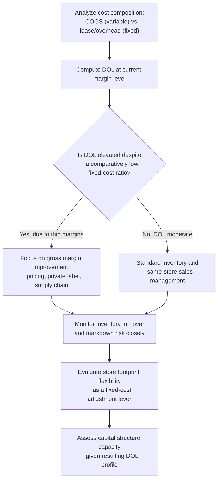

## Retail and Consumer Goods Cost Structures

### Conceptual Foundation

Retail and consumer goods businesses typically occupy the opposite end of the cost structure spectrum from capital intensive manufacturing, airlines, and SaaS platforms: a predominantly **variable cost structure**, where the cost of goods sold (COGS) — inventory purchased or manufactured for resale — scales closely and directly with sales volume. While retailers do carry fixed costs (store leases, corporate overhead, base staffing), these are generally a smaller proportion of total cost relative to COGS than in the high-fixed-cost archetypes examined elsewhere in this material. This produces a comparatively lower Degree of Operating Leverage (DOL), a lower breakeven volume relative to revenue, and a fundamentally different set of strategic and financial priorities centered on inventory management, margin discipline, and same-store sales performance rather than capacity utilization.

**Key Points**

- Cost of goods sold (COGS) — the largest single cost category for most retailers — is inherently variable, scaling directly with units sold.
- Fixed costs (store leases, corporate overhead, base staffing) exist but typically represent a smaller share of total cost than in high-fixed-cost industries, producing comparatively lower DOL.
- Inventory management, not capacity utilization, is the central operational lever, since unsold inventory ties up working capital and carries carrying/obsolescence costs distinct from the fixed-cost dynamics seen elsewhere.
- Gross margin percentage and same-store (comparable) sales growth are the primary performance metrics, reflecting the variable-cost-dominated nature of the business.

---

### Typical Cost Composition

| Cost Category | Classification | Notes |
| --- | --- | --- |
| Cost of goods sold (COGS) | Variable | The dominant cost category; scales directly with units sold |
| Store-level hourly staff (scheduled to demand) | Variable/semi-variable | Often scheduled flexibly against expected foot traffic, though a base staffing level is typically fixed |
| Store lease/rent | Fixed | Committed regardless of sales volume within the lease term |
| Store manager and corporate salaried staff | Fixed | Salaried positions largely independent of short-term sales fluctuations |
| Corporate overhead (headquarters, buying, marketing base) | Fixed | Largely independent of individual store sales volume |
| Credit card processing fees | Variable | Scales as a percentage of sales transacted |
| Sales commissions (where applicable) | Variable | Scales with sales achieved |
| Distribution and logistics (variable component) | Variable | Scales with volume shipped/moved, though distribution center fixed costs also exist |
| Marketing (promotional/variable) | Variable | Some marketing spend scales with promotional activity tied to sales periods |

---

### Comparatively Lower Operating Leverage

Because COGS dominates the cost structure and is variable, retail DOL is typically much lower than the high-fixed-cost archetypes examined elsewhere in this material:

$$DOL = \frac{Q(P-V)}{Q(P-V) - F}$$

With $F$ (fixed costs — leases, corporate overhead, base staffing) representing a comparatively smaller share of total cost, and the contribution margin denominator ($Q(P-V) - F$, i.e., EBIT) being closer in magnitude to the numerator, DOL for retailers is often in a moderate range — frequently well below the DOL levels seen in capital intensive manufacturing, airlines, or SaaS platforms near their own breakeven points. [Inference: specific DOL levels vary considerably across retail sub-sectors and individual companies, and general statements here should not be applied to any specific retailer without company-specific data]

**Worked Example:**

A retailer has:

- Annual sales: $\$8{,}000{,}000$
- COGS (variable, 65% of sales): $\$5{,}200{,}000$
- Store lease, corporate overhead, base staffing (fixed): $\$2{,}200{,}000$

Contribution margin $= 8{,}000{,}000 - 5{,}200{,}000 = \$2{,}800{,}000$

EBIT $= 2{,}800{,}000 - 2{,}200{,}000 = \$600{,}000$

$$DOL = \frac{2{,}800{,}000}{600{,}000} = 4.67$$

**Interpretation:** despite retail's reputation as a comparatively lower-fixed-cost industry, DOL can still be meaningfully elevated near typical operating margins, since retail net margins are often thin — meaning EBIT (the denominator) is small relative to the contribution margin (the numerator). This illustrates an important nuance: retail's DOL is driven less by an unusually large fixed cost base (as in manufacturing) and more by thin operating margins at typical scale, even though the underlying fixed-to-variable cost *ratio* is genuinely lower than in capital intensive industries. [Inference: this framing reflects the general mechanics of the DOL formula; actual retail margin and DOL profiles vary substantially by sub-sector, format, and specific company performance]

---

### Inventory Management as the Central Operational Lever

Unlike capacity utilization (manufacturing, airlines) or customer acquisition economics (SaaS), the central operational discipline in retail and consumer goods is **inventory management** — balancing the risk of stockouts (lost sales, dissatisfied customers) against the risk of overstocking (markdowns, obsolescence, carrying costs, and tied-up working capital):

1. **Inventory turnover** — the rate at which inventory is sold and replaced over a period — is a key efficiency metric, since holding excess inventory ties up cash and creates markdown risk without directly relating to the fixed-cost dynamics seen in high-DOL industries.
2. **Markdown risk** — unsold seasonal or perishable inventory often must be discounted below cost to clear, directly eroding the variable-cost-based gross margin the business depends on.
3. **Working capital cycle** — the interplay between inventory purchase timing, payment terms to suppliers, and sales collection creates a working capital dynamic distinct from the fixed-asset-heavy capital intensity seen in manufacturing.
4. **Demand forecasting** — accurate forecasting to align inventory purchases with expected demand is central to retail operational performance, given that both understocking and overstocking carry direct financial costs.

---

### Key Retail-Specific Performance Metrics

| Metric | Relevance to Cost Structure |
| --- | --- |
| Gross margin percentage | Directly reflects the variable-cost (COGS) structure — the fundamental unit economics of each sale |
| Same-store (comparable) sales growth | Measures demand-side performance independent of new store openings, isolating organic sales trends |
| Inventory turnover ratio | Reflects efficiency of the variable-cost-dominated inventory investment cycle |
| Sales per square foot | A capacity-utilization-like metric, but tied to fixed store footprint rather than production capacity |
| Operating margin | Reflects the interaction between the (comparatively smaller) fixed cost base and the variable COGS-driven gross margin |

---

### Strategic Implications of the Retail Cost Structure

1. **Greater capacity to absorb financial leverage.** Because retail DOL is often comparatively moderate relative to high-fixed-cost industries (notwithstanding the margin-driven elevation illustrated above), retailers may have somewhat greater capacity to use financial leverage within a given total risk tolerance — though actual leverage practice varies enormously by retailer, format, and credit market conditions. [Inference: this is a general implication of the DOL-DFL relationship covered elsewhere in this material, not a specific claim about any retailer's actual capital structure]
2. **Store footprint flexibility as a fixed-cost lever.** Because store leases represent a meaningful fixed-cost commitment, retailers can adjust their fixed cost base over time (opening/closing stores, renegotiating leases) more readily than manufacturers can adjust plant capacity, though this remains slower than adjusting variable staffing or inventory purchases.
3. **Private label and vertical integration strategies.** Some retailers pursue private-label products or greater vertical integration into their supply chain to improve gross margin (effectively reducing $V$ relative to $P$), directly improving contribution margin per unit sold.
4. **E-commerce shift and cost structure implications.** The growth of e-commerce introduces a different cost mix (fulfillment center/logistics costs, shipping) relative to traditional brick-and-mortar retail, altering the fixed-variable balance in ways that depend heavily on the specific fulfillment model chosen (owned distribution centers vs. third-party logistics). [Inference: the specific cost structure implications of e-commerce vs. brick-and-mortar vary considerably and would require more detailed, retailer-specific analysis]
5. **Promotional and discount strategy discipline.** Given thin typical margins in many retail segments, promotional pricing must be carefully bounded relative to variable cost (COGS) to avoid margin erosion — a tighter pricing discipline than the aggressive yield-management flexibility available to high-fixed-cost, low-marginal-cost industries like airlines or SaaS.

---

### Comparative Position Relative to Other Industry Archetypes

| Dimension | Retail/Consumer Goods | Capital Intensive Manufacturing | SaaS/Digital Platforms |
| --- | --- | --- | --- |
| Dominant cost category | COGS (variable) | Fixed capital/equipment costs | Fixed engineering/development costs |
| Typical DOL driver | Thin margins on a variable-cost-dominated base | Large fixed cost base relative to contribution margin | Very low marginal cost relative to price near breakeven |
| Central operational metric | Inventory turnover, same-store sales | Capacity utilization | Customer acquisition/retention economics |
| Pricing flexibility | Constrained by relatively high variable cost (COGS) | High — large gap between short-run and long-run pricing floor | Very high — marginal cost approaches zero at scale |
| Typical financial leverage capacity | Moderate to higher (subject to margin-driven DOL effects) | Lower — constrained by high DOL | Often low during growth phase (equity-financed), though otherwise less constrained by DOL at scale |

---

### Diagram: Retail Cost Structure Composition (svg_diagram)

<svg xmlns="http://www.w3.org/2000/svg" viewBox="0 0 760 380" font-family="Arial, sans-serif">
<text x="380" y="26" text-anchor="middle" font-size="17" font-weight="bold">Retail Cost Structure: COGS-Dominated (svg_diagram)</text>

<text x="190" y="60" text-anchor="middle" font-size="13" font-weight="bold">Typical Retail Cost Split</text>

<rect x="60" y="90" width="260" height="60" fill="`#e67e22`" opacity="0.5" />

<text x="190" y="125" text-anchor="middle" font-size="13" fill="white" font-weight="bold">COGS (Variable) ~65%</text>

<rect x="60" y="150" width="90" height="40" fill="#3498db" opacity="0.5" />
<text x="105" y="175" text-anchor="middle" font-size="11">Fixed ~27%</text>
<rect x="150" y="150" width="20" height="40" fill="#2ecc71" opacity="0.5" />
<text x="220" y="205" text-anchor="middle" font-size="11">Operating Margin ~8%</text>

<text x="190" y="240" text-anchor="middle" font-size="11" fill="#555">Contrast with high-fixed-cost industries:</text>

<text x="190" y="256" text-anchor="middle" font-size="11" fill="#555">most cost scales directly with sales volume</text>

<text x="570" y="60" text-anchor="middle" font-size="13" font-weight="bold">Contrast: Capital Intensive Split</text>

<rect x="440" y="90" width="150" height="60" fill="`#3498db`" opacity="0.5" />

<text x="515" y="125" text-anchor="middle" font-size="12" fill="white" font-weight="bold">Fixed ~55%</text>

<rect x="590" y="90" width="100" height="60" fill="#e67e22" opacity="0.5" />
<text x="640" y="125" text-anchor="middle" font-size="11">Variable ~35%</text>

<text x="570" y="180" text-anchor="middle" font-size="11" fill="#555">Fixed cost dominates —</text>

<text x="570" y="196" text-anchor="middle" font-size="11" fill="#555">drives higher DOL structurally</text>

</svg>

---

### Analytical Framework for Retail Cost Structure Management

---

### Common Analytical Pitfalls

- **Assuming retail automatically has low DOL because fixed costs are a smaller proportion of total cost**, without recognizing that thin operating margins can still produce elevated DOL through the mechanics of the DOL formula itself.
- **Applying capacity-utilization-style analysis (appropriate for manufacturing or airlines)** to a retail context where inventory management and same-store sales are the more relevant operational levers.
- **Treating all retail sub-sectors as having similar cost structures**, when significant variation exists between segments (e.g., grocery's typically thin margins and high turnover vs. luxury retail's higher margins and slower turnover). [Inference]
- **Overlooking the working capital implications of inventory decisions**, focusing only on the income-statement cost classification without considering the balance-sheet and cash-flow effects of inventory investment.

---

### Related Topics

- Degree of Operating Leverage (DOL) — formula and derivation
- Pricing Strategy Under Different Cost Structures (retail pricing discipline vs. high-fixed-cost flexibility)
- Capital Intensive Manufacturing Cost Structures and SaaS/Digital Platform Cost Structures (contrasting archetypes)
- Inventory management and working capital cycle analysis
- Same-store sales and comparable sales growth metrics
- Capital structure implications of high/low operating leverage
- Gross margin analysis and private label/vertical integration strategy