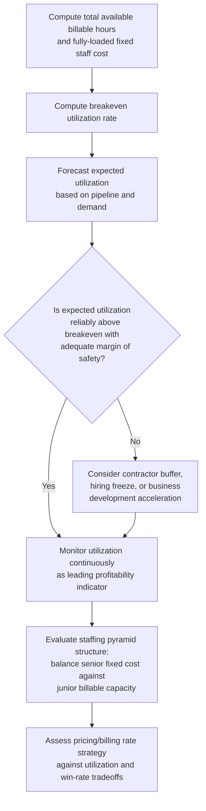

## Professional Services and Labor Intensive Cost Structures

### Conceptual Foundation

Professional services firms — consulting, legal, accounting, architecture, and similar knowledge-based businesses — represent a distinctive labor intensive cost structure archetype in which the dominant cost is skilled human capital, typically structured with a meaningful fixed component (salaried professional staff) alongside variable elements (contractors, overtime, performance-based compensation). Unlike retail (where COGS is the dominant variable cost) or capital intensive manufacturing (where physical capital dominates fixed costs), professional services firms generate revenue by billing out the time and expertise of their staff, making capacity utilization of billable hours — rather than physical plant utilization or inventory turnover — the central operational metric.

**Key Points**

- The dominant cost is professional labor, typically structured as salaried compensation (a largely fixed cost in the short run) rather than hourly variable wages.
- Utilization rate (the percentage of available staff hours actually billed to clients) functions as the professional services analogue to capacity utilization in manufacturing.
- Revenue is generated through billable hours or project fees, creating a cost structure where the "capacity" being sold is staff time rather than physical output.
- Because senior professional staff often cannot be quickly hired or terminated without significant cost and disruption, this structure exhibits meaningfully lower short-run flexibility than a purely variable, hourly-wage labor model would suggest.

---

### Typical Cost Composition

| Cost Category | Classification | Notes |
| --- | --- | --- |
| Salaried professional staff compensation | Largely fixed (short run) | The dominant cost category; committed regardless of billable utilization in any given period |
| Performance bonuses/profit sharing | Variable (tied to firm/individual performance) | Often a meaningful portion of total compensation, but typically determined and paid based on realized performance rather than scaling directly with billable hours in real time |
| Benefits and payroll taxes on salaried staff | Largely fixed | Scales with headcount, not with hours billed |
| Office space and facility overhead | Fixed | Committed regardless of utilization, though often a smaller proportion of total cost than in physical-asset-heavy industries |
| Contract/temporary staff (variable overflow capacity) | Variable | Used to handle demand spikes without expanding permanent fixed headcount |
| Overtime compensation (where applicable) | Variable | Scales with hours worked beyond standard capacity |
| Technology and research tools/subscriptions | Largely fixed | Typically licensed on a fixed basis independent of utilization |
| Travel and project-specific expenses | Variable | Scales with specific client engagements |

**Important nuance:** although salaried compensation is the dominant cost and behaves as fixed in the short run, this differs meaningfully from a pure capital-intensive fixed cost (like depreciation) — professional headcount, while sticky, can be adjusted over a somewhat shorter horizon (hiring freezes, targeted layoffs, use of contractors) than physical capital investment, giving this cost structure an intermediate degree of flexibility between pure labor intensive (hourly wage) models and pure capital intensive models.

---

### Utilization Rate as the Central Operational Metric

**Utilization rate** measures the percentage of available staff hours actually billed to clients:

$$\text{Utilization Rate} = \frac{\text{Billable Hours}}{\text{Total Available Hours}}$$

Because salaried compensation is largely fixed regardless of how many of a professional's hours are actually billed to clients, utilization rate functions analogously to capacity utilization in manufacturing or load factor in airlines — it is the key lever determining whether the largely fixed cost of maintaining professional staff is being converted into revenue-generating output.

**Worked Example:**

A consulting firm has:

- 50 consultants, each with 2,000 available hours annually
- Total available hours: $50 \times 2{,}000 = 100{,}000$ hours
- Fully-loaded annual cost per consultant (salary, benefits, overhead allocation): $\$180{,}000$, totaling $\$9{,}000{,}000$ in largely fixed cost
- Average billing rate: $\$220$/hour
- Variable cost per billable hour (project expenses, contractor supplementation): $\$15$/hour

**At 70% utilization:**

Billable hours $= 100{,}000 \times 0.70 = 70{,}000$ hours

Revenue $= 70{,}000 \times 220 = \$15{,}400{,}000$

Variable costs $= 70{,}000 \times 15 = \$1{,}050{,}000$

Contribution margin $= 15{,}400{,}000 - 1{,}050{,}000 = \$14{,}350{,}000$

EBIT $= 14{,}350{,}000 - 9{,}000{,}000 = \$5{,}350{,}000$

**At 55% utilization:**

Billable hours $= 100{,}000 \times 0.55 = 55{,}000$ hours

Revenue $= 55{,}000 \times 220 = \$12{,}100{,}000$

Variable costs $= 55{,}000 \times 15 = \$825{,}000$

Contribution margin $= 12{,}100{,}000 - 825{,}000 = \$11{,}275{,}000$

EBIT $= 11{,}275{,}000 - 9{,}000{,}000 = \$2{,}275{,}000$

**Interpretation:** a 15-percentage-point decline in utilization (70% → 55%, a roughly 21% decline in billable hours) produces a 57.5% decline in EBIT ($5,350,000 → $2,275,000) — illustrating substantial operating leverage driven by the fixed nature of professional compensation. This confirms that professional services firms, despite being "labor intensive" in a colloquial sense, can exhibit meaningfully elevated operating leverage once the fixed nature of salaried compensation is properly recognized — distinguishing this cost structure from a pure hourly-wage labor intensive model where cost would decline roughly proportionally with reduced utilization.

**Breakeven utilization:**

$$\text{Breakeven Utilization} = \frac{F}{\text{Total Available Hours} \times (P - V)} = \frac{9{,}000{,}000}{100{,}000 \times (220-15)} = \frac{9{,}000{,}000}{20{,}500{,}000} = 43.9\%$$

---

### Comparative Framework: Professional Services vs. Pure Labor Intensive vs. Pure Capital Intensive

| Dimension | Professional Services (Salaried) | Pure Labor Intensive (Hourly Wage) | Capital Intensive Manufacturing |
| --- | --- | --- | --- |
| Dominant cost | Salaried professional compensation | Hourly wages | Equipment depreciation, facility costs |
| Short-run cost behavior | Largely fixed | Variable (scales with hours scheduled) | Fixed |
| Flexibility to reduce cost quickly | Moderate (hiring freezes, contractor substitution, targeted layoffs) | High (reduce scheduled hours) | Low (equipment cannot be easily divested) |
| Central operational metric | Utilization rate (billable hours) | Labor cost as % of revenue | Capacity utilization |
| Typical DOL | Moderate to high, particularly at lower utilization levels | Low | High |
| Revenue driver | Billing rate × billable hours | Units of service delivered | Units of product sold |

This positions professional services as occupying an **intermediate** position on the cost structure spectrum — genuinely "labor intensive" in that the dominant cost is human capital rather than physical capital, but exhibiting operating leverage characteristics closer to a moderately fixed-cost structure than to the classic variable, hourly-wage labor intensive model (e.g., retail floor staff, food service) discussed under the broader capital-versus-labor-intensive framework.

---

### Strategic Implications Specific to Professional Services

1. **Staffing pyramid and leverage models.** Many professional services firms (notably consulting and law) use a "pyramid" staffing structure with a smaller number of senior, higher-fixed-cost partners/principals overseeing a larger base of junior staff — allowing the firm to scale billable capacity while managing the proportion of the cost base tied to the most senior, highest-cost, and most difficult-to-adjust compensation levels. [Inference: specific staffing ratios and their strategic rationale vary considerably by firm and industry segment]
2. **Contractor and variable staffing buffers.** Using contractors or part-time staff to absorb demand fluctuations allows firms to maintain a smaller core fixed-cost base of full-time salaried staff, effectively lowering DOL by converting some potential fixed cost into genuinely variable cost — directly analogous to the outsourcing/variabilization strategies discussed elsewhere in this material.
3. **Pipeline and business development discipline.** Given the fixed nature of salaried staff cost, maintaining a steady pipeline of client engagements to sustain utilization becomes a critical ongoing management discipline, distinct from the capacity-utilization forecasting seen in manufacturing but conceptually analogous.
4. **Talent retention as a strategic priority.** Because skilled professional staff represent both the firm's primary cost and its primary revenue-generating asset, retention (avoiding costly and disruptive turnover) takes on outsized strategic importance compared to industries where labor is more readily substitutable.
5. **Pricing and billing rate strategy.** Given that utilization (not billing rate alone) drives profitability, professional services firms must balance premium pricing (which may reduce win rates and thus utilization) against volume-oriented pricing (which may sustain utilization but compress margin per hour) — a tension distinct from the pure cost-based pricing floors discussed under general pricing strategy. [Inference: the specific optimal balance depends heavily on competitive positioning and market segment, and cannot be generalized]

---

### Diagram: Utilization Rate and Profitability Sensitivity (svg_diagram)

<svg xmlns="http://www.w3.org/2000/svg" viewBox="0 0 760 380" font-family="Arial, sans-serif">
<text x="380" y="26" text-anchor="middle" font-size="17" font-weight="bold">Professional Services: Utilization Rate Sensitivity (svg_diagram)</text>
<line x1="80" y1="340" x2="700" y2="340" stroke="black" stroke-width="2" />
<line x1="80" y1="340" x2="80" y2="60" stroke="black" stroke-width="2" />
<text x="390" y="365" text-anchor="middle" font-size="13">Utilization Rate (%)</text>
<text x="30" y="200" text-anchor="middle" font-size="13" transform="rotate(-90 30 200)">EBIT</text>
<line x1="330" y1="60" x2="330" y2="340" stroke="black" stroke-width="1" stroke-dasharray="4,3" />
<text x="330" y="355" text-anchor="middle" font-size="11">Breakeven Utilization (~44%)</text>
<path d="M 80 320 L 700 100" stroke="#2980b9" stroke-width="2.5" />
<text x="580" y="110" font-size="12" fill="#2980b9">EBIT rises with utilization</text>
<circle cx="500" cy="180" r="4" fill="black" />
<text x="510" y="175" font-size="10">70% util. → EBIT $5.35M</text>
<circle cx="410" cy="255" r="4" fill="black" />
<text x="420" y="270" font-size="10">55% util. → EBIT $2.28M</text>

<text x="180" y="300" font-size="11" fill="`#c0392b`">Losses below breakeven —</text>

<text x="180" y="315" font-size="11" fill="`#c0392b`">fixed salaries still incurred</text>

</svg>

---

### Analytical Framework for Professional Services Cost Management

---

### Common Analytical Pitfalls

- **Treating professional services as a simple variable-cost labor model** because it is "labor intensive," missing that salaried compensation behaves as a largely fixed cost in the short run, producing meaningful operating leverage.
- **Focusing on billing rate alone** without recognizing that utilization rate is often the more critical driver of profitability, given the fixed nature of the underlying staff cost.
- **Underestimating the disruption and cost of adjusting senior staff levels**, treating professional headcount as more flexible than it typically is in practice, particularly for senior, client-relationship-holding personnel. [Inference]
- **Overlooking the intermediate flexibility position of this cost structure**, either treating it as fully fixed (like manufacturing capital) or fully variable (like hourly retail labor), when the reality — moderate adjustability via contractors, hiring freezes, and targeted layoffs — sits meaningfully between these extremes.

---

### Related Topics

- Degree of Operating Leverage (DOL) and breakeven analysis, applied to utilization-based revenue models
- Capital Intensive versus Labor Intensive Cost Structures (the broader framework this topic specializes)
- Outsourcing and Variabilizing Fixed Costs (contractor buffering as a variabilization strategy)
- Capital structure implications of high operating leverage
- Retail and Consumer Goods Cost Structures (a contrasting variable-cost-dominated archetype)
- Talent management and retention strategy in knowledge-based industries
- Pricing Strategy Under Different Cost Structures (billing rate vs. utilization tradeoffs)