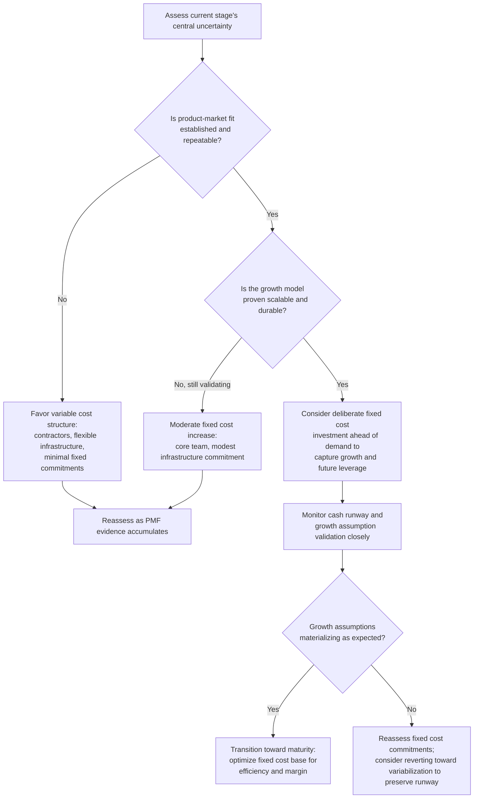

## Cost Structure Evolution Across Startup Growth Stages

### Conceptual Foundation

A startup's cost structure is not static — it evolves systematically as the company progresses from initial concept through scale, with each stage typically characterized by a distinct fixed-variable cost mix, operating leverage profile, and set of dominant risks. Unlike a mature firm operating within an established industry archetype (as examined for capital intensive manufacturing, airlines, SaaS, retail, and professional services elsewhere in this material), a startup's cost structure is a moving target shaped by deliberate strategic choices about when to commit to fixed costs versus preserve variable flexibility, made under conditions of substantial uncertainty about future demand and product-market fit.

**Key Points**

- Early-stage startups typically favor variable, flexible cost structures to preserve optionality while product-market fit remains unproven.
- As product-market fit is established and growth becomes the priority, startups often deliberately increase fixed costs (headcount, infrastructure, facilities) to scale capacity ahead of demand.
- This progression means operating leverage (DOL) tends to rise through the growth stages, then often stabilizes or moderates as the firm matures into a scaled, profitable operation.
- The appropriate cost structure at each stage is a function of the specific uncertainty being resolved — product uncertainty, market uncertainty, or scaling uncertainty — not a fixed formula applicable to all startups.

---

### Stage 1: Pre-Product-Market Fit (Seed/Early Stage)

**Characteristic cost structure:** Highly variable, minimal fixed commitments.

**Typical composition:**

- Founder and small core team compensation, often below-market or equity-heavy, minimizing cash fixed costs
- Contractor and freelance usage rather than full-time hires for non-core functions
- Cloud infrastructure on pay-as-you-go tiers rather than committed capacity
- Minimal or no physical office footprint (remote-first, co-working space on flexible terms)
- Outsourced or minimal marketing spend, often organic/founder-led rather than paid channels with fixed retainers

**Rationale:** At this stage, the central uncertainty is whether the product solves a genuine customer problem — product-market fit is unproven, and demand is highly uncertain. A predominantly variable cost structure preserves optionality: if the initial approach fails to gain traction, the firm can pivot or wind down with minimal stranded fixed-cost commitments. This mirrors the general principle that variabilization (see outsourcing and variabilization elsewhere in this material) is most valuable precisely when future demand is highly uncertain.

**Typical DOL:** Low, by deliberate design — the firm is structured to minimize the earnings (or loss) amplification effect of an uncertain and likely low or volatile revenue base.

---

### Stage 2: Early Product-Market Fit / Initial Scaling

**Characteristic cost structure:** Beginning shift toward fixed costs, but still substantial flexibility retained.

**Typical composition:**

- First full-time hires beyond founders, typically in core product, engineering, and early sales/customer success roles
- Committed (though often modest) cloud infrastructure spend as usage grows and pay-as-you-go tiers become less cost-efficient
- Possible first dedicated office space, though often still flexible (shorter lease terms, coworking)
- Beginning of more structured marketing spend, though often still performance-based/variable (paid acquisition tied to measurable ROI) rather than large fixed brand marketing commitments

**Rationale:** With initial evidence of product-market fit, the central uncertainty shifts from "does anyone want this" to "how repeatable and scalable is this demand." Some fixed cost commitment becomes justified to build the foundational team and infrastructure needed to serve a growing but still relatively small and unproven customer base, while retaining enough flexibility to adjust if growth assumptions prove overly optimistic.

**Typical DOL:** Rising, as the fixed cost base grows faster than the still-modest revenue base — often the stage where DOL, if calculated, would appear highest in percentage terms (though on a small absolute revenue and cost base), mirroring the extreme-DOL-near-breakeven dynamic discussed under SaaS/digital platform cost structures.

---

### Stage 3: Growth Stage (Scaling Demand)

**Characteristic cost structure:** Significant, deliberate fixed cost investment ahead of current revenue.

**Typical composition:**

- Substantial headcount growth across engineering, sales, marketing, and operations, often hired ahead of current revenue to support anticipated growth
- Committed infrastructure capacity (reserved cloud capacity, dedicated data infrastructure) to support scaling usage
- Expanded office footprint and potentially multiple locations
- Larger, more committed marketing spend, including brand-building investments with less immediately measurable ROI than pure performance marketing

**Rationale:** Having validated demand and a repeatable growth model, many startups deliberately shift toward a higher fixed cost structure to capture market share and scale efficiently, reasoning that the operating leverage payoff (as demonstrated under SaaS/digital platform cost structures) justifies near-term losses or thin margins in service of longer-term profitable scale. This represents a conscious tradeoff of near-term earnings volatility and burn rate for the possibility of significant future operating leverage benefit — a strategy that depends heavily on continued access to growth financing and the durability of the underlying growth assumptions. [Speculation: whether this strategy proves value-maximizing for any specific startup depends on numerous firm-specific and market factors that cannot be assessed in general terms]

**Typical DOL:** High, and often intentionally so — the firm may be operating at a loss or thin margin by design, with growth in revenue expected to convert disproportionately into future profit once the fixed cost base is more fully utilized, consistent with the mechanics established under general operating leverage.

**Key risk:** if growth assumptions do not materialize as expected, the firm faces the classic high-DOL vulnerability — a fixed cost base that cannot be quickly reduced, now unsupported by the anticipated revenue growth, creating acute cash burn and runway risk.

---

### Stage 4: Maturity / Scaled Operations

**Characteristic cost structure:** Stabilizing, often moderating DOL as the fixed cost base is more fully leveraged against an established revenue base.

**Typical composition:**

- More disciplined hiring aligned with proven unit economics rather than growth-at-all-costs hiring
- Infrastructure and facilities scaled to match established, more predictable demand patterns
- Marketing spend increasingly justified by demonstrated ROI and customer lifetime value rather than speculative growth investment
- Potential reintroduction of some variabilization strategies (outsourcing non-core functions, more flexible facility arrangements) as the firm optimizes an already-established cost base for efficiency rather than pure growth

**Rationale:** With demand more established and predictable, the firm shifts priorities from capturing growth at the cost of near-term profitability toward optimizing the now-larger, more stable revenue base for sustainable margin — a transition conceptually similar to how a manufacturer might reassess a previously growth-driven fixed cost investment for efficiency once volume has stabilized.

**Typical DOL:** Often moderates from the peak levels seen during the growth stage, as the firm's revenue base has grown large enough that the (now largely fixed) cost base represents a smaller proportional share of the business's economics — consistent with the general DOL behavior of declining toward 1 as volume rises well above breakeven.

---

### Summary Table: Cost Structure Evolution

| Stage | Dominant Cost Behavior | Central Uncertainty | Typical DOL Trajectory | Central Risk |
| --- | --- | --- | --- | --- |
| Pre-PMF (Seed) | Highly variable | Product-market fit | Low, by design | Running out of runway before finding fit |
| Early PMF | Shifting toward fixed | Repeatability/scalability of demand | Rising | Committing to fixed costs before demand is proven durable |
| Growth Stage | Significant fixed investment | Scaling efficiency and market capture | High, often intentional | Growth assumptions failing to materialize against a fixed cost base |
| Maturity | Stabilizing, optimized mix | Sustaining margin and efficiency | Moderating | Complacency or failure to adapt cost structure to changing competitive conditions |

---

### Financing Implications Across the Stages

The evolving cost structure interacts closely with typical financing patterns at each stage, connecting directly to the broader relationship between operating leverage and capital structure capacity:

- **Pre-PMF/Early PMF:** Financing is typically pure equity (founder capital, angel/seed investment), since the firm has minimal or no stable cash flow to support debt service, and the high uncertainty makes debt financing largely inaccessible or inappropriate regardless of the (currently low) DOL level.
- **Growth Stage:** Financing typically remains equity-heavy (venture capital rounds) despite potentially high DOL, since the firm is often not yet cash-flow-positive and traditional debt capacity analysis (which assumes stable EBIT to service fixed interest) does not straightforwardly apply to a firm still investing ahead of proven, stable cash generation. [Inference: certain growth-stage startups do access venture debt or revenue-based financing, but these instruments and their appropriate use are a distinct topic from the core cost-structure-and-leverage relationship discussed here]
- **Maturity:** As cash flow stabilizes and becomes more predictable, traditional capital structure principles (matching financial leverage capacity to a now more clearly understood DOL and cash flow profile) become more directly applicable, potentially opening access to conventional debt financing on the same basis as an established firm in the relevant industry archetype.

---

### Diagram: Cost Structure and DOL Evolution Across Stages (svg_diagram)

<svg xmlns="http://www.w3.org/2000/svg" viewBox="0 0 780 380" font-family="Arial, sans-serif">
<text x="390" y="26" text-anchor="middle" font-size="17" font-weight="bold">Startup Cost Structure Evolution (svg_diagram)</text>
<line x1="80" y1="330" x2="720" y2="330" stroke="black" stroke-width="2" />
<line x1="80" y1="330" x2="80" y2="60" stroke="black" stroke-width="2" />
<text x="400" y="355" text-anchor="middle" font-size="13">Growth Stage Progression</text>
<text x="30" y="195" text-anchor="middle" font-size="13" transform="rotate(-90 30 195)">Fixed Cost Proportion / DOL</text>

<text x="140" y="345" text-anchor="middle" font-size="10">Pre-PMF</text>

<text x="300" y="345" text-anchor="middle" font-size="10">Early PMF</text>

<text x="480" y="345" text-anchor="middle" font-size="10">Growth</text>

<text x="640" y="345" text-anchor="middle" font-size="10">Maturity</text>

<path d="M 100 310 L 300 250 L 480 110 L 640 160" stroke="#8e44ad" stroke-width="2.5" fill="none" />
<circle cx="100" cy="310" r="5" fill="#8e44ad" />
<circle cx="300" cy="250" r="5" fill="#8e44ad" />
<circle cx="480" cy="110" r="5" fill="#8e44ad" />
<circle cx="640" cy="160" r="5" fill="#8e44ad" />

<text x="480" y="95" text-anchor="middle" font-size="11" font-weight="bold">Peak DOL —</text>

<text x="480" y="80" text-anchor="middle" font-size="10">deliberate growth investment</text>

<text x="640" y="145" text-anchor="middle" font-size="10">DOL moderates as</text>

<text x="640" y="130" text-anchor="middle" font-size="10">revenue base matures</text>

<text x="140" y="295" text-anchor="middle" font-size="10">Low DOL —</text>

<text x="140" y="280" text-anchor="middle" font-size="10">variable, flexible</text>

</svg>

---

### Stage-Appropriate Decision Framework

---

### Common Analytical Pitfalls

- **Applying a mature-industry cost structure framework too early**, committing to fixed costs before product-market fit is genuinely established, creating unnecessary downside risk during a stage when flexibility is most valuable.
- **Failing to transition from a growth-stage fixed cost structure to a maturity-stage optimized structure**, continuing aggressive fixed cost investment past the point where it is justified by demonstrated, durable demand.
- **Treating the growth-stage high-DOL strategy as universally correct** without recognizing that it depends heavily on continued access to financing and the validity of underlying growth assumptions — a strategy that carries genuine failure risk if those assumptions prove wrong. [Inference]
- **Ignoring the interaction between cost structure stage and appropriate financing type**, attempting to access traditional debt financing at a stage where the firm's cash flow profile does not yet support conventional debt capacity analysis.

---

### Related Topics

- Degree of Operating Leverage (DOL) — formula, derivation, and behavior across the business lifecycle
- Software as a Service and Digital Platform Cost Structures (the archetype most directly relevant to growth-stage startup dynamics)
- Outsourcing and Variabilizing Fixed Costs (relevant to pre-PMF and early-PMF stage strategies)
- Capital structure implications of high operating leverage (applied across financing stages)
- Capital Intensive versus Labor Intensive Cost Structures (relevant to the make/hire decisions at each stage)
- Venture financing and startup capital structure evolution
- Runway and burn rate analysis in early-stage company management