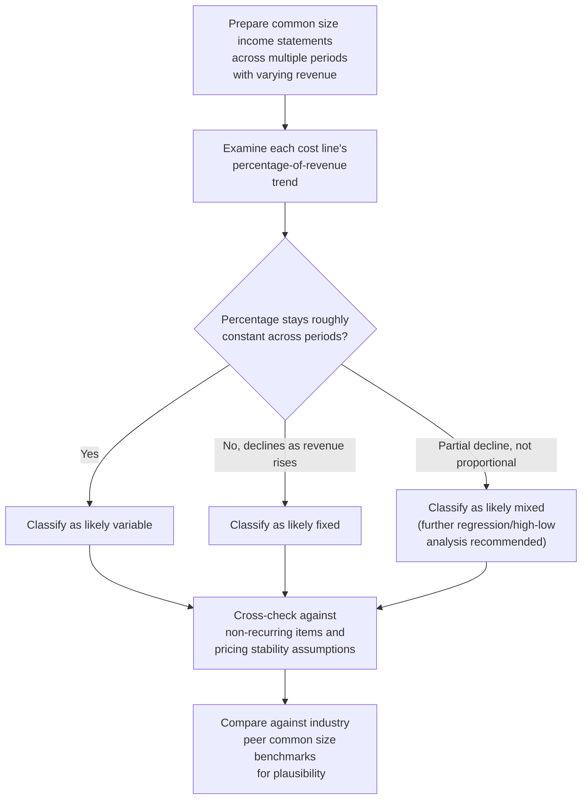

## Common Size Income Statement Analysis for Cost Behavior

### Conceptual Foundation

Common size income statement analysis expresses every line item as a percentage of total revenue (sales), rather than in absolute dollar terms, enabling direct comparison of cost structure across different periods, companies of different sizes, or against industry benchmarks. While common size analysis is a general financial statement technique, it has a specific and powerful application to cost behavior analysis: by observing how each cost line's percentage-of-revenue changes as revenue itself changes across periods, an analyst can gather meaningful evidence about which costs behave as fixed versus variable — a purely variable cost should maintain a roughly constant percentage of revenue, while a purely fixed cost's percentage should move inversely with revenue.

**Key Points**

- A cost line that remains a stable percentage of revenue across periods of varying sales volume behaves as approximately variable.
- A cost line whose percentage of revenue declines as revenue rises (and rises as revenue falls) behaves as approximately fixed.
- This technique provides a fast, intuitive complement to formal regression-based estimation, though it is less statistically precise.
- Common size analysis is most informative when applied across multiple periods with meaningfully different revenue levels, since a narrow range of revenue variation limits the technique's diagnostic power.

---

### The Analytical Logic

**For a purely variable cost** ($TC = V \times Q$, with price per unit roughly stable), the cost-to-revenue ratio remains constant:

$$\frac{V \times Q}{P \times Q} = \frac{V}{P} = \text{constant regardless of } Q$$

**For a purely fixed cost** ($TC = F$, unchanged regardless of volume), the cost-to-revenue ratio moves inversely with revenue:

$$\frac{F}{P \times Q} \implies \text{ratio decreases as } Q \text{ (and thus revenue) increases}$$

This inverse relationship for fixed costs — sometimes referred to as the **operating leverage effect visible in common size form** — is the central diagnostic signal analysts look for: a cost line whose percentage of revenue shrinks meaningfully as the company grows (and grows as revenue contracts) is behaving as a fixed cost, since it is not scaling proportionally with the volume driving revenue.

---

### Worked Example

A company's common size income statement across three fiscal years, with revenue growing over the period:

|  | Year 1 | Year 2 | Year 3 |
| --- | --- | --- | --- |
| Revenue | $10,000,000 (100%) | $14,000,000 (100%) | $18,000,000 (100%) |
| Cost of goods sold | $6,000,000 (60.0%) | $8,400,000 (60.0%) | $10,800,000 (60.0%) |
| Depreciation & amortization | $1,200,000 (12.0%) | $1,250,000 (8.9%) | $1,300,000 (7.2%) |
| Salaried administrative staff | $800,000 (8.0%) | $850,000 (6.1%) | $900,000 (5.0%) |
| Sales commissions | $500,000 (5.0%) | $700,000 (5.0%) | $900,000 (5.0%) |
| Operating income | $1,500,000 (15.0%) | $2,800,000 (20.0%) | $4,100,000 (22.8%) |

**Diagnostic interpretation of each line:**

- **Cost of goods sold (60.0% in all three years):** the percentage of revenue is essentially constant across all three years despite revenue growing 80% over the period — strong evidence this cost behaves as **variable**, consistent with a per-unit cost that scales proportionally with sales.
- **Depreciation & amortization (12.0% → 8.9% → 7.2%):** the percentage of revenue declines steadily as revenue grows, even though the absolute dollar amount barely changes ($1,200,000 → $1,300,000) — strong evidence this cost behaves as **fixed**, since it is not scaling with volume at all in absolute terms, causing its relative burden to shrink as the revenue base grows.
- **Salaried administrative staff (8.0% → 6.1% → 5.0%):** similarly declining percentage despite modest absolute dollar growth ($800,000 → $900,000, only a 12.5% increase against an 80% revenue increase) — evidence of a **largely fixed** cost with perhaps a small variable or step-fixed component (the modest absolute increase might reflect occasional headcount additions rather than proportional scaling).
- **Sales commissions (5.0% in all three years):** constant percentage of revenue — strong evidence this cost is **variable**, consistent with a commission structure calculated as a fixed percentage of sales.
- **Operating income (15.0% → 20.0% → 22.8%):** the rising operating margin percentage, driven by the combination of a stable COGS/commission ratio and declining fixed-cost ratios, is itself direct visual evidence of **operating leverage in action** — as fixed costs are spread over a growing revenue base, an increasing proportion of each additional revenue dollar flows through to operating income, consistent with the general DOL mechanics established elsewhere in this material.

---

### Comparative Diagnostic Table

| Common Size Pattern Across Periods of Rising Revenue | Inferred Cost Behavior |
| --- | --- |
| Percentage of revenue stays constant | Likely variable |
| Percentage of revenue declines steadily | Likely fixed |
| Percentage of revenue declines but not proportionally to revenue growth | Likely mixed/semi-variable (has both fixed and variable components) |
| Percentage of revenue is volatile/erratic without clear pattern | May reflect one-time items, structural changes, or genuinely non-linear cost behavior requiring further investigation |

---

### Using Common Size Analysis for Peer and Industry Comparison

Beyond analyzing a single company's cost behavior across time, common size statements enable **cross-sectional comparison** — comparing the cost structure percentages of different companies (adjusted for size via the common size format) to assess relative operating leverage positioning:

**Illustrative Comparison:**

|  | Company A (retailer) | Company B (SaaS platform) |
| --- | --- | --- |
| Revenue | 100% | 100% |
| COGS/Hosting costs | 62% | 15% |
| Fixed operating costs (SG&A, R&D) | 28% | 65% |
| Operating income | 10% | 20% |

This comparison, consistent with the industry archetypes established elsewhere in this material (retail and consumer goods cost structures vs. SaaS and digital platform cost structures), visually confirms the expected structural difference: Company A's cost structure is dominated by a large variable COGS line, while Company B's is dominated by a large, presumably fixed cost line (reflecting engineering and infrastructure investment) alongside a much smaller variable/marginal cost component — a pattern immediately visible in common size format even without formal regression analysis.

---

### Limitations of Common Size Analysis for Cost Behavior Inference

1. **Assumes stable per-unit pricing.** The core logic (variable costs maintain a constant revenue percentage) assumes the average selling price per unit has not changed materially across the periods compared — a price increase or decrease unrelated to volume could distort the apparent cost-to-revenue ratio even for a genuinely variable cost. [Inference]
2. **Cannot cleanly separate mixed costs.** A cost with both fixed and variable components will show a declining-but-not-proportional pattern that is diagnostically ambiguous without further quantitative work (e.g., regression or high-low analysis) to actually separate the two components.
3. **Sensitive to non-recurring items.** One-time charges, restructuring costs, or unusual gains/losses in any given period can distort the common size percentages for that period, potentially leading to an incorrect inference about underlying cost behavior if not identified and adjusted for.
4. **Requires meaningful revenue variation across periods to be diagnostic.** If revenue has been relatively flat across the periods examined, the technique provides limited diagnostic power, since even a genuinely fixed cost would show little change in its revenue percentage over a narrow revenue range.
5. **Aggregation within reported line items can mask underlying behavior.** As with the broader challenge of identifying cost structure from published income statements, individual reported line items (e.g., "operating expenses") often blend multiple underlying costs with different true behaviors, and the common size percentage for the aggregate line reflects only the net effect of this mix. [Inference]

---

### Diagram: Common Size Pattern Recognition (svg_diagram)

<svg xmlns="http://www.w3.org/2000/svg" viewBox="0 0 760 380" font-family="Arial, sans-serif">
<text x="380" y="26" text-anchor="middle" font-size="17" font-weight="bold">Common Size Patterns: Fixed vs. Variable Cost Signatures (svg_diagram)</text>
<line x1="80" y1="330" x2="700" y2="330" stroke="black" stroke-width="2" />
<line x1="80" y1="330" x2="80" y2="60" stroke="black" stroke-width="2" />
<text x="390" y="355" text-anchor="middle" font-size="13">Period (Rising Revenue →)</text>
<text x="30" y="200" text-anchor="middle" font-size="13" transform="rotate(-90 30 200)">Cost as % of Revenue</text>

<line x1="120" y1="230" x2="660" y2="230" stroke="#27ae60" stroke-width="2.5" />
<text x="600" y="220" font-size="12" fill="#27ae60">Variable Cost (COGS): flat %</text>

<path d="M 120 130 Q 350 200 660 280" stroke="#c0392b" stroke-width="2.5" fill="none" />
<text x="580" y="295" font-size="12" fill="#c0392b">Fixed Cost (D&amp;A): declining %</text>

<circle cx="120" cy="130" r="4" fill="#c0392b" />
<circle cx="390" cy="185" r="4" fill="#c0392b" />
<circle cx="660" cy="280" r="4" fill="#c0392b" />
<circle cx="120" cy="230" r="4" fill="#27ae60" />
<circle cx="390" cy="230" r="4" fill="#27ae60" />
<circle cx="660" cy="230" r="4" fill="#27ae60" />

<text x="390" y="70" text-anchor="middle" font-size="11" fill="#555">A flat line signals variable cost behavior;</text>

<text x="390" y="86" text-anchor="middle" font-size="11" fill="#555">a declining line signals fixed cost behavior</text>

</svg>

---

### Analytical Workflow

---

### Common Analytical Pitfalls

- **Over-relying on visual pattern recognition without quantitative confirmation**, treating common size analysis as a substitute for, rather than a complement to, more rigorous regression-based estimation when precision matters.
- **Failing to adjust for one-time or non-recurring items** before interpreting a period's common size percentages, potentially misattributing an unusual item's effect to underlying cost behavior.
- **Assuming stable pricing when comparing periods**, when in reality price changes (inflation-driven or strategic) can distort the apparent behavior of genuinely variable costs. [Inference]
- **Applying the technique over too narrow a revenue range**, limiting its diagnostic power to distinguish fixed from variable cost behavior when volume has not varied meaningfully across the periods examined.

---

### Related Topics

- Identifying Cost Structure from Published Income Statements (the broader external-analysis framework this technique supports)
- High-low method and regression-based cost estimation techniques
- Degree of Operating Leverage (DOL) and its visibility in common size operating margin trends
- Industry-specific cost structure archetypes for peer benchmarking
- Financial statement analysis and ratio interpretation more broadly
- Flexible Budgeting and Cost Structure (a related fixed/variable classification application)
- Vertical and horizontal analysis techniques in financial statement analysis