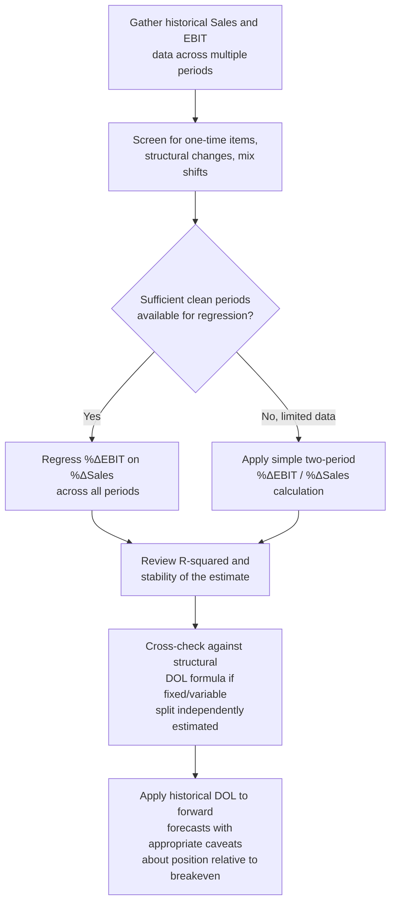

## Estimating Historical DOL from Financial Statement Data

### Conceptual Foundation

While the Degree of Operating Leverage (DOL) point formula developed earlier in this material requires knowledge of a firm's internal fixed and variable cost split, external analysts without access to management accounting detail can estimate DOL retrospectively using only the historical sales and EBIT figures reported in published financial statements. This approach — sometimes called the **historical percentage-change method** — sidesteps the need to separately identify fixed and variable costs by directly applying DOL's definitional (elasticity) formula to observed period-over-period changes, making it a practical complement to the cost-structure-inference techniques (regression, high-low method, common size analysis) covered elsewhere in this chapter.

**Key Points**

- The historical DOL estimate applies the elasticity definition directly to reported sales and EBIT changes across two or more periods, without requiring separate fixed/variable cost identification.
- This method is most reliable when applied across periods with a genuinely stable underlying cost structure, and becomes distorted by structural changes, one-time items, or highly volatile individual-period comparisons.
- Using multiple periods (via regression of %ΔEBIT against %ΔSales) generally produces a more robust estimate than a single two-period comparison.
- The resulting estimate should be interpreted as an approximation of the firm's *average* operating leverage over the period examined, not a precise point-in-time DOL at current volume.

---

### The Core Historical Estimation Formula

**Two-period method (definitional formula applied directly):**

$$DOL_{historical} = \frac{\%\Delta EBIT}{\%\Delta Sales}$$

Using only publicly reported Sales and EBIT (Operating Income) figures for two comparable periods, this directly estimates the realized operating leverage between those two points, without needing to separately know $F$ or $V$.

**Worked Example:**

A company reports the following historical figures:

|  | Year 1 | Year 2 |
| --- | --- | --- |
| Sales | $25,000,000 | $29,000,000 |
| Operating Income (EBIT) | $3,200,000 | $4,700,000 |

$$\%\Delta Sales = \frac{29{,}000{,}000 - 25{,}000{,}000}{25{,}000{,}000} = 16.0\%$$

$$\%\Delta EBIT = \frac{4{,}700{,}000 - 3{,}200{,}000}{3{,}200{,}000} = 46.9\%$$

$$DOL_{historical} = \frac{46.9\%}{16.0\%} = 2.93$$

**Interpretation:** over this period, a 1% change in sales was associated with approximately a 2.93% change in EBIT — suggesting a moderately high degree of operating leverage. This estimate can then be used to approximate expected EBIT sensitivity to future sales changes, subject to the important caveat that it reflects historically realized leverage over this specific interval, not necessarily the firm's current, forward-looking DOL at its present sales level.

---

### Multi-Period Regression Approach

A more statistically robust variant regresses percentage changes in EBIT against percentage changes in sales across many historical periods (quarterly data is often preferred for a larger sample size):

$$\%\Delta EBIT_t = \alpha + \beta \times \%\Delta Sales_t + \varepsilon_t$$

The estimated slope coefficient $\beta$ serves as the historical DOL estimate, averaged across all periods included in the regression, smoothing out the noise and potential distortion that a single two-period comparison is vulnerable to.

**Advantages over the simple two-period method:**

- Uses more data, reducing sensitivity to any single unusual period.
- The regression's R-squared and standard errors provide a sense of how reliable and stable the estimated relationship actually is — a low R-squared would indicate that the simple linear DOL relationship is a poor description of the company's actual EBIT-sales dynamics over the period, perhaps due to other significant drivers of EBIT variability (cost structure changes, one-time items, pricing shifts) not captured by the volume-leverage relationship alone.
- Can help identify whether DOL itself appears to be trending over time (e.g., rising DOL across recent quarters might suggest the firm has been shifting toward a more fixed-cost-heavy structure, consistent with the kind of deliberate shift examined under automation and its effect on the fixed-variable mix).

**Practical consideration:** as with the regression-based cost structure estimation techniques covered elsewhere in this material, a reasonably large number of historical periods (often 12-20+ quarters is preferred for reasonable statistical reliability) and a stable underlying business model over that window are both important preconditions for a meaningful estimate. [Inference: specific minimum sample size recommendations are general statistical practice guidance rather than a fixed rule, and appropriate sample size depends on the data's underlying variability]

---

### Cross-Checking Against the Structural (Component) DOL Formula

Where sufficient additional disclosure exists (e.g., detailed segment reporting, disclosed cost of goods sold trends, or successfully-inferred fixed/variable splits from the techniques covered under identifying cost structure from published income statements), the historical percentage-change DOL estimate can be cross-checked against the structural formula:

$$DOL_{structural} = \frac{\text{Contribution Margin}}{\text{EBIT}}$$

**Convergence check:** if the historical percentage-change estimate and the structural estimate (built from an independently-inferred fixed/variable split) produce reasonably similar DOL figures, this increases confidence in both estimates. A significant divergence between the two suggests either the historical period examined was not representative of the firm's current cost structure (e.g., due to a structural shift during the sample period), or the underlying fixed/variable cost inference used in the structural estimate requires refinement.

---

### Sources of Distortion in Historical DOL Estimates

| Distortion Source | Effect on Historical DOL Estimate |
| --- | --- |
| One-time gains/losses in either period's EBIT | Can dramatically inflate or deflate the estimate, since these items are unrelated to the volume-driven operating leverage relationship being measured |
| Price changes unrelated to volume (inflation, strategic repricing) | Distorts the sales figure's relationship to actual unit volume, complicating interpretation of the resulting DOL as a pure volume-sensitivity measure |
| Structural cost changes during the period (automation, outsourcing, major restructuring) | Means the estimated DOL reflects a blend of the "before" and "after" cost structures rather than either one cleanly |
| Changes in product/segment mix | A shift toward higher- or lower-margin products/segments between periods can alter the observed EBIT-sales relationship independent of pure operating leverage effects |
| Small denominator effects (near-breakeven periods) | If either period's sales or EBIT change is very small in absolute or percentage terms, the resulting ratio can be extremely volatile and unreliable, consistent with the general instability of DOL near breakeven established under the core DOL formula discussion |

---

### Using Historical DOL Estimates for Forward-Looking Analysis

Once a historical DOL estimate is derived, it is commonly used to approximate expected future EBIT sensitivity:

$$\%\Delta EBIT_{expected} \approx DOL_{historical} \times \%\Delta Sales_{forecast}$$

**Important caveat:** because DOL is not a constant across volume levels (as established under the general DOL discussion), this forward application implicitly assumes the firm's current position relative to its cost structure and breakeven point is reasonably similar to its average position during the historical estimation window — an assumption that may not hold if the firm has grown substantially, changed its cost structure, or moved meaningfully closer to or further from breakeven since the historical period examined. [Inference: the appropriateness of this extrapolation depends heavily on how similar the firm's current operating position is to conditions during the historical estimation period]

---

### Comparative Summary: Historical Percentage-Change Method vs. Structural Formula Method

| Aspect | Historical Percentage-Change Method | Structural (Component) Formula Method |
| --- | --- | --- |
| Data required | Only reported Sales and EBIT across periods | Requires separately identified fixed cost ($F$) and variable cost per unit ($V$) |
| Availability to external analysts | High — uses only standard reported figures | Lower — requires inference via regression, high-low method, or other cost-structure estimation techniques |
| Sensitivity to one-time items | High, especially with only two periods | Lower, if the fixed/variable split was estimated using a robust method that already accounted for such distortions |
| Reflects current vs. average leverage | Reflects average leverage over the historical window examined | Can be computed at any specific current volume/EBIT level, if $F$ and $V$ are reliably known |
| Best used when | Quick approximation needed; detailed cost structure data unavailable | More precise point-in-time DOL estimate needed; sufficient data available to reliably estimate $F$ and $V$ |

---

### Diagram: Historical DOL Estimation via Regression (svg_diagram)

<svg xmlns="http://www.w3.org/2000/svg" viewBox="0 0 760 380" font-family="Arial, sans-serif">
<text x="380" y="26" text-anchor="middle" font-size="17" font-weight="bold">Historical DOL: %ΔEBIT vs. %ΔSales Regression (svg_diagram)</text>
<line x1="80" y1="200" x2="700" y2="200" stroke="black" stroke-width="1.5" />
<line x1="390" y1="340" x2="390" y2="60" stroke="black" stroke-width="1.5" />
<text x="390" y="365" text-anchor="middle" font-size="13">%ΔSales</text>
<text x="30" y="200" text-anchor="middle" font-size="13" transform="rotate(-90 30 200)">%ΔEBIT</text>

<circle cx="450" cy="150" r="4" fill="#3498db" />
<circle cx="500" cy="110" r="4" fill="#3498db" />
<circle cx="330" cy="240" r="4" fill="#3498db" />
<circle cx="280" cy="280" r="4" fill="#3498db" />
<circle cx="560" cy="90" r="4" fill="#3498db" />
<circle cx="410" cy="180" r="4" fill="#3498db" />
<circle cx="240" cy="300" r="4" fill="#3498db" />
<circle cx="600" cy="70" r="4" fill="#3498db" />

<line x1="150" y1="320" x2="650" y2="80" stroke="#c0392b" stroke-width="2.5" stroke-dasharray="6,3" />
<text x="560" y="65" font-size="12" fill="#c0392b">Slope (β) = Historical DOL estimate</text>

<text x="390" y="45" text-anchor="middle" font-size="11" fill="#555">Each point represents one historical period's %ΔSales and %ΔEBIT</text>

</svg>

---

### Analytical Workflow

---

### Common Analytical Pitfalls

- **Using a single two-period comparison without screening for one-time items**, risking a badly distorted DOL estimate driven by non-recurring gains or losses rather than genuine operating leverage.
- **Applying a historical DOL estimate to a firm whose cost structure or scale has changed materially** since the estimation period, without recognizing that the estimate reflects average historical conditions, not necessarily current ones.
- **Ignoring the instability of DOL estimates near small percentage changes**, where minor absolute EBIT or sales movements can produce extreme and unreliable ratio values.
- **Failing to cross-check against a structural (component) DOL estimate** when sufficient supplementary data exists to construct one, missing an opportunity to validate the historical estimate's plausibility. [Inference]

---

### Related Topics

- Degree of Operating Leverage (DOL) — formula, derivation, and behavior near breakeven
- Identifying Cost Structure from Published Income Statements (the complementary structural estimation approach)
- Common Size Income Statement Analysis for Cost Behavior (a related diagnostic technique)
- Regression-based cost estimation and the high-low method
- Financial statement analysis and ratio interpretation more broadly
- Degree of Combined/Total Leverage (DTL) — extending this estimation logic to EPS sensitivity
- Forecasting and scenario analysis using historical leverage estimates