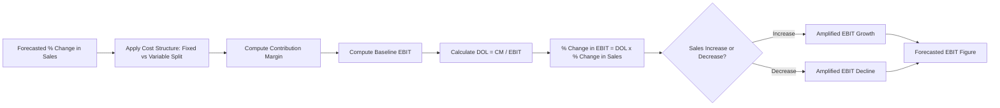

## Using Cost Structure to Forecast Earnings Sensitivity

### Overview

Earnings sensitivity analysis quantifies how much operating income (EBIT) or net income moves in response to a change in sales volume or revenue, given a company's mix of fixed and variable costs. Because fixed costs remain constant while variable costs scale with output, the proportion of each determines how *amplified* the earnings response will be to any change in top-line activity. This amplification effect is formally captured by **operating leverage**.

### Foundational Cost Behavior Recap

- **Variable costs (VC):** change in direct proportion to units sold (e.g., raw materials, sales commissions, direct labor tied to output)
- **Fixed costs (FC):** remain constant in total over a relevant range of activity, regardless of volume (e.g., rent, salaried overhead, depreciation on equipment)
- **Contribution margin (CM):** the amount each unit contributes toward covering fixed costs and generating profit

$$CM = Price - Variable\ Cost\ per\ Unit$$

$$CM\ Ratio = \frac{CM}{Price}$$

### Degree of Operating Leverage (DOL)

DOL is the core tool for forecasting earnings sensitivity. It measures the percentage change in operating income resulting from a percentage change in sales.

$$DOL = \frac{\%\ \Delta\ EBIT}{\%\ \Delta\ Sales}$$

A more directly computable version, using data at a single operating point:

$$DOL = \frac{Contribution\ Margin}{EBIT} = \frac{Contribution\ Margin}{Contribution\ Margin - Fixed\ Costs}$$

Where:

$$Contribution\ Margin = Sales - Total\ Variable\ Costs$$

**Key Points**

- A DOL of 3.0 means a 1% increase in sales produces approximately a 3% increase in EBIT.
- DOL is not a fixed constant across all volume levels — it changes as sales approach or move away from the break-even point. It is highest near break-even and declines as sales rise further above it (approaching 1.0 asymptotically as EBIT grows large relative to fixed costs).
- DOL is symmetric: it amplifies both gains and losses. A high-DOL firm sees earnings fall faster than sales in a downturn.

### Step-by-Step Forecasting Method

1. **Establish the current cost structure** — separate costs into fixed and variable components (using methods like the high-low method, scattergraph, or regression if costs are mixed/semi-variable).
2. **Compute current contribution margin and EBIT** at the baseline sales level.
3. **Calculate DOL** at that baseline.
4. **Apply a forecasted sales change** (e.g., +10%, -5%) to project the corresponding EBIT change:

$$\%\ \Delta\ EBIT = DOL \times \%\ \Delta\ Sales$$

5. **Convert the percentage EBIT change into a projected dollar EBIT figure.**

### Worked Example

A company has the following baseline figures:

| Item | Amount |
| --- | --- |
| Sales | $1,000,000 |
| Variable Costs | $600,000 |
| Contribution Margin | $400,000 |
| Fixed Costs | $250,000 |
| EBIT | $150,000 |

**Step 1 — Compute DOL:**

$$DOL = \frac{400{,}000}{150{,}000} = 2.67$$

**Step 2 — Forecast a 12% increase in sales:**

$$\%\ \Delta\ EBIT = 2.67 \times 12\% = 32.0\%$$

**Step 3 — Apply to baseline EBIT:**

$$New\ EBIT = 150{,}000 \times (1 + 0.32) = \$198{,}000$$

A relatively modest 12% sales increase is forecast to produce a much larger 32% earnings increase — this is the amplifying mechanic of operating leverage in action. The same multiplier applies in reverse: a 12% sales *decline* would be projected to reduce EBIT by roughly 32%, i.e., down to about $102,000.

### Comparing Cost Structures: High vs. Low Operating Leverage

| Characteristic | High Fixed / Low Variable Structure | Low Fixed / High Variable Structure |
| --- | --- | --- |
| DOL | High | Low |
| Break-even point | Higher sales volume needed | Lower sales volume needed |
| Earnings in expansion | Amplified upside | Modest upside |
| Earnings in contraction | Amplified downside (risk) | Cushioned downside |
| Typical industries | Airlines, manufacturing, telecom, software (post-development) | Retail/distribution, staffing/consulting, commission-based sales |

**Example**

Two firms, A (high fixed cost) and B (high variable cost), both currently generate $150,000 EBIT on $1,000,000 sales:

- Firm A: Fixed Costs = $400,000, Contribution Margin = $550,000 → $DOL_A = 550{,}000 / 150{,}000 = 3.67$
- Firm B: Fixed Costs = $100,000, Contribution Margin = $250,000 → $DOL_B = 250{,}000 / 150{,}000 = 1.67$

For an identical 10% sales forecast, Firm A's EBIT is projected to grow ~36.7%, while Firm B's grows only ~16.7%. If sales instead fall 10%, Firm A's EBIT is projected to fall ~36.7%, exposing it to significantly more earnings volatility for the same revenue shock.

### Break-Even Point as a Sensitivity Anchor

$$Break\text{-}Even\ Units = \frac{Fixed\ Costs}{CM\ per\ Unit}$$

Sales levels closer to the break-even point produce more extreme DOL values (since EBIT in the denominator approaches zero), meaning forecasted earnings sensitivity is most volatile — and least reliable for small forecast errors — near break-even. Analysts should treat DOL-based forecasts near break-even with additional caution, since small errors in the sales estimate translate into very large percentage swings in projected EBIT. [Inference: this sensitivity-near-breakeven effect is a mathematical property of the DOL formula rather than a claim about any specific company's actual behavior, but it holds generally under the standard linear cost-volume-profit assumptions.]

### Limitations and Assumptions

- **Linearity assumption:** CVP-based DOL assumes costs and revenues behave linearly within a "relevant range." Outside that range (e.g., needing new facility capacity, volume discounts), the relationship breaks down.
- **Single-product simplification:** Multi-product firms require weighted-average contribution margins, which complicates precise DOL computation.
- **Short-term view:** DOL reflects a static snapshot; management may alter the fixed/variable mix over time (e.g., outsourcing, automation), changing future sensitivity.
- **No accounting for financing costs:** DOL isolates operating risk. Combined with **Degree of Financial Leverage (DFL)**, it forms **Degree of Total Leverage (DTL)**, which forecasts net income (rather than EBIT) sensitivity to sales changes:

$$DTL = DOL \times DFL = \frac{\%\ \Delta\ Net\ Income}{\%\ \Delta\ Sales}$$

### Diagram: Sensitivity Flow from Sales Change to Earnings Impact (svg_diagram)

### Practical Applications in Ratio/Statement Analysis

- **Scenario/sensitivity tables:** Analysts build tables projecting EBIT across a range of sales assumptions (e.g., -20% to +20%) to stress-test earnings forecasts.
- **Cross-company comparison:** Comparing DOL across peers helps explain why firms with similar revenue can show very different earnings volatility during economic cycles.
- **Earnings quality assessment:** A firm heavily reliant on high fixed costs to generate current profitability may be flagged as carrying higher forecast risk if a demand downturn is anticipated.
- **Management guidance evaluation:** When management issues earnings guidance tied to a sales growth range, DOL can be used to sanity-check whether the implied EBIT range is consistent with the firm's known cost structure.

**Next Topics**

- Degree of Financial Leverage (DFL) and combining it with DOL
- Degree of Total Leverage (DTL) and net income sensitivity
- Break-even analysis and margin of safety
- Cost-Volume-Profit (CVP) analysis under multi-product conditions
- Estimating fixed vs. variable costs from financial statements (regression-based cost estimation)
- Scenario and sensitivity analysis techniques in equity/credit research