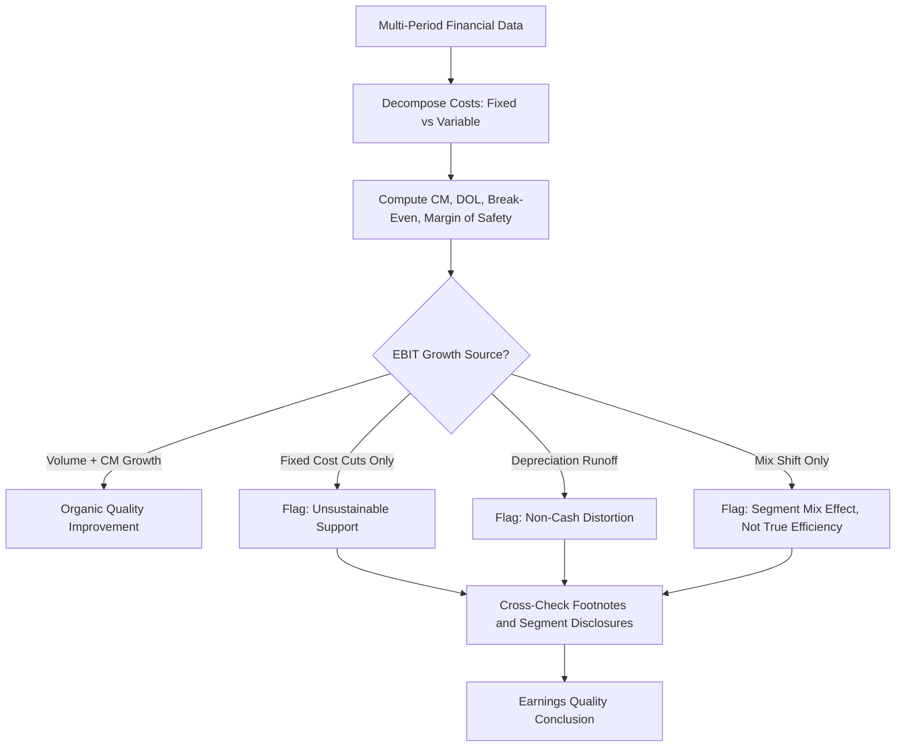

## Cost Structure Signals in Earnings Quality Analysis

### Overview

Earnings quality analysis assesses whether reported earnings are a reliable, sustainable, and accurate representation of a company's true economic performance. Cost structure — the fixed/variable cost mix — is a critical but often underused lens in this analysis, because shifts in that structure can distort period-over-period earnings comparisons, mask deteriorating fundamentals, or create earnings that look strong but are fragile to volume changes. This section catalogs the specific cost-structure-derived signals analysts use to evaluate earnings quality.

### Why Cost Structure Matters for Earnings Quality

Reported net income and EBIT are single numbers that compress a large amount of underlying operating dynamics. Two firms can report identical current-period EBIT while having very different earnings *quality* if:

- One relies on high fixed costs and thin, volume-dependent margins (fragile earnings)
- The other has a flexible, largely variable cost base (resilient earnings)

Cost structure signals help distinguish "real" operating improvement from cost-structure artifacts, timing effects, or classification choices that inflate the appearance of quality.

### Key Signal 1: Rising Operating Leverage Without Revenue Growth Justification

- **Signal:** Degree of Operating Leverage (DOL) increasing while sales growth is flat or decelerating.
- **Interpretation:** Management may be capitalizing costs, deferring maintenance, or converting variable arrangements (e.g., contractor labor) into fixed commitments to boost near-term reported margins — a practice that raises risk exposure without a corresponding increase in the durability of profits.
- **Red flag pattern:** EBIT margin expansion driven primarily by fixed-cost leverage on stagnant volume, rather than genuine unit economics improvement or pricing power. [Inference: whether this reflects deliberate earnings management versus legitimate operating scale benefits cannot be determined from cost structure metrics alone and requires further investigation into the nature of specific cost changes.]

### Key Signal 2: Cost Reclassification Between Fixed and Variable Categories

- **Signal:** Sudden shifts in the ratio of Cost of Goods Sold (COGS, typically more variable) to SG&A (typically more fixed), or vice versa, without a clear operational explanation.
- **Interpretation:** Reclassifying costs between categories (e.g., moving costs from COGS to a "one-time" or below-the-line SG&A bucket) can artificially inflate gross margin, a commonly-watched earnings quality metric, without any real change in underlying economics.
- **Detection method:** Track gross margin, SG&A-to-sales ratio, and total cost-to-sales ratio together over multiple periods. A stable total-cost ratio combined with volatile sub-line ratios suggests reclassification rather than genuine efficiency gains.

### Key Signal 3: Contribution Margin Compression Masked by Fixed Cost Cuts

- **Signal:** EBIT or net income holds steady or grows while contribution margin (CM) — sales minus variable costs — is declining.
- **Interpretation:** This pattern indicates that reported profitability is being sustained through fixed-cost reduction (layoffs, facility closures, deferred R&D) rather than improved unit economics. Since fixed-cost cuts have a natural floor, this is a structurally unsustainable way to defend earnings and often signals deteriorating core profitability being temporarily offset.
- **Analyst response:** Decompose the EBIT bridge period-over-period into (a) volume effect, (b) price/mix effect, (c) variable cost effect, and (d) fixed cost effect, to isolate which driver is doing the work.

### Key Signal 4: Break-Even Point Migration

- **Signal:** The break-even sales volume (Fixed Costs ÷ Contribution Margin per unit) is rising over time.
- **Interpretation:** A rising break-even point means the company needs increasingly higher sales just to maintain profitability — a leading indicator of margin fragility, even if current-period earnings still look acceptable. This often precedes an earnings miss when a demand shock occurs, because the margin of safety (Actual Sales − Break-Even Sales) has quietly eroded.

$$Margin\ of\ Safety = \frac{Actual\ Sales - Break\text{-}Even\ Sales}{Actual\ Sales}$$

A shrinking margin of safety alongside flat reported earnings is a classic hidden earnings-quality deterioration signal.

### Key Signal 5: Divergence Between Cash Fixed Costs and Reported (Accrual) Fixed Costs

- **Signal:** Reported fixed costs (which include non-cash items like depreciation and amortization) diverging significantly from cash fixed costs.
- **Interpretation:** A firm might show stable or improving EBIT largely due to declining depreciation (e.g., assets becoming fully depreciated) rather than genuine operating leverage. This inflates the *appearance* of a favorable cost structure without any underlying operational change, and can reverse sharply once major capex/reinvestment resumes and depreciation resets higher.
- **Cross-check:** Compare EBIT trends to EBITDA trends and to cash operating expenses per unit; a widening EBIT/EBITDA gap combined with flat cash costs suggests the depreciation runoff effect.

### Key Signal 6: Segment or Product-Mix Shifts Disguised as Cost Structure Improvement

- **Signal:** Consolidated contribution margin or DOL improving while underlying segment/product-level data (if disclosed) shows no such improvement.
- **Interpretation:** A shift in sales mix toward higher-margin (often lower-fixed-cost, higher-variable-cost, e.g., licensing or services) segments can mechanically improve consolidated ratios without any segment actually becoming more efficient. This is a mix effect, not a cost structure improvement, and may not persist if the favorable mix shift reverses.

### Summary Table: Cost Structure Red Flags in Earnings Quality Review

| Signal | What to Check | Quality Concern |
| --- | --- | --- |
| Rising DOL, flat sales | DOL trend vs. sales growth trend | Fragile, volume-dependent earnings |
| COGS/SG&A ratio volatility | Sub-line ratios vs. total cost ratio | Possible cost reclassification |
| CM decline, stable EBIT | CM per unit trend vs. EBIT trend | Fixed-cost cuts masking margin erosion |
| Rising break-even point | Margin of safety trend | Eroding cushion against demand shocks |
| EBIT/EBITDA gap widening | Depreciation trend vs. capex trend | Non-cash effects inflating EBIT quality |
| Consolidated margin improvement, flat segment margins | Segment-level CM and DOL | Mix shift, not true efficiency gain |

### Practical Workflow for Analysts

1. Gather at least 3–5 years of cost data broken into fixed/variable components (via regression, high-low method, or disclosed segment data).
2. Compute CM, DOL, and break-even sales for each period.
3. Build a trend table of: sales growth, CM growth, EBIT growth, DOL, and margin of safety.
4. Flag any period where EBIT growth outpaces CM growth (fixed-cost-driven) or where DOL rises without volume growth.
5. Cross-reference flagged periods against footnote disclosures (restructuring charges, segment realignment, depreciation policy changes) to distinguish legitimate operational shifts from earnings management or unsustainable cost-cutting.

### Diagram: Cost Structure Signal Detection Flow (svg_diagram)

### Limitations

- Precise fixed/variable cost decomposition is rarely disclosed directly; analysts must estimate it, introducing estimation error into every downstream signal.
- Signals are most powerful in combination — any single signal in isolation can have an innocuous explanation (e.g., a real efficiency gain from automation can also raise DOL).
- Cyclical industries naturally show fluctuating DOL and margin of safety across the business cycle; signals should be evaluated relative to industry and cycle position, not in absolute terms. [Unverified: appropriate industry-specific thresholds for what constitutes a "significant" shift in these metrics are not standardized and vary by analyst judgment and sector.]

**Related Topics**

- Estimating fixed vs. variable costs from financial statements (regression-based cost estimation)
- Degree of Financial Leverage (DFL) and combined leverage effects
- EBIT/EBITDA bridge analysis and non-cash cost distortions
- Revenue recognition and cost-matching earnings quality checks
- Segment reporting analysis under ASC 280 / IFRS 8
- Restructuring charges and their impact on comparability