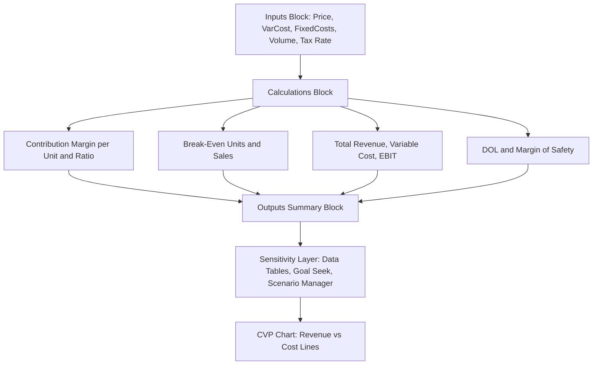

## Building CVP Models in Spreadsheets

### Overview

Cost-Volume-Profit (CVP) modeling in spreadsheets translates the algebraic relationships between fixed costs, variable costs, price, and volume into a dynamic, interactive tool that lets analysts instantly see how changes in any input ripple through to break-even points, contribution margin, and profit. A well-built spreadsheet CVP model is the practical backbone for forecasting, scenario planning, and sensitivity analysis in financial statement work.

### Core Model Structure

A robust CVP spreadsheet model separates inputs, calculations, and outputs into distinct sections to avoid hardcoded values buried inside formulas — this separation is what makes the model genuinely interactive rather than a static calculation.

**Recommended Layout (by row/section):**

1. **Inputs block** — all editable assumptions, clearly labeled and visually distinguished (e.g., colored cell fill)
2. **Calculations block** — formulas referencing only the Inputs block, never hardcoded numbers
3. **Outputs/Summary block** — key results pulled from Calculations
4. **Sensitivity/Scenario block** — data tables or scenario switches built on top of the core model

### Step-by-Step Build

#### Step 1 — Define Inputs

| Cell | Label | Example Value |
| --- | --- | --- |
| B2 | Selling Price per Unit | $50 |
| B3 | Variable Cost per Unit | $30 |
| B4 | Total Fixed Costs | $200,000 |
| B5 | Forecasted Unit Sales | 15,000 |
| B6 | Tax Rate (optional) | 25% |

#### Step 2 — Build Core Calculations

| Cell | Label | Formula |
| --- | --- | --- |
| B8 | Contribution Margin per Unit | `=B2-B3` |
| B9 | Contribution Margin Ratio | `=B8/B2` |
| B10 | Break-Even Units | `=B4/B8` |
| B11 | Break-Even Sales ($) | `=B10*B2` |
| B12 | Total Sales Revenue | `=B5*B2` |
| B13 | Total Variable Costs | `=B5*B3` |
| B14 | Total Contribution Margin | `=B12-B13` |
| B15 | EBIT (Operating Income) | `=B14-B4` |
| B16 | Margin of Safety (Units) | `=B5-B10` |
| B17 | Margin of Safety (%) | `=B16/B5` |
| B18 | Degree of Operating Leverage (DOL) | `=B14/B15` |

**Key Points**

- Never hardcode a number inside a calculation formula — every formula should reference an input cell, even constants like the tax rate. This is what allows one-input-change to flow through the entire model.
- Use named ranges (Formulas → Define Name) instead of raw cell references (e.g., `Price`, `VarCost`, `FixedCosts`) to make formulas self-documenting: `=(Price-VarCost)` reads far more clearly than `=(B2-B3)`.
- Guard against division-by-zero errors when Contribution Margin per Unit could be zero or negative, using `IFERROR()` or `IF()` wrappers, e.g. `=IF(B8<=0,"N/A",B4/B8)`.

#### Step 3 — Add Net Income Line (if tax modeling is required)

| Cell | Label | Formula |
| --- | --- | --- |
| B19 | Tax Expense | `=MAX(B15,0)*B6` |
| B20 | Net Income | `=B15-B19` |

Using `MAX(B15,0)` prevents generating a tax *benefit* on a loss unless the model is deliberately designed to reflect tax-loss carryback/carryforward effects.

### Sensitivity Analysis Techniques

#### One-Variable Data Table (Excel/Google Sheets)

Used to see how EBIT changes across a range of unit sales volumes.

**Setup:**

1. In a column, list a range of unit sales values (e.g., 10,000 to 20,000 in steps of 1,000).
2. In the row above, reference the EBIT formula cell (`=B15`).
3. Select the full range, go to Data → What-If Analysis → Data Table.
4. Set "Column input cell" to the Unit Sales input cell (B5).

This generates an instant table of EBIT outcomes across a volume range without manually recalculating each scenario.

#### Two-Variable Data Table

Used to see EBIT sensitivity across two inputs simultaneously — commonly Price and Volume, or Variable Cost and Volume.

**Setup:**

1. Place one variable's range across a row, the other variable's range down a column.
2. Reference the output formula (e.g., EBIT) in the top-left corner cell of the table.
3. Select the full grid, Data → What-If Analysis → Data Table, setting both "Row input cell" and "Column input cell" to the respective input cells.

#### Goal Seek for Break-Even Validation

Goal Seek can validate the algebraic break-even formula by solving numerically:

1. Data → What-If Analysis → Goal Seek
2. Set cell: EBIT cell (B15)
3. To value: 0
4. By changing cell: Unit Sales (B5)

The result should match the algebraically computed Break-Even Units (B10) — a useful audit check on formula integrity.

#### Scenario Manager

For discrete named scenarios (e.g., "Base Case," "Recession," "Expansion"), Excel's Scenario Manager (Data → What-If Analysis → Scenario Manager) allows saving different sets of input values and toggling between them without manually re-entering data, while preserving a single formula structure.

### Charting the Model

A CVP chart visually plots Total Revenue, Total Cost, and the break-even intersection across a range of unit volumes.

**Chart construction steps:**

1. Build a helper table with a Units column (a range spanning below and above break-even) and calculated columns for Total Revenue (`=Units*Price`), Total Fixed Cost (constant), Total Cost (`=FixedCost+Units*VarCost`).
2. Select the helper table and insert a Line or Scatter chart.
3. The break-even point appears visually where the Total Revenue and Total Cost lines intersect.

### Diagram: CVP Spreadsheet Model Architecture (svg_diagram)

### Common Build Errors and How to Avoid Them

| Error | Cause | Fix |
| --- | --- | --- |
| Circular reference | Output cell accidentally referenced within its own calculation chain | Trace precedents (Formulas → Trace Precedents) to isolate the loop |
| #DIV/0! on break-even | Contribution margin per unit is zero | Wrap break-even formula in `IFERROR()` or `IF()` |
| Data table shows same value in every cell | Input cell reference in Data Table dialog points to wrong cell, or the output formula doesn't actually reference the intended input | Confirm Row/Column input cell matches the input driving the output formula |
| Scenario results don't update chart | Chart series bound to static values instead of the helper table's dynamic formulas | Rebuild chart series to reference calculated cells, not pasted values |
| Tax expense negative on a loss | Missing `MAX(EBIT,0)` guard | Add `MAX()` wrapper unless carryback/carryforward is intentionally modeled |

### Extending the Model for Multi-Product CVP

For multi-product firms, a single blended contribution margin is insufficient. Extend the model with:

- A per-product row for Price, Variable Cost, and Sales Mix % (must sum to 100%)
- A **Weighted-Average Contribution Margin per Unit**:

$$WACM = \sum_{i=1}^{n} (CM_i \times Mix\%_i)$$

- Break-even in total units, then allocate to each product by its mix percentage:

$$Break\text{-}Even\ Units_i = Break\text{-}Even\ Total\ Units \times Mix\%_i$$

This requires an additional Inputs sub-block for sales mix and a modified break-even formula referencing WACM instead of a single product's CM.

### Validation and Auditing Practices

- **Formula auditing tools:** Use Trace Precedents/Trace Dependents to visually confirm each output cell only pulls from intended inputs.
- **Reasonableness checks:** Confirm Break-Even Sales ($) is less than Total Sales Revenue when EBIT is positive, and vice versa.
- **Cross-validation:** Compare the spreadsheet's algebraic break-even result against the Goal Seek numerical result — any mismatch indicates a formula error.
- **Sensitivity boundary checks:** Ensure the Data Table range spans both above and below break-even volume, so the model shows the full profit/loss transition, not just a positive-EBIT segment. [Inference: the specific range width appropriate for a given analysis depends on the industry's typical demand volatility and is a judgment call rather than a fixed rule.]

**Next Steps**

- Building multi-scenario tornado charts for sensitivity ranking across several variables
- Monte Carlo simulation add-ins for probabilistic CVP forecasting
- Linking CVP models to three-statement financial models
- Building dynamic dashboards with slicers/form controls for scenario toggling
- Sales mix optimization under constrained capacity (linear programming extensions)