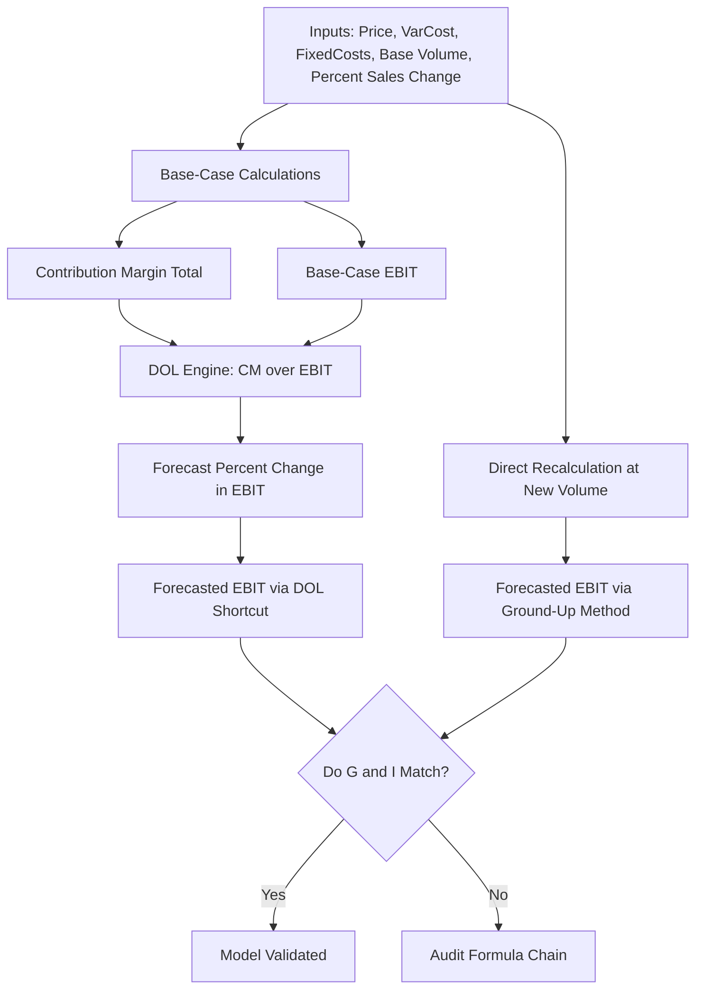

## Building Operating Leverage Models in Spreadsheets

### Overview

An operating leverage spreadsheet model extends a basic CVP model into a dedicated tool for quantifying how sensitive EBIT is to changes in sales volume, and for forecasting earnings across a range of demand scenarios. While a CVP model focuses on break-even and profit at a point in time, an operating leverage model is built specifically to compute the Degree of Operating Leverage (DOL) dynamically and use it to forecast earnings changes for arbitrary sales movements — making it the core forecasting engine referenced in earnings sensitivity and earnings quality analysis.

### Core Model Structure

The model separates into four functional blocks: Inputs, Base-Case Calculations, DOL Engine, and Forecast/Sensitivity Output.

#### Step 1 — Inputs Block

| Cell | Label | Example Value |
| --- | --- | --- |
| B2 | Selling Price per Unit | $40 |
| B3 | Variable Cost per Unit | $25 |
| B4 | Total Fixed Costs | $300,000 |
| B5 | Base-Case Unit Sales | 25,000 |
| B6 | Forecasted % Change in Sales | 10% |

#### Step 2 — Base-Case Calculations Block

| Cell | Label | Formula |
| --- | --- | --- |
| B8 | Contribution Margin per Unit | `=B2-B3` |
| B9 | Total Sales Revenue | `=B5*B2` |
| B10 | Total Variable Costs | `=B5*B3` |
| B11 | Total Contribution Margin | `=B9-B10` |
| B12 | Base-Case EBIT | `=B11-B4` |

#### Step 3 — DOL Engine

| Cell | Label | Formula |
| --- | --- | --- |
| B14 | Degree of Operating Leverage (DOL) | `=B11/B12` |
| B15 | Alternative DOL Check (% method) | `=(B11/B5)/((B11/B5)-(B4/B5))` |

**Key Points**

- Row B15 is a redundant cross-check using the per-unit contribution margin form of the DOL formula; both formulas should return an identical result — a mismatch signals a formula error elsewhere in the model.
- DOL is only valid and meaningful at the specific sales volume it is computed from — it must be recalculated at each new base volume, not treated as a fixed constant applied to a firm indefinitely, because operating leverage changes as volume moves relative to the fixed cost base.
- Guard the DOL formula against division-by-zero using `IFERROR()`, since EBIT could equal zero at a volume level (e.g., exactly at break-even).

#### Step 4 — Forecast Output Block

| Cell | Label | Formula |
| --- | --- | --- |
| B17 | Forecasted % Change in EBIT | `=B14*B6` |
| B18 | Forecasted EBIT | `=B12*(1+B17)` |
| B19 | Forecasted Unit Sales | `=B5*(1+B6)` |
| B20 | Forecasted EBIT (Direct Recalculation Check) | `=(B19*B2-B19*B3)-B4` |

Row B20 independently recalculates EBIT from scratch at the new forecasted volume, bypassing the DOL shortcut entirely. Comparing B18 to B20 validates that the DOL-based percentage forecast agrees with a full ground-up recalculation — an essential audit step, since the DOL formula is only a linear approximation. [Inference: for a single-product, linear-cost model, B18 and B20 should match exactly rather than approximately, since DOL is derived algebraically from the same underlying linear cost function.]

### Building a DOL Sensitivity Table Across Volume Levels

Because DOL changes at every volume level, a one-variable data table is used to show how DOL itself shifts as base volume changes — this is distinct from a data table showing EBIT sensitivity.

**Setup:**

1. List a range of base unit sales volumes down a column (e.g., 15,000 to 35,000 in steps of 2,500), spanning both below and above the break-even point.
2. In the row above, reference the DOL formula cell (`=B14`).
3. Select the table range, Data → What-If Analysis → Data Table, with "Column input cell" set to the Base-Case Unit Sales cell (B5).

The resulting table typically shows DOL declining as volume rises further above break-even, and rising sharply (toward very large or undefined values) as volume approaches break-even from above — illustrating why forecasts near break-even carry disproportionate sensitivity.

### Building a Two-Variable Sensitivity Grid: Volume Change × Base Volume

To forecast EBIT across combinations of "how much do we expect sales to change" and "what is our current base volume," a two-variable data table is more useful than DOL alone:

1. Row headers: a range of forecasted % sales changes (e.g., -20% to +20%).
2. Column headers: a range of base-case unit sales volumes.
3. Top-left corner cell: reference the Forecasted EBIT formula (B18 or B20).
4. Data → What-If Analysis → Data Table, setting Row input cell to the % Change input (B6) and Column input cell to the Base Volume input (B5).

This produces a full grid of forecasted EBIT outcomes, letting an analyst see simultaneously how growth assumptions and starting-scale assumptions interact.

### Diagram: Operating Leverage Model Architecture (svg_diagram)

### Modeling DOL Decay Across a Growth Trajectory

For multi-period forecasts (e.g., a 5-year projection), DOL should be recalculated each period as volume changes, rather than held constant across the forecast horizon.

**Recommended structure:**

| Row | Year 1 | Year 2 | Year 3 | Year 4 | Year 5 |
| --- | --- | --- | --- | --- | --- |
| Unit Sales | formula-driven from prior year × growth rate | ... | ... | ... | ... |
| Contribution Margin | `=Units*CM_per_unit` | ... | ... | ... | ... |
| EBIT | `=CM-FixedCosts` | ... | ... | ... | ... |
| DOL (period-specific) | `=CM/EBIT` | ... | ... | ... | ... |

Each period's DOL is computed independently from that period's own EBIT and contribution margin — never carried forward from a prior period — since the ratio is volume-dependent. This lets the model show DOL naturally decaying over a growth trajectory as the firm scales further above break-even (assuming a constant fixed cost base), which is itself a useful diagnostic: a growth forecast that does not show declining DOL over time may indicate an unrealistic assumption that fixed costs will scale with volume forever.

### Incorporating Operating Leverage into a Combined Leverage Model

To extend into **Degree of Total Leverage (DTL)**, add a financing layer:

| Cell | Label | Formula |
| --- | --- | --- |
| B22 | Interest Expense | (input) |
| B23 | EBT (Earnings Before Tax) | `=B12-B22` |
| B24 | Degree of Financial Leverage (DFL) | `=B12/B23` |
| B25 | Degree of Total Leverage (DTL) | `=B14*B24` |
| B26 | Forecasted % Change in Net Income | `=B25*B6` |

This produces a full pipeline: sales change → EBIT change (via DOL) → net income change (via DTL) — useful for forecasting how a given sales forecast flows all the way to the bottom line, accounting for both operating and financial leverage simultaneously.

### Common Build Errors and How to Avoid Them

| Error | Cause | Fix |
| --- | --- | --- |
| DOL shows negative value | Base-case EBIT is negative (operating at a loss) | Expected mathematically, but flag for interpretation — negative DOL doesn't have the same intuitive "amplification" reading and should be explained separately |
| DOL-based forecast diverges from ground-up recalculation | Formula in DOL forecast doesn't match linear CVP assumptions, or a nonlinear cost was introduced | Reconcile B18 vs. B20; investigate any stepped/tiered cost structures |
| Sensitivity table returns identical DOL for every volume | Column input cell in Data Table dialog pointed to wrong cell | Confirm it targets the Base-Case Unit Sales input, not a downstream calculated cell |
| Multi-period DOL doesn't decay as expected | Fixed costs formula mistakenly scaled with volume | Confirm Fixed Costs reference is a flat input, not multiplied by units |

### Validation and Auditing Practices

- **Dual-method cross-check:** Always maintain both the DOL-shortcut forecast and a ground-up recalculation forecast side-by-side; a persistent mismatch indicates a structural formula issue.
- **Break-even boundary test:** Confirm DOL trends toward very large magnitudes as base volume approaches break-even, and toward 1.0 as base volume grows very large relative to fixed costs — this behavior should hold in any correctly-built linear CVP-based model.
- **Sign consistency check:** Confirm that a negative forecasted % sales change correctly produces a negative forecasted % EBIT change of larger magnitude (for DOL > 1), not a sign error from a misplaced formula reference.

**Related Topics**

- Degree of Financial Leverage (DFL) and combined leverage modeling
- Multi-product weighted-average CVP spreadsheet extensions
- Monte Carlo/probabilistic simulation layered onto operating leverage models
- Building EBIT bridge waterfalls in spreadsheets
- Scenario Manager and dynamic dashboard construction for leverage forecasting