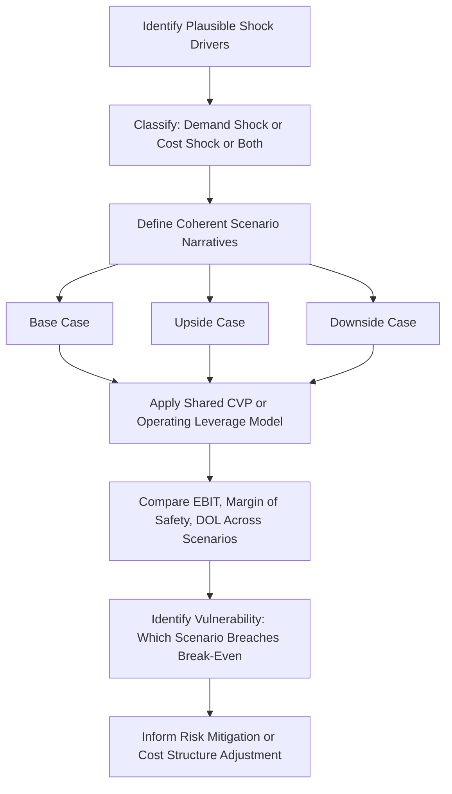

## Scenario Analysis for Demand and Cost Shocks

### Overview

Scenario analysis extends the single-point forecasting of CVP and operating leverage models into a structured framework for evaluating earnings outcomes under discrete, named states of the world — rather than a continuous sensitivity range. Where a data table answers "what happens as sales change smoothly from -20% to +20%," scenario analysis answers "what happens to EBIT specifically under a recession, a supply-chain disruption, or a competitive price war." It is the primary tool for stress-testing a cost structure against realistic, correlated combinations of demand and cost shocks rather than isolated single-variable movements.

### Distinguishing Scenario Analysis from Sensitivity Analysis

| Dimension | Sensitivity Analysis | Scenario Analysis |
| --- | --- | --- |
| Variables changed | Typically one or two at a time | Multiple variables changed simultaneously in a coherent narrative |
| Output | Continuous range/table | Discrete set of named outcomes |
| Purpose | Identify which variable matters most | Evaluate plausible real-world combined events |
| Correlation handling | Assumes independence between variables | Explicitly models correlated shocks (e.g., demand drop AND input cost spike together) |

**Key Points**

- Sensitivity analysis isolates individual variable impact; scenario analysis captures how variables move *together* under a real economic event, which is usually more realistic since demand shocks and cost shocks are rarely independent.
- A demand shock (e.g., recession) often correlates with specific cost shocks (e.g., commodity price relief from lower demand, or conversely, supply chain-driven cost spikes) — scenario analysis is the appropriate tool for modeling these correlated combinations, not isolated one-variable sensitivity tables.

### Classifying Shock Types

#### Demand Shocks

- **Volume shock:** Change in unit sales without a price change (e.g., recession-driven demand decline, market share loss)
- **Price shock:** Change in selling price without a volume change (e.g., competitive price war, pricing power loss)
- **Mix shock:** Change in the proportion of high-margin vs. low-margin products/services sold

#### Cost Shocks

- **Variable cost shock:** Change in per-unit input costs (e.g., raw material price spike, tariff imposition, freight cost surge)
- **Fixed cost shock:** Step-change in the fixed cost base (e.g., new lease commitment, one-time restructuring charge, wage inflation affecting salaried staff)
- **Cost structure shift shock:** A shock that changes the fixed/variable *mix* itself (e.g., shifting from owned equipment/depreciation to a variable-cost equipment rental model)

### Standard Scenario Framework: Base / Upside / Downside

The most common structure defines three coherent scenarios, each combining multiple shock types into an internally consistent narrative:

| Scenario | Volume | Price | Variable Cost/Unit | Fixed Costs |
| --- | --- | --- | --- | --- |
| **Base Case** | Baseline forecast | Baseline | Baseline | Baseline |
| **Upside Case** | +X% (demand strength) | Stable or +Y% (pricing power) | Stable or slightly favorable | Stable |
| **Downside Case** | -X% (demand weakness) | Stable or -Y% (competitive pressure) | +Z% (input cost pressure, common in downturns due to reduced purchasing scale) | Stable or step-up (deleveraging fixed costs over lower volume) |

**Example**

A manufacturer's base case: 50,000 units at $60 price, $35 variable cost/unit, $400,000 fixed costs → Base EBIT = $850,000.

- **Downside scenario:** Volume falls 15% (42,500 units) due to recession; simultaneously, reduced purchase volume causes a loss of bulk-input discounts, raising variable cost/unit to $37; fixed costs remain sticky at $400,000 (a common downturn characteristic, since many fixed costs like leases and salaried staff cannot be reduced quickly).

$$New\ CM = 42{,}500 \times (60 - 37) = \$977{,}500$$

Wait — this example requires care: the combined effect must be recalculated directly rather than assumed. Recalculating:

$$New\ CM = 42{,}500 \times (60-37) = 42{,}500 \times 23 = \$977{,}500$$

$$New\ EBIT = 977{,}500 - 400{,}000 = \$577{,}500$$

This represents roughly a 32% EBIT decline from a 15% volume decline and a modest $2 variable cost increase — illustrating how a demand shock and cost shock compound each other's earnings impact well beyond what either shock alone would produce, an effect single-variable sensitivity analysis would understate.

### Building the Model: Scenario Manager Approach

**Setup in Excel/Sheets:**

1. Build the core CVP/operating leverage model with clearly labeled input cells (Price, Variable Cost, Fixed Costs, Volume).
2. Data → What-If Analysis → Scenario Manager → Add.
3. Name each scenario ("Base Case," "Downside — Recession," "Upside — Expansion").
4. Select the changing cells (the specific input cells that shift under that scenario) — this can include any combination of Price, Variable Cost, Fixed Costs, and Volume simultaneously.
5. Enter the specific values for each changing cell under that scenario.
6. Use Scenario Manager's "Summary" feature to generate a comparison report showing EBIT (and other tracked outputs) across all defined scenarios side by side.

#### Alternative: Manual Scenario Grid (More Transparent, More Portable)

Many analysts prefer a manual side-by-side column layout over Scenario Manager, since it remains visible in the model at all times (rather than hidden in a dialog) and is easier to audit and share:

| Row | Base Case | Downside | Upside |
| --- | --- | --- | --- |
| Unit Sales | 50,000 | 42,500 | 55,000 |
| Price | $60 | $60 | $62 |
| Variable Cost/Unit | $35 | $37 | $34 |
| Fixed Costs | $400,000 | $400,000 | $410,000 |
| Contribution Margin | `=Units*(Price-VarCost)` | (same formula, different column inputs) | (same formula) |
| EBIT | `=CM-FixedCosts` | (same formula) | (same formula) |
| % Change in EBIT vs. Base | — | `=(Downside_EBIT-Base_EBIT)/Base_EBIT` | `=(Upside_EBIT-Base_EBIT)/Base_EBIT` |

Each scenario column uses identical formula structure, differing only in the input values referenced — enforced by copying formulas across columns rather than retyping them, which minimizes the risk of formula inconsistency between scenarios.

### Diagram: Scenario Analysis Workflow (svg_diagram)

### Incorporating Correlated Shocks Realistically

A common modeling error is treating demand and cost shocks as independent when building downside scenarios. Realistic downside scenario construction should consider:

- **Operating deleverage:** In a demand downturn, fixed costs per unit rise (since the same fixed base is spread over fewer units), compounding the EBIT decline beyond the pure volume effect — this is precisely the operating leverage effect discussed in DOL modeling, and should be reflected automatically if the model's fixed cost row is not (incorrectly) scaled with volume.
- **Sticky costs:** Empirical cost behavior research has documented that costs often fall less when volume declines than they rise when volume increases by an equivalent amount — a phenomenon sometimes termed "cost stickiness." A downside scenario that reduces total costs proportionally to a volume decline, using the same variable-cost assumptions as the upside case, may overstate the company's ability to shed costs quickly. [Inference: the degree of cost stickiness varies significantly by company and industry and is not a fixed universal ratio; where relevant, it should be estimated from the specific company's historical cost behavior during past downturns rather than assumed.]
- **Vendor/input cost countercyclicality:** In some industries, a broad demand slowdown reduces commodity/input prices industry-wide (helping variable costs), while in others (e.g., firm-specific volume loss from competitive share loss), the firm loses purchasing scale and its own input costs rise even as aggregate demand is unaffected. Scenario construction should specify which of these dynamics applies to the situation being modeled, since they produce opposite directional effects on variable cost per unit.

### Stress-Testing Against Break-Even

A key output of scenario analysis is explicitly checking whether a downside scenario's sales volume falls below the break-even point:

$$Scenario\ Margin\ of\ Safety = \frac{Scenario\ Volume - Break\text{-}Even\ Volume}{Scenario\ Volume}$$

A downside scenario producing a negative margin of safety indicates the shock combination would push the company into an operating loss — a critical threshold-crossing result that a smooth sensitivity table might not highlight as clearly as a discrete, named scenario does.

### Tornado Charts for Shock Ranking

To identify which individual shock (within a multi-variable scenario) contributes most to the EBIT impact, a tornado chart isolates each variable's effect one at a time while holding others at base case:

1. For each input variable, compute EBIT with only that variable shocked to its downside scenario value (others held at base).
2. Compute the resulting EBIT deviation from base case for each variable individually.
3. Sort variables by magnitude of EBIT impact, largest at top.
4. Chart as a horizontal bar chart (each bar's length showing EBIT deviation), producing the characteristic "tornado" shape with the most impactful variable at top.

This decomposition helps prioritize which specific risk (volume, price, variable cost, or fixed cost) most warrants mitigation attention or hedging.

### Common Build Errors and How to Avoid Them

| Error | Cause | Fix |
| --- | --- | --- |
| Scenarios show implausibly small EBIT differences | Only one variable shocked per scenario instead of a coherent multi-variable narrative | Ensure each named scenario changes all relevant correlated variables together |
| Downside scenario accidentally improves EBIT | Sign error on a shock direction (e.g., variable cost decrease instead of increase) | Explicitly label each shock's directional assumption in a comment or adjacent note |
| Scenario Manager summary doesn't update | "Result cells" in Scenario Manager not set to include EBIT or other key outputs | Re-run Scenario Manager, explicitly selecting all desired result cells before generating summary |
| Fixed costs incorrectly modeled as scaling with volume in downside case | Formula error treating fixed costs as a per-unit rate | Confirm fixed cost input is a flat dollar figure independent of volume in every scenario column |

### Validation and Auditing Practices

- **Narrative consistency check:** For each scenario, confirm every changed input is directionally consistent with the named narrative (e.g., a "recession" scenario should not simultaneously assume rising selling prices without explicit justification).
- **Base case reconciliation:** Confirm the Base Case column/scenario exactly reproduces the standalone CVP model's EBIT — any discrepancy indicates a formula linkage error.
- **Break-even threshold flagging:** Build a conditional check (e.g., conditional formatting or an `IF()` flag) that highlights any scenario where volume falls below break-even, so threshold-crossing scenarios are visually obvious rather than requiring manual inspection.

**Next Steps**

- Building tornado charts and variable-impact ranking in spreadsheets
- Cost stickiness estimation from historical cost behavior data
- Monte Carlo simulation for probabilistic (rather than discrete) scenario modeling
- Linking scenario analysis outputs to covenant compliance and liquidity stress testing
- Real options and management flexibility in response to downside scenarios