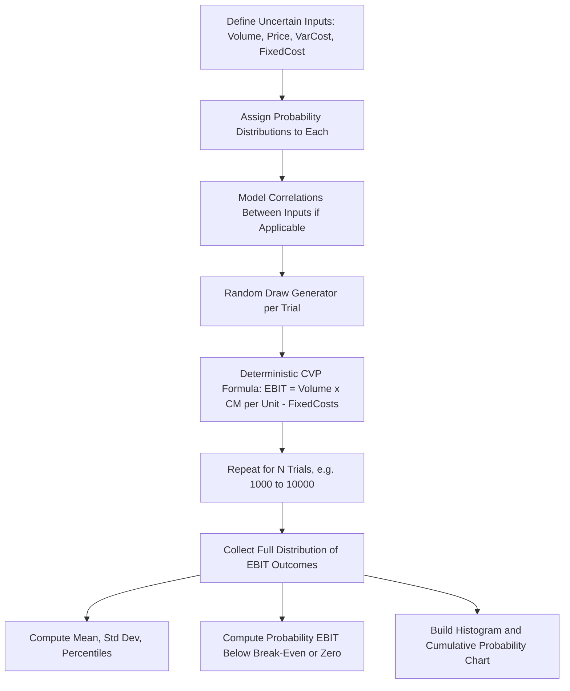

## Monte Carlo Simulation of Cost Structure Outcomes

### Overview

Monte Carlo simulation extends scenario analysis from a handful of discrete, hand-picked cases into a full probabilistic distribution of outcomes by repeatedly sampling random values for uncertain inputs (price, volume, variable cost, fixed cost) from defined probability distributions, then recalculating EBIT thousands of times. Rather than answering "what happens in a recession," Monte Carlo simulation answers "what is the full probability distribution of EBIT outcomes, and what is the probability that EBIT falls below zero or below break-even." This makes it the natural extension of CVP and scenario modeling when the goal is quantifying *risk* rather than just testing specific narratives.

### Why Monte Carlo for Cost Structure Analysis

Deterministic CVP and scenario models produce a small number of point estimates (base/upside/downside). This has two limitations Monte Carlo addresses:

- **No probability weighting:** A downside scenario might be 3x more or less likely than an upside scenario, but a simple three-case table treats them as equally informative snapshots.
- **No view of extreme tail outcomes:** A model might not construct the specific combination of shocks that produces the worst realistic outcome, whereas random sampling across full distributions will naturally generate and count extreme combinations, revealing tail risk that a hand-picked scenario might miss.

Monte Carlo simulation instead produces a full distribution of possible EBIT outcomes, from which an analyst can extract the probability of falling below break-even, the expected value, the standard deviation (a direct measure of earnings volatility), and percentile-based risk metrics.

### Core Model Components

#### Step 1 — Define Random Input Variables and Their Distributions

Each uncertain CVP input is assigned a probability distribution instead of a single point value:

| Variable | Common Distribution Choice | Rationale |
| --- | --- | --- |
| Unit Sales Volume | Normal or triangular | Demand often clusters around an expected value with symmetric or mildly skewed uncertainty |
| Selling Price | Normal or triangular (tighter range) | Prices are typically more stable than volume but still subject to competitive pressure |
| Variable Cost per Unit | Normal, triangular, or lognormal | Input costs can spike asymmetrically (lognormal captures fat right-tail risk from commodity shocks) |
| Fixed Costs | Discrete/step distribution or fixed (less often randomized) | Fixed costs are typically contractually set for a period, so uncertainty here is often modeled as an occasional step-change probability instead of continuous randomness |

**Key Points**

- A **triangular distribution** (defined by minimum, most likely, and maximum values) is popular in financial modeling because it doesn't require statistical parameter estimation from historical data — subject matter experts can directly estimate the three intuitive values.
- A **normal distribution** is appropriate when the variable is believed to be symmetric around a central estimate with no strong skew, but it technically allows unbounded values in both directions, which can produce unrealistic extreme values (e.g., negative sales volume) if the standard deviation is large relative to the mean — this should be checked and capped where necessary.
- **Correlation between variables must be modeled explicitly** if it exists (e.g., volume decline and variable cost increase both spiking together in a supply shock) — a Monte Carlo simulation with independently-sampled variables will understate joint tail risk if the true variables are correlated. [Inference: the specific correlation coefficients between a firm's own volume and cost variables are empirical questions that require historical data analysis and are not derivable from CVP theory alone.]

#### Step 2 — Build the Deterministic CVP Core

The simulation wraps around the same core CVP formula used in standard models:

$$EBIT = (Volume \times (Price - Variable\ Cost\ per\ Unit)) - Fixed\ Costs$$

Each simulation trial draws one random value for each uncertain input, plugs them into this formula, and records the resulting EBIT.

#### Step 3 — Generate Random Draws in a Spreadsheet

**Using native spreadsheet functions (no add-in required):**

| Distribution | Excel/Sheets Formula Approach |
| --- | --- |
| Normal | `=NORM.INV(RAND(), mean, std_dev)` |
| Triangular | No native function; constructed manually: `=IF(RAND()<(mode-min)/(max-min), min+SQRT(RAND()*(mode-min)*(max-min)), max-SQRT((1-RAND())*(max-mode)*(max-min)))` |
| Uniform | `=min+RAND()*(max-min)` |
| Lognormal | `=LOGNORM.INV(RAND(), mean_of_ln, std_dev_of_ln)` |

**Example row structure (one simulation trial per row):**

| Column | Content |
| --- | --- |
| A | Trial number (1 to N) |
| B | Random Volume draw: `=NORM.INV(RAND(),25000,3000)` |
| C | Random Price draw: `=NORM.INV(RAND(),40,1.5)` |
| D | Random Variable Cost draw: `=LOGNORM.INV(RAND(),LN(25),0.1)` |
| E | Fixed Costs (held constant, or step-distributed) |
| F | EBIT for this trial: `=B*(C-D)-E` |

This row structure is filled down for as many trials as needed (typically 1,000–10,000), then Column F becomes the dataset for statistical analysis.

**Important spreadsheet mechanic:** `RAND()` recalculates on every worksheet change, meaning the entire simulation reshuffles each time any cell in the workbook is edited. To "freeze" a completed simulation for analysis, copy the results range and use Paste Special → Values Only, converting the volatile random formulas into static numbers.

#### Step 4 — Run via Data Table Trick (No Add-In Method)

A widely-used spreadsheet technique to generate many trials efficiently:

1. Build the single-trial EBIT formula referencing `RAND()`-based inputs, as above.
2. Create a data table with trial numbers (1 to N) in a column and the EBIT formula referenced in the header row.
3. Use Data → What-If Analysis → Data Table with a dummy "Column input cell" (any unused blank cell) — this forces Excel to recalculate the entire random-input chain fresh for each row, effectively generating N independent trials.

This technique exploits the Data Table feature's recalculation behavior to run repeated trials without needing VBA or an add-in.

#### Step 5 — Use a Dedicated Add-In (More Robust for Large-Scale Simulation)

For simulations requiring more than a few thousand trials, correlation modeling, or more distribution types, dedicated tools are more practical than native spreadsheet functions:

- **@RISK (Palisade)** — widely used in corporate finance, supports correlated variables, extensive distribution library, built-in sensitivity/tornado analysis on simulation results
- **Oracle Crystal Ball** — similar functionality, integrates with Excel
- **Python-based approach (via `numpy`/`scipy`)** — for analysts comfortable outside spreadsheets, allows much faster simulation (100,000+ trials), more flexible distribution and correlation modeling, and easier statistical post-processing

### Diagram: Monte Carlo Simulation Architecture (svg_diagram)

### Analyzing Simulation Output

Once N trials of EBIT are generated, standard descriptive statistics summarize the risk profile:

| Metric | Formula/Approach | Interpretation |
| --- | --- | --- |
| Expected EBIT | `=AVERAGE(EBIT_range)` | Central tendency across all trials |
| EBIT Volatility | `=STDEV.S(EBIT_range)` | Direct quantitative measure of earnings risk |
| Probability of Loss | `=COUNTIF(EBIT_range,"<0")/COUNT(EBIT_range)` | Fraction of trials resulting in a negative EBIT |
| Probability Below Break-Even Target | `=COUNTIF(EBIT_range,"<"&target)/COUNT(EBIT_range)` | Fraction of trials missing a specific EBIT threshold |
| Value at Risk (5th percentile) | `=PERCENTILE.INC(EBIT_range,0.05)` | The EBIT level below which only 5% of simulated outcomes fall — a downside risk threshold |
| Histogram | Excel/Sheets native histogram chart on the EBIT range | Visualizes the full shape of the outcome distribution |

**Example**

After running 5,000 trials with the inputs above, suppose the results show: Expected EBIT = $580,000, Standard Deviation = $145,000, and 8% of trials produce a negative EBIT. This tells a materially richer risk story than a simple three-scenario table: there is a a quantified ~8% chance of an operating loss given the specified input distributions, not just a single named "downside case" outcome with no attached likelihood. [Inference: this 8% figure is entirely a function of the assumed input distributions and their parameters — it is not an empirical probability unless those distributions were themselves calibrated to real historical data, and should be presented with that caveat.]

### Linking to Operating Leverage

Monte Carlo simulation naturally reveals how operating leverage shapes the *skew* of the EBIT distribution, not just its center. A high-fixed-cost (high-DOL) structure, run through the same relative volume/price uncertainty as a low-fixed-cost structure, will typically show:

- A wider spread (higher standard deviation) of simulated EBIT outcomes
- A higher probability mass below zero, for the same input distributions
- More extreme tail outcomes on both the upside and downside

Running the same Monte Carlo input distributions through two versions of the model — one with a high-fixed/low-variable cost structure and one with the reverse — and comparing the resulting EBIT histograms directly and visually demonstrates the risk-amplifying property of operating leverage that the DOL formula describes algebraically.

### Common Build Errors and How to Avoid Them

| Error | Cause | Fix |
| --- | --- | --- |
| Every trial produces an identical EBIT | `RAND()`-based formulas not actually referenced in the EBIT calculation, or Data Table dummy cell misconfigured | Confirm the EBIT formula directly references the random draw cells, and the Data Table setup correctly forces recalculation per row |
| Simulation results change every time a cell is clicked | `RAND()` volatility not frozen after simulation is complete | Paste Special → Values Only immediately after generating results, before further analysis |
| Unrealistic negative volume or price appears in trials | Normal distribution with a standard deviation too large relative to the mean | Switch to a bounded distribution (triangular) or add a floor via `MAX(0, draw)` |
| Probability-of-loss statistic looks implausibly high or low | Distribution parameters (mean/std dev) not properly calibrated to realistic historical variability | Cross-check assumed distribution parameters against actual historical volatility in volume/price/cost, where available |
| Correlated variables simulated independently | Simple `RAND()`-based setup doesn't naturally support correlation | Use Cholesky decomposition or a copula method (or a dedicated add-in with built-in correlation support) to induce correlation between draws |

### Validation and Auditing Practices

- **Convergence check:** Run the simulation at increasing trial counts (e.g., 1,000 vs. 5,000 vs. 10,000) and confirm the mean and standard deviation stabilize — if results still shift meaningfully between runs, more trials are needed.
- **Base case reconciliation:** Confirm that setting all distributions to their mean/most-likely values (removing randomness) reproduces the standalone deterministic CVP model's EBIT exactly.
- **Distribution sanity check:** Plot a histogram of each individual input variable's simulated draws (not just the output EBIT) to visually confirm each distribution is behaving as intended before trusting the downstream EBIT distribution.
- **Sensitivity of results to distribution choice:** Where feasible, re-run the simulation with an alternative distribution assumption (e.g., triangular instead of normal) for a key variable to test how sensitive the final risk conclusions are to that modeling choice.

**Related Topics**

- Correlation modeling techniques: Cholesky decomposition and copulas
- Value at Risk (VaR) and Conditional VaR in earnings forecasting
- Historical volatility estimation for calibrating distribution parameters
- Python/numpy-based Monte Carlo simulation workflows
- Linking simulated EBIT distributions to credit rating and covenant stress testing
- Tornado and spider charts derived from simulation sensitivity output