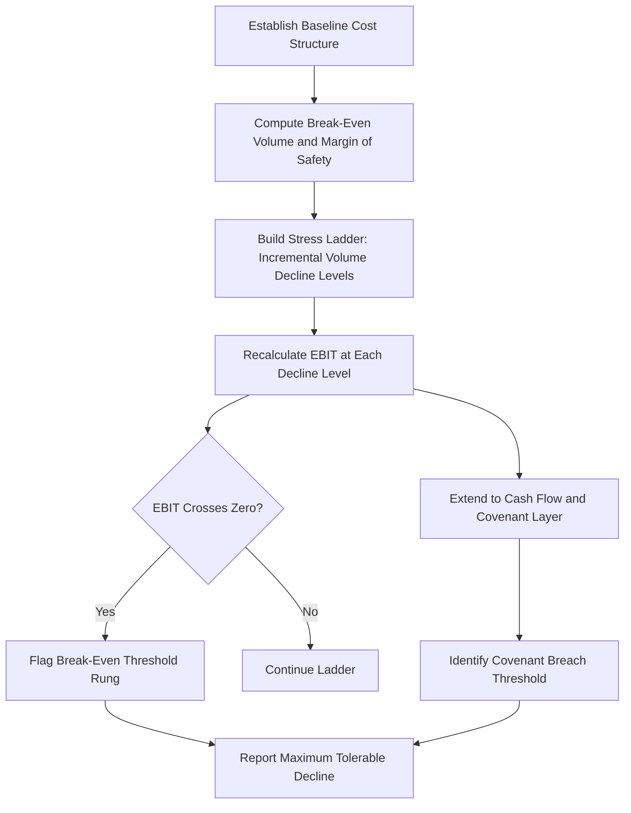

## Stress Testing Profitability Under Volume Declines

### Overview

Stress testing profitability under volume declines is a targeted application of CVP and operating leverage modeling that asks a specific, high-stakes question: how severe a sales volume drop can a company withstand before it breaches profitability, covenant thresholds, or cash-flow viability? Unlike general scenario or Monte Carlo analysis, which explore a range of plausible futures, stress testing deliberately pushes inputs to severe, low-probability, "what-if-the-worst-happens" levels to reveal the outer boundaries of resilience. It is the standard analytical tool for evaluating downside risk in credit analysis, covenant compliance review, and management capital-allocation decisions.

### Purpose and Distinguishing Features

**Key Points**

- Stress testing is not primarily about *likely* outcomes — it is about identifying breach points and quantifying the severity of decline the business model can absorb before specific consequences trigger (loss, covenant breach, negative cash flow, insolvency risk).
- Unlike Monte Carlo simulation, stress testing typically uses a small number of severe, deliberately chosen scenarios (rather than a full probability distribution) — trading probabilistic rigor for interpretability and direct linkage to a specific threshold of concern.
- Stress tests are often *reverse-engineered*: instead of asking "what is EBIT if volume falls 20%," analysts frequently ask "how far can volume fall before EBIT hits zero, or before a debt covenant is breached" — making Goal Seek and break-even mechanics central tools.

### Step 1 — Establish the Baseline Cost Structure

Before stress testing, the model requires an accurate fixed/variable cost decomposition, since the entire stress test's validity depends on correctly capturing how much of the cost base is truly fixed (and therefore unavoidable) during a downturn versus variable (and therefore naturally shrinks with volume).

| Baseline Input | Example Value |
| --- | --- |
| Selling Price per Unit | $45 |
| Variable Cost per Unit | $28 |
| Total Fixed Costs | $500,000 |
| Base-Case Unit Sales | 40,000 |
| Contribution Margin per Unit | $17 |
| Base-Case EBIT | $180,000 |

### Step 2 — Compute the Break-Even Volume Decline Threshold

The single most important stress-test output is the percentage volume decline that would exactly eliminate EBIT:

$$Break\text{-}Even\ Volume = \frac{Fixed\ Costs}{CM\ per\ Unit} = \frac{500{,}000}{17} = 29{,}412\ units$$

$$Maximum\ Tolerable\ Volume\ Decline\ (\%) = \frac{Base\ Volume - Break\text{-}Even\ Volume}{Base\ Volume}$$

$$= \frac{40{,}000 - 29{,}412}{40{,}000} = 26.5\%$$

This is mathematically identical to the **margin of safety** concept, reframed explicitly as a stress-test threshold: the company can absorb approximately a 26.5% volume decline before operating losses begin. This single number is often the headline output stakeholders want from a stress test.

### Step 3 — Build the Stress Ladder

Rather than a single downside scenario, a stress test typically builds a "ladder" of increasingly severe volume decline levels, showing the progressive EBIT deterioration at each rung — this is more informative for risk communication than a single downside data point, since it shows the *shape* of the decline (linear vs. accelerating) as volume falls.

| Volume Decline | Resulting Volume | EBIT | EBIT Margin | Status |
| --- | --- | --- | --- | --- |
| 0% (Base) | 40,000 | $180,000 | 10.0% | Healthy |
| -10% | 36,000 | $112,000 | 6.9% | Compressed |
| -20% | 32,000 | $44,000 | 3.1% | Thin |
| -26.5% | 29,412 | $0 | 0.0% | Break-Even |
| -30% | 28,000 | ($24,000) | -1.9% | Operating Loss |
| -40% | 24,000 | ($92,000) | -8.5% | Significant Loss |
| -50% | 20,000 | ($160,000) | -18.2% | Severe Distress |

**Spreadsheet formula pattern for the ladder** (one row per decline level, with Volume Decline % in column A):

| Cell | Formula |
| --- | --- |
| Volume (col B) | `=$BaseVolume*(1-A2)` |
| EBIT (col C) | `=B2*($Price-$VarCost)-$FixedCosts` |
| EBIT Margin (col D) | `=C2/(B2*$Price)` |
| Status flag (col E) | `=IF(C2<0,"Loss","Profit")` |

Using absolute references (`$`) for the shared baseline inputs allows the entire ladder to be built with one formula copied down the column, changing only the decline percentage in column A.

### Diagram: Stress Test Construction Flow (svg_diagram)

### Extending Beyond EBIT: Cash Flow and Covenant Stress Testing

A pure accounting-EBIT stress test can understate real distress risk, since it ignores non-operating cash obligations. A more complete stress test layers on:

- **Debt service coverage:** Compare stressed EBIT (or EBITDA) against fixed debt service obligations (interest + mandatory principal) to identify the volume decline at which the company can no longer cover debt payments from operations.

$$Debt\ Service\ Coverage\ Ratio = \frac{EBITDA}{Interest + Principal\ Due}$$

- **Covenant threshold testing:** If a credit agreement requires a minimum interest coverage ratio (e.g., EBITDA/Interest ≥ 3.0x) or a maximum leverage ratio (e.g., Debt/EBITDA ≤ 4.0x), the stress ladder can be extended to identify the specific volume decline level at which each covenant would be breached — often a more binding constraint than the pure operating break-even point.
- **Working capital drag:** A volume decline can also cause a temporary cash strain even before EBIT turns negative, if receivables/payables timing doesn't adjust as quickly as the income statement — a full liquidity stress test would layer in a cash flow statement, not just EBIT.

**Example**

Extending the ladder above with a debt covenant requiring EBITDA/Interest ≥ 2.5x, and assuming $50,000 in fixed interest expense and $30,000 in depreciation (so EBITDA = EBIT + $30,000):

| Volume Decline | EBIT | EBITDA | EBITDA/Interest | Covenant Status (≥2.5x) |
| --- | --- | --- | --- | --- |
| 0% | $180,000 | $210,000 | 4.20x | Pass |
| -20% | $44,000 | $74,000 | 1.48x | **Breach** |
| -26.5% | $0 | $30,000 | 0.60x | Breach |

This reveals that the debt covenant breaches at roughly a 20% volume decline — well before the pure operating break-even point at 26.5% — meaning the *binding* constraint in this stress test is financial (covenant), not operational (accounting break-even). This is a common and important finding in real stress-testing work: the operational break-even point is not always the most relevant threshold.

### Reverse Stress Testing

A related technique flips the framing: instead of specifying a decline severity and observing the outcome, reverse stress testing starts from an unacceptable outcome (e.g., insolvency, covenant breach, a specific credit rating downgrade trigger) and solves backward for the combination of shocks that would produce it.

**Spreadsheet implementation via Goal Seek:**

1. Set cell: EBITDA/Interest ratio cell
2. To value: 2.5 (the covenant threshold)
3. By changing cell: Volume Decline % input

This directly answers "how much would volume need to fall to breach our covenant" without needing to manually iterate down a ladder — a faster path to the specific threshold of concern.

### Combining with Operating Leverage Concepts

The steepness of the stress ladder's EBIT decline is a direct function of the Degree of Operating Leverage (DOL) at the base-case volume. A stress test on a high-DOL cost structure will show EBIT falling much faster per unit of volume decline than an identical stress test on a low-DOL structure with the same base EBIT — reinforcing why understanding a company's specific cost structure (not just its current profit level) is essential before interpreting stress test resilience.

$$\%\ \Delta\ EBIT \approx DOL \times \%\ \Delta\ Volume$$

This approximation can be used as a fast, formula-driven cross-check on the stress ladder's more precise ground-up recalculation, particularly at volume levels not too far from the base case (the DOL-based linear approximation becomes less precise as the ladder approaches or crosses the break-even point itself, since DOL is not constant across volume levels).

### Common Build Errors and How to Avoid Them

| Error | Cause | Fix |
| --- | --- | --- |
| Stress ladder shows constant EBIT decline rate that doesn't match DOL | Fixed costs formula accidentally varies with volume | Confirm fixed cost cell is a flat, absolute reference independent of the volume decline input |
| Covenant breach threshold never triggers in the ladder | Ladder's decline range doesn't extend far enough to reach the breach point | Extend the ladder's range, or use Goal Seek/reverse stress testing to jump directly to the threshold |
| EBITDA miscalculated | Depreciation/amortization add-back omitted or double-counted | Explicitly build EBITDA as `=EBIT+D&A`, verified against the cash flow statement or footnotes |
| Break-even volume threshold doesn't match ladder's zero-crossing row | Rounding or formula inconsistency between the algebraic break-even formula and the ladder's row-by-row EBIT formula | Cross-check the algebraic break-even units figure against where the ladder's EBIT column actually crosses zero |

### Validation and Auditing Practices

- **Algebraic cross-check:** Confirm the ladder's EBIT-crosses-zero row aligns with the independently-computed algebraic break-even volume.
- **DOL approximation check:** Compare the DOL-based percentage EBIT change approximation against the ladder's ground-up recalculated EBIT change at a few sample decline levels, to confirm consistency (especially near the base case, where the linear approximation should be closest).
- **Binding constraint identification:** Explicitly compare the operational break-even threshold against any covenant/financial thresholds — report whichever binds first (occurs at a smaller volume decline), since that is the practically relevant risk boundary, not necessarily the accounting break-even point.
- **Historical plausibility check:** Where possible, compare the stress test's severity levels (e.g., -20%, -30%, -50%) against the company's or industry's actual historical peak-to-trough volume declines during past downturns, to calibrate whether the chosen stress levels are realistically severe or excessively/insufficiently conservative. [Inference: appropriate historical benchmarks vary substantially by industry cyclicality and are not derivable from the CVP framework itself.]

**Next Steps**

- Covenant compliance modeling and credit agreement threshold analysis
- Liquidity and cash flow stress testing beyond EBIT/EBITDA
- Reverse stress testing methodology and Goal Seek applications
- Cost stickiness and its effect on realistic downside cost assumptions
- Linking stress test outputs to credit rating agency methodology
- Scenario analysis for demand and cost shocks (combined multi-variable stress framing)