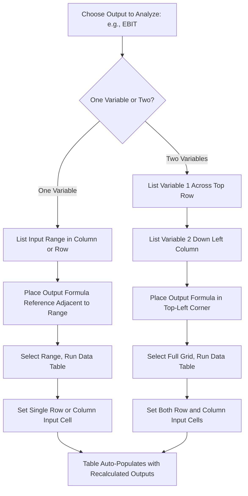

## Sensitivity Tables and What If Analysis

### Overview

Sensitivity tables and What-If Analysis are the spreadsheet mechanics that underpin nearly every other forecasting technique in cost structure analysis — CVP modeling, operating leverage forecasting, scenario analysis, and stress testing all rely on the same small set of core tools to systematically vary inputs and observe output changes. This topic consolidates those mechanics into a single reference: Data Tables (one- and two-variable), Goal Seek, Scenario Manager, and the underlying spreadsheet architecture that makes them work reliably.

### The Four Core What-If Tools

| Tool | Question It Answers | Typical Use Case |
| --- | --- | --- |
| One-Variable Data Table | "How does output change as one input varies across a range?" | EBIT across a range of volumes |
| Two-Variable Data Table | "How does output change as two inputs vary simultaneously?" | EBIT across combinations of price and volume |
| Goal Seek | "What input value produces a specific target output?" | Volume needed to hit a target EBIT |
| Scenario Manager | "What is the output under several named, discrete combinations of inputs?" | Base/Upside/Downside case comparison |

**Key Points**

- All four tools operate on the *same underlying model* — they do not require separate formulas or duplicate models. A single well-built CVP model can be probed with any of the four tools depending on the question being asked.
- Data Tables require the output formula to be referenced in a specific cell relative to the input range (top-left corner for two-variable tables, top-right for one-variable column-oriented tables) — the exact placement rules are a common source of setup errors.
- What-If tools are recalculation-triggering constructs, not new formulas — they temporarily substitute values into existing input cells and record the resulting output, without altering the underlying calculation logic.

### One-Variable Data Table: Detailed Mechanics

**Structure requirements:**

- If **column-oriented** (input values listed down a column): the output formula must be placed one row above and one column to the right of the top input value, i.e., in the cell diagonally adjacent to the top-left of the range.
- If **row-oriented** (input values listed across a row): the output formula must be placed one column to the left and one row below the leftmost input value.

**Setup steps (column-oriented example):**

1. List input values down column A (e.g., unit sales from 20,000 to 40,000 in steps of 2,000), starting one row below where the output formula will go.
2. In the cell one row up and one column to the right of the first input value, enter `=EBIT_cell` (a direct reference to the model's EBIT output cell).
3. Select the entire rectangular range including both the input column and the formula reference cell.
4. Data → What-If Analysis → Data Table.
5. In the dialog, leave "Row input cell" blank (since inputs are in a column) and set "Column input cell" to the model's Unit Sales input cell.
6. Excel fills in the table automatically, substituting each input value into the Unit Sales cell and recording the resulting EBIT.

**Result appears as:**

|  | EBIT (formula reference row) |
| --- | --- |
| 20,000 | (calculated) |
| 22,000 | (calculated) |
| 24,000 | (calculated) |
| ... | ... |
| 40,000 | (calculated) |

### Two-Variable Data Table: Detailed Mechanics

**Structure requirements:**

- One variable's range goes across a row (top of the table); the other variable's range goes down a column (left side of the table).
- The output formula reference goes in the single cell at the intersection of that row and column — the top-left corner of the grid.

**Setup steps:**

1. Place Price values across row 1 (e.g., $35 to $55 in $5 increments), starting one column to the right of where the row of volume values will go.
2. Place Volume values down column A (e.g., 20,000 to 40,000), starting one row below the price row.
3. In the top-left corner cell (intersection of the price row and volume column), enter `=EBIT_cell`.
4. Select the entire grid.
5. Data → What-If Analysis → Data Table.
6. Set "Row input cell" to the Price input cell (since Price varies across the row) and "Column input cell" to the Volume input cell (since Volume varies down the column).

**Result:** A full grid of EBIT values, each cell showing the EBIT outcome for that row's price combined with that column's volume — allowing direct visual identification of which price/volume combinations produce acceptable versus unacceptable profitability.

### Diagram: Data Table Setup Logic (svg_diagram)

### Goal Seek: Detailed Mechanics

Goal Seek solves for the single input value needed to hit a specific target output — the reverse direction from a Data Table (which shows outputs for given inputs).

**Setup steps:**

1. Data → What-If Analysis → Goal Seek.
2. **Set cell:** the output cell to control (e.g., EBIT).
3. **To value:** the specific target (e.g., 0 for break-even, or a specific target profit figure).
4. **By changing cell:** the single input cell to solve for (e.g., Unit Sales).
5. Excel iteratively adjusts the changing cell until the set cell reaches the target value (within a small tolerance), using an internal iterative numerical method.

**Common applications in cost structure analysis:**

- Break-even volume validation (Set EBIT to 0, changing Unit Sales) — should match the algebraic break-even formula
- Target profit volume (Set EBIT to a specific dollar target, changing Unit Sales)
- Required price for target margin (Set EBIT Margin % to a target, changing Price)
- Maximum tolerable cost increase (Set EBIT to 0, changing Variable Cost per Unit)

**Key Points**

- Goal Seek only solves for **one** changing cell at a time — for simultaneous multi-variable solving, more advanced tools (e.g., Excel's Solver add-in) are required.
- Goal Seek uses numerical iteration, not a closed-form algebraic solution — for well-behaved linear CVP relationships, it will converge to the exact algebraic answer, but this should still be cross-checked against the direct formula (e.g., `Fixed Costs / CM per unit` for break-even) as an audit step, since Goal Seek can occasionally fail to converge or converge to an imprecise value if starting conditions or tolerances are unfavorable.

### Scenario Manager: Detailed Mechanics

Scenario Manager stores multiple named sets of input values for the same model, allowing quick toggling and side-by-side comparison without manually re-entering values each time.

**Setup steps:**

1. Data → What-If Analysis → Scenario Manager → Add.
2. Name the scenario (e.g., "Downside — Recession").
3. Select "Changing cells" — the specific input cells this scenario will override (can be multiple cells simultaneously, e.g., Volume, Price, and Variable Cost together).
4. Enter the specific values for each changing cell under this scenario.
5. Repeat for each additional named scenario.
6. Use "Summary" to generate a new worksheet comparing all scenarios' result cells (which must be explicitly selected — typically EBIT, Margin of Safety, etc.) side by side in one table.

**Distinguishing feature vs. Data Tables:** Scenario Manager handles **discrete, named, multi-variable combinations** cleanly, whereas Data Tables are better suited for **continuous ranges** of one or two variables. Scenario Manager is the natural fit for base/upside/downside case comparison; Data Tables are the natural fit for a smooth sensitivity gradient.

### Choosing the Right Tool for a Given Question

| Question | Best Tool |
| --- | --- |
| "How does EBIT change smoothly across a range of sales volumes?" | One-Variable Data Table |
| "How does EBIT vary across combinations of price and volume?" | Two-Variable Data Table |
| "What volume is needed to break even, or hit a specific profit target?" | Goal Seek |
| "What is EBIT under our recession case vs. our base case vs. our expansion case?" | Scenario Manager |
| "What is the full probability distribution of EBIT given input uncertainty?" | Monte Carlo simulation (see dedicated topic) |
| "How far can volume fall before we breach a covenant?" | Goal Seek (reverse-solving) or a stress ladder table |

### Common Build Errors and How to Avoid Them

| Error | Cause | Fix |
| --- | --- | --- |
| Data Table returns the same value in every cell | Row/Column input cell in the dialog doesn't match the cell actually driving the referenced output formula | Confirm the output formula genuinely depends on the specified input cell; re-check Row vs. Column input cell assignment |
| Data Table shows `#N/A` or `#REF!` errors | Output formula reference cell was deleted, moved, or incorrectly placed relative to the input range | Re-verify the output formula reference is in the exact correct relative position (diagonal corner for one-variable, top-left for two-variable) |
| Goal Seek doesn't converge ("Goal Seek may not have found a solution") | Target value is mathematically unreachable given the model's constraints, or the relationship is discontinuous/non-monotonic | Verify the target is achievable within a reasonable input range; check for formula issues like circular references or IF-based discontinuities |
| Scenario Summary shows blank or incorrect result cells | Result cells not explicitly selected when generating the summary, or scenario changing cells don't actually feed into the result cells | Re-run Scenario Manager, explicitly selecting the correct result cells (e.g., EBIT, not just the changing cells themselves) |
| Data Table dramatically slows down a large workbook | Excel recalculates the entire Data Table on every workbook change by default, which is expensive at scale | Set calculation options to Automatic Except for Data Tables (Formulas → Calculation Options), then manually recalculate (F9) when needed |

### Validation and Auditing Practices

- **Corner-case reconciliation:** For a Data Table, confirm that the row/column corresponding to the current live input values in the model matches the model's live output — if the model shows EBIT = $180,000 at 40,000 units, the Data Table's 40,000-unit row should show exactly the same figure.
- **Goal Seek vs. algebraic cross-check:** Wherever a closed-form formula exists (e.g., break-even units), always cross-check Goal Seek's numerically-converged answer against the direct algebraic formula result.
- **Scenario Manager audit:** Confirm each scenario's changing cells actually correspond to the intended narrative (e.g., a "downside" scenario shouldn't inadvertently leave a favorable input unchanged when the narrative implies it should also shift).
- **Formula reference stability:** Since Data Tables and Scenario Manager depend on exact cell references, inserting or deleting rows/columns in the model after setup can silently break the linkage — re-verify all What-If tool configurations after any structural changes to the underlying model.

**Related Topics**

- Building CVP models in spreadsheets (the underlying model these tools operate on)
- Building operating leverage models in spreadsheets
- Scenario analysis for demand and cost shocks
- Monte Carlo simulation of cost structure outcomes
- Excel Solver for multi-variable simultaneous optimization
- Tornado charts for ranking variable sensitivity impact