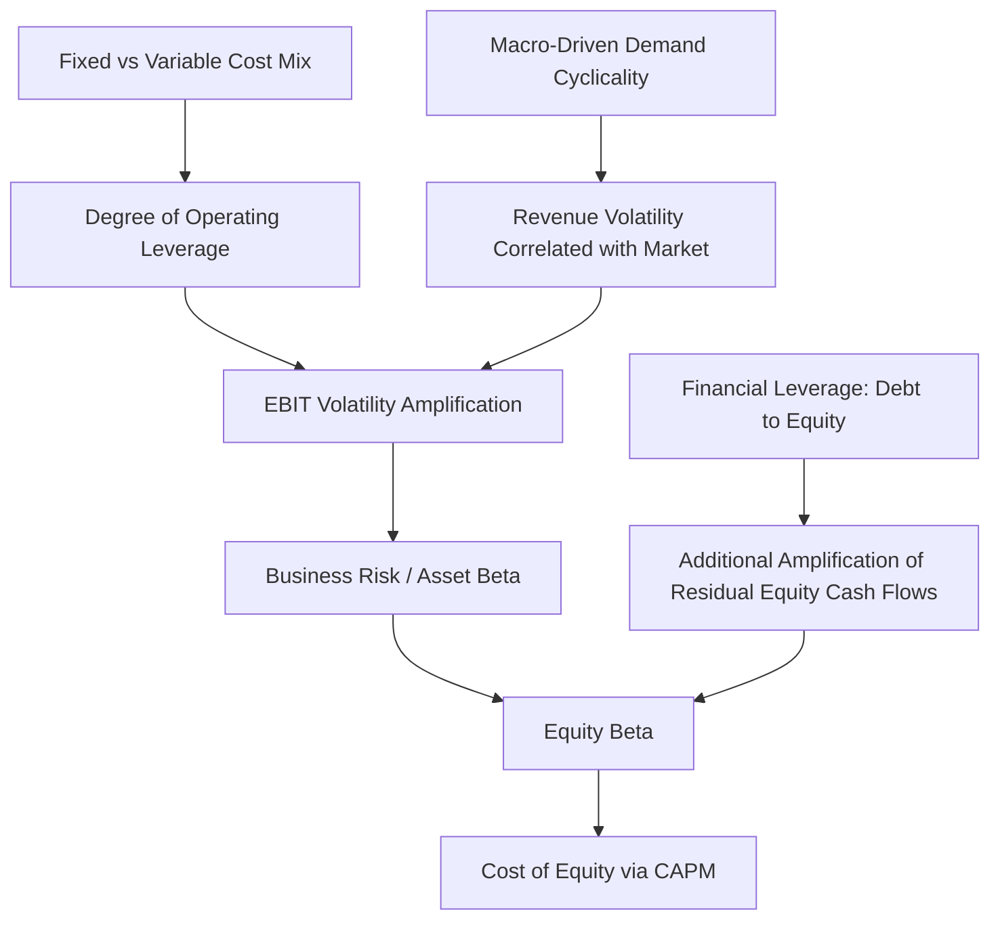

## Operating Leverage and Earnings Volatility Effects on Beta

### Overview

Beta measures a stock's sensitivity to broad market movements and is a central input to the Capital Asset Pricing Model (CAPM) for estimating a firm's cost of equity. Operating leverage connects directly to beta because a firm's cost structure amplifies (or dampens) how sensitively its underlying earnings respond to economy-wide demand fluctuations — and since earnings variability driven by macro conditions is a core component of systematic risk, higher operating leverage tends to produce higher equity beta, all else equal. This topic bridges cost structure analysis with capital markets valuation theory.

### Conceptual Chain: From Cost Structure to Beta

$$Cost\ Structure \rightarrow Operating\ Leverage\ (DOL) \rightarrow EBIT\ Volatility \rightarrow Business\ Risk \rightarrow Asset\ Beta \rightarrow Equity\ Beta$$

**Key Points**

- Operating leverage affects **business risk** (the volatility of operating earnings driven by the firm's operations), which is distinct from **financial risk** (the additional volatility layered on by debt financing). Both flow into equity beta, but through different mechanisms.
- A firm with high fixed costs relative to variable costs will see EBIT swing more dramatically for a given change in sales — and to the extent that sales themselves are correlated with the broader economy (a demand driver most firms share to some degree), this earnings amplification translates into greater *systematic* (market-correlated) risk, not merely greater total volatility.
- Idiosyncratic (firm-specific) volatility from operating leverage — e.g., a demand shock unique to one company's product, uncorrelated with the market — does not raise beta, since beta specifically measures *co-movement with the market*, not total earnings volatility. This distinction matters: high DOL raises beta primarily to the extent the underlying demand driver is macro-correlated.

### Unlevered (Asset) Beta and Operating Leverage

**Asset beta** (also called unlevered beta) reflects a firm's business risk independent of its capital structure. Operating leverage is one of the primary drivers of asset beta differences across firms and industries, even before considering financial leverage.

$$\beta_{asset} = \beta_{equity} \times \left[\frac{1}{1+(1-t)\frac{D}{E}}\right]$$

(This formula "unlevers" observed equity beta by removing the financial leverage effect, isolating the business-risk component — which includes the operating leverage effect — from the capital-structure effect.)

**Why operating leverage raises asset beta:**

- Two firms in the same industry, facing the same macro-driven demand cyclicality, but with different fixed/variable cost mixes, will show different EBIT volatility for the same revenue volatility.
- The firm with higher fixed costs (higher DOL) experiences proportionally larger EBIT swings for the same percentage revenue swing driven by the economic cycle.
- Since asset beta reflects the covariance of the firm's *operating* cash flows/earnings with the market, the firm with amplified EBIT swings (from operating leverage) tends to exhibit higher asset beta, holding the underlying revenue cyclicality constant.

### Combining Operating and Financial Leverage Effects on Beta

Total equity beta reflects both business risk (including operating leverage) and financial risk (from debt):

$$\beta_{equity} = \beta_{asset} \times \left[1+(1-t)\frac{D}{E}\right]$$

This produces a compounding structure: a firm with both high operating leverage (high fixed operating costs) *and* high financial leverage (significant debt) will tend to exhibit the highest equity beta among its peers, since both forms of leverage independently amplify the sensitivity of the residual cash flows (to equity holders) relative to changes in underlying demand.

**Illustrative comparison:**

| Firm | Fixed Cost Structure | Debt/Equity | Relative Asset Beta | Relative Equity Beta |
| --- | --- | --- | --- | --- |
| A | Low (variable-cost-heavy) | Low | Lower | Lowest |
| B | High (fixed-cost-heavy) | Low | Higher | Moderate |
| C | Low (variable-cost-heavy) | High | Lower | Moderate |
| D | High (fixed-cost-heavy) | High | Higher | Highest |

Firm D combines both leverage sources and would be expected to show the highest sensitivity of equity returns to market movements among the four, all else (industry demand cyclicality) held equal.

### Industry Patterns Linking Cost Structure to Observed Beta

Certain industries are commonly cited as illustrating this relationship, though actual beta for any specific company depends on many factors beyond cost structure alone:

| Industry Pattern | Typical Cost Structure | Typical Beta Tendency |
| --- | --- | --- |
| Airlines, heavy manufacturing, semiconductors | High fixed costs (aircraft, factories, fabs) | Tends toward higher beta |
| Utilities (regulated) | High fixed costs, but demand is highly inelastic/non-cyclical | Often lower beta despite high fixed costs — demand stability offsets operating leverage |
| Retail/grocery (staples) | More variable cost-heavy (COGS-dominated), plus stable demand | Tends toward lower beta |
| Consulting/staffing services | Low fixed costs (labor scales with revenue) | Tends toward lower beta from the cost-structure channel |

[Inference: this table describes commonly observed directional tendencies rather than a strict deterministic rule — regulated utilities are a clear counterexample showing that demand cyclicality (not fixed costs alone) is the necessary co-factor for operating leverage to translate into higher beta, and actual company-specific beta depends on many factors beyond cost structure, including demand elasticity, competitive dynamics, and regulatory environment.]

### Diagram: Cost Structure to Beta Transmission Mechanism (svg_diagram)

### Implications for Cost of Equity and Valuation

Since beta feeds directly into the CAPM cost of equity estimate:

$$Cost\ of\ Equity = Risk\text{-}Free\ Rate + \beta_{equity} \times Equity\ Risk\ Premium$$

A higher operating-leverage-driven beta implies a higher required cost of equity, which in turn:

- Increases the discount rate applied in a DCF valuation, reducing present value of future cash flows for a given cash flow forecast
- Implies the market demands greater compensation for holding the stock, reflecting the amplified earnings sensitivity to economic cycles
- Can partially or fully offset the *upside* benefit of operating leverage (larger EBIT growth in expansions) when translated into a present-value framework, since the same leverage that helps in expansions also raises the discount rate applied to all future cash flows

**Example**

Two otherwise-identical firms with the same expected long-run average EBIT growth: Firm X (high DOL, beta = 1.4) and Firm Y (low DOL, beta = 0.9), with a risk-free rate of 4% and an equity risk premium of 5.5%:

$$Cost\ of\ Equity_X = 4\% + 1.4 \times 5.5\% = 11.7\%$$

$$Cost\ of\ Equity_Y = 4\% + 0.9 \times 5.5\% = 8.95\%$$

Even if both firms are forecast to generate identical expected future cash flows, Firm X's higher operating-leverage-driven beta results in a materially higher discount rate, producing a lower valuation multiple on those cash flows, all else equal — illustrating that operating leverage's earnings amplification is a double-edged consideration for valuation, not a purely favorable characteristic.

### Practical Application: Adjusting Beta Estimates for Cost Structure Changes

When a company undergoes a material shift in its cost structure (e.g., outsourcing manufacturing to convert fixed costs into variable costs, or conversely building owned capacity to replace variable third-party contracts), analysts should consider whether historical observed beta (typically estimated via regression of stock returns against market returns) remains a reliable forward-looking estimate:

1. **Identify the direction of the cost structure shift** (fixed-to-variable, or variable-to-fixed).
2. **Estimate the resulting change in DOL** using pre- and post-shift CVP models.
3. **Consider using a peer/comparable-company beta approach** instead of (or alongside) the company's own historical beta if the cost structure shift is significant enough that historical return data no longer reflects the current risk profile — selecting comparable companies with a similar *post-shift* cost structure and re-levering their unlevered betas to the subject company's capital structure.
4. **Apply the Hamada equation** (shown above) to unlever peer betas, average the resulting asset betas, then re-lever to the subject company's specific capital structure, incorporating the operating-leverage-consistent business risk from the peer set.

### Limitations and Caveats

- **Beta is empirically estimated, not derived purely from cost structure theory** — the relationship described here is a directional, conceptual link, not a formula that directly converts a DOL figure into a specific beta value. [Unverified: no widely standardized formula translates a specific DOL value into a specific beta adjustment; the relationship is used qualitatively and directionally in practice, most commonly via peer-comparable beta selection rather than a direct mathematical mapping.]
- **Demand cyclicality is a necessary co-factor.** High operating leverage in a genuinely non-cyclical, demand-inelastic business (e.g., regulated utilities, essential healthcare services) does not translate into high beta the way it does in cyclical industries, since the revenue volatility driving the DOL amplification must itself be market-correlated for the effect to manifest in systematic risk.
- **Other factors also drive beta** independent of cost structure: industry regulation, competitive dynamics, pricing power, customer concentration, and general firm-specific factors all contribute to observed beta alongside the operating leverage channel.

**Next Topics**

- Levering and unlevering beta (Hamada equation) in detail
- Comparable company analysis and peer beta selection methodology
- CAPM and the equity risk premium in cost of equity estimation
- Degree of Total Leverage (DTL) and its combined effect on equity risk
- Industry beta patterns and demand elasticity as a beta determinant
- DCF valuation sensitivity to discount rate assumptions