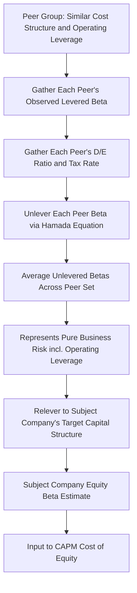

## Unlevered versus Levered Beta and Operating Leverage

### Overview

The distinction between unlevered (asset) beta and levered (equity) beta separates a firm's *business risk* — driven substantially by its cost structure and operating leverage — from its *financial risk*, driven by capital structure/debt financing. This decomposition is essential for cross-company comparison, comparable company analysis, and building forward-looking cost of equity estimates that reflect a target company's specific risk profile rather than a peer's blended risk. Operating leverage sits specifically inside the unlevered beta component, making the unlevering/levering process the formal mechanism by which cost-structure-driven business risk is isolated, transferred across comparable companies, and re-combined with a specific capital structure.

### Defining the Two Beta Concepts

| Concept | What It Captures | Cost Structure Relevance |
| --- | --- | --- |
| **Levered (Equity) Beta** | Total systematic risk borne by equity holders — business risk PLUS financial risk from leverage | Reflects operating leverage *and* financial leverage combined |
| **Unlevered (Asset) Beta** | Systematic risk of the underlying business operations only, as if financed entirely with equity (no debt) | Isolates the operating leverage / business risk component alone |

**Key Points**

- Unlevered beta is sometimes called "asset beta" because it reflects the risk of the firm's assets/operations independent of how those assets are financed.
- Two firms in the same industry with identical operations and cost structures, but different debt levels, will show different levered (equity) betas but should show similar unlevered (asset) betas — since unlevering strips out the capital structure effect, leaving primarily the business-risk (including operating leverage) component.
- The unlevering/levering transformation is the standard technique that allows analysts to use a peer group's observed equity betas to estimate an appropriate beta for a company with a different (or hypothetical) capital structure, or a private/newly-public company with no historical trading data of its own.

### The Hamada Equation

The most widely used formula connecting levered and unlevered beta:

**Unlevering (removing the effect of the observed company's financial leverage):**

$$\beta_{Unlevered} = \frac{\beta_{Levered}}{1+(1-t)\times\frac{D}{E}}$$

**Relevering (applying a target capital structure's financial leverage):**

$$\beta_{Relevered} = \beta_{Unlevered} \times \left[1+(1-t)\times\frac{D}{E}\right]$$

Where:

- $\beta_{Levered}$ = observed equity beta (e.g., from regression of stock returns vs. market returns)
- $t$ = marginal tax rate
- $D/E$ = debt-to-equity ratio (market value basis preferred)

**Key Points**

- The $(1-t)$ term reflects the tax shield on debt — interest expense is tax-deductible, which reduces the effective risk-amplifying impact of a given amount of debt compared to a world with no tax shield.
- This formula assumes debt beta is approximately zero (i.e., debt itself carries negligible systematic risk) — a simplifying assumption that becomes less accurate for highly leveraged or distressed companies where debt itself bears meaningful market risk. [Inference: for most investment-grade, moderately-levered companies this assumption introduces limited distortion, but analysts should be aware it is an approximation rather than an exact decomposition.]

### Step-by-Step Comparable Company Beta Process

This is the standard application connecting operating leverage, cost structure, and beta estimation in practice:

1. **Identify a peer group** of comparable companies — ideally with similar cost structures/operating leverage profiles (same industry, similar business model), not merely similar revenue size.
2. **Gather each peer's observed levered (equity) beta**, typically from a financial data provider or via regression of historical stock returns against a market index.
3. **Gather each peer's capital structure** (D/E ratio) and applicable tax rate.
4. **Unlever each peer's beta** using the Hamada equation, producing a set of asset betas that reflect each peer's business risk independent of its specific financing choice.
5. **Average (or median) the unlevered betas** across the peer set, producing a representative unlevered beta for the industry/business model.
6. **Relever the averaged unlevered beta** to the subject company's own (or target) capital structure and tax rate, producing an appropriate equity beta estimate for the subject company.

### Worked Example

A private company is being valued and needs an estimated equity beta. Three public peers with similar cost structures are identified:

| Peer | Levered Beta | D/E | Tax Rate | Unlevered Beta |
| --- | --- | --- | --- | --- |
| Peer 1 | 1.35 | 0.60 | 25% | `=1.35/(1+(1-0.25)*0.60)` = 0.949 |
| Peer 2 | 1.20 | 0.40 | 25% | `=1.20/(1+(1-0.25)*0.40)` = 0.960 |
| Peer 3 | 1.50 | 0.80 | 25% | `=1.50/(1+(1-0.25)*0.80)` = 0.968 |

**Average unlevered beta:** $(0.949 + 0.960 + 0.968)/3 = 0.959$

If the subject company's target capital structure is D/E = 0.50 and tax rate = 25%:

$$\beta_{Relevered} = 0.959 \times [1+(1-0.25)\times0.50] = 0.959 \times 1.375 = 1.319$$

This relevered beta of approximately 1.32 becomes the equity beta input for the subject company's CAPM cost of equity calculation, reflecting the peer group's shared business risk (including their common operating leverage characteristics) combined with the subject company's own specific capital structure — rather than any single peer's own blended risk profile.

### Diagram: Unlever/Relever Process Flow (svg_diagram)

### Why Operating Leverage Specifically Lives in the Unlevered Component

Since unlevered beta strips out financing effects entirely (as if the company had no debt), what remains is purely the risk of the underlying operations — and the largest driver of operating risk variation across companies in similar industries is typically their cost structure:

- A peer with high fixed costs (high DOL) will generally show a higher unlevered beta than a peer with low fixed costs (low DOL), even after removing both companies' financial leverage effects — assuming both face similar demand cyclicality.
- This is precisely why comparable company selection should prioritize similarity in **operating model and cost structure**, not just industry classification or revenue size — two companies in the same broad industry (e.g., "technology") can have very different cost structures (e.g., a capital-intensive semiconductor fabricator vs. an asset-light software company), and their unlevered betas would be expected to differ accordingly.

### Practical Considerations in Peer Selection

| Consideration | Why It Matters for Operating-Leverage-Consistent Beta |
| --- | --- |
| Similar fixed/variable cost mix | Ensures the unlevered beta reflects comparable operating leverage, not a mismatched risk profile |
| Similar demand cyclicality | Operating leverage only translates into higher beta when the underlying revenue driver is market-correlated (see prior topic) |
| Similar business model maturity | Early-stage/high-growth companies may show different fixed cost absorption patterns than mature companies in the "same" industry |
| Sufficient peer sample size | A small peer set is more sensitive to any single peer's idiosyncratic beta estimation noise |
| Consistent capital structure data source | Market-value D/E is preferred over book-value D/E for the Hamada calculation, since book value can significantly understate or overstate true financial leverage |

### Common Errors in Application

| Error | Cause | Fix |
| --- | --- | --- |
| Using book value D/E instead of market value D/E | Book equity is more readily available but doesn't reflect market-priced financial risk | Use market capitalization for equity value in the D/E ratio wherever feasible |
| Averaging levered betas directly across peers without unlevering first | Skipping the unlevering step | Always unlever each peer individually before averaging — averaging levered betas directly conflates business risk and financing risk differences across peers with different capital structures |
| Selecting peers by industry classification alone | Ignoring underlying cost structure differences within a broad industry label | Screen peers specifically for similar fixed/variable cost mix and operating leverage profile, not just SIC/GICS code |
| Applying the subject company's tax rate inconsistently between unlevering peers and relevering the average | Mismatched tax rate assumptions distort the final beta estimate | Use each peer's own tax rate when unlevering; use the subject company's own (typically marginal) tax rate when relevering |
| Ignoring debt beta for highly leveraged peers | Assuming debt beta = 0 regardless of leverage level | For distressed or very highly levered peers, consider a debt-beta-adjusted (Hamada with debt beta term) formula, or exclude such peers from the set |

### Validation and Auditing Practices

- **Reasonableness check on unlevered betas:** Confirm the unlevered betas across the peer set fall within a plausible, relatively tight range for companies described as comparable — a wide dispersion may indicate the peer set is not as operationally similar as assumed (differing cost structures despite similar industry labels).
- **Sensitivity to capital structure assumption:** Test the relevered beta's sensitivity to the assumed target D/E ratio — since the subject company (especially if private or pre-IPO) may not have a definitively "correct" capital structure, testing a range of plausible D/E assumptions shows how much the final beta (and resulting cost of equity) depends on that assumption.
- **Cross-check against direct regression (if available):** If the subject company has any trading history of its own (e.g., recently IPO'd), compare the peer-derived relevered beta against a direct regression-based beta estimate, understanding that a short trading history typically produces a noisier, less reliable direct estimate.

**Related Topics**

- Operating leverage and earnings volatility effects on beta
- CAPM and cost of equity estimation
- Comparable company analysis methodology
- Degree of Total Leverage (DTL) and combined operating/financial leverage
- WACC construction incorporating relevered beta
- Debt beta and its role in highly leveraged capital structures