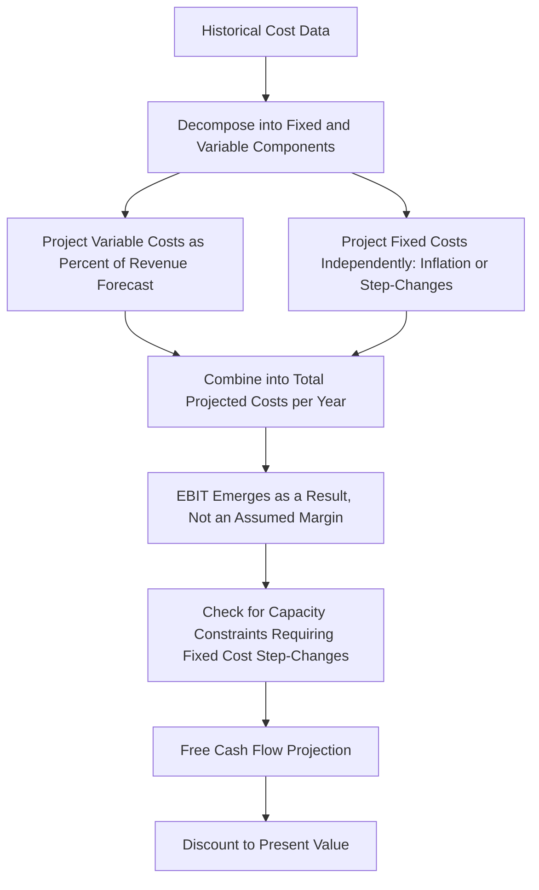

## Operating Leverage Assumptions in Discounted Cash Flow Models

### Overview

Discounted Cash Flow (DCF) valuation requires explicit or implicit assumptions about how a company's cost structure behaves as projected revenue changes over the forecast period. Because fixed and variable costs respond differently to volume changes, the way an analyst models cost behavior in the projection period — rather than simply applying a constant margin — has a material effect on projected free cash flow, terminal value, and ultimately the resulting valuation. This topic addresses how operating leverage assumptions should be explicitly built into DCF cost projections, and the common modeling errors that arise from ignoring cost structure entirely.

### The Core Modeling Problem: Constant Margin vs. Cost Structure-Based Projection

**The naive (and common) approach:** Project revenue growth, then apply a constant historical operating margin (%) to derive EBIT in every forecast year.

$$EBIT_{t} = Revenue_t \times Historical\ Margin\%$$

**The problem:** This approach implicitly assumes *all* costs are variable (scaling perfectly with revenue), which contradicts the fixed/variable cost reality of virtually every business, and produces systematically biased forecasts, particularly in scenarios of significant growth or decline.

**The cost-structure-based approach:** Explicitly separate the cost base into fixed and variable components, project each according to its actual behavior, and let EBIT margin emerge as a *result* of the volume forecast rather than being assumed as a constant input.

$$EBIT_t = Revenue_t - (Variable\ Cost\ \%\ of\ Revenue \times Revenue_t) - Fixed\ Costs_t$$

**Key Points**

- Under the constant-margin approach, a 20% revenue growth forecast mechanically produces exactly 20% EBIT growth — which is only correct if the company has zero operating leverage (all costs variable), an assumption that is rarely accurate and typically understates true margin expansion potential in a growth scenario.
- Under the cost-structure-based approach, the same 20% revenue growth forecast will produce EBIT growth *greater* than 20% (for a company with meaningful fixed costs), correctly reflecting operating leverage — since fixed costs do not scale with the added revenue, more of each incremental revenue dollar flows through to EBIT.
- The reverse is equally important: in a revenue decline scenario, the constant-margin approach understates how severely EBIT will fall, since it fails to capture the reality that fixed costs remain largely unchanged even as revenue shrinks.

### Step-by-Step: Building Operating-Leverage-Aware DCF Cost Projections

#### Step 1 — Decompose Historical Costs into Fixed and Variable Components

Using historical financial statements, apply a cost decomposition method (high-low method, regression analysis, or management-provided cost classification) to separate each major cost line (COGS, SG&A, etc.) into its fixed and variable components.

| Cost Line | Historical Total | Estimated Fixed Portion | Estimated Variable Portion (% of Revenue) |
| --- | --- | --- | --- |
| COGS | $40M | $8M | 32% of revenue |
| SG&A | $15M | $11M | 4% of revenue |
| R&D | $8M | $8M | 0% (treated as fully fixed/discretionary) |

#### Step 2 — Project Each Component Separately Across the Forecast Period

- **Variable costs:** scale directly with the revenue forecast using the historical variable cost percentage (adjusted for any expected efficiency changes).
- **Fixed costs:** project based on expected step-changes (e.g., capacity expansion requiring a new facility) or inflation-based growth, rather than scaling with revenue.

| Year | Revenue | Variable Costs (36% combined) | Fixed Costs | EBIT | Implied EBIT Margin |
| --- | --- | --- | --- | --- | --- |
| Base | $100M | $36M | $27M | $37M | 37.0% |
| Year 1 (+15%) | $115M | $41.4M | $27M (unchanged) | $46.6M | 40.5% |
| Year 2 (+15%) | $132.25M | $47.6M | $28M (inflation +3.7%) | $56.65M | 42.8% |

Note how EBIT margin *expands* across the forecast under this approach — purely as a mechanical result of fixed costs not scaling with revenue growth — without requiring the analyst to separately assume margin expansion as an unexplained top-down input.

#### Step 3 — Flag Capacity-Driven Step-Changes in Fixed Costs

A critical refinement: fixed costs are only fixed *within a relevant range* of activity. If the revenue forecast implies volume growth beyond current capacity, the model should incorporate a step-change in fixed costs (e.g., a new facility, additional salaried management layer) at the appropriate forecast year, rather than assuming fixed costs remain flat indefinitely regardless of scale.

**Example capacity constraint modeling:**

| Year | Revenue | Capacity Utilization | Fixed Cost Treatment |
| --- | --- | --- | --- |
| Year 1 | $115M | 78% | No change — within existing capacity |
| Year 2 | $132M | 90% | No change — approaching capacity limit |
| Year 3 | $152M | 104% (exceeds capacity) | Step-change: add $5M new fixed costs for expanded capacity |

Failing to model this step-change would overstate EBIT margin expansion in Year 3, since the model would incorrectly assume the existing fixed cost base can support unlimited volume growth.

### Diagram: Operating-Leverage-Aware DCF Cost Build (svg_diagram)

### Impact on Terminal Value Assumptions

The terminal value calculation deserves particular attention regarding operating leverage assumptions, since it typically represents the majority of total DCF value:

$$Terminal\ Value = \frac{FCF_{terminal\ year} \times (1+g)}{WACC - g}$$

**Key considerations:**

- The terminal year margin assumption should reflect a **steady-state** operating leverage condition — not the peak margin expansion seen during a high-growth forecast period, since perpetual growth at a terminal growth rate typically implies revenue growth has moderated to a mature, sustainable pace where fixed costs would have already scaled to match the new steady-state volume.
- A common modeling error is carrying forward the terminal year's *forecast-period* fixed cost base indefinitely into the terminal value without confirming it remains appropriate at the assumed terminal growth rate — if the terminal growth rate implies continued volume growth beyond current capacity, unaddressed operating leverage benefits embedded in the terminal margin can overstate terminal value.
- Conversely, if the terminal year margin is based on a forecast period that included one-time fixed-cost step-downs (e.g., a restructuring), the terminal value should reflect a normalized, sustainable fixed cost base rather than an artificially depressed one.

### Sensitivity of DCF Value to Cost Structure Assumptions

Because operating leverage compounds through multiple forecast years and then again through the terminal value, DCF valuations are often more sensitive to fixed/variable cost split assumptions than analysts initially expect.

**Illustrative sensitivity (same revenue forecast, varying assumed fixed cost proportion of total base-year costs):**

| Fixed Cost % of Base Costs | Year 1 EBIT Margin | Terminal Year EBIT Margin | Approximate DCF Value Impact |
| --- | --- | --- | --- |
| 20% (mostly variable) | 37.5% | 38.2% | Baseline |
| 40% (moderate fixed) | 38.5% | 41.0% | Meaningfully higher |
| 60% (high fixed) | 40.0% | 45.5% | Substantially higher |

[Inference: the specific magnitude of DCF value impact shown here depends heavily on the specific revenue growth trajectory, discount rate, and cost inflation assumptions used, and is illustrative of the *direction and materiality* of the effect rather than a universal quantitative rule — analysts should always test this sensitivity directly within their own specific model rather than relying on a generic magnitude estimate.]

This underscores why a rigorous DCF should build a bottom-up, cost-structure-explicit projection rather than a single blended margin assumption — the fixed/variable split assumption alone can move the valuation by a material amount, independent of the revenue growth assumption.

### Interaction with Scenario and Sensitivity Analysis in DCF Context

A DCF model built with explicit fixed/variable cost decomposition naturally supports downstream scenario and sensitivity work that a constant-margin model cannot:

- **Downside revenue scenarios** will correctly show margin *compression* (not just proportional EBIT decline) as fixed costs fail to shrink with lower volume — critical for realistic downside DCF cases.
- **Upside revenue scenarios** will correctly show margin *expansion* from operating leverage, rather than requiring the analyst to separately and somewhat arbitrarily assume a higher margin for the upside case.
- **Data Tables and Scenario Manager** (see dedicated topic) can be layered directly onto the cost-structure-explicit DCF model to test EBIT and valuation sensitivity to revenue growth assumptions, correctly capturing the amplification effect automatically through the model's structure rather than needing to be separately hardcoded into each scenario.

### Common Build Errors and How to Avoid Them

| Error | Cause | Fix |
| --- | --- | --- |
| EBIT margin held constant across all forecast years regardless of growth rate | Applying a single historical margin % directly to each year's revenue forecast | Rebuild the cost projection using separate fixed and variable cost lines |
| Terminal value margin inconsistent with terminal growth rate implications | Terminal year simply carries forward the final explicit forecast year's margin without checking steady-state consistency | Explicitly assess whether the terminal year's implied fixed cost base is sustainable at the assumed perpetual growth rate |
| Fixed costs treated as fixed indefinitely regardless of volume growth | No capacity constraint check built into the model | Add explicit capacity utilization tracking and step-change triggers for fixed costs |
| Downside scenario shows proportional cost decline matching revenue decline | Variable cost percentage applied to all costs, including genuinely fixed cost lines | Confirm the fixed cost line remains flat (or only modestly reduced, reflecting realistic cost stickiness) in downside scenarios |
| Sensitivity tables built on a constant-margin model understate valuation sensitivity | Underlying model doesn't actually contain a fixed/variable cost split for the sensitivity tool to act on | Ensure the base DCF model itself is cost-structure-explicit before layering on sensitivity tools |

### Validation and Auditing Practices

- **Margin trajectory reasonableness check:** Plot projected EBIT margin across the forecast period — a smoothly and continuously expanding margin driven purely by fixed cost leverage should be checked against whether the underlying capacity and competitive assumptions genuinely support that trajectory indefinitely, or whether it should plateau as the business matures.
- **Base-year reconciliation:** Confirm that plugging the base-year (historical, actual) revenue figure into the fixed/variable cost formula exactly reproduces the base year's actual reported EBIT — any mismatch indicates an error in the cost decomposition.
- **Capacity constraint cross-check:** Compare the implied volume growth in the revenue forecast against any known or estimated capacity ceiling (production capacity, headcount capacity, facility square footage) to confirm fixed cost step-changes are appropriately timed.
- **Terminal value sensitivity to cost structure:** Given terminal value's outsized weight in total DCF value, specifically test how sensitive the terminal value is to the terminal-year fixed/variable cost split assumption, isolated from the terminal growth rate and discount rate sensitivities that are more commonly tested.

**Next Topics**

- Fixed and variable cost decomposition methods (high-low method, regression)
- Terminal value construction and steady-state assumption validation
- Capacity utilization modeling and step-cost functions
- Scenario analysis for demand and cost shocks applied within DCF
- WACC construction and the role of relevered beta
- Free cash flow build mechanics from EBIT to FCF