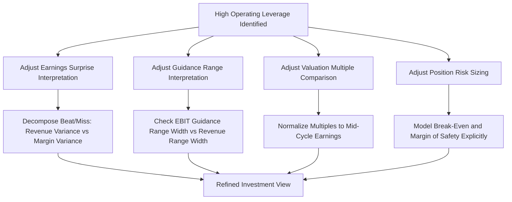

## Investor Interpretation of High Operating Leverage Companies

### Overview

High operating leverage fundamentally changes how investors should interpret a company's financial results, earnings guidance, and valuation multiples compared to a low-operating-leverage peer. Because a high-DOL company's earnings amplify both positive and negative revenue surprises, investors must adjust their analytical framework across earnings quality assessment, guidance interpretation, multiple comparison, and risk sizing — treating operating leverage as a structural lens that changes the meaning of otherwise-similar reported numbers.

### Reframing "Beat" and "Miss" for High-DOL Companies

**Key Points**

- A revenue beat of even a small magnitude can produce a disproportionately large EBIT/EPS beat for a high-DOL company — investors should expect and correctly interpret amplified earnings surprises as a structural feature, not necessarily as evidence of exceptional operational execution beyond the revenue outperformance itself.
- Conversely, a modest revenue miss can produce a much larger EBIT/EPS miss — market reactions (stock price declines) to high-DOL companies missing guidance are often disproportionately severe precisely because the earnings impact is genuinely disproportionate, not merely a sentiment overreaction.
- Sophisticated investors decompose a reported EPS beat/miss into the portion attributable to revenue variance versus the portion attributable to *margin* variance (cost control, pricing, mix) — for a high-DOL company, a substantial fraction of any given EPS surprise may be mechanically explained by the operating leverage effect on a given revenue surprise, rather than reflecting incremental efficiency gains.

### Interpreting Management Guidance

Investors evaluating guidance from a high-operating-leverage company should specifically examine:

- **Implied margin assumptions embedded in revenue guidance ranges:** if a company guides to a revenue range of, say, ±5%, the corresponding EBIT guidance range (if disclosed) should be meaningfully wider than ±5% for a high-DOL business — a guidance range where EBIT sensitivity appears understated relative to the revenue range may signal either unstated cost flexibility assumptions or an inconsistency worth questioning management about.
- **Fixed cost commitments disclosed in guidance:** management commentary on new fixed cost commitments (facility leases, headcount additions, capital expenditure plans) should be tracked carefully, since these directly raise the company's DOL and therefore its forward earnings sensitivity, independent of the revenue outlook itself.
- **Historical guidance accuracy calibration:** for a high-DOL company, a given percentage error in the underlying revenue forecast produces a larger percentage error in the EBIT forecast — investors should calibrate their expectations for guidance "precision" accordingly rather than judging a high-DOL company's guidance track record by the same absolute EBIT variance thresholds used for a low-DOL peer.

### Valuation Multiple Interpretation

| Consideration | Implication for High-DOL Companies |
| --- | --- |
| P/E and EV/EBITDA multiples across the cycle | Multiples for high-DOL, cyclical companies often appear to compress at cycle peaks (denominator earnings are elevated) and expand at cycle troughs (denominator earnings are depressed) — a naive multiple comparison across the cycle can be misleading unless normalized for the cycle position |
| Peak vs. trough earnings basis | Investors sometimes use "normalized" or "mid-cycle" earnings estimates rather than trailing or forward consensus earnings, specifically to avoid the distortion high operating leverage introduces into simple point-in-time multiples |
| Cross-company multiple comparison | Comparing a high-DOL company's multiple directly to a low-DOL peer's multiple, without adjusting for the different earnings volatility/risk profile, can produce a misleading conclusion about relative "cheapness" — the appropriate multiple should reflect the different risk premia embedded via beta and cost of equity (see prior topics) |

**Example**

A cyclical industrial company (high DOL) trades at 8x forward EBITDA at a cycle peak, while a stable consumer staples company (low DOL) trades at 14x. A naive comparison might suggest the industrial company is "cheaper." However, if the industrial company's EBITDA is itself elevated due to being at a cyclical peak with substantial operating leverage benefit currently in effect, the *sustainable, mid-cycle* multiple could be considerably higher than 8x once normalized — meaning the two multiples are not directly comparable without first adjusting for where each company sits in its earnings cycle relative to its cost structure. [Inference: the specific normalized multiple in any real case depends on company-specific mid-cycle earnings estimates that require detailed fundamental analysis and cannot be generically assumed.]

### Risk Sizing and Position Management Implications

- **Volatility expectations:** Investors holding high-DOL positions should expect and size positions for greater earnings-driven stock price volatility around each reporting period, independent of any view on the company's long-term fundamental quality.
- **Downside scenario planning:** Given the amplified downside in a demand contraction, investors evaluating a high-DOL company should specifically model (or demand disclosure supporting) the company's break-even volume and margin of safety (see stress testing topic), rather than relying solely on trailing profitability metrics that may not reflect proximity to a fragile threshold.
- **Correlation with macro cycle positioning:** Since operating leverage's beta-amplifying effect is strongest when the underlying demand driver is macro-correlated (see prior topic), investors often treat high-DOL, cyclical names as a more explicit "macro bet" requiring a view on the broader economic cycle, distinct from company-specific fundamental analysis alone.

### Diagram: Investor Analytical Adjustments for High-DOL Companies (svg_diagram)

### Sell-Side and Management Communication Patterns

- **Management framing:** Companies with genuinely high operating leverage often explicitly reference it in investor communications (e.g., "we expect significant margin expansion as volumes recover") — investors should treat such statements as a reasonable structural expectation warranting verification against the actual cost structure, rather than dismissing it as promotional language, while still confirming that the underlying volume/capacity assumptions are realistic.
- **Sell-side model construction:** Analyst models for high-DOL companies should explicitly build fixed/variable cost decomposition (as discussed in DCF and CVP modeling topics) rather than a simple constant-margin extrapolation, since a constant-margin sell-side model applied to a high-DOL company will systematically mis-forecast earnings in both directions relative to actual revenue outcomes.
- **Consensus estimate dispersion:** High-DOL companies often show wider dispersion in sell-side EPS estimates around earnings dates than low-DOL peers with comparable revenue estimate dispersion, precisely because analysts' differing margin/cost assumptions get amplified into more divergent EBIT and EPS estimates.

### Distinguishing Structural Operating Leverage from Temporary Cost Actions

Investors should be careful to distinguish genuine, structural operating leverage (a stable fixed/variable cost mix producing a predictable EBIT-to-revenue relationship) from temporary cost-cutting that mimics operating leverage's appearance in reported results:

| Pattern | Structural Operating Leverage | Temporary Cost Action Disguised as Leverage |
| --- | --- | --- |
| Driver of margin expansion | Fixed costs remaining constant as volume grows | One-time cost cuts, layoffs, or deferred spending independent of volume |
| Sustainability | Repeats predictably as volume continues to grow | Margin benefit does not recur once volume growth is no longer the driver |
| Reversal risk | Symmetric — margin compresses similarly if volume falls | Can reverse sharply if deferred costs (e.g., R&D, maintenance) must eventually be incurred |

This distinction connects directly to the earnings quality analysis discussed earlier in the curriculum (see "Cost Structure Signals in Earnings Quality Analysis") — investors should apply the same decomposition techniques (CM trend vs. EBIT trend, break-even migration) to determine which pattern is actually driving a given period's reported margin expansion before concluding that observed leverage is durable and repeatable.

### Common Investor Interpretation Errors

| Error | Consequence | Correction |
| --- | --- | --- |
| Treating a revenue-driven EPS beat as pure "execution" | Overestimates management skill and durability of the beat | Decompose the beat into revenue-driven (mechanical, DOL-explained) vs. margin-driven (genuine execution) components |
| Comparing multiples across companies with different DOL without cycle-normalizing earnings | Misjudges relative valuation cheapness/expensiveness | Normalize to mid-cycle or steady-state earnings before multiple comparison |
| Extrapolating peak-cycle margins into a perpetual growth/terminal value assumption | Overstates intrinsic value | Cross-check terminal margin assumptions against sustainable, capacity-constrained steady-state levels |
| Assuming disclosed operating leverage commentary applies without confirming underlying capacity assumptions | Accepts management framing uncritically | Verify capacity utilization assumptions independently rather than accepting guidance framing at face value |
| Sizing positions in high-DOL names using the same volatility assumptions as low-DOL peers | Under-hedges or over-concentrates risk | Explicitly account for amplified earnings volatility in position sizing and risk models |

**Related Topics**

- Cost structure signals in earnings quality analysis
- Operating leverage and earnings volatility effects on beta
- Stress testing profitability under volume declines
- Mid-cycle and normalized earnings estimation techniques
- Sell-side consensus estimate dispersion analysis
- Operating leverage assumptions in discounted cash flow models