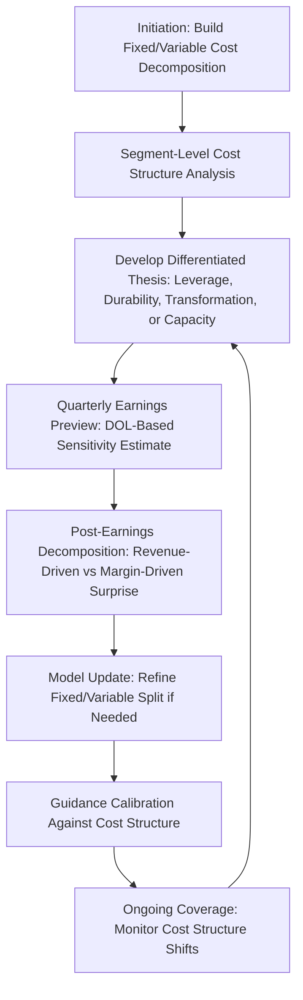

## Cost Structure Considerations in Equity Research

### Overview

Equity research analysts integrate cost structure analysis throughout the research process — from initial company modeling through thesis development, earnings previews, post-earnings updates, and ongoing coverage maintenance. Unlike a one-time academic CVP exercise, cost structure work in equity research is a continuous, iterative discipline embedded in model-building, differentiated thesis generation, and client communication. This topic consolidates how the cost structure concepts developed throughout this curriculum are operationalized in the day-to-day practice of professional equity research.

### Cost Structure in Initial Company Modeling

**Key Points**

- A rigorous equity research model builds the income statement bottom-up from a fixed/variable cost decomposition (as covered in CVP and DCF modeling topics) rather than a top-down constant-margin extrapolation, since the constant-margin approach systematically misprices the sensitivity of forecasts to volume assumptions.
- Initiation reports (the first formal research report on a newly-covered company) typically require the most extensive cost structure groundwork, since the analyst must establish a defensible fixed/variable split from limited historical disclosure, often supplementing public filings with management calls, industry comparables, and channel checks.
- Segment-level cost structure decomposition (where segment reporting is available) is preferable to consolidated-level decomposition, since a multi-segment company's consolidated cost structure is a blend that can obscure very different operating leverage profiles across its individual businesses.

### Building a Differentiated Thesis Around Cost Structure

Equity research theses often hinge on cost structure insights that are not fully appreciated by the consensus, since a variant cost structure view is one of the more durable sources of differentiated forecasting (as opposed to variant revenue growth views, which are more commonly and visibly debated).

**Common thesis archetypes built on cost structure analysis:**

| Thesis Type | Cost Structure Insight | Example Framing |
| --- | --- | --- |
| **Underappreciated operating leverage** | Consensus models understate margin expansion potential from a genuinely high-DOL structure as volume recovers | "Consensus is modeling flat margins into the recovery, but our bottom-up cost model shows [X]% of the cost base is fixed, implying materially higher EBIT flow-through" |
| **Overstated margin durability** | Consensus extrapolates recent margin expansion without recognizing it was driven by temporary cost actions, not structural leverage | "Recent margin gains reflect [specific one-time cost reduction], not structural operating leverage — we see mean reversion risk as volume-independent costs normalize" |
| **Cost structure transformation** | Company is actively shifting its fixed/variable mix (e.g., outsourcing, automation, or the reverse) | "Management's shift to a variable-cost manufacturing model via outsourcing should reduce the stock's earnings volatility and beta over time, warranting a re-rating" |
| **Capacity constraint inflection** | Consensus fails to anticipate an upcoming step-change in fixed costs as capacity limits are reached | "Our capacity utilization analysis suggests the company will need to add [$X]M in fixed costs by [year], which consensus estimates do not yet reflect" |

**Example**

An analyst initiating coverage on a specialty manufacturer identifies that the company's cost structure includes substantial fixed manufacturing overhead (multi-year plant depreciation, salaried production management) that consensus models — built on simple historical margin extrapolation — do not explicitly capture. The analyst's bottom-up CVP-based model shows that a forecasted 12% volume recovery should produce roughly 30%+ EBIT growth (via DOL amplification), materially above the ~15% EBIT growth implied by consensus's constant-margin approach — forming the quantitative basis for an above-consensus earnings estimate and a differentiated buy thesis.

### Earnings Preview and Post-Earnings Analysis Workflow

Cost structure analysis is embedded in the standard quarterly earnings cycle:

1. **Pre-earnings preview:** Using the cost-structure-explicit model, forecast the quarter's EBIT/EPS based on the analyst's specific revenue estimate, explicitly noting the implied DOL-driven sensitivity of the estimate to potential revenue surprises in either direction.
2. **Earnings reaction analysis (same day):** Upon results, decompose the reported EBIT/EPS beat or miss into the portion explained by revenue variance (mechanically flowing through the known cost structure) versus the portion explained by unexpected margin/cost variance — this decomposition is often the single most valuable piece of same-day analysis for clients, since it separates "the company beat because volume was better" from "the company beat because of genuine cost execution."
3. **Model update:** Revise the fixed/variable cost split assumptions if the quarter's results suggest the prior decomposition was inaccurate (e.g., if a revenue beat produced a smaller-than-DOL-implied EBIT beat, this may signal higher variable costs than previously modeled, or a one-time cost item).
4. **Guidance calibration:** Compare newly issued forward guidance's implied EBIT sensitivity to revenue against the analyst's own cost-structure-based DOL estimate (see prior topic on investor interpretation of guidance) to assess whether guidance appears conservative, aggressive, or consistent with the known cost structure.

### Diagram: Cost Structure Integration in the Equity Research Workflow (svg_diagram)

### Cost Structure in Comparable Company and Peer Analysis

Equity research comparable company tables should incorporate cost structure context rather than presenting margins and multiples in isolation:

- **Margin comparison with DOL context:** presenting a peer group's operating margins alongside their estimated DOL helps clients understand which companies' margins are more volume-sensitive versus more structurally stable — two companies with identical current margins can have very different margin trajectories under the same volume forecast.
- **Multiple comparison with cycle-normalization:** as discussed in investor interpretation, comparing raw current-period multiples across peers with different operating leverage profiles can be misleading without normalizing for cycle position (see prior topic).
- **Beta and cost of equity consistency:** peer betas used in cost of equity estimation for a comparable company table should be checked for consistency with each peer's own cost structure/operating leverage profile (see unlevered/levered beta topic), rather than applying a single blended peer beta without recognizing genuine business-risk differences within the peer set.

### Cost Structure Disclosure Gaps and Analyst Estimation Techniques

Public company disclosure of the fixed/variable cost split is rarely explicit, requiring equity researchers to estimate it through indirect methods:

| Estimation Technique | Approach | Limitation |
| --- | --- | --- |
| **Regression against historical revenue** | Regress total costs (or COGS/SG&A) against revenue across multiple historical periods; the regression intercept approximates fixed costs, the slope approximates variable cost rate | Assumes a stable cost structure over the regression period — a company undergoing operational transformation will produce a misleading regression result |
| **High-low method** | Compare costs at the highest and lowest historical volume periods to estimate fixed/variable components | Sensitive to outlier periods; less statistically robust than regression across many data points |
| **Management commentary and disclosure** | Direct statements on earnings calls, investor days, or 10-K MD&A sections regarding fixed vs. variable cost mix | Often qualitative rather than precisely quantified; disclosure detail varies significantly by company and industry |
| **Industry/peer benchmarking** | Apply a peer group's more transparently disclosed cost structure as a proxy where the subject company's own disclosure is insufficient | Assumes genuine comparability of operating models, which may not hold even within the same industry |
| **Segment reporting cross-reference** | Where segment-level fixed asset intensity, headcount, and margin data are disclosed, use these to refine consolidated-level estimates | Segment disclosure requirements vary by jurisdiction and are sometimes aggregated at a level too coarse for precise estimation |

[Inference: no single estimation technique is definitively superior across all situations — practitioners commonly triangulate across multiple methods and reconcile discrepancies using judgment informed by industry knowledge, since the true fixed/variable split is rarely observable with precision from public disclosure alone.]

### Communicating Cost Structure Analysis to Clients

Equity research reports translate technical cost structure analysis into client-usable insights through several standard presentation formats:

- **Bridge charts:** visually decomposing period-over-period EBIT change into volume, price/mix, variable cost, and fixed cost components — making the cost structure story visually explicit rather than buried in a model.
- **Sensitivity tables in report appendices:** presenting EBIT or EPS sensitivity to revenue growth assumptions (built via the Data Table techniques covered earlier) directly in published research, allowing clients to substitute their own revenue view and quickly derive an implied earnings estimate.
- **Explicit DOL disclosure in models:** many analysts include a labeled DOL calculation directly in their published model tabs, making the operating leverage assumption transparent and auditable by clients rather than embedded invisibly in a margin assumption.
- **Scenario tables:** presenting base/bull/bear cases with the underlying cost structure assumptions for each explicitly stated, rather than only showing the resulting EBIT/EPS outputs — allowing clients to assess whether they agree with the cost structure assumptions driving each scenario, independent of whether they agree with the revenue assumptions.

### Common Pitfalls in Equity Research Cost Structure Work

| Pitfall | Consequence | Mitigation |
| --- | --- | --- |
| Using a single company-wide margin assumption for a multi-segment business | Masks divergent operating leverage across segments, mispricing segment-level thesis opportunities | Build segment-level cost decomposition wherever disclosure permits |
| Failing to update the fixed/variable split after a structural business change (M&A, outsourcing, automation) | Model becomes stale and mispredicts post-change earnings sensitivity | Explicitly flag and re-estimate cost structure following any disclosed structural change |
| Treating consensus margin assumptions as a validated baseline without independent verification | Forfeits the differentiated-thesis value that independent cost structure analysis can provide | Build an independent bottom-up cost decomposition rather than anchoring to consensus margin assumptions |
| Ignoring capacity constraints in long-term margin extrapolation | Overstates sustainable margin expansion in long-range estimates and terminal value | Cross-check long-range margin trajectory against realistic capacity and market share ceilings |
| Presenting DOL or margin sensitivity without clearly stating the underlying assumptions | Reduces client ability to independently assess or challenge the analysis | Explicitly disclose the fixed/variable cost split and estimation method used |

### Validation and Auditing Practices

- **Back-testing the cost decomposition:** Apply the estimated fixed/variable split retroactively to several historical quarters and confirm it reasonably reproduces actual historical EBIT — a decomposition that fails this back-test needs re-estimation before being used prospectively.
- **Cross-checking DOL-implied guidance against actual results over time:** Track, quarter over quarter, whether the analyst's DOL-based EBIT sensitivity estimates have been predictively accurate relative to actual reported results, refining the cost structure model based on this ongoing track record.
- **Peer consistency review:** Periodically confirm that cost structure assumptions and resulting DOL estimates remain reasonably consistent (or that differences are well-justified) across companies covered within the same industry/sector by the analyst or research team.

**Related Topics**

- Estimating fixed vs. variable costs from financial statements (regression-based methods)
- Cost structure signals in earnings quality analysis
- Investor interpretation of high operating leverage companies
- Operating leverage assumptions in discounted cash flow models
- Segment reporting analysis and multi-segment cost decomposition
- Bridge chart construction for EBIT variance analysis