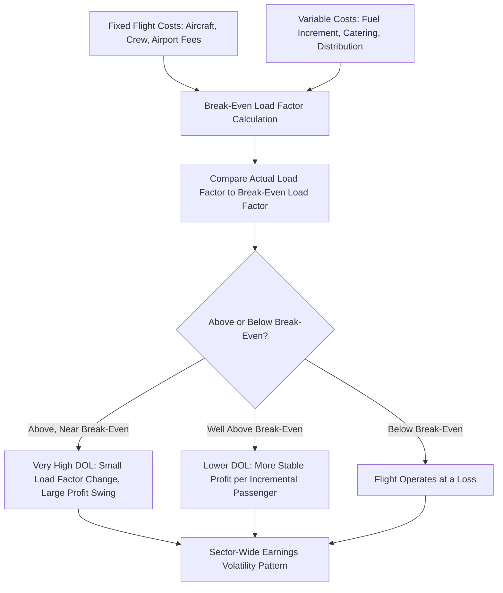

## Airline Industry Cost Structure Case Study

### Overview

The airline industry is one of the most frequently cited real-world illustrations of high operating leverage in financial analysis education, due to its distinctive combination of very high fixed costs (aircraft, crews, airport infrastructure, scheduled routes) and thin margins on a per-seat basis. This case study applies the full toolkit developed across this curriculum — CVP mechanics, DOL, break-even analysis, stress testing, and beta implications — to a stylized airline cost structure, illustrating how the concepts interact in a single, coherent real-world context.

### Airline Cost Structure Characteristics

**Key Points**

- A large majority of an airline's costs are fixed or "quasi-fixed" in the short-to-medium term once a flight schedule is committed: aircraft ownership/lease costs, pilot and crew salaries (largely fixed once scheduled), airport gate and landing fees (often contractually fixed), and maintenance programs.
- Truly variable costs on a per-passenger or per-flight basis are comparatively limited: fuel (variable with flight operation, though not strictly with passenger count), some catering and passenger service costs, and variable distribution/booking fees.
- This produces one of the classic textbook examples of a business where the marginal cost of an *additional passenger* on an already-scheduled flight is very low (essentially the weight-related fuel increment plus minor service costs), while the *flight itself* carries a large fixed cost regardless of how many seats are filled — making load factor (percentage of seats filled) one of the most critical volume metrics in the entire industry.

### Simplified Airline Cost Decomposition

| Cost Category | Approximate Nature | Illustrative % of Total Operating Costs |
| --- | --- | --- |
| Aircraft ownership/lease | Fixed | 12% |
| Crew salaries and benefits | Fixed (largely, once scheduled) | 22% |
| Fuel | Variable (with flight operations, weight) | 25% |
| Airport fees, landing, gate rental | Fixed (contractual) | 10% |
| Maintenance | Mostly fixed (scheduled), partly variable (usage-based) | 12% |
| Distribution, booking, credit card fees | Variable (with ticket sales) | 6% |
| Passenger service (catering, etc.) | Variable (with passenger count) | 5% |
| Corporate overhead, SG&A | Fixed | 8% |

[Inference: this decomposition is illustrative and stylized for pedagogical purposes rather than sourced from any specific airline's actual reported cost breakdown — actual proportions vary by airline business model (full-service vs. low-cost carrier), fleet age, route network, and fuel hedging position, and should be verified against a specific company's own disclosures for real analytical use.]

### Applying the CVP Framework: Load Factor as the Volume Variable

Airlines typically frame CVP analysis around **load factor** (% of seats filled) rather than raw passenger count, since capacity (available seat miles) is largely fixed once the flight schedule is set — the relevant "volume" decision is how many of the already-committed seats get filled, not how much total capacity to offer in the short run.

$$Break\text{-}Even\ Load\ Factor = \frac{Fixed\ Costs\ per\ Flight}{Contribution\ Margin\ per\ Seat \times Total\ Seats}$$

**Illustrative example (single flight):**

| Input | Value |
| --- | --- |
| Total Seats | 180 |
| Average Fare | $220 |
| Variable Cost per Passenger | $45 |
| Contribution Margin per Passenger | $175 |
| Total Fixed Cost of Flight (crew, aircraft, fuel base, fees) | $22,000 |

$$Break\text{-}Even\ Passengers = \frac{22{,}000}{175} = 125.7 \approx 126\ passengers$$

$$Break\text{-}Even\ Load\ Factor = \frac{126}{180} = 70.0\%$$

This is directly comparable to the real-world metric airlines report publicly: many carriers disclose their **breakeven load factor** as a standard operating statistic, and it is a very direct, industry-native application of the same break-even formula developed generically earlier in this curriculum.

### DOL in the Airline Context

Given the heavy fixed-cost weighting, airlines characteristically exhibit high DOL, particularly near their break-even load factor:

$$DOL = \frac{Contribution\ Margin}{EBIT}$$

**Using the flight-level example above, extended to a load factor of 75% (135 passengers):**

$$Total\ CM = 135 \times 175 = \$23{,}625$$

$$EBIT = 23{,}625 - 22{,}000 = \$1{,}625$$

$$DOL = 23{,}625 / 1{,}625 = 14.5$$

At a load factor only modestly above break-even, DOL is extremely high — meaning a small percentage change in load factor produces a dramatically amplified percentage change in flight-level profit. This numerically illustrates why airline earnings are historically so volatile relative to revenue changes, and why small swings in demand (recession, fuel price spikes affecting ticket demand, geopolitical disruptions) have historically produced outsized effects on airline sector profitability.

### Diagram: Airline CVP and Load Factor Sensitivity (svg_diagram)

### Stress Testing Application: Demand Shock Scenario

Applying the stress-testing framework from earlier in the curriculum to this stylized flight economics example, modeling a demand shock (e.g., a recession or a geopolitical event reducing travel demand):

| Load Factor | Passengers | Total CM | EBIT | Status |
| --- | --- | --- | --- | --- |
| 85% (strong demand) | 153 | $26,775 | $4,775 | Healthy |
| 75% (base case) | 135 | $23,625 | $1,625 | Modest profit |
| 70% (break-even) | 126 | $22,050 | $50 | Near break-even |
| 60% (demand shock) | 108 | $18,900 | ($3,100) | Loss |
| 50% (severe shock) | 90 | $15,750 | ($6,250) | Significant loss |

This stress ladder shows that a demand shock reducing load factor from a healthy 85% to a stressed 50% (a roughly 41% relative decline in load factor) swings the flight from a solid profit to a substantial loss — directly demonstrating the operating leverage amplification mechanic in a real, industry-specific unit-economics context rather than an abstract numerical example.

### Historical Real-World Context: Illustrative Industry Behavior

Historically, the airline industry has frequently been cited by financial analysts and researchers as an example of a capital-intensive, high-fixed-cost industry that has experienced significant profitability volatility across economic and fuel-price cycles, including periods of sector-wide losses during demand shocks (such as post-9/11, the 2008 financial crisis, and the COVID-19 pandemic) followed by periods of strong profitability during high-demand, high-load-factor conditions. [Unverified: specific historical financial figures for individual airlines or the industry aggregate should be verified against current data if precise figures are needed for a specific analysis, since this case study is intended to illustrate the general cost-structure mechanic rather than serve as a source of current or historical airline financial statistics.]

### Beta and Cost of Equity Implications for Airlines

Connecting to the beta topics covered earlier: airline demand is generally considered meaningfully correlated with macroeconomic conditions (business and leisure travel both tend to contract during economic downturns), which is the necessary co-factor (alongside high fixed costs) for operating leverage to translate into elevated systematic risk (beta). This combination — high DOL plus macro-correlated demand — is a commonly cited textbook explanation for why airlines have historically often exhibited higher equity betas and higher costs of equity relative to more demand-stable industries, consistent with the conceptual chain (cost structure → DOL → EBIT volatility → business risk → beta) developed in this chapter. Airlines also frequently carry meaningful debt/lease-related financial leverage (aircraft financing), which — per the levered/unlevered beta framework — would further amplify equity beta beyond the operating leverage effect alone.

### Applying Equity Research Framing to the Airline Case

An equity analyst covering an airline would typically:

1. **Build a fleet/capacity-based cost model** rather than a simple revenue-times-margin model, given the fixed-cost-per-flight/per-aircraft nature of the cost base.
2. **Track load factor and break-even load factor trends** as leading indicators of margin trajectory, since load factor is often disclosed monthly (traffic statistics) well ahead of quarterly financial results.
3. **Monitor fuel price movements separately from load factor**, since fuel is one of the largest variable cost components and can independently shift the break-even load factor even absent any change in demand.
4. **Decompose quarterly EBIT surprises** into load factor variance, fare/yield variance, and fuel cost variance — a direct industry-specific application of the revenue-driven vs. margin-driven decomposition discussed in the investor interpretation and equity research topics.
5. **Stress test balance sheet resilience** against a severe demand shock scenario, given the historical precedent for sector-wide demand collapses, often incorporating liquidity runway (cash relative to monthly fixed cash burn in a shutdown scenario) as a critical metric distinct from pure accounting break-even.

### Key Takeaways from the Case Study

- The airline industry demonstrates, in a single real-world context, nearly every concept developed in this chapter: fixed/variable cost decomposition, break-even analysis (via load factor), DOL, stress testing, and the beta/cost-of-equity connection.
- Load factor serves as the industry-specific "volume" variable around which CVP mechanics are naturally framed, illustrating how the generic CVP framework adapts to industry-specific operating metrics.
- The extremely high DOL near break-even load factor explains both the industry's historically observed profit volatility and its commonly cited elevated cost of capital relative to less cyclical, less fixed-cost-intensive industries.

**Related Topics**

- Break-even analysis and margin of safety
- Stress testing profitability under volume declines
- Operating leverage and earnings volatility effects on beta
- Industry-specific applications of CVP analysis (hospitality, manufacturing, SaaS)
- Fleet and capacity-based financial modeling
- Liquidity stress testing and cash burn analysis in cyclical industries