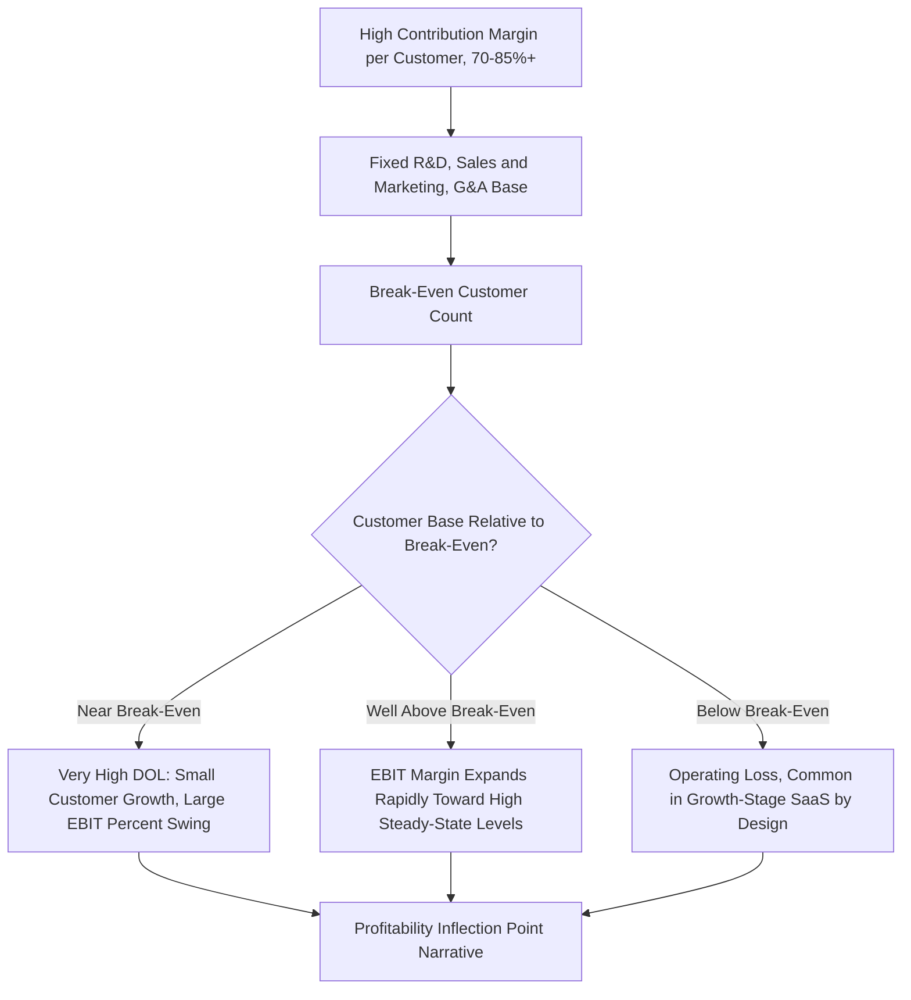

## Software Company Operating Leverage Case Study

### Overview

Software companies — particularly SaaS (Software-as-a-Service) businesses — present a distinctive and instructive operating leverage profile: extremely high gross margins combined with a cost base that is dominated by largely fixed, headcount-driven expenses (R&D, sales & marketing, G&A) rather than traditional per-unit variable costs. This creates a cost structure fundamentally different from manufacturing or airline examples, yet one that exhibits its own powerful, and in some ways more extreme, operating leverage dynamics. This case study applies the CVP and DOL framework to a stylized SaaS cost structure, highlighting both the parallels to and key differences from the physical-asset-heavy examples covered elsewhere in this curriculum.

### The Distinctive SaaS Cost Structure

**Key Points**

- The **marginal cost of serving one additional customer** in a mature SaaS business is often very low — largely limited to incremental cloud hosting/infrastructure costs and modest customer support costs — producing gross margins frequently in the 70-85%+ range, among the highest of any major industry category.
- Unlike a manufacturer, where "variable cost" primarily means materials and direct labor, SaaS variable costs are dominated by **cloud infrastructure/hosting costs** that scale with usage (compute, storage, bandwidth) and **payment processing fees**.
- The largest cost categories — R&D (engineering headcount), Sales & Marketing (sales headcount, marketing programs), and G&A — behave more like **step-fixed costs**: they don't scale smoothly with each incremental customer, but they do require periodic step-changes (hiring additional engineers, sales reps) to support continued growth beyond a given capacity, making them "fixed" only within a given operating range rather than fixed indefinitely.

### Simplified SaaS Cost Decomposition

| Cost Category | Nature | Illustrative % of Revenue (Growth-Stage SaaS) |
| --- | --- | --- |
| Cloud hosting/infrastructure (COGS) | Variable (scales with usage) | 12% |
| Payment processing fees | Variable (scales with revenue) | 2% |
| Customer support (COGS) | Semi-variable (some scaling with customer count) | 6% |
| R&D / Engineering | Fixed (step-fixed with headcount) | 25% |
| Sales & Marketing | Fixed (step-fixed with headcount, though marketing spend has some discretionary variability) | 35% |
| G&A | Fixed | 10% |

[Inference: this decomposition is a stylized, illustrative structure representative of a growth-stage SaaS company rather than data from any specific real company — actual proportions vary enormously by SaaS sub-sector, company maturity/growth stage, and go-to-market model (e.g., product-led growth vs. enterprise sales-led), and should not be treated as a benchmark for any specific company's actual cost structure.]

### CVP Mechanics Adapted to SaaS: Contribution Margin per Customer/Subscription

Rather than a per-unit manufactured good, the SaaS "unit" is typically framed as a customer subscription (or, for usage-based pricing models, a unit of consumption). The core CVP relationship still holds, adapted to this framing:

$$Contribution\ Margin\ per\ Customer = Average\ Revenue\ per\ Customer - Variable\ Cost\ per\ Customer\ (Hosting + Support + Payment\ Processing)$$

**Illustrative example:**

| Input | Value |
| --- | --- |
| Average Annual Revenue per Customer (ARPC) | $12,000 |
| Variable Cost per Customer (hosting, support, processing) | $2,400 |
| Contribution Margin per Customer | $9,600 |
| Contribution Margin % | 80% |
| Total Fixed Costs (R&D, S&M, G&A) | $18,000,000 |

$$Break\text{-}Even\ Customers = \frac{18{,}000{,}000}{9{,}600} = 1{,}875\ customers$$

### The Distinctive DOL Trajectory of a Scaling SaaS Business

A key pedagogical point for this case study is how dramatically DOL evolves across a SaaS company's growth trajectory, more so than in many other industries, precisely because the very high contribution margin percentage means EBIT is extremely small (or negative) relative to contribution margin at low customer counts, then scales dramatically as the fixed cost base is spread over a rapidly growing customer base.

**DOL at different growth stages (same unit economics, growing customer base):**

| Customers | Total CM | Fixed Costs | EBIT | EBIT Margin | DOL |
| --- | --- | --- | --- | --- | --- |
| 2,000 | $19,200,000 | $18,000,000 | $1,200,000 | 8.3% (of revenue) | 16.0 |
| 3,000 | $28,800,000 | $18,000,000 | $10,800,000 | 30.0% | 2.67 |
| 4,000 | $38,400,000 | $18,000,000 | $20,400,000 | 42.5% | 1.88 |
| 5,000 | $48,000,000 | $18,000,000 | $30,000,000 | 50.0% | 1.60 |

This table illustrates a pattern extremely characteristic of SaaS: near break-even, DOL is very high (small changes in customer count produce enormous percentage EBIT swings), but the extremely high contribution margin percentage means the business can scale to very substantial EBIT margins relatively quickly once meaningfully past break-even — a trajectory that is central to the classic "SaaS profitability inflection" narrative frequently discussed in growth-stage technology investing.

### Diagram: SaaS Operating Leverage Trajectory (svg_diagram)

### The "Growth vs. Profitability" Tradeoff as a Cost Structure Decision

A distinctive feature of SaaS cost structure analysis is that the fixed cost base itself is often a **deliberate, discretionary management choice** rather than a purely operational necessity — unlike an airline's aircraft fleet or a manufacturer's factory, which are less flexible in the short run. Management can choose to:

- **Increase fixed costs (hire more S&M/R&D headcount) to accelerate growth**, deliberately suppressing near-term EBIT margin (or maintaining a loss) in pursuit of a larger future customer base and eventual DOL-driven profitability at scale.
- **Hold fixed costs constant (or reduce them) to demonstrate near-term profitability**, at the cost of slower customer/revenue growth.

This makes SaaS cost structure analysis inherently intertwined with capital allocation strategy analysis: an equity analyst evaluating a SaaS company must assess not just the current DOL, but management's implicit or explicit *choice* about where on the growth-investment spectrum they are currently operating, and whether the embedded fixed cost growth (hiring plans) is justified by the resulting customer acquisition and retention economics. [Inference: assessing whether a specific company's fixed-cost growth investment is "justified" requires unit economics analysis such as customer acquisition cost (CAC) payback periods and net revenue retention, which are related but distinct metrics from the pure CVP/DOL framework covered in this chapter.]

### Applying Scenario and Stress Testing to a SaaS Context

**Downside scenario consideration — customer churn shock:**

Unlike a one-time unit sale, SaaS revenue is subscription-based and recurring, meaning a "volume decline" in this context typically manifests as elevated customer churn (subscription cancellations) or reduced net revenue retention (existing customers downgrading), rather than a single-period sales volume miss.

| Scenario | Customers | Total CM | Fixed Costs | EBIT | Status |
| --- | --- | --- | --- | --- | --- |
| Base Case | 4,000 | $38,400,000 | $18,000,000 | $20,400,000 | Healthy |
| Elevated Churn (-15% customers) | 3,400 | $32,640,000 | $18,000,000 | $14,640,000 | Compressed, still profitable |
| Severe Churn Shock (-30% customers) | 2,800 | $26,880,000 | $18,000,000 | $8,880,000 | Materially reduced |
| Extreme Shock (-50% customers) | 2,000 | $19,200,000 | $18,000,000 | $1,200,000 | Near break-even |

Because break-even in this example (1,875 customers) is well below the base case (4,000 customers), this particular company shows a relatively favorable margin of safety (over 50%) against customer attrition — a materially different resilience profile than the airline case study's much tighter break-even proximity, illustrating how the same DOL/break-even framework can produce very different risk conclusions depending on how far the actual operating point sits above the break-even threshold, independent of the industry.

### Investor and Equity Research Considerations Specific to SaaS

- **Rule of 40 and similar heuristics:** SaaS investors frequently use combined growth-rate-plus-margin heuristics (e.g., "Rule of 40": revenue growth % + profit margin % should exceed 40%) partly because these metrics implicitly capture the growth-vs.-profitability tradeoff inherent in the discretionary fixed cost structure discussed above — a company investing heavily in fixed cost growth (low current margin) can still be viewed favorably if growth is sufficiently high, and vice versa.
- **Deferred and unearned revenue considerations:** SaaS subscription billing patterns (annual upfront billing vs. monthly) can create timing differences between cash collection and revenue recognition, which is a distinct topic from cost structure but frequently analyzed alongside it in SaaS-specific equity research, since it affects cash-based break-even timing versus accrual-based break-even timing.
- **Net revenue retention as a volume proxy:** Rather than tracking "load factor" (as in the airline case) or "units sold" (as in a manufacturing case), SaaS analysts often track net revenue retention (NRR) and gross churn as the primary volume-related metrics feeding into the CVP framework, since they capture both customer count changes and expansion/contraction within existing accounts.

### Comparison to the Airline Case Study

| Dimension | Airlines | SaaS |
| --- | --- | --- |
| Contribution margin % | Moderate (fuel and other variable costs are meaningful) | Very high (70-85%+) |
| Nature of "fixed" costs | Largely operationally fixed (aircraft, crew, infrastructure) — less discretionary in the short run | Largely discretionary/strategic (headcount hiring decisions) — more flexible, at least directionally, than physical capital commitments |
| Typical proximity to break-even | Often operates close to break-even load factor, especially historically | Varies enormously — early-stage SaaS often operates well below break-even by design; mature SaaS often operates well above it |
| Primary volume metric | Load factor | Customer count / net revenue retention |
| DOL interpretation nuance | High DOL reflects operational cost rigidity | High DOL near break-even often reflects a deliberate strategic choice to prioritize growth investment over near-term profitability |

This comparison reinforces a key overarching lesson from this chapter: the *mechanics* of CVP and DOL are universal, but the *interpretation* of a given DOL or break-even proximity finding depends heavily on the specific industry context — including whether the fixed cost base is operationally rigid or a discretionary strategic choice, and whether the company's position relative to break-even reflects distress or a deliberate growth-stage strategy.

**Related Topics**

- Airline industry cost structure case study
- SaaS unit economics: CAC, LTV, and payback period analysis
- Rule of 40 and growth-adjusted profitability metrics
- Net revenue retention and churn analysis
- Deferred revenue and subscription billing cash flow timing
- Operating leverage assumptions in discounted cash flow models