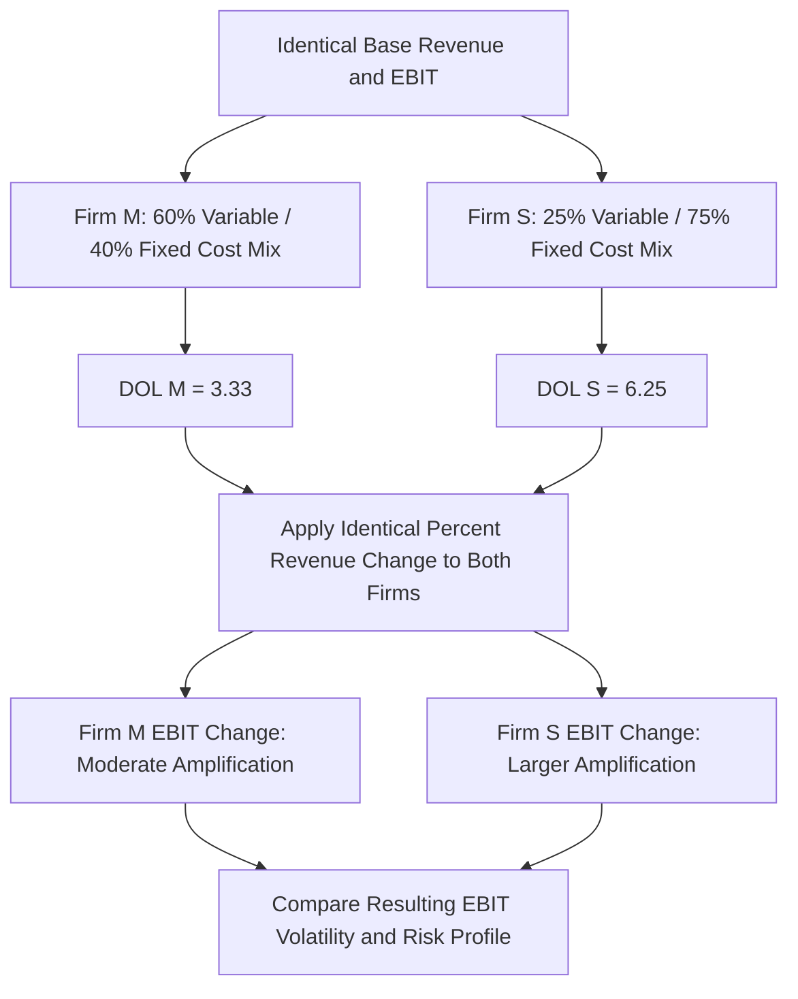

## Manufacturing versus Service Industry Comparative Case Study

### Overview

This case study directly compares two archetypal cost structures — a capital-intensive manufacturer and a labor-based professional service firm — operating at similar revenue scale, to isolate exactly how differing fixed/variable cost mixes produce divergent earnings behavior under identical demand scenarios. Where the airline and SaaS case studies each explored a single distinctive industry in depth, this comparative study places two contrasting archetypes side by side, making the structural differences and their consequences directly visible through matched analysis.

### Setting Up the Comparative Baseline

Both companies are constructed to have identical base-case revenue and EBIT, isolating cost *structure* (not profitability level) as the sole variable of interest.

| Metric | Manufacturer (Firm M) | Service Firm (Firm S) |
| --- | --- | --- |
| Revenue | $50,000,000 | $50,000,000 |
| Variable Costs | $30,000,000 (60% of revenue) | $12,500,000 (25% of revenue) |
| Contribution Margin | $20,000,000 (40%) | $37,500,000 (75%) |
| Fixed Costs | $14,000,000 | $31,500,000 |
| EBIT | $6,000,000 | $6,000,000 |
| EBIT Margin | 12.0% | 12.0% |

**Key Points**

- Both firms generate identical revenue and identical EBIT at the base case — a naive comparison of profitability alone would suggest these are equivalent businesses from a risk standpoint.
- The cost *composition* is dramatically different: Firm M's costs are majority variable (materials, direct labor tied to units produced), while Firm S's costs are majority fixed (senior staff salaries, office leases, licensing/compliance overhead that doesn't scale directly with billable engagements).
- This setup deliberately isolates cost structure as the variable of interest — any difference in the two firms' behavior under a demand shock can be attributed specifically to the fixed/variable mix, not to differing baseline profitability.

### Comparative DOL Calculation

$$DOL_M = \frac{20{,}000{,}000}{6{,}000{,}000} = 3.33$$

$$DOL_S = \frac{37{,}500{,}000}{6{,}000{,}000} = 6.25$$

Despite identical current profitability, Firm S (the service firm) exhibits **nearly double the operating leverage** of Firm M (the manufacturer) — a result that may be counterintuitive to those who associate "manufacturing" reflexively with high fixed costs (factories, equipment) and "services" with more flexible, people-based cost structures. This case study specifically illustrates that the *manufacturing vs. service* label is not, by itself, a reliable proxy for operating leverage — the actual fixed/variable split within each specific business determines DOL, and professional service firms with high fixed senior-staff and infrastructure costs relative to their variable costs can exhibit higher operating leverage than a manufacturer with substantial per-unit material and labor costs.

### Diagram: Comparative Cost Structure Mechanics (svg_diagram)

### Applying an Identical Demand Shock to Both Firms

To make the DOL difference concrete, the same ±15% revenue shock is applied to both firms, with variable costs scaling proportionally and fixed costs held constant (the standard CVP assumption).

**Upside scenario: +15% revenue**

| Metric | Firm M | Firm S |
| --- | --- | --- |
| New Revenue | $57,500,000 | $57,500,000 |
| New Variable Costs (same %) | $34,500,000 | $14,375,000 |
| New Contribution Margin | $23,000,000 | $43,125,000 |
| New EBIT | $9,000,000 | $11,625,000 |
| % Change in EBIT | +50.0% | +93.75% |

**Downside scenario: -15% revenue**

| Metric | Firm M | Firm S |
| --- | --- | --- |
| New Revenue | $42,500,000 | $42,500,000 |
| New Variable Costs (same %) | $25,500,000 | $10,625,000 |
| New Contribution Margin | $17,000,000 | $31,875,000 |
| New EBIT | $3,000,000 | $375,000 |
| % Change in EBIT | -50.0% | -93.75% |

**Cross-check using the DOL shortcut:** $\%\Delta EBIT = DOL \times \%\Delta Revenue$. For Firm M: $3.33 \times 15\% = 50.0\%$ ✓. For Firm S: $6.25 \times 15\% = 93.75\%$ ✓ — both ground-up recalculations reconcile exactly with the DOL-based approximation, confirming the linear CVP relationship holds precisely at this shock magnitude.

**Key Points**

- The identical 15% revenue shock (in either direction) produces roughly double the EBIT percentage swing for Firm S versus Firm M — a direct, quantified illustration of what "operating leverage" means in practice, using two firms that looked identical on a simple profitability basis.
- In the downside scenario, Firm S's EBIT falls to a razor-thin $375,000 (0.9% margin) — dangerously close to break-even — while Firm M retains a still-meaningful $3,000,000 (7.1% margin), despite both firms starting from the identical 12.0% base-case margin.
- This demonstrates why profitability level alone (EBIT margin) is an insufficient risk metric — two firms with identical current margins can have vastly different resilience to a demand shock, a distinction only revealed by examining the underlying cost structure.

### Break-Even and Margin of Safety Comparison

$$Break\text{-}Even\ Revenue_M = \frac{Fixed\ Costs}{CM\%} = \frac{14{,}000{,}000}{0.40} = \$35{,}000{,}000$$

$$Break\text{-}Even\ Revenue_S = \frac{31{,}500{,}000}{0.75} = \$42{,}000{,}000$$

$$Margin\ of\ Safety_M = \frac{50{,}000{,}000 - 35{,}000{,}000}{50{,}000{,}000} = 30.0\%$$

$$Margin\ of\ Safety_S = \frac{50{,}000{,}000 - 42{,}000{,}000}{50{,}000{,}000} = 16.0\%$$

Firm S's margin of safety (16.0%) is roughly half of Firm M's (30.0%) — meaning Firm S can tolerate a materially smaller revenue decline before crossing into an operating loss, directly consistent with (and mathematically connected to) its higher DOL. This margin-of-safety comparison provides a second, complementary lens on the same underlying risk difference, reinforcing the stress-testing framework covered earlier in the curriculum.

### Stress Ladder Comparison

| Revenue Decline | Firm M EBIT | Firm S EBIT |
| --- | --- | --- |
| 0% (Base) | $6,000,000 | $6,000,000 |
| -10% | $4,000,000 | $2,250,000 |
| -16% (Firm S Break-Even) | $2,880,000 | $0 |
| -20% | $2,000,000 | ($1,500,000) |
| -30% (Firm M Break-Even) | $0 | ($7,875,000) |
| -40% | ($2,000,000) | ($14,250,000) |

This side-by-side ladder makes visible that Firm S crosses into a loss at a materially smaller revenue decline (-16%) than Firm M (-30%), and that once both firms are in loss territory, Firm S's losses deepen far more steeply per additional percentage point of revenue decline — a direct visual and numerical consequence of its higher DOL.

### Investor and Valuation Implications of the Comparison

Connecting to the beta and valuation topics covered earlier in this chapter:

- If both firms face similarly macro-correlated demand (a reasonable assumption if both serve similarly cyclical end markets), Firm S's higher DOL would be expected to translate into a higher asset beta and correspondingly higher cost of equity than Firm M, despite their identical current-period profitability.
- A DCF valuation of the two firms, using identical revenue growth assumptions but each firm's own actual cost structure, would show Firm S's cash flows amplifying more strongly in an upside growth scenario — but also require a higher discount rate (reflecting the beta effect) and show materially more fragile downside cash flows in a contraction scenario.
- An equity analyst comparing these two companies on a simple trailing P/E or EV/EBITDA basis, without adjusting for this structural difference, would be implicitly treating their earnings streams as equally risky and durable — a comparison this case study demonstrates is not well-founded absent explicit cost structure analysis.

### Practical Lessons from the Comparison

1. **Industry labels are unreliable proxies for operating leverage.** "Manufacturing" and "services" are not inherently high- or low-DOL categories — the actual fixed/variable decomposition of each specific company's cost base is what determines its operating leverage, and this case study deliberately demonstrates a counterintuitive result (the service firm has higher DOL) to reinforce this point.
2. **Identical current profitability does not imply identical risk.** Two companies with the same EBIT margin can have very different earnings sensitivity to demand changes — margin level and margin *volatility* (as driven by cost structure) are distinct dimensions that must both be analyzed.
3. **Margin of safety and DOL are complementary, mathematically linked metrics** that both flow from the same underlying fixed/variable cost decomposition — a rigorous cost structure analysis should compute both, since each highlights a slightly different aspect of the same underlying risk (DOL emphasizes earnings sensitivity; margin of safety emphasizes distance from the loss threshold).
4. **The appropriate analytical response is the same regardless of industry label**: decompose costs into fixed and variable components, compute DOL and break-even/margin of safety, and use these — not the industry classification alone — to assess earnings risk and inform valuation, guidance interpretation, and stress testing.

### Common Errors When Comparing Firms Across Industry Labels

| Error | Consequence | Correction |
| --- | --- | --- |
| Assuming manufacturing firms are always higher-DOL than service firms | Misjudges relative risk between specific companies | Always compute DOL from each company's actual cost decomposition, not industry stereotype |
| Comparing valuation multiples across firms with different DOL without adjusting for risk | Misprices relative "cheapness" | Incorporate beta/cost-of-equity differences (or normalize margins) before comparing multiples |
| Treating identical EBIT margins as evidence of identical earnings quality/risk | Overlooks materially different downside resilience | Compute and compare margin of safety and DOL alongside margin level |
| Applying a single generic "downside case" percentage decline uniformly across companies with different cost structures | Understates the differential severity of the downside for the higher-DOL firm | Run each company's own stress ladder using its own specific cost structure |

**Related Topics**

- Airline industry cost structure case study
- Software company operating leverage case study
- Stress testing profitability under volume declines
- Operating leverage and earnings volatility effects on beta
- Margin of safety and break-even analysis
- Estimating fixed vs. variable costs from financial statements