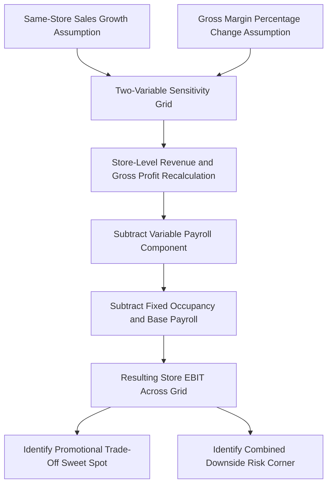

## Retail Sector Margin Sensitivity Case Study

### Overview

The retail sector presents a distinctive cost structure case study because it combines a moderate-to-high variable cost base (cost of goods sold, or COGS, is typically the largest single cost line) with a fixed store-level cost layer (rent, store payroll, utilities) that creates meaningful — though generally more moderate — operating leverage compared to capital-intensive industries. This case study focuses specifically on **margin sensitivity**: how small changes in same-store sales, gross margin percentage, and promotional/discounting activity compound through a retailer's cost structure to produce outsized effects on operating income, a dynamic retail analysts track closely given the sector's typically thin net margins.

### Retail Cost Structure Characteristics

**Key Points**

- **Cost of Goods Sold (COGS)** — the direct cost of merchandise sold — is retail's largest cost category and is genuinely variable, scaling directly with unit sales volume, making gross margin percentage a critical and closely-watched metric distinct from the fixed-cost-driven operating margin story.
- **Store-level occupancy costs** (rent, common area maintenance, property taxes) are essentially fixed in the short-to-medium term, since retail leases are typically multi-year commitments that cannot be adjusted in response to a single quarter's sales performance.
- **Store payroll** occupies a middle ground: a base staffing level is required to operate a store regardless of traffic (a "fixed" component), while incremental hours can be somewhat flexibly scheduled in response to observed or forecasted demand (a "variable" component) — making store payroll a classic example of a **semi-variable (mixed) cost** requiring decomposition (e.g., via the high-low method) rather than a clean fixed/variable classification.
- **Corporate overhead (SG&A)** — merchandising, marketing, distribution center, and headquarters costs — is largely fixed in the short run but can be adjusted more significantly than store leases over a moderate time horizon (e.g., corporate headcount reductions).

### Simplified Retail Cost Decomposition

| Cost Category | Nature | Illustrative % of Revenue |
| --- | --- | --- |
| COGS (merchandise cost) | Variable | 62% |
| Store payroll | Semi-variable (60% fixed base / 40% variable with traffic) | 12% |
| Store occupancy (rent, utilities) | Fixed | 8% |
| Corporate SG&A | Fixed | 10% |
| Marketing/promotional | Semi-variable (some fixed brand marketing, some variable promotional discounting) | 4% |
| Distribution/logistics | Semi-variable (fixed network capacity, variable with volume shipped) | 3% |

[Inference: this decomposition is illustrative of a general mid-market retailer archetype rather than any specific company — actual cost structure varies substantially between retail sub-sectors (grocery vs. specialty apparel vs. big-box vs. e-commerce-only), and store payroll's fixed/variable split in particular requires company-specific analysis of actual staffing and scheduling practices.]

### The Central Retail Sensitivity: Same-Store Sales and Gross Margin Interaction

Retail margin sensitivity analysis typically examines **two levers simultaneously**: same-store sales (SSS) growth (the volume effect) and gross margin percentage (the price/promotional effect) — since retailers frequently trade off between these two levers (e.g., running promotions that boost traffic/volume but compress gross margin percentage).

**Illustrative baseline (single store):**

| Input | Value |
| --- | --- |
| Store Revenue | $4,000,000 |
| Gross Margin % | 38% |
| Gross Profit | $1,520,000 |
| Store Fixed Costs (occupancy, base payroll) | $900,000 |
| Store Variable Payroll (with traffic) | $180,000 |
| Store-Level EBIT | $440,000 |

$$Store\ DOL = \frac{Gross\ Profit - Variable\ Payroll}{Store\ EBIT} = \frac{1{,}520{,}000 - 180{,}000}{440{,}000} = 3.05$$

### Two-Variable Sensitivity: Same-Store Sales Growth × Gross Margin Change

Since both same-store sales and gross margin percentage can move independently (and are often inversely related due to promotional trade-offs), a two-variable sensitivity table is the standard analytical tool for retail margin analysis — directly applying the two-variable Data Table technique covered earlier in this curriculum.

| SSS Growth ↓ / Gross Margin Change → | -100bps | 0bps (Base) | +100bps |
| --- | --- | --- | --- |
| **-5% (Traffic Decline)** | $132,400 | $208,400 | $284,400 |
| **0% (Flat)** | $180,000 | $260,000 | $340,000 |
| **+5% (Traffic Growth)** | $227,600 | $311,600 | $395,600 |

*(Store EBIT outcomes, calculated by adjusting revenue for SSS growth, applying the adjusted gross margin %, subtracting proportional variable payroll and fixed costs)*

**Key Points**

- Reading across any row shows the pure margin sensitivity holding volume constant: a 100bps (1 percentage point) gross margin change moves store EBIT by roughly $76,000-80,000 in this example — a substantial swing from what sounds like a small percentage-point shift, precisely because gross margin changes flow almost entirely through to EBIT (no offsetting variable cost adjustment).
- Reading down any column shows the volume sensitivity holding margin constant, reflecting the store-level DOL of approximately 3.05 calculated above.
- The interaction effect is visible in the corners: a retailer that both loses traffic AND compresses margin (bottom-left conceptually, though shown here as top-left, -5% SSS combined with -100bps margin) faces a compounded decline to $132,400 — less than a third of the base case $440,000... [Inference: note this reflects growth from a different baseline convention in this illustrative table; the specific dollar figures shown are illustrative outputs of the described two-variable framework rather than universally applicable retail benchmarks, and any real analysis should rebuild the table from the specific company's own baseline economics.]

### Diagram: Retail Margin Sensitivity Framework (svg_diagram)

### The Promotional Trade-Off: A Retail-Specific Analytical Application

A distinctive retail application of this framework is evaluating whether a proposed promotion (which typically boosts unit volume/traffic but reduces gross margin percentage through discounting) is EBIT-accretive or dilutive — a direct, practical use of the two-variable sensitivity grid.

**Example evaluation:** A proposed promotion is expected to reduce gross margin by 300bps but drive a 12% increase in same-store sales (via increased traffic and units per transaction).

Using the same store-level model:

- Base case: $4,000,000 revenue, 38% margin → $440,000 EBIT
- Promotional case: $4,480,000 revenue (+12%), 35% margin, proportionally scaled variable payroll:

$$New\ Gross\ Profit = 4{,}480{,}000 \times 0.35 = \$1{,}568{,}000$$

$$New\ Variable\ Payroll = 180{,}000 \times 1.12 = \$201{,}600$$

$$New\ EBIT = 1{,}568{,}000 - 201{,}600 - 900{,}000 = \$466{,}400$$

In this illustrative case, the promotion is modestly EBIT-accretive ($466,400 vs. $440,000 base), since the volume gain (via fixed cost leverage on the additional traffic) more than offsets the margin compression from discounting — but the margin is thin enough that a less successful promotion (e.g., only 8% SSS lift for the same 300bps margin give-up) could easily become dilutive. This type of before/after promotional analysis is a routine, practical retail application of the CVP and sensitivity techniques developed throughout this curriculum.

### Multi-Store Rollup and Portfolio Considerations

Retail cost structure analysis typically extends from a single representative store to a full store portfolio, introducing additional considerations:

- **New store cannibalization:** incremental same-store sales at existing locations can be partially offset by new store openings drawing from the same customer base — a volume effect distinct from pure market-wide demand changes.
- **Store-level break-even and underperforming store identification:** applying the break-even framework at the individual store level identifies specific underperforming locations (operating below their store-level break-even) as candidates for renegotiated leases, right-sizing, or closure — a granular application of break-even analysis beyond the consolidated company level.
- **Fixed cost step-changes from real estate decisions:** new store openings represent discrete fixed cost step-changes (new lease commitments, new base staffing) analogous to the capacity constraint step-changes discussed in the DCF modeling topic, requiring similar explicit modeling rather than smooth extrapolation.

### Seasonal Sensitivity Considerations

Retail (particularly categories with pronounced seasonality, such as apparel, toys, or holiday-driven categories) requires layering seasonal demand patterns onto the margin sensitivity framework, since fixed costs (rent, base staffing) are incurred year-round while sales — and often gross margin (due to seasonal promotional intensity, e.g., post-holiday clearance) — vary substantially by period.

$$Quarterly\ Store\ DOL = \frac{Quarterly\ Contribution\ Margin}{Quarterly\ Store\ EBIT}$$

Because fixed costs are typically spread relatively evenly across quarters while sales concentrate heavily in peak periods (e.g., Q4 holiday season for many retail categories), **quarterly DOL is often far higher in off-peak quarters** than in peak quarters — a retail-specific nuance illustrating that DOL should be calculated and interpreted at a matching time-period granularity relevant to the analysis, rather than assuming an annual DOL figure applies uniformly across quarters.

### Investor and Equity Research Implications

- **Same-store sales as the primary tracked volume metric:** retail equity analysts monitor monthly/quarterly SSS disclosures as the primary leading indicator feeding into the volume side of the CVP framework, analogous to load factor for airlines or net revenue retention for SaaS.
- **Gross margin guidance scrutiny:** given how directly gross margin percentage flows through to EBIT (with limited offsetting variable cost adjustment), analysts scrutinize management commentary on promotional intensity, input cost inflation, and mix shift as key drivers of gross margin trajectory, often more closely than SSS guidance itself.
- **Peer comparison caution on cost structure:** as with the manufacturing/service comparison case study, retail sub-sectors (grocery vs. specialty apparel vs. off-price) have meaningfully different fixed/variable cost mixes and DOL profiles despite sharing the broad "retail" label — grocery, with typically thinner gross margins but more stable demand, behaves quite differently from a discretionary specialty retailer with higher gross margins but more cyclical, promotion-sensitive demand.

### Common Errors in Retail Margin Sensitivity Analysis

| Error | Consequence | Correction |
| --- | --- | --- |
| Treating store payroll as fully fixed or fully variable | Misstates store-level DOL in either direction | Decompose store payroll into fixed base staffing and variable/flexed hours components |
| Evaluating a promotion's SSS lift without also modeling the margin give-up | Overstates promotional benefit | Always model promotions as a joint SSS-and-margin two-variable scenario, not an isolated volume lift |
| Applying annual DOL uniformly to quarterly analysis | Misjudges quarterly earnings sensitivity, especially in seasonal categories | Calculate DOL at the relevant time-period granularity matching fixed cost incidence and sales seasonality |
| Comparing gross margin trends across retail sub-sectors without adjusting for structural differences | Misjudges relative margin health | Compare gross margin trends within a sub-sector/format, or normalize for structural differences before cross-sub-sector comparison |
| Ignoring new store cannibalization when assessing consolidated same-store sales | Misattributes portfolio-level growth entirely to organic demand | Separate new-store contribution from same-store (comparable) sales explicitly in the volume analysis |

**Related Topics**

- Manufacturing versus service industry comparative case study
- Semi-variable cost decomposition using the high-low method
- Same-store sales analysis and retail KPI frameworks
- Seasonal cost structure and quarterly DOL variation
- Store-level break-even analysis and portfolio rationalization
- Cost structure signals in earnings quality analysis