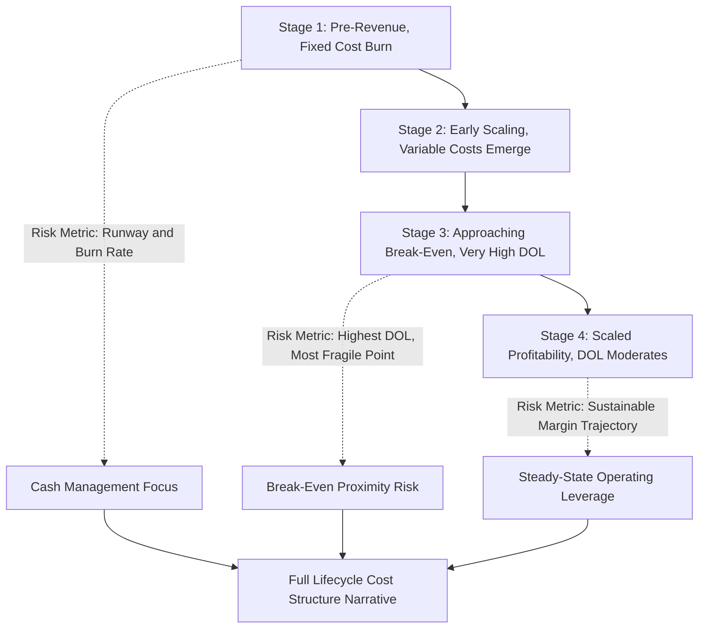

## Startup Cost Structure Transformation Case Study

### Overview

Startups present a uniquely dynamic cost structure case study because their fixed/variable cost mix typically undergoes deliberate, staged transformation across the company's lifecycle — from a pre-revenue, almost entirely fixed-cost burn phase, through a scaling phase where variable costs grow with early revenue, to a maturity phase where operating leverage begins driving margin expansion. Unlike the other case studies in this chapter, which examine a cost structure at a point in time or compare two static structures, this case study specifically traces cost structure **evolution over time** and the strategic decisions that drive it.

### The Three-Stage Startup Cost Structure Lifecycle

**Key Points**

- **Stage 1 (Pre-Revenue/Early Revenue):** Costs are almost entirely fixed — founder and early employee salaries, initial infrastructure, product development — incurred regardless of the (typically minimal or zero) revenue base. DOL is not meaningfully calculable (EBIT is deeply negative, often approaching negative infinity in percentage terms relative to near-zero revenue), so absolute burn rate and runway (months of cash remaining at current burn) are the primary risk metrics rather than DOL.
- **Stage 2 (Scaling):** Revenue grows, variable costs (COGS, transaction fees, usage-based infrastructure) begin to represent a more meaningful share of the cost base, and fixed costs continue growing (but more slowly than revenue) as the company hires ahead of growth. DOL becomes calculable and typically very high, reflecting proximity to break-even.
- **Stage 3 (Maturity/Scaled Profitability):** Revenue growth continues to outpace fixed cost growth, contribution margin scales substantially ahead of the fixed cost base, and DOL moderates toward a more stable, lower level as the company operates well above break-even — closely resembling the mature-stage SaaS dynamics discussed in the software company case study.

### Stylized Multi-Year Cost Structure Transformation

| Metric | Year 1 (Pre-Revenue) | Year 2 (Early Scaling) | Year 3 (Scaling) | Year 4 (Approaching Maturity) |
| --- | --- | --- | --- | --- |
| Revenue | $500,000 | $4,000,000 | $15,000,000 | $40,000,000 |
| Variable Costs | $150,000 | $1,200,000 | $4,500,000 | $11,600,000 |
| Contribution Margin | $350,000 | $2,800,000 | $10,500,000 | $28,400,000 |
| Fixed Costs | $3,500,000 | $6,500,000 | $9,800,000 | $14,200,000 |
| EBIT | ($3,150,000) | ($3,700,000) | $700,000 | $14,200,000 |
| DOL | Not meaningful (deep loss) | Not meaningful (deep loss) | 15.0 | 2.0 |

**Key Points**

- Note that fixed costs continue to *grow* every year in absolute dollar terms (from $3.5M to $14.2M) — this is the deliberate, strategic hiring/infrastructure investment discussed in the SaaS case study, not cost discipline or cost-cutting. The transformation is driven by revenue growing *faster* than the fixed cost base, not by fixed costs shrinking.
- Year 3's DOL of 15.0 reflects the company sitting very close to its break-even point — a single modest revenue shortfall in Year 3 could easily have produced a materially larger loss than Year 2, despite the company being "further along" in its growth story. This illustrates a critical, often underappreciated risk: **DOL is often at its highest, most dangerous level exactly during the transition from loss to profitability**, not during the deep pre-revenue loss phase (where the loss, while large, is more predictable and budgeted) or the mature profitability phase (where DOL has moderated).
- By Year 4, DOL has fallen to 2.0 as the company operates well above break-even — the classic mature-stage pattern where continued fixed cost growth is now comfortably outpaced by even larger contribution margin growth.

### Diagram: Startup Cost Structure Lifecycle (svg_diagram)

### The Critical Risk Window: Near-Break-Even Fragility

This case study highlights a specific, important lesson that is easy to overlook when studying operating leverage only in mature, stable-state examples: **a company transitioning from loss to profitability passes through its point of maximum earnings fragility precisely when it looks, superficially, like it is "succeeding."**

- In Year 2, a revenue shortfall would simply mean a somewhat larger loss — painful, but a continuation of an already-understood, budgeted-for loss trajectory.
- In Year 3, sitting close to break-even with DOL of 15.0, an equivalent percentage revenue shortfall could push the company from a small profit into a meaningfully larger loss — a much more consequential and potentially alarming outcome to investors, lenders, or the board, precisely because expectations have shifted toward sustained profitability.
- This is directly analogous to the airline case study's observation that DOL is highest near break-even load factor, and to the general CVP mathematical property that DOL approaches infinity as EBIT approaches zero from either direction — but here applied specifically to the *strategic timing* implication for a growth-stage company's fundraising, guidance, and risk communication.

### Financing and Runway Implications Across Stages

Cost structure stage has direct implications for how a startup should approach financing and cash management:

| Stage | Primary Financial Risk Metric | Financing Implication |
| --- | --- | --- |
| Pre-Revenue | Burn rate, runway (months of cash at current burn) | Financing sized to fund a defined runway to the next milestone; DOL not yet a meaningful risk lens |
| Early Scaling | Burn rate declining but still present; early DOL emerging | Financing should account for the possibility that revenue growth stalls before reaching break-even, extending the loss period |
| Near Break-Even | Very high DOL; small revenue misses have outsized EBIT impact | Maintaining adequate cash buffer is critical, since the company is most exposed to a shortfall being amplified into a larger-than-expected loss right when investors expect improvement |
| Scaled/Mature | Moderated DOL; typical operating leverage risk management | Financing/capital allocation shifts toward growth investment or capital return decisions, similar to a mature company |

### Applying Scenario Analysis Across the Transformation

A well-constructed startup financial model should apply the scenario analysis framework (see earlier topic) specifically calibrated to each lifecycle stage, since a single "downside case" percentage haircut applied uniformly across all years will understate risk in the near-break-even year and may overstate relative risk in the deep pre-revenue year (where the loss, while large in dollar terms, is less sensitive in percentage terms to a given revenue miss).

**Illustrative Year 3 downside scenario (near-break-even year):**

| Scenario | Revenue | Contribution Margin | Fixed Costs | EBIT |
| --- | --- | --- | --- | --- |
| Base Case | $15,000,000 | $10,500,000 | $9,800,000 | $700,000 |
| Downside (-10% revenue) | $13,500,000 | $9,450,000 | $9,800,000 | ($350,000) |

A modest 10% revenue shortfall in this near-break-even year flips the company from a small profit to a loss — a result directly explained by the Year 3 DOL of 15.0 ($15.0 \times -10\% = -150\%$ change in EBIT, consistent with moving from +$700,000 to approximately -$350,000). This is precisely the kind of scenario a founder or CFO should proactively model and communicate to the board and investors *before* it happens, rather than being caught off guard by the amplification effect.

### Strategic Levers to Manage the Near-Break-Even Risk Window

Given the elevated risk during the near-break-even transition, companies and their financial leadership can consider several structural responses, each with trade-offs:

- **Deliberately slow fixed cost growth (hiring) until past the break-even inflection**, accepting slower growth investment in exchange for reduced earnings volatility during the fragile transition period — directly trading growth speed for reduced DOL risk.
- **Convert some fixed costs to variable arrangements during the transition** (e.g., using contractors or outsourced services instead of full-time hires for certain functions, usage-based cloud infrastructure instead of committed capacity) — directly reducing DOL by design during the highest-risk window, then potentially reverting to more fixed, in-house infrastructure once past break-even and operating with a larger margin of safety.
- **Maintain a larger cash buffer specifically during the identified high-DOL window**, rather than applying a uniform cash buffer policy across all lifecycle stages — explicitly sizing the buffer to the stress-tested downside scenario at the point of maximum DOL, not just a generic number of months of burn.
- **Communicate the DOL dynamic proactively to the board/investors**, framing a potential near-term dip as an anticipated consequence of business model mechanics rather than allowing it to be perceived as an unexpected operational failure if a revenue shortfall does occur during this window.

### Connecting to Other Chapter Topics

This case study serves as a synthesis point connecting several concepts from across the curriculum:

- The **CVP and DOL mechanics** are identical to those used throughout the chapter — this case study's contribution is showing how they evolve dynamically over a single company's lifecycle rather than examining a static snapshot.
- The **stress testing framework** (break-even ladders, margin of safety) is directly applicable at each lifecycle stage, but the *interpretation* of a given stress test result depends heavily on which stage the company is in.
- The **software company case study's** growth-vs-profitability discretionary fixed cost framing directly applies here — a startup's fixed cost growth is a deliberate strategic choice, and this case study extends that discussion specifically to the highest-risk transition window.
- The **beta and cost of equity implications** discussed earlier suggest that investors (particularly late-stage venture or crossover investors) should expect and price in elevated earnings volatility specifically during this near-break-even transition period, distinct from the earlier (understood-to-be-lossmaking) or later (more stable) stages.

### Common Errors in Analyzing Startup Cost Structure Transformation

| Error | Consequence | Correction |
| --- | --- | --- |
| Treating "reaching profitability" as inherently de-risking | Misses that the near-break-even point is often the highest-DOL, most fragile point in the company's history | Explicitly calculate and communicate DOL at each stage, recognizing the near-break-even window as a distinct risk period |
| Applying a uniform downside scenario percentage across all lifecycle years | Misjudges relative risk across stages | Calibrate scenario severity understanding, and interpret resulting EBIT swings, in light of each year's specific DOL |
| Evaluating burn rate/runway metrics as the sole risk lens even after the company approaches break-even | Fails to capture the DOL-driven earnings volatility risk that emerges near break-even | Transition risk monitoring from pure cash-burn metrics to DOL and margin-of-safety metrics as the company approaches break-even |
| Assuming continued fixed cost growth is inherently risky or undisciplined | Misreads a deliberate, often value-accretive growth investment strategy as a red flag | Assess fixed cost growth in the context of the resulting revenue/contribution margin growth it is intended to support, not as an isolated line-item concern |

**Related Topics**

- Software company operating leverage case study
- Stress testing profitability under volume declines
- Burn rate and runway analysis for early-stage companies
- Scenario analysis for demand and cost shocks
- Operating leverage and earnings volatility effects on beta
- Cost structure signals in earnings quality analysis