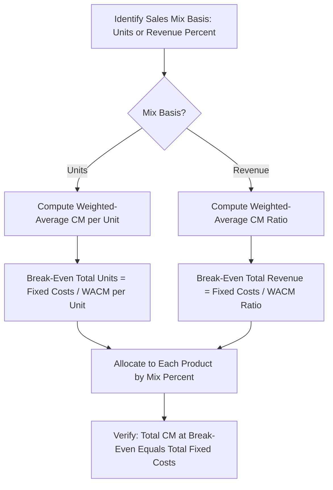
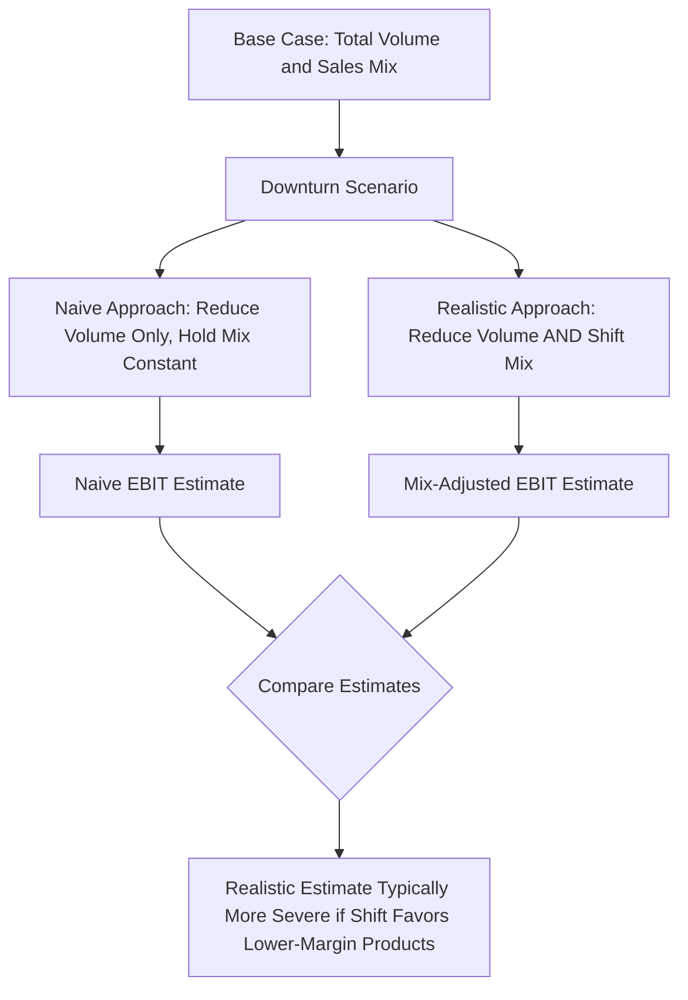

## Multi Product Break Even Applied Problem Set

### Overview

This applied problem set works through multi-product break-even and CVP mechanics using a series of progressively complex worked problems, extending the single-product framework established earlier in the curriculum to businesses selling multiple products with different contribution margins and sales mixes. Multi-product break-even analysis requires a weighted-average approach that most single-product treatments gloss over, and this problem set is designed to build that competency through direct practice.

### Foundational Formula Review

For a multi-product business, break-even cannot be computed using any single product's contribution margin — a **weighted-average contribution margin (WACM)**, based on the sales mix, must be used instead:

$$WACM\ per\ Unit = \sum_{i=1}^{n} (CM_i \times Mix\%_i)$$

$$Break\text{-}Even\ Total\ Units = \frac{Total\ Fixed\ Costs}{WACM\ per\ Unit}$$

$$Break\text{-}Even\ Units\ for\ Product_i = Break\text{-}Even\ Total\ Units \times Mix\%_i$$

Alternatively, when products have very different prices, a **weighted-average contribution margin ratio** approach (using sales dollars rather than units as the mix basis) is often more appropriate:

$$WACM\ Ratio = \sum_{i=1}^{n} (CM\ Ratio_i \times Revenue\ Mix\%_i)$$

$$Break\text{-}Even\ Total\ Revenue = \frac{Total\ Fixed\ Costs}{WACM\ Ratio}$$

### Problem 1 — Basic Two-Product Break-Even (Unit-Based Mix)

**Setup:** A company sells two products with the following economics and a fixed total sales mix:

| Product | Price | Variable Cost | CM per Unit | Sales Mix (Units) |
| --- | --- | --- | --- | --- |
| A | $50 | $30 | $20 | 60% |
| B | $80 | $50 | $30 | 40% |

Total Fixed Costs: $312,000

**Solution:**

$$WACM = (20 \times 0.60) + (30 \times 0.40) = 12 + 12 = \$24\ per\ unit$$

$$Break\text{-}Even\ Total\ Units = \frac{312{,}000}{24} = 13{,}000\ units$$

$$Break\text{-}Even\ Units_A = 13{,}000 \times 0.60 = 7{,}800\ units$$

$$Break\text{-}Even\ Units_B = 13{,}000 \times 0.40 = 5{,}200\ units$$

**Verification:** $(7{,}800 \times 20) + (5{,}200 \times 30) = 156{,}000 + 156{,}000 = 312{,}000$ ✓ — total contribution margin at the break-even mix exactly equals total fixed costs, confirming the solution.

### Problem 2 — Revenue-Mix-Based Break-Even (Products with Very Different Prices)

**Setup:** A company sells a low-price, high-volume product and a high-price, low-volume product, making a revenue-mix approach more appropriate than a unit-mix approach:

| Product | Price | Variable Cost | CM Ratio | Sales Mix (Revenue %) |
| --- | --- | --- | --- | --- |
| X | $15 | $9 | 40% | 70% |
| Y | $200 | $110 | 45% | 30% |

Total Fixed Costs: $189,000

**Solution:**

$$WACM\ Ratio = (0.40 \times 0.70) + (0.45 \times 0.30) = 0.28 + 0.135 = 0.415$$

$$Break\text{-}Even\ Total\ Revenue = \frac{189{,}000}{0.415} = \$455{,}422$$

$$Break\text{-}Even\ Revenue_X = 455{,}422 \times 0.70 = \$318{,}795$$

$$Break\text{-}Even\ Revenue_Y = 455{,}422 \times 0.30 = \$136{,}627$$

**Converting to units:**

$$Break\text{-}Even\ Units_X = 318{,}795 / 15 = 21{,}253\ units$$

$$Break\text{-}Even\ Units_Y = 136{,}627 / 200 = 683\ units$$

**Key Points**

- The revenue-mix approach is preferred over the unit-mix approach when products have substantially different price points, since a unit-mix assumption (e.g., "for every 1 unit of Y, sell X units of X") can obscure the true revenue composition and distort the resulting WACM.
- Always verify the choice of mix basis matches how the sales mix is actually specified or observed in practice (units sold vs. revenue share) — using the wrong basis for the available data produces an internally inconsistent calculation.

### Diagram: Multi-Product Break-Even Solution Path (svg_diagram)

### Problem 3 — Three-Product Mix with Mix Shift Sensitivity

**Setup:** A company sells three products. Management is considering a marketing shift that would change the sales mix. Evaluate break-even under both the current and proposed mix.

| Product | CM per Unit | Current Mix | Proposed Mix |
| --- | --- | --- | --- |
| P | $15 | 50% | 30% |
| Q | $25 | 30% | 30% |
| R | $40 | 20% | 40% |

Total Fixed Costs: $342,000

**Current Mix Solution:**

$$WACM_{current} = (15 \times 0.50)+(25 \times 0.30)+(40 \times 0.20) = 7.5+7.5+8.0 = \$23.00$$

$$Break\text{-}Even\ Units_{current} = \frac{342{,}000}{23.00} = 14{,}870\ units$$

**Proposed Mix Solution:**

$$WACM_{proposed} = (15 \times 0.30)+(25 \times 0.30)+(40 \times 0.40) = 4.5+7.5+16.0 = \$28.00$$

$$Break\text{-}Even\ Units_{proposed} = \frac{342{,}000}{28.00} = 12{,}214\ units$$

**Interpretation:** Shifting the sales mix toward the higher-contribution-margin Product R reduces total break-even unit volume by approximately 2,656 units (a roughly 17.9% reduction) — with no change to price, variable cost, or fixed costs for any individual product. This demonstrates a distinctively multi-product phenomenon: **break-even volume can be lowered purely through mix management**, a lever unavailable in single-product CVP analysis, and directly relevant to the mix-shift earnings quality signal discussed earlier in this chapter (a consolidated margin improvement driven by mix shift rather than underlying unit economics improvement).

### Problem 4 — Solving for Required Mix to Hit a Target Profit

**Setup:** Using Problem 3's current per-unit economics (P: $15, Q: $25, R: $40 CM per unit; $342,000 fixed costs), the company wants to know: if it can only sell 15,000 total units, what sales mix is required to achieve a target EBIT of $50,000, assuming the mix is limited to only Products Q and R (Product P is being discontinued)?

**Solution approach:** Let $x$ = units of Q, and $(15{,}000 - x)$ = units of R.

$$Total\ CM = 25x + 40(15{,}000-x) = Target\ EBIT + Fixed\ Costs$$

$$25x + 600{,}000 - 40x = 50{,}000 + 342{,}000$$

$$-15x + 600{,}000 = 392{,}000$$

$$-15x = -208{,}000$$

$$x = 13{,}867\ units\ of\ Q$$

$$Units\ of\ R = 15{,}000 - 13{,}867 = 1{,}133\ units$$

**Verification:** $(13{,}867 \times 25) + (1{,}133 \times 40) = 346{,}675 + 45{,}320 = 391{,}995 \approx 392{,}000$ (minor rounding) ✓, and $391{,}995 - 342{,}000 = 49{,}995 \approx 50{,}000$ EBIT ✓.

**Key Points**

- This problem type — solving algebraically for a required product mix given a fixed total unit constraint and a target profit — is a natural real-world extension when a company faces a capacity constraint (only 15,000 total units can be sold or produced) and must decide how to allocate that limited capacity across products with different margins.
- This is conceptually related to (but distinct from) linear programming/optimization approaches used when multiple simultaneous constraints (not just a single total-unit cap) apply — a full constrained-optimization treatment is beyond basic multi-product CVP algebra and would typically require a formal optimization technique.

### Problem 5 — Multi-Product Margin of Safety and Risk Concentration

**Setup:** Using Problem 1's two-product structure (Product A: 60% mix, CM $20; Product B: 40% mix, CM $30; Fixed Costs $312,000; Break-Even = 13,000 total units), the company currently sells 18,000 total units at the same 60/40 mix. Calculate the margin of safety, and evaluate the risk if the mix were to shift unfavorably during a downturn (customers disproportionately cutting back on the higher-margin Product B).

**Base margin of safety (mix held constant):**

$$Margin\ of\ Safety = \frac{18{,}000 - 13{,}000}{18{,}000} = 27.8\%$$

**Downturn scenario — total volume falls to 15,000 units, AND mix shifts to 75% A / 25% B (customers trading down):**

$$New\ WACM = (20 \times 0.75)+(30\times0.25) = 15+7.5 = \$22.50$$

$$New\ Total\ CM = 15{,}000 \times 22.50 = \$337{,}500$$

$$New\ EBIT = 337{,}500 - 312{,}000 = \$25{,}500$$

**Compare to a naive scenario** that reduces volume by the same amount (15,000 units) but incorrectly holds the original 60/40 mix constant:

$$Naive\ WACM = \$24.00\ (unchanged\ from\ Problem\ 1)$$

$$Naive\ Total\ CM = 15{,}000 \times 24.00 = \$360{,}000$$

$$Naive\ EBIT = 360{,}000 - 312{,}000 = \$48{,}000$$

**Interpretation:** The mix-shift-aware scenario ($25,500 EBIT) shows a materially worse outcome than the naive constant-mix scenario ($48,000 EBIT) for the identical total unit volume decline — because the downturn caused customers to trade down toward the lower-margin product, compounding the pure volume effect with an adverse mix effect. This demonstrates why a rigorous multi-product stress test must explicitly consider potential mix shifts under stress, not just apply a uniform percentage volume decline across all products while holding the mix constant, since demand shocks are frequently not neutral across a product portfolio (particularly when products differ in being discretionary/premium versus essential/value-oriented).

### Diagram: Multi-Product Stress Testing with Mix Shift (svg_diagram)

### Common Errors in Multi-Product Break-Even Problems

| Error | Cause | Fix |
| --- | --- | --- |
| Using unit-based mix when products have very different prices | Applying the simpler unit-mix formula without checking price disparity | Switch to revenue-mix / WACM ratio approach when products have substantially different price points |
| Holding sales mix constant in stress/downturn scenarios | Failing to consider that demand shocks often affect products unevenly | Explicitly model plausible mix shifts under stress, particularly between premium/discretionary and value/essential product tiers |
| Treating multi-product break-even as if it were a single fixed number regardless of mix | Ignoring that break-even units/revenue changes whenever the mix assumption changes | Recompute break-even under each relevant mix scenario rather than treating the base-case mix as a fixed, universal constant |
| Failing to verify the algebraic solution | Skipping the check that total contribution margin at the computed break-even equals total fixed costs | Always plug the solved-for quantities back into the total CM formula as a verification step |

### Validation and Auditing Practices

- **Reconciliation check:** For every solved break-even or target-profit problem, substitute the solution back into the original total contribution margin formula and confirm it equals the stated fixed costs (or fixed costs plus target profit) — this is the standard audit step for any multi-product algebra problem.
- **Mix basis consistency check:** Confirm the sales mix percentages used are internally consistent with the chosen basis (i.e., unit-mix percentages should sum to 100% of units; revenue-mix percentages should sum to 100% of revenue) — mixing the two bases inadvertently is a common source of error.
- **Sensitivity to mix assumption:** Given how significantly break-even volume changed in Problem 3 purely from a mix shift, any multi-product break-even analysis should explicitly test sensitivity to reasonable alternative mix assumptions, rather than presenting a single break-even figure as if the mix were a fixed, unchangeable constant.

**Next Steps**

- Linear programming approaches to multi-product optimization under multiple constraints
- Multi-product CVP spreadsheet model construction
- Sales mix variance analysis in budget-to-actual reporting
- Cost structure signals in earnings quality analysis (mix-shift-driven margin changes)
- Retail sector margin sensitivity case study (a practical multi-product/multi-category application)