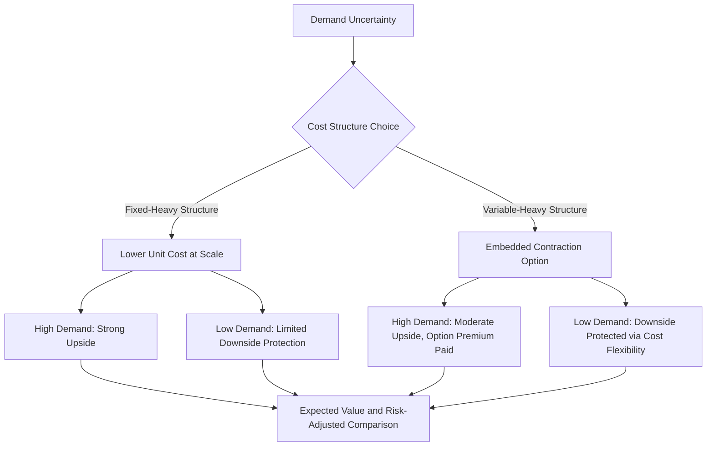

## Real Options Theory and Operating Flexibility

### Overview

Real options theory applies option-pricing concepts from financial derivatives to real (physical/operational) investment and operating decisions, treating managerial flexibility itself as a valuable asset. In the context of cost structure analysis, real options theory reframes the fixed/variable cost decision not merely as a static risk trade-off (as covered in prior operating leverage topics) but as an embedded set of options — the option to expand, contract, delay, abandon, or switch modes of operation — whose value depends on uncertainty and flexibility, and which traditional CVP and DCF frameworks (built on fixed assumptions) do not fully capture.

### Why Traditional CVP/DCF Undervalues Operating Flexibility

**Key Points**

- A standard DCF or CVP model (as covered earlier in this chapter) typically assumes a fixed operating plan is followed regardless of how the future unfolds — but real management teams actively adjust cost structure, capacity, and operating decisions in response to new information as it arrives, and this adaptability has value that a static model omits.
- Real options theory holds that flexibility is more valuable precisely when **uncertainty is high** — a company facing highly uncertain demand benefits more from retaining the option to scale up or down than one facing predictable, stable demand, since the flexible company can capture more upside and avoid more downside by waiting for uncertainty to resolve before committing.
- This directly connects to the fixed/variable cost structure decision: **committing to a fixed cost structure (e.g., building an owned factory) forecloses certain options** (the option to scale down costs if demand disappoints) in exchange for potentially lower costs at high volume, while a variable-cost structure (e.g., outsourcing) preserves more flexibility at the potential cost of higher per-unit expense — a trade-off real options theory helps formalize and value.

### Core Real Options Types Relevant to Cost Structure Decisions

| Option Type | Description | Cost Structure Connection |
| --- | --- | --- |
| **Option to Expand** | Ability to scale up operations/capacity if demand exceeds expectations | Relates to whether current fixed cost investments (capacity) can be added to incrementally, or require large discrete step-changes |
| **Option to Contract/Abandon** | Ability to scale down or exit operations if demand disappoints | Directly tied to the *variability* of costs — a highly variable cost structure effectively embeds a continuous contraction option, while high fixed costs limit this option |
| **Option to Switch** | Ability to change inputs, outputs, or operating modes in response to changing relative costs/prices | Relevant when a company can flexibly shift between different cost structures (e.g., switching between in-house and outsourced production based on relative cost-effectiveness) |
| **Option to Delay** | Ability to postpone a capital/fixed-cost commitment until more information is available | Directly relevant to the capacity step-change timing decisions discussed in the DCF modeling topic |
| **Option to Defer/Stage Investment** | Ability to make an investment in stages rather than all at once | Allows a company to convert what would otherwise be a single large fixed cost commitment into smaller, more flexible increments |

### Framing Cost Structure Choice as an Option Decision

**Key Points**

- Choosing a **variable-cost-heavy structure** (e.g., outsourcing manufacturing, using contractors instead of employees, cloud infrastructure instead of owned servers) can be understood as **purchasing operating flexibility** — often at a higher per-unit cost — analogous to paying an option premium for the right (but not obligation) to scale costs down if demand disappoints.
- Choosing a **fixed-cost-heavy structure** (e.g., owned manufacturing, committed long-term leases, permanent headcount) can be understood as **forgoing that flexibility option** in exchange for potentially lower costs at scale — a bet that demand will materialize as expected (or better), since the fixed commitment cannot be easily unwound if demand disappoints.
- This reframing helps explain empirically observed patterns, such as companies facing high demand uncertainty (e.g., early-stage products, industries with high technological or competitive disruption risk) often deliberately choosing higher-variable-cost operating models even when a fixed-cost alternative might appear cheaper under a single, static demand forecast — the value of the preserved flexibility, properly accounted for, can outweigh the point-estimate cost disadvantage.

### Simplified Real Options Valuation Intuition (Binomial Framing)

While full options-pricing mathematics (e.g., Black-Scholes, binomial lattice models) is a specialized quantitative topic beyond the scope of this chapter's CVP-focused toolkit, the core intuition can be illustrated with a simplified two-outcome (binomial) framing applied to a cost structure decision:

**Illustrative setup:** A company can choose Structure F (fixed-cost-heavy, lower unit cost, no ability to reduce costs if demand disappoints) or Structure V (variable-cost-heavy, higher unit cost, full ability to scale costs down if demand disappoints). Demand next year is uncertain: 50% probability of "High Demand," 50% probability of "Low Demand."

| Outcome | Structure F EBIT | Structure V EBIT |
| --- | --- | --- |
| High Demand (50% probability) | $800,000 | $650,000 |
| Low Demand (50% probability) | ($400,000) | $50,000 |
| **Expected Value** | $200,000 | $350,000 |

**Interpretation:** Even though Structure F has a higher EBIT in the High Demand outcome (reflecting its lower unit costs at scale), its expected value is lower than Structure V once the Low Demand outcome — where Structure F's inflexible fixed costs produce a substantial loss, while Structure V's flexible costs allow it to scale down and remain modestly profitable — is properly weighted. This simplified example illustrates the core real options insight: **the value of downside protection (the contraction option embedded in Structure V) can outweigh the upside cost advantage of Structure F**, particularly when the probability-weighted downside outcome is severe. [Inference: this specific numerical example is illustrative of the conceptual mechanism rather than a general claim that variable-cost structures always dominate on an expected-value basis — the actual optimal choice depends on the specific probabilities, magnitudes, and the decision-maker's risk tolerance (a risk-averse decision-maker might prefer Structure V's outcome even at an equal or slightly lower expected value, given its much narrower outcome range).]

### Diagram: Cost Structure as an Embedded Real Option (svg_diagram)

### Connecting to Operating Leverage and DOL

Real options theory and the DOL framework developed throughout this chapter are complementary, not competing, lenses:

- **DOL quantifies the earnings sensitivity consequence** of a given fixed/variable cost structure choice, once made.
- **Real options theory helps evaluate whether making that structural choice is itself the right decision**, given the level of uncertainty faced, by explicitly valuing the flexibility that is preserved or forgone.
- A company with very high DOL (heavily fixed-cost structure) can be understood, through the real options lens, as having **already exercised** (or committed to) a particular structural choice that forwent contraction flexibility — the real options framework asks whether that choice was, or would currently be, the value-maximizing one given the demand uncertainty the company actually faces, rather than simply describing the earnings consequence (which is what DOL does).

### Practical Applications of Real Options Thinking to Cost Structure Decisions

- **Outsourcing vs. insourcing (make-or-buy) decisions:** framing this classic decision through a real options lens explicitly values the flexibility preserved by outsourcing (variable cost) against the potential cost savings and control benefits of insourcing (fixed cost investment), particularly under demand or technology uncertainty.
- **Capacity investment timing:** the "option to delay" a capacity expansion (a fixed cost commitment) has value when demand trajectory is uncertain — real options theory provides a framework for valuing the benefit of waiting for more information against the cost of delayed capacity (e.g., lost sales if demand materializes faster than capacity can be added).
- **Staged/modular capital investment:** designing a capacity expansion to be built in smaller, sequential increments (rather than one large discrete step) — even if this sacrifices some economies of scale — can be justified by the value of the embedded options to halt or adjust the expansion plan as actual demand is observed at each stage.
- **Contract structuring with suppliers/landlords:** negotiating shorter lease terms, cancellation clauses, or volume-flexible supplier contracts — even at a cost premium relative to longer, more rigid commitments — can be understood as purchasing real options value, directly relevant to a company's broader cost structure strategy.

### Real Options Thinking in Volatile or Emerging Industries

Real options theory is particularly emphasized in contexts characterized by high uncertainty, since option value increases with volatility (a property directly analogous to financial options, where higher underlying asset volatility increases option value, all else equal):

- **Early-stage/emerging technology sectors:** companies facing substantial technological, regulatory, or competitive uncertainty often rationally favor variable-cost, flexible operating models (directly connecting to the startup cost structure transformation case study discussed earlier), since the option value of flexibility is elevated by the high uncertainty these companies face.
- **Commodity-exposed industries:** companies whose input costs or output prices are highly volatile (e.g., resource extraction, agriculture-linked processing) often have strong real-options rationale for maintaining operational flexibility (e.g., the ability to idle production when prices are unfavorable) rather than committing to inflexible, always-on fixed-cost operations.
- **Regulatory or geopolitical uncertainty contexts:** businesses facing significant policy or geopolitical uncertainty (e.g., tariff exposure, uncertain regulatory approval timelines) may similarly favor preserving operational flexibility until that uncertainty resolves.

### Limitations and Practical Challenges

- **Quantification difficulty:** while the conceptual framework is powerful, rigorously quantifying real options value (via binomial lattice or other options-pricing methodology) requires estimating inputs — volatility of the underlying demand/value driver, an appropriate "exercise price," and the relevant risk-free rate — that are often far less directly observable than they are for financial options on traded securities, introducing substantial estimation uncertainty into any precise quantitative application. [Unverified: the specific numerical precision achievable in real options valuations for operating/cost structure decisions varies widely across use cases and is a subject of ongoing debate in both academic and practitioner literature; this topic presents the conceptual framework rather than endorsing any specific quantification methodology as broadly reliable.]
- **Organizational and behavioral factors:** real options theory assumes management will rationally exercise options (expand, contract, abandon) when it becomes value-maximizing to do so — in practice, organizational inertia, sunk cost bias, or misaligned incentives can prevent management from actually exercising a theoretically valuable option at the appropriate time, meaning the theoretical option value may not be fully realized in practice.
- **Interaction with existing CVP/DCF frameworks:** real options analysis is typically used to *supplement*, not replace, the standard CVP, DOL, and DCF frameworks covered throughout this chapter — it is most useful for evaluating discrete strategic decisions (e.g., "should we build owned capacity or outsource") rather than as a routine substitute for standard financial forecasting and valuation techniques.

**Related Topics**

- Startup cost structure transformation case study (flexibility during high-uncertainty growth stages)
- Operating leverage assumptions in discounted cash flow models
- Capacity constraint modeling and step-cost functions
- Make-or-buy and outsourcing decision frameworks
- Binomial option pricing and Black-Scholes fundamentals
- Scenario analysis for demand and cost shocks