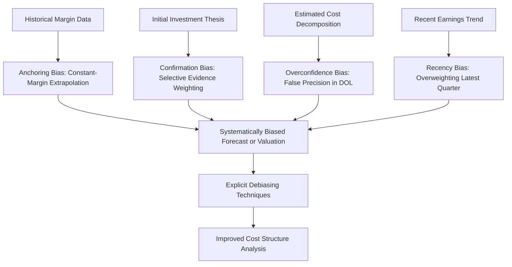
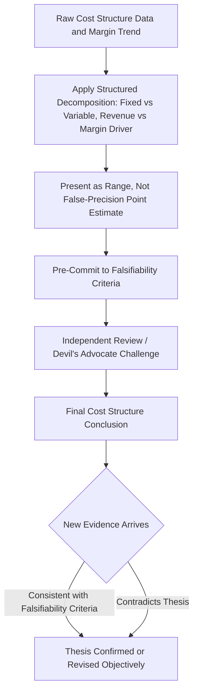

## Behavioral Biases in Interpreting Cost Structure and Leverage

### Overview

Behavioral finance research documents systematic, predictable deviations from rational decision-making that affect how both corporate managers and outside analysts/investors interpret cost structure and operating leverage. While the preceding chapter topics developed the mathematically rigorous CVP, DOL, and valuation frameworks, this topic examines the well-documented psychological tendencies that can cause even sophisticated market participants to misapply or misinterpret those frameworks in practice — a critical complement to the technical toolkit, since correct formulas applied with biased judgment can still produce poor decisions.

### Anchoring on Historical Margins

**Key Points**

- **Anchoring bias** describes the tendency to rely too heavily on an initial reference point (an "anchor") when making judgments, even when that reference point is no longer relevant or accurate.
- Analysts and managers frequently anchor on a company's historical operating margin when projecting future margins, applying a constant-margin extrapolation (as discussed critically in the DCF modeling topic) even when the underlying cost structure has materially shifted (e.g., following an acquisition, automation investment, or outsourcing decision).
- This bias directly explains why the cost-structure-explicit DCF modeling approach (decomposing fixed and variable costs rather than applying a blended historical margin) is emphasized throughout this curriculum as a *behavioral corrective*, not merely a technical refinement — the explicit decomposition forces the analyst to confront and re-justify the underlying cost assumptions rather than passively anchoring on a historical blended figure.

### Confirmation Bias in Thesis-Driven Cost Structure Analysis

- Once an equity analyst or investor has formed a thesis (e.g., "this company has under-appreciated operating leverage that will drive margin expansion"), **confirmation bias** can lead to selectively weighting subsequent evidence that supports the thesis while discounting evidence that contradicts it.
- In practice, this can manifest as: interpreting a revenue beat as confirmation of the operating leverage thesis while attributing a revenue miss to "one-time" factors unrelated to the underlying cost structure story; or continuing to model aggressive margin expansion in a DCF terminal value calculation despite emerging evidence (e.g., a capacity constraint requiring a step-change in fixed costs, as discussed in the DCF assumptions topic) that would undermine the thesis.
- **Mitigation approach:** Explicitly pre-committing to specific, falsifiable metrics that would indicate the cost structure thesis is wrong (e.g., "if gross margin does not expand by at least X bps over the next two quarters despite Y% volume growth, the thesis is likely flawed") before observing results, rather than retroactively rationalizing whatever outcome occurs as consistent with the original thesis.

### Overconfidence in Cost Structure Estimation Precision

- Since precise fixed/variable cost decomposition is rarely directly disclosed (as discussed in the equity research topic) and typically requires estimation via regression, high-low methods, or management commentary, there is a risk of **overconfidence bias** — treating an estimated fixed/variable split with more precision and certainty than the underlying estimation method actually supports.
- This can manifest as presenting a single-point DOL estimate without any acknowledgment of the estimation uncertainty surrounding the underlying fixed/variable split, when in reality a range of plausible splits (each consistent with available historical data) might produce a meaningfully different DOL and forecast.
- **Mitigation approach:** Presenting cost structure and DOL estimates as ranges (e.g., "DOL is likely between 2.5x and 4.0x based on our regression analysis") rather than false-precision point estimates, and explicitly stress-testing valuation conclusions against the plausible range of cost structure assumptions rather than a single assumed split.

### Diagram: Behavioral Bias Pathways in Cost Structure Analysis (svg_diagram)

### Recency Bias in Margin Trend Extrapolation

- **Recency bias** — overweighting the most recent data points relative to a longer historical pattern — can lead analysts to extrapolate a single strong (or weak) recent quarter's margin performance as if it represents a new, durable structural trend, rather than appropriately weighing it against a longer history that might reveal it as within normal cyclical or seasonal variation.
- This connects directly to the earnings quality analysis framework covered earlier: recency bias makes it easy to mistake a temporary cost action or a favorable one-quarter mix shift for genuine, structural operating leverage — precisely the distinction the earnings quality "signals" framework is designed to help investors make deliberately and analytically, rather than intuitively (and potentially biased-ly).
- **Mitigation approach:** Systematically applying the multi-period trend analysis and decomposition techniques from the earnings quality topic (contribution margin trend vs. EBIT trend, break-even migration) rather than relying on an intuitive read of the most recent 1-2 quarters alone.

### Loss Aversion and Asymmetric Reaction to Operating Leverage

- **Loss aversion** — the well-documented tendency for losses to be felt more acutely than equivalent-sized gains — can produce asymmetric market reactions to high-DOL companies' earnings surprises: a negative earnings surprise (amplified by high DOL) may trigger a disproportionately severe stock price reaction relative to the proportionally equivalent positive reaction to a similarly-sized positive surprise.
- This has a direct practical implication connected to the investor interpretation topic covered earlier: high-DOL companies may exhibit not just genuinely higher fundamental earnings volatility (a rational consequence of their cost structure, as this chapter has established), but *additional* market-price volatility beyond what the earnings volatility alone would justify, if loss aversion causes the market to systematically overreact to downside earnings surprises relative to upside ones of equal magnitude. [Inference: whether observed stock price reactions to high-DOL earnings surprises reflect purely rational risk-pricing versus an additional loss-aversion-driven overreaction is a genuinely debated empirical question in behavioral finance research, and this topic presents the conceptual mechanism rather than asserting a specific, settled magnitude of any such effect.]

### Narrative Fallacy and Cost Structure Storytelling

- The **narrative fallacy** describes the human tendency to construct coherent, appealing stories to explain data, even when the underlying data may be more consistent with randomness, multiple competing explanations, or a simpler mechanical driver.
- In cost structure analysis, this can manifest as constructing an elaborate strategic narrative around a company's margin trajectory (e.g., attributing margin expansion to "brilliant management execution" or "a structural competitive advantage") when a substantial portion of the observed margin change is mechanically explained by ordinary operating leverage acting on a volume change — precisely the mechanical, DOL-driven effect this chapter has shown can be quantified and isolated.
- **Mitigation approach:** Systematically applying the revenue-driven vs. margin-driven decomposition (discussed in the investor interpretation and equity research topics) as a discipline specifically designed to separate the mechanical, cost-structure-explained portion of a margin change from any residual portion that might genuinely warrant a more elaborate strategic narrative or execution-based explanation.

### Management-Side Behavioral Biases in Cost Structure Decisions

Behavioral biases affect not only analysts and investors interpreting a company's cost structure, but also the managers making the underlying cost structure decisions themselves:

| Bias | Manifestation in Cost Structure Decisions |
| --- | --- |
| **Sunk cost fallacy** | Continuing to maintain or expand a fixed-cost investment (e.g., an owned facility) because of the amount already invested, rather than evaluating the forward-looking economics independent of past spending |
| **Overoptimism about demand forecasts** | Committing to fixed cost expansions (new capacity, headcount) based on optimistic demand projections, without adequately weighing the downside scenario where the fixed commitment becomes a source of the near-break-even fragility discussed in the startup case study |
| **Status quo bias** | Maintaining an existing fixed-cost-heavy operating model (e.g., continuing in-house manufacturing) longer than economically justified, simply because it represents the established way of operating, rather than periodically re-evaluating the make-or-buy/fixed-variable trade-off objectively |
| **Herding behavior** | Making cost structure decisions (e.g., adopting a particular technology stack, outsourcing arrangement, or facility investment) primarily because industry peers are doing so, rather than based on independent analysis of the company's own specific demand uncertainty and risk tolerance |

This connects directly to the real options theory topic: several of these management-side biases (sunk cost fallacy, overoptimism, status quo bias) can cause management to fail to exercise a valuable real option (e.g., the option to abandon or contract) even when doing so would be objectively value-maximizing, precisely the "organizational and behavioral factors" limitation flagged in that topic's discussion of real options theory's practical challenges.

### Debiasing Techniques Applicable to Cost Structure Analysis

| Technique | Application |
| --- | --- |
| **Pre-mortem analysis** | Before finalizing a cost structure forecast or fixed-cost commitment decision, explicitly imagine the decision has failed and work backward to identify why — surfacing risks that optimism or anchoring might otherwise obscure |
| **Explicit falsifiability criteria** | Define in advance the specific evidence that would indicate a cost structure thesis (either analytical or a management decision) is wrong, reducing the scope for confirmation bias to retroactively rationalize contrary evidence |
| **Base rate anchoring on cost structure decomposition, not blended margins** | Systematically use the fixed/variable decomposition techniques from this chapter (regression, high-low method) as the analytical starting point, rather than a single historical blended margin figure that invites anchoring bias |
| **Range-based rather than point estimates** | Present DOL, break-even, and margin forecasts as ranges reflecting genuine estimation uncertainty, rather than false-precision point figures |
| **Independent review / devil's advocate process** | Having a second analyst or a formal decision-review process specifically challenge a cost-structure-driven investment thesis or management decision, reducing the risk that a single individual's biases go unchecked |
| **Structured decomposition frameworks** | Systematically applying the revenue-driven vs. margin-driven decomposition and the earnings quality signal framework from earlier in this chapter, rather than relying on intuitive or narrative-based interpretation of margin changes |

### Diagram: Debiasing Workflow for Cost Structure Analysis (svg_diagram)

### Practical Synthesis: Why This Topic Matters for the Preceding Technical Framework

The mathematically rigorous tools developed throughout this chapter — CVP mechanics, DOL calculation, break-even and margin of safety, Monte Carlo simulation, DCF cost structure assumptions, and beta/valuation implications — are all vulnerable to being applied with biased inputs or interpreted through a biased lens, even when the underlying mathematics is executed correctly. A technically sound DOL calculation built on an anchored, overconfident, or narrative-driven fixed/variable cost estimate will produce a technically sound-*looking* but substantively flawed forecast. This topic's core lesson is that rigorous cost structure analysis requires **both** the quantitative toolkit developed throughout this chapter **and** deliberate awareness of, and structural safeguards against, the well-documented behavioral tendencies that can distort how that toolkit's inputs are estimated and its outputs are interpreted.

### Common Errors Stemming from Behavioral Biases

| Error | Underlying Bias | Correction |
| --- | --- | --- |
| Projecting constant margins despite a known cost structure change | Anchoring | Rebuild the cost decomposition explicitly following any structural change; do not carry forward historical blended margins |
| Dismissing disconfirming evidence for an operating leverage thesis as "one-time" | Confirmation bias | Pre-commit to falsifiability criteria before observing results |
| Presenting a single-point DOL or break-even estimate as precise fact | Overconfidence | Present cost structure estimates as ranges with explicit uncertainty acknowledgment |
| Extrapolating one strong quarter into a permanent structural margin shift | Recency bias | Apply multi-period trend decomposition rather than short-window extrapolation |
| Attributing mechanical DOL-driven margin change to elaborate strategic narrative | Narrative fallacy | Systematically decompose margin change into mechanical (volume/DOL) and residual (execution) components before attributing causation |
| Maintaining a fixed-cost commitment due to prior investment rather than forward economics | Sunk cost fallacy (management-side) | Evaluate fixed cost commitments purely on forward-looking, incremental economics, independent of amounts already spent |

**Related Topics**

- Cost structure signals in earnings quality analysis
- Investor interpretation of high operating leverage companies
- Real options theory and operating flexibility
- Operating leverage assumptions in discounted cash flow models
- Confirmation bias and thesis-driven investing more broadly
- Decision-making frameworks under uncertainty in corporate finance