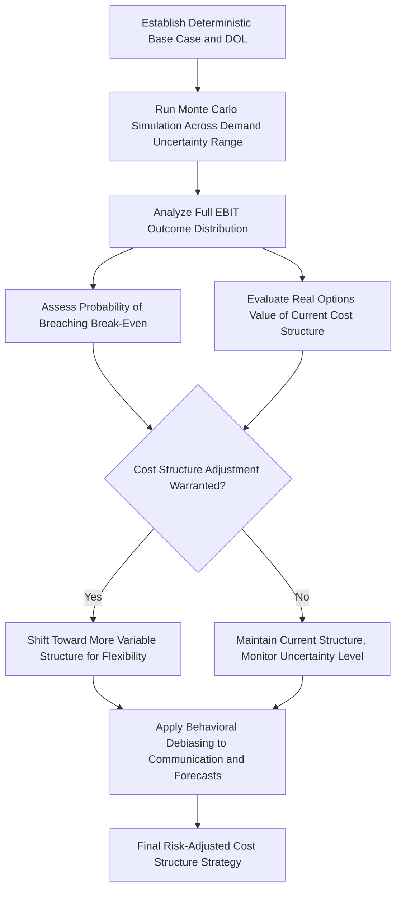

## Operating Leverage Under Demand Uncertainty

### Overview

This topic synthesizes and extends the operating leverage framework developed throughout this chapter specifically for conditions of elevated demand uncertainty — where the standard deterministic DOL calculation, built on a single expected-value forecast, becomes an incomplete (and potentially misleading) description of a company's true risk profile. It integrates Monte Carlo simulation, real options theory, and behavioral considerations covered elsewhere in this chapter into a unified treatment of how operating leverage should be analyzed, communicated, and managed when the underlying demand driver is itself highly uncertain rather than confidently forecastable.

### Why Deterministic DOL Is Insufficient Under High Uncertainty

**Key Points**

- The standard DOL formula ($DOL = CM/EBIT$) is computed at a single point — a specific assumed volume level — and describes the *local* sensitivity of EBIT to a small change in volume around that point. Under high demand uncertainty, the relevant question is often not "what is the sensitivity around our base case" but "what is the full distribution of possible outcomes across a wide range of plausible volumes," which a single-point DOL figure does not directly answer.
- Because DOL itself is not constant across volume levels (it is highest near break-even and moderates further from it, as established early in this chapter), a company facing genuinely wide demand uncertainty may have a demand distribution that spans multiple very different DOL regimes simultaneously — meaning a single "the company's DOL is X" statement can be actively misleading if the plausible demand range straddles break-even.
- This is precisely the situation where the **Monte Carlo simulation** techniques covered earlier in this chapter become most valuable relative to a simple deterministic DOL calculation — simulation captures the full distribution of outcomes across the uncertain demand range, rather than a single local sensitivity measure.

### Distinguishing Types of Demand Uncertainty

Not all demand uncertainty is equivalent from a cost structure risk-management perspective, and the appropriate analytical and strategic response differs by type:

| Uncertainty Type | Description | Cost Structure Implication |
| --- | --- | --- |
| **Cyclical uncertainty** | Demand varies predictably (though not perfectly) with the macroeconomic cycle | Historical cycle data can inform probability distributions for Monte Carlo simulation; beta/systematic risk framework (see earlier topic) is directly applicable |
| **Idiosyncratic/company-specific uncertainty** | Demand uncertainty driven by firm-specific factors (new product success, customer concentration risk, competitive dynamics) | Less amenable to beta-based systematic risk framing; more relevant to company-specific stress testing and real options analysis |
| **Structural/secular uncertainty** | Uncertainty about a fundamental, potentially permanent shift in demand (e.g., technological disruption, changing consumer preferences) | Real options framework (option to abandon, switch) is particularly relevant, since traditional probability-weighted scenario analysis may understate genuine "unknown unknown" risk |
| **Event-driven uncertainty** | Discrete, identifiable potential shocks (regulatory decision, litigation outcome, geopolitical event) with a specific resolution date | Scenario analysis with explicit before/after event framing is often more appropriate than continuous probability distributions |

[Inference: this typology is a pedagogical organizing framework for connecting different demand uncertainty sources to the appropriate analytical tool covered elsewhere in this chapter, rather than an exhaustive or universally standardized academic taxonomy — in practice, most real companies face some combination of multiple uncertainty types simultaneously, requiring a blended analytical approach.]

### Integrating DOL, Monte Carlo, and Real Options: A Combined Framework

**Step 1 — Establish the deterministic base case and DOL** (as covered in the CVP and operating leverage modeling topics): compute base-case EBIT, contribution margin, and DOL at the expected/most-likely demand level, providing the standard reference point.

**Step 2 — Run Monte Carlo simulation across the demand uncertainty range** (as covered in the dedicated Monte Carlo topic): generate the full probability distribution of EBIT outcomes, explicitly capturing how DOL's non-constant nature across volume levels affects the shape of that distribution — particularly useful for identifying the probability of crossing below break-even, which a single-point DOL calculation cannot directly provide.

**Step 3 — Evaluate whether the cost structure itself should be adjusted given the uncertainty level** (as covered in the real options topic): given the observed width and shape of the simulated outcome distribution, assess whether the current fixed/variable cost mix appropriately reflects the value of preserved operating flexibility, or whether the uncertainty level warrants a deliberate shift toward more variable-cost, flexible arrangements (or, conversely, whether sufficiently low uncertainty might justify capturing fixed-cost scale economies more aggressively).

**Step 4 — Apply behavioral debiasing techniques throughout** (as covered in the behavioral biases topic): present DOL and simulation results as ranges rather than false-precision points, explicitly pre-commit to falsifiability criteria for any cost-structure-related thesis, and guard against anchoring on a single historical margin trajectory when the demand environment has genuinely become more uncertain.

### Diagram: Integrated Framework for Operating Leverage Under Uncertainty (svg_diagram)

### Worked Illustration: Combining the Frameworks

**Setup:** A company has a base-case demand forecast of 50,000 units, with Price $40, Variable Cost $25/unit, Fixed Costs $600,000.

**Step 1 — Deterministic base case:**

$$CM = 50{,}000 \times 15 = \$750{,}000$$

$$EBIT = 750{,}000 - 600{,}000 = \$150{,}000$$

$$DOL = 750{,}000/150{,}000 = 5.0$$

A DOL of 5.0 already signals meaningful earnings sensitivity even at the base case.

**Step 2 — Monte Carlo simulation** using a triangular demand distribution (minimum 30,000, most likely 50,000, maximum 65,000 units — reflecting genuinely wide uncertainty), holding price and variable cost fixed:

Illustrative simulation output (conceptual, not an actual randomized run):

- Expected EBIT: approximately $155,000 (close to, but not exactly equal to, the deterministic base case — a common feature when the underlying demand distribution is asymmetric, as this triangular distribution is)
- Standard deviation of EBIT: approximately $140,000 (very high relative to expected EBIT, reflecting the combination of wide demand uncertainty and high DOL amplifying that uncertainty into EBIT)
- Probability of negative EBIT (operating loss): approximately 18% (since the break-even volume of 40,000 units — $600{,}000/15$ — falls within the plausible demand range, a meaningful probability mass of the simulated outcomes falls below it)

**Step 3 — Real options evaluation:** Given an 18% simulated probability of an operating loss, and demand uncertainty that appears to be **structural** (e.g., driven by genuine uncertainty about a new market's adoption rate, an idiosyncratic/structural uncertainty type per the typology above) rather than purely cyclical, the analysis suggests real options value may be significant — the company might reasonably evaluate whether shifting toward a more variable-cost operating model (e.g., outsourcing a portion of production, using flexible staffing) would reduce this 18% loss probability, even at some cost to per-unit economics at the most-likely demand level, given the material downside risk the simulation has quantified.

**Step 4 — Behavioral debiasing:** Rather than presenting management or investors with the single deterministic figure ("DOL is 5.0, expected EBIT is $150,000"), the analysis is communicated as a range with explicit downside probability ("expected EBIT of approximately $150,000-155,000, with an estimated 18% probability of an operating loss given current demand uncertainty and cost structure") — directly applying the range-based, false-precision-avoiding communication approach recommended in the behavioral biases topic.

### Strategic Cost Structure Responses to Elevated Demand Uncertainty

Building on the real options and startup transformation topics, several concrete strategic responses are commonly employed when demand uncertainty is assessed as elevated:

| Strategic Response | Mechanism | Trade-Off |
| --- | --- | --- |
| **Shift toward variable cost arrangements** | Convert fixed commitments (owned capacity, permanent headcount) to variable ones (outsourcing, contractors, usage-based infrastructure) | Reduces DOL and downside risk; typically increases per-unit cost at any given volume level |
| **Stage capital investment** | Build capacity in smaller increments rather than one large commitment | Preserves the option to halt expansion if demand disappoints; may sacrifice economies of scale |
| **Negotiate flexible contract terms** | Shorter lease terms, volume-flexible supplier agreements, cancellation clauses | Preserves optionality; often carries a pricing premium relative to rigid, long-term commitments |
| **Maintain a larger cash/liquidity buffer** | Hold additional cash reserves specifically sized to the simulated downside scenario | Directly addresses the quantified loss probability without altering the underlying cost structure; carries an opportunity cost of capital not deployed elsewhere |
| **Diversify demand drivers** | Reduce reliance on a single customer, product, or end market whose uncertainty is driving the elevated risk | Addresses idiosyncratic uncertainty specifically; may not help with broad cyclical or structural uncertainty affecting the entire diversified base |

### Connecting Back to Investor Communication

The investor interpretation topic covered earlier in this chapter emphasized how investors should interpret guidance and results from high-DOL companies; this topic's uncertainty-explicit framing suggests that **companies facing both high DOL and high demand uncertainty simultaneously** warrant a particularly careful and explicit approach to guidance and disclosure:

- Providing a guidance **range** (rather than a point estimate) that appropriately reflects the width of the underlying demand uncertainty, rather than a false-precision single figure that a high-DOL, high-uncertainty business cannot realistically be expected to hit precisely.
- Explicitly disclosing (to the extent competitively feasible) the qualitative nature of the demand uncertainty being faced (cyclical, idiosyncratic, structural, or event-driven, per the typology above), helping investors apply the appropriate analytical lens rather than treating all guidance uncertainty as equivalent.
- Considering, where material, disclosing the cost structure flexibility levers available (e.g., "approximately X% of our cost base could be reduced within two quarters if demand disappoints") — directly informing investors' own real-options-style assessment of the company's downside resilience, beyond what a simple margin or DOL disclosure alone would convey.

### Common Errors in Analyzing Operating Leverage Under Uncertainty

| Error | Consequence | Correction |
| --- | --- | --- |
| Relying solely on a deterministic, single-point DOL calculation when demand uncertainty is genuinely wide | Understates true risk, particularly the probability of breaching break-even | Layer Monte Carlo simulation on top of the deterministic DOL calculation when uncertainty is elevated |
| Treating all demand uncertainty as equivalent regardless of source | Applies the wrong analytical tool (e.g., beta-based systematic risk framing for genuinely idiosyncratic uncertainty) | Classify the uncertainty type (cyclical, idiosyncratic, structural, event-driven) before selecting the primary analytical approach |
| Failing to consider real options value when uncertainty is high | Potentially maintains a suboptimal, inflexible cost structure given the actual risk environment | Explicitly evaluate whether elevated uncertainty warrants a shift toward more variable-cost, flexible arrangements |
| Communicating point estimates without acknowledging genuine uncertainty | Sets up unrealistic expectations and invites the behavioral biases discussed in the prior topic (overconfidence, anchoring) | Communicate ranges and explicit downside probabilities, particularly for high-DOL, high-uncertainty businesses |

**Related Topics**

- Monte Carlo simulation of cost structure outcomes
- Real options theory and operating flexibility
- Behavioral biases in interpreting cost structure and leverage
- Stress testing profitability under volume declines
- Investor interpretation of high operating leverage companies
- Startup cost structure transformation case study