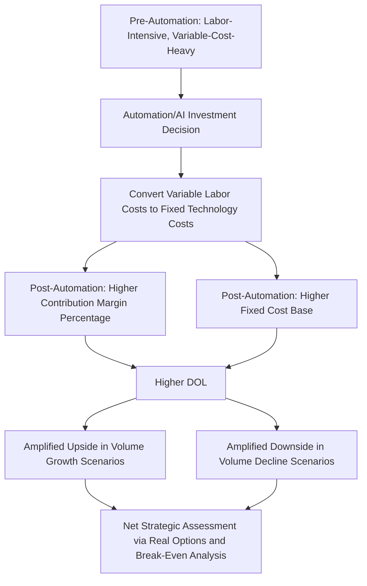

## Cost Structure Implications of Automation and Artificial Intelligence

### Overview

Automation and artificial intelligence adoption represent one of the most significant contemporary drivers of deliberate cost structure transformation, systematically shifting costs from variable, labor-based expenses toward fixed, capital-based expenses (technology infrastructure, software licensing, upfront development costs). This topic applies the CVP, DOL, real options, and behavioral frameworks developed throughout this chapter specifically to the automation/AI adoption decision, examining both the mechanical cost structure consequences and the strategic and risk considerations that arise from this transformation.

### The Core Cost Structure Shift: Labor (Variable) to Technology (Fixed)

**Key Points**

- Traditional labor-intensive processes typically carry cost characteristics closer to variable costs — additional headcount can be added or reduced (with some lag and friction) in response to changing volume, and compensation costs scale at least roughly with the number of workers required to handle a given workload.
- Automation and AI systems typically involve substantial upfront fixed costs — software licensing or development, infrastructure/computing costs, integration and implementation expenses, and ongoing maintenance/subscription fees — that do not scale directly with transaction or unit volume in the way labor costs traditionally have, particularly once the automated system architecture is established.
- This produces a direct, mechanical application of the operating leverage framework: **automation-driven cost structure transformation systematically increases DOL**, converting what was previously a more variable-cost, lower-DOL operation into a more fixed-cost, higher-DOL one — with all the amplification consequences (both upside and downside) that this chapter has developed at length.

### Illustrative Before/After Cost Structure Comparison

| Metric | Pre-Automation (Labor-Intensive) | Post-Automation (Technology-Intensive) |
| --- | --- | --- |
| Revenue | $25,000,000 | $25,000,000 |
| Variable Costs (labor tied to volume) | $15,000,000 (60%) | $4,000,000 (16%) |
| Contribution Margin | $10,000,000 (40%) | $21,000,000 (84%) |
| Fixed Costs (base overhead + new technology/licensing/infrastructure) | $7,000,000 | $17,500,000 |
| EBIT | $3,000,000 | $3,500,000 |
| EBIT Margin | 12.0% | 14.0% |
| DOL | 3.33 | 6.00 |

[Inference: this illustrative comparison is stylized to demonstrate the directional mechanical effect of automation on cost structure and DOL — actual pre/post economics for any specific automation initiative depend heavily on the specific technology, implementation costs, achievable labor cost savings, and the scale at which the automation investment breaks even, all of which require company- and initiative-specific analysis rather than being derivable from this generic illustration.]

**Interpretation:** Even though the automation initiative in this example modestly improves the base-case EBIT margin (from 12.0% to 14.0%), it nearly doubles DOL (from 3.33 to 6.00) — meaning the post-automation business, despite looking marginally more profitable at the current volume level, is now substantially more sensitive to volume changes in both directions. This is the central cost-structure tension of automation investment that this topic examines.

### Diagram: Automation-Driven Cost Structure Transformation (svg_diagram)

### Applying Break-Even and Stress Testing to the Automation Decision

Using the illustrative figures above, the break-even volume implications of the automation decision can be directly assessed using the CVP framework from earlier in this chapter:

$$Break\text{-}Even\ Revenue_{Pre} = \frac{7{,}000{,}000}{0.40} = \$17{,}500{,}000$$

$$Break\text{-}Even\ Revenue_{Post} = \frac{17{,}500{,}000}{0.84} = \$20{,}833{,}333$$

$$Margin\ of\ Safety_{Pre} = \frac{25{,}000{,}000-17{,}500{,}000}{25{,}000{,}000} = 30.0\%$$

$$Margin\ of\ Safety_{Post} = \frac{25{,}000{,}000-20{,}833{,}333}{25{,}000{,}000} = 16.7\%$$

The post-automation structure requires a materially higher revenue base to break even, and its margin of safety nearly halves — directly consistent with, and a direct application of, the margin-of-safety and DOL mechanics established throughout this chapter. A company evaluating an automation investment should explicitly compute this break-even shift, not just the projected EBIT improvement at current volume, since the automation decision's true risk consequence is only fully visible through this break-even/margin-of-safety lens.

### Real Options Framing of the Automation Decision

Connecting directly to the real options theory topic: committing to a large, fixed-cost automation investment can be understood as **forgoing the contraction option** that the prior labor-intensive, variable-cost structure provided — a relevant consideration precisely when the future volume trajectory supporting the automation investment is uncertain.

- **Staged automation implementation** (automating one process or business unit at a time, rather than a single large enterprise-wide commitment) directly applies the "staged investment" real option discussed earlier, preserving the ability to halt or adjust the automation rollout based on observed results at each stage, rather than committing the full fixed cost investment upfront based on a single point-estimate business case.
- **Hybrid/flexible automation approaches** — such as cloud-based AI services billed on a usage basis rather than large upfront licensing or infrastructure builds — can partially preserve variable-cost characteristics even while capturing some automation benefits, directly analogous to the "switching option" and general flexibility-preservation themes discussed in the real options topic. This is a genuinely emerging and evolving area of technology architecture choice with direct cost structure consequences. [Unverified: the specific pricing models, cost structures, and capability trade-offs of usage-based versus infrastructure-owned AI/automation deployment continue to evolve rapidly; a technology or vendor-specific claim in this area would need to be verified against current documentation rather than assumed to be static.]
- **The option to delay** an automation investment until demand/volume trajectory is more certain has real value under the framework developed earlier — but must be weighed against the potential competitive disadvantage of delaying automation adoption relative to competitors who move first, a consideration somewhat distinct from the pure demand-uncertainty framing that dominates most real options discussions in this chapter.

### Behavioral Considerations Specific to Automation/AI Cost Structure Decisions

Connecting to the behavioral biases topic, automation and AI investment decisions are particularly susceptible to certain biases given the current prominence and momentum of AI adoption narratives:

- **Herding behavior:** Given substantial industry-wide attention to AI adoption, there is a risk that automation/AI investment decisions are made partly in response to competitive or investor pressure to demonstrate "AI strategy" rather than purely on the basis of rigorous cost structure and break-even analysis specific to the company's own situation.
- **Overoptimism about labor cost savings:** Automation business cases can be susceptible to overoptimistic assumptions about achievable labor cost reduction, implementation timelines, and the productivity of the resulting automated process — the overoptimism bias discussed in the behavioral topic is directly relevant to building automation business cases, and a rigorous DOL and break-even analysis (grounded in conservative, well-supported cost assumptions) provides a partial structural check against this tendency.
- **Sunk cost dynamics in ongoing automation investment:** Once a substantial fixed-cost automation investment has been made, sunk cost fallacy could lead management to continue investing in or defending the automation initiative even if evolving evidence suggests the underlying business case (labor savings, volume assumptions) was flawed — directly analogous to the sunk cost fallacy discussed in the management-side behavioral biases topic.

### Investor and Equity Research Considerations for Automation-Driven Cost Structure Change

Applying the equity research and investor interpretation frameworks from earlier in this chapter specifically to companies undergoing automation-driven cost structure transformation:

- **Re-estimating DOL following disclosed automation initiatives:** an equity analyst covering a company that discloses a significant automation or AI investment program should explicitly re-estimate the company's fixed/variable cost decomposition and resulting DOL, rather than continuing to apply a pre-automation cost structure assumption — directly connecting to the cost structure signal of "reclassification between fixed and variable categories" discussed in the earnings quality topic, since automation genuinely does reclassify costs (in this case for a substantive operational reason, not merely an accounting presentation choice).
- **Distinguishing genuine structural margin improvement from automation versus temporary factors:** consistent with the earnings quality framework, an analyst should verify that margin improvement attributed to "AI/automation efficiency gains" reflects a genuine, sustainable reduction in the variable cost base (or a genuine, durable fixed-cost leverage benefit) rather than a temporary cost action coincidentally timed with an automation initiative announcement.
- **Beta and cost of equity implications:** per the operating leverage and beta topic, a company that has meaningfully increased its DOL through automation would be expected, all else equal, to exhibit somewhat higher asset beta and cost of equity going forward — an analyst updating a valuation model following a disclosed automation transformation should consider whether the beta/discount rate assumption should be revisited alongside the margin assumption, rather than updating only the margin forecast while leaving the discount rate unchanged.

### Common Errors in Analyzing Automation Cost Structure Decisions

| Error | Consequence | Correction |
| --- | --- | --- |
| Evaluating automation investment purely on projected EBIT margin improvement at current volume | Ignores the break-even and margin-of-safety deterioration that typically accompanies the fixed-cost increase | Explicitly compute pre- and post-automation break-even volume and margin of safety, not just projected EBIT at current volume |
| Treating automation-driven margin improvement as automatically durable and structural | May overlook that some announced "automation savings" reflect coincidental timing with other temporary cost actions | Apply the earnings quality decomposition framework to verify the margin improvement is genuinely and durably tied to the automation initiative |
| Failing to update beta/discount rate assumptions following a disclosed automation-driven DOL increase | Produces an internally inconsistent valuation model (higher margin assumption, unchanged discount rate) | Revisit both the margin forecast and the beta/cost of equity assumption together following a material cost structure shift |
| Committing to a large, single-stage automation investment without considering staged alternatives | Forgoes the real options value of a staged approach under demand or execution uncertainty | Evaluate staged/modular automation implementation as a real-options-informed alternative to a single large commitment |
| Assuming automation adoption decisions are made purely rationally, free of herding or overoptimism bias | May overlook a mismatch between the automation business case's assumptions and objectively supportable cost savings estimates | Apply the debiasing techniques from the behavioral biases topic (range-based estimates, pre-committed falsifiability criteria) specifically to automation business cases |

### Validation and Auditing Practices

- **Break-even reconciliation:** Confirm the pre- and post-automation break-even calculations are each internally consistent with their respective fixed/variable cost decompositions, and that the projected labor cost savings and new technology costs are both reflected accurately in the respective cost lines.
- **DOL sensitivity disclosure:** Given the potentially substantial DOL increase from automation, present the post-automation DOL and margin-of-safety figures alongside the projected margin improvement, rather than presenting only the margin improvement in isolation.
- **Cross-check against actual realized labor cost savings:** Where an automation initiative has been implemented for a sufficient period, back-test the originally projected labor cost savings against actual realized savings, applying similar rigor to the overoptimism-checking practices discussed in the behavioral biases topic.

**Related Topics**

- Real options theory and operating flexibility
- Behavioral biases in interpreting cost structure and leverage
- Operating leverage and earnings volatility effects on beta
- Cost structure signals in earnings quality analysis
- Estimating fixed vs. variable costs from financial statements
- Startup cost structure transformation case study