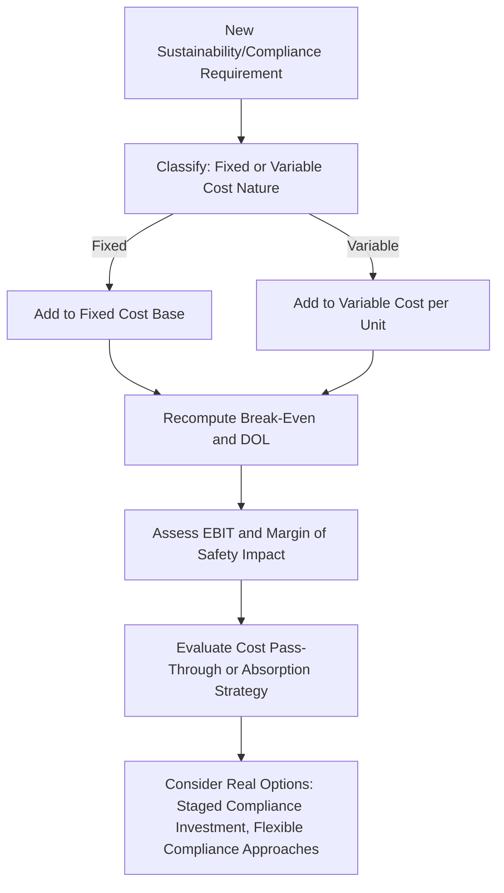

## Sustainability and Compliance Driven Fixed Cost Considerations

### Overview

Sustainability regulation and compliance requirements represent a growing and distinctive category of fixed cost that companies increasingly must incorporate into cost structure analysis — encompassing environmental compliance systems, emissions monitoring and reporting infrastructure, sustainability disclosure and audit costs, and capital investments driven by regulatory or stakeholder-imposed environmental standards. This topic applies the CVP, DOL, and real options frameworks developed throughout this chapter specifically to this emerging and evolving category of fixed cost, while treating the specific regulatory landscape as an area requiring verification against current sources given its continued evolution.

### Characterizing Sustainability and Compliance Costs Within the Cost Structure Framework

**Key Points**

- Many sustainability and compliance-driven costs exhibit classically fixed characteristics: reporting and disclosure system infrastructure, dedicated compliance/sustainability staffing, third-party audit and assurance fees, and capital investments in emissions-reduction or monitoring equipment typically do not scale directly with unit sales volume, instead representing a largely fixed cost layer that must be incurred regardless of production or sales levels within a given reporting period.
- Some compliance-related costs are more genuinely variable — for example, per-unit carbon costs under certain cap-and-trade or carbon tax regimes, or per-shipment costs associated with certain environmental compliance documentation — making a careful case-by-case classification necessary rather than assuming all sustainability-related costs behave identically.
- Because much of this cost category is fixed, its addition to a company's cost base has the same mechanical DOL-increasing effect discussed in the automation topic — a company facing new, substantial fixed sustainability/compliance costs will, all else equal, see its DOL rise, with the attendant amplification of both upside and downside earnings sensitivity developed throughout this chapter.

### Illustrative Categories of Sustainability/Compliance-Driven Fixed Costs

| Cost Category | Nature | Illustrative Examples |
| --- | --- | --- |
| Disclosure and reporting infrastructure | Fixed | Software systems for emissions tracking, sustainability data management, dedicated reporting staff |
| Third-party assurance and audit | Fixed (though may scale modestly with company size/complexity) | External audit of sustainability disclosures, verification of emissions data |
| Compliance monitoring equipment | Fixed (capital investment, often depreciated over time) | Emissions monitoring sensors, water treatment or filtration systems, waste management infrastructure |
| Regulatory/legal compliance staffing | Fixed | Dedicated environmental compliance officers, regulatory affairs staff |
| Certification and standards compliance | Fixed (often periodic/renewal-based) | Costs of obtaining and maintaining specific environmental or sustainability certifications |
| Carbon pricing/emissions costs | Can be variable (per-unit emissions cost) or fixed (if structured as a compliance program cost rather than a per-unit charge) | Cap-and-trade allowance purchases, carbon tax payments — classification depends on the specific regulatory mechanism |

[Inference: this categorization reflects general cost-behavior principles applied to a broad description of sustainability/compliance cost types, but the specific regulatory frameworks, disclosure requirements, and their associated cost structures vary substantially by jurisdiction and continue to evolve — any application to a specific company or regulatory regime should be verified against current, jurisdiction-specific regulatory sources rather than treated as a fixed, universal framework.]

### CVP and DOL Application to a Compliance-Driven Fixed Cost Increase

**Illustrative example:** A company faces a new regulatory requirement mandating emissions monitoring and annual third-party sustainability assurance, adding $2,200,000 in new annual fixed costs to an existing cost structure.

| Metric | Before New Compliance Costs | After New Compliance Costs |
| --- | --- | --- |
| Revenue | $60,000,000 | $60,000,000 |
| Contribution Margin (45%) | $27,000,000 | $27,000,000 |
| Fixed Costs | $21,000,000 | $23,200,000 |
| EBIT | $6,000,000 | $3,800,000 |
| EBIT Margin | 10.0% | 6.3% |
| DOL | 4.50 | 7.11 |
| Break-Even Revenue | $46,666,667 | $51,555,556 |
| Margin of Safety | 22.2% | 14.1% |

**Interpretation:** The new compliance-driven fixed cost, even though it represents a relatively modest absolute addition ($2.2M) relative to total revenue, produces a substantial proportional EBIT decline (from $6.0M to $3.8M, a 36.7% reduction) and a meaningful DOL increase (from 4.50 to 7.11) — directly illustrating how new fixed cost layers, including regulatory/compliance-driven ones, compound with an existing cost structure to affect both current profitability and forward earnings sensitivity, precisely the mechanical relationship this chapter has developed throughout.

### Diagram: Compliance-Driven Fixed Cost Integration (svg_diagram)

### Strategic Responses: Cost Pass-Through, Absorption, and Timing

Companies facing new sustainability/compliance-driven fixed costs generally have several strategic response categories, each with distinct cost structure implications:

- **Price pass-through:** Raising prices to offset the new fixed cost, which — if fully successful — restores the original margin percentage but does not address the underlying DOL increase (since the added cost remains fixed regardless of the pricing response), meaning the company's *earnings sensitivity* to volume changes is still elevated even if its *margin at the base-case volume* is restored.
- **Cost absorption:** Accepting the margin compression shown in the illustrative example above, without a pricing response — directly reducing near-term EBIT and margin of safety, as shown.
- **Structural cost mitigation:** Seeking ways to convert what would otherwise be a purely fixed compliance cost into a more variable or shared-cost arrangement — for example, participating in industry-wide or shared compliance infrastructure/reporting consortiums rather than building fully dedicated in-house systems, or using third-party compliance-as-a-service providers with usage-based pricing rather than large fixed internal investments — directly analogous to the flexible/hybrid technology adoption approaches discussed in the automation topic.
- **Timing and staging:** Where regulatory phase-in periods or voluntary early-adoption timing flexibility exist, staging the compliance investment (implementing in phases rather than all at once) applies the same staged-investment real options logic discussed in the real options and automation topics, preserving some flexibility to adjust the pace of investment based on how the regulatory landscape and the company's own volume trajectory evolve.

### Real Options Considerations Specific to Sustainability/Compliance Costs

Sustainability and compliance costs present a distinctive real options dimension because the regulatory landscape itself carries genuine uncertainty — requirements may tighten, loosen, be delayed, or be implemented differently than currently anticipated, distinct from the demand-uncertainty framing that has been the primary focus of the real options treatment elsewhere in this chapter:

- **Regulatory uncertainty as a distinct uncertainty type:** connecting to the "event-driven" and "structural/secular" uncertainty types discussed in the operating leverage under demand uncertainty topic, regulatory compliance requirements often resolve at discrete points in time (a rule finalization, a compliance deadline) rather than evolving continuously — making explicit scenario analysis around specific regulatory decision points often more appropriate than a continuous probability distribution approach.
- **Option value of flexible/modular compliance infrastructure:** given genuine uncertainty about the ultimate scope and stringency of sustainability disclosure and compliance requirements in many jurisdictions, investing in more modular, scalable compliance infrastructure (that can be expanded if requirements tighten, without requiring a complete rebuild) preserves valuable optionality relative to committing to a single, rigid compliance system architecture sized only for currently-known requirements.
- **Early-mover versus wait-and-see trade-offs:** similar to the automation adoption timing discussion, companies must weigh the option value of delaying compliance infrastructure investment until requirements are more definitively settled against the potential competitive, reputational, or last-minute-implementation-cost disadvantages of waiting — a trade-off that depends significantly on the specific regulatory trajectory and competitive context, which should be assessed using current, jurisdiction-specific information rather than generic assumptions.

### Investor and Equity Research Considerations

Applying the equity research and investor interpretation frameworks from earlier in this chapter to sustainability/compliance-driven cost structure changes:

- **Distinguishing one-time implementation costs from ongoing fixed cost increases:** an analyst evaluating a company's disclosed compliance-related costs should distinguish between one-time setup/implementation costs (which may not recur) and the ongoing, recurring fixed cost layer (staffing, systems maintenance, recurring audit fees) that will persist and affect the company's DOL on a continuing basis — conflating the two would misstate the durable impact on the cost structure.
- **Cross-company comparability challenges:** given that sustainability/compliance regulatory requirements can vary substantially by jurisdiction, industry, and company size, comparability of disclosed compliance costs across peer companies requires care — a peer operating in a less stringent regulatory jurisdiction may show a structurally different (lower) compliance-driven fixed cost layer that does not reflect superior operational efficiency, but rather a different regulatory environment.
- **Monitoring forward regulatory trajectory:** given the continued evolution of sustainability disclosure and compliance requirements in many jurisdictions, equity analysts covering affected industries should treat this as an area requiring ongoing monitoring of current regulatory developments (via web search or direct regulatory source review) rather than relying on a static, point-in-time understanding of the applicable requirements — this topic's treatment of the cost structure mechanics is durable, but the specific regulatory landscape it applies to is genuinely dynamic. [Unverified: specific current regulatory requirements, disclosure mandates, and compliance deadlines vary by jurisdiction and continue to change; any application requiring current regulatory specifics should be verified against up-to-date, jurisdiction-specific sources rather than assumed from this general framework.]

### Common Errors in Analyzing Sustainability/Compliance Fixed Cost Impacts

| Error | Consequence | Correction |
| --- | --- | --- |
| Treating all sustainability/compliance costs as uniformly fixed without case-by-case classification | Misstates DOL and break-even impact, particularly where genuinely variable carbon-pricing-type costs are present | Classify each specific compliance cost component individually based on its actual scaling behavior |
| Evaluating a compliance cost increase purely on its absolute dollar impact to EBIT | Misses the disproportionate DOL and margin-of-safety effect relative to the dollar amount, as the worked example demonstrates | Explicitly recompute DOL, break-even, and margin of safety following any material new fixed compliance cost layer |
| Assuming a price pass-through fully neutralizes the cost structure impact | Overlooks that pass-through restores margin at the base-case volume but does not reduce the underlying DOL/earnings-sensitivity increase | Recognize that pricing response and DOL impact are distinct considerations requiring separate assessment |
| Comparing compliance cost burden across companies in different regulatory jurisdictions without adjustment | Misattributes a jurisdictional/regulatory difference to operational efficiency differences | Adjust or contextualize compliance cost comparisons for jurisdiction-specific regulatory stringency differences |
| Treating the current regulatory requirement set as fixed and unchanging for long-range forecasting purposes | Fails to account for genuine regulatory evolution risk | Explicitly incorporate regulatory uncertainty into scenario analysis and monitor current developments rather than assuming static requirements |

### Validation and Auditing Practices

- **Cost classification review:** Periodically reassess whether previously-classified fixed compliance costs remain accurately characterized, particularly as regulatory mechanisms evolve (e.g., a mechanism initially structured as a fixed program fee could be redesigned as a per-unit charge, changing its cost behavior classification).
- **DOL and margin-of-safety recomputation:** Following any material new compliance-driven cost layer, explicitly recompute and disclose (internally, and to investors where material) the resulting DOL and margin-of-safety change, rather than presenting only the absolute EBIT impact in isolation.
- **Regulatory currency check:** Given the genuinely evolving nature of this cost category, confirm that any analysis relying on specific current regulatory requirements has been checked against up-to-date sources before being used for a decision with a multi-year time horizon.

**Related Topics**

- Cost structure implications of automation and artificial intelligence
- Real options theory and operating flexibility
- Operating leverage under demand uncertainty
- Stress testing profitability under volume declines
- Cost structure signals in earnings quality analysis
- Cross-jurisdictional regulatory compliance cost comparison