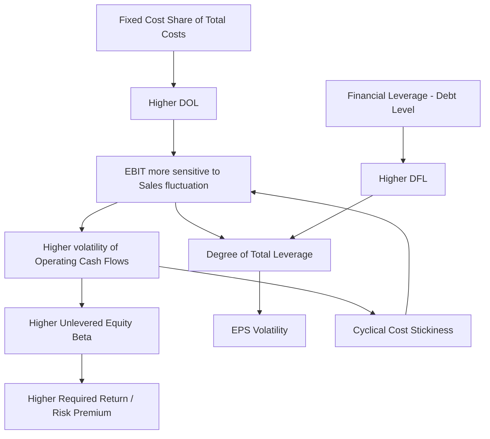

## Academic Research on Cross Industry Operating Leverage Patterns

### Overview

Academic research on operating leverage (OL) examines how the fixed-to-variable cost ratio of a firm's production function amplifies the sensitivity of operating income to changes in revenue, and how this sensitivity varies systematically across industries, over the business cycle, and in its interaction with financial leverage and asset pricing. This body of work spans corporate finance, accounting, and asset pricing literatures, and traces back to early cost-accounting formalizations before being absorbed into empirical asset-pricing tests of risk and returns.

### Foundational Theoretical Framework

**Degree of Operating Leverage (DOL)**

The canonical formalization treats DOL as an elasticity:

$$DOL = \frac{\%\Delta EBIT}{\%\Delta Sales}$$

Equivalently, using the contribution-margin decomposition:

$$DOL = \frac{Q(P - V)}{Q(P - V) - F}$$

where $Q$ is quantity, $P$ is price per unit, $V$ is variable cost per unit, and $F$ is fixed costs.

- [Inference] Firms with $F$ close to zero converge toward $DOL \to 1$, meaning operating income moves roughly proportionally with sales.
- As $F$ grows relative to the contribution margin, $DOL$ increases, meaning small revenue changes produce magnified EBIT changes.

**Key Points**

- DOL is a point-elasticity measure — it changes with the operating volume at which it is evaluated, not a fixed firm characteristic.
- Academic treatments distinguish *accounting* operating leverage (measured from cost behavior in financial statements) from *economic* operating leverage (a theoretical construct tied to the firm's underlying production technology and often unobservable directly).

### The Sticky Cost Literature and Asymmetric Cost Behavior

A major branch of accounting research — most associated with the traditional cost-volume-profit (CVP) model's critique — challenges the assumption that variable costs move proportionally with volume in both directions.

- The "sticky costs" hypothesis holds that costs rise more with a sales increase than they fall with an equivalent sales decrease, because managers incur adjustment costs (severance, contract termination penalties) when downsizing resources and are reluctant to do so if they expect the decline to be temporary.
- This asymmetry means empirically estimated DOL from historical cost-to-sales regressions can be biased if the sample period conflates expansion and contraction phases without accounting for the direction of change.
- [Inference] The sticky-cost framework implies that operating leverage measured naively during economic expansions understates the true earnings amplification firms will experience in a downturn, since cost bases resist rapid downward adjustment.

**Related empirical constructs:**

- Cost stickiness degree, typically estimated via a two-piece log-log regression of cost changes on revenue increases versus decreases.
- Anti-stickiness (cost "anti-stickiness" or "cost inertia") observed in some capital-intensive industries where cost reductions during downturns *exceed* proportional increases during upturns, often via aggressive layoffs.

### Cross-Industry Variation: Empirical Patterns

Research consistently documents that operating leverage is not uniform across sectors, driven by underlying production technology, capital intensity, and labor contracts.

| Industry Category | Typical Fixed-Cost Intensity | Representative Drivers |
| --- | --- | --- |
| Airlines | Very High | Aircraft leases/depreciation, crew base costs, slot fees |
| Semiconductors / Fabs | Very High | Fab construction, cleanroom maintenance, equipment depreciation |
| Utilities | High | Generation and distribution infrastructure |
| Heavy Manufacturing / Steel | High | Plant and equipment, long asset lives |
| Software (SaaS) | High (but different structure) | R&D and infrastructure fixed relative to marginal distribution cost near zero |
| Pharmaceuticals (branded) | High | R&D sunk costs, regulatory fixed costs |
| Retail (traditional) | Moderate | Store leases (fixed-ish), but store-level labor semi-variable |
| Staffing / Consulting Services | Low | Labor scales closely with billed hours |
| Agriculture (commodity) | Low–Moderate | Variable input costs dominate (seed, fertilizer, labor) |

**Key Points**

- Capital-intensive industries with high depreciation and long-lived, illiquid assets systematically exhibit higher measured DOL.
- Labor-intensive service industries with flexible staffing arrangements exhibit structurally lower DOL, though unionized labor markets can push effective fixed-cost share upward via rigid wage/benefit obligations regardless of nominal "variable" labor classification.
- [Inference] Digital/software business models exhibit a distinct pattern: high fixed cost of initial product/infrastructure development combined with near-zero marginal cost of service to an additional customer, producing DOL dynamics that resemble traditional heavy industry despite having no physical capital base.

### Operating Leverage and Systematic Risk (Asset Pricing Literature)

A substantial finance literature links operating leverage to equity risk premia and the cross-section of stock returns, building on the intuition that fixed costs act like a form of implicit debt.

- The theoretical linkage: fixed operating costs represent a "quasi-fixed claim" on cash flow analogous to debt service, so a firm's *unlevered* equity beta already embeds operating leverage risk, not purely business/market risk in a cost-frictionless sense.
- Empirical asset-pricing tests generally find that proxies for operating leverage (e.g., the ratio of fixed costs, SG&A, or PP&E to total costs or assets) are positively associated with higher expected stock returns and higher equity betas, consistent with operating leverage being a priced risk factor.
- This literature connects to the broader "value premium" discussion: value stocks (high book-to-market) are frequently characterized as having relatively higher committed fixed-cost/capital structures acquired during more favorable conditions, making their cash flows more sensitive to demand downturns than growth stocks, which are argued to have more flexible/scalable cost structures — an explanation offered for why value stocks command a risk premium.
- [Inference] This asset-pricing channel is distinct from, but often confounded with, financial leverage effects in empirical work, requiring researchers to control for debt-to-equity ratios separately to isolate the pure operating-leverage risk channel.

### Interaction with Financial Leverage: Total Leverage

Academic work frequently combines operating and financial leverage into a **Degree of Total Leverage (DTL)**:

$$DTL = DOL \times DFL = \frac{\%\Delta EPS}{\%\Delta Sales}$$

- A documented cross-industry finding is a partial *substitution* pattern: industries with structurally high operating leverage (e.g., utilities, given their high fixed infrastructure costs) tend to carry lower financial leverage in equilibrium, and vice versa, consistent with firms managing total cash-flow risk to a bounded level rather than letting both leverage types compound unchecked.
- [Inference] This substitution pattern is not universal — capital-intensive sectors with highly collateralizable, stable-cash-flow assets (e.g., regulated utilities) can sustain *both* high operating and high financial leverage simultaneously because regulatory revenue guarantees dampen the effective cash-flow volatility that leverage would otherwise amplify.

### Operating Leverage Over the Business Cycle

- Research documents that measured operating leverage rises during recessions and falls during expansions for the same firm, contradicting a naive constant-DOL assumption; this is largely attributable to the sticky-cost mechanism above plus fixed costs becoming a larger share of a temporarily smaller revenue base (a denominator effect).
- Some studies find that this cyclicality itself is priced: firms whose operating leverage rises most sharply in downturns (i.e., firms with the least cost flexibility) exhibit the highest sensitivity to aggregate consumption or market-wide downturns, linking micro-level cost structure to macro asset-pricing risk factors.

### Methodological Challenges in Cross-Industry Studies

**Key Points**

- **Measurement**: Academic studies vary in whether they proxy fixed costs using SG&A, PP&E, depreciation, or a decomposed cost-of-goods-sold regression; results are sensitive to this choice, complicating cross-study and cross-industry comparability.
- **Endogeneity**: Firms choose their cost structure partly in response to expected demand volatility (a firm expecting stable demand may rationally invest in more automation/fixed capital), so cross-sectional regressions of "risk on operating leverage" face reverse-causality concerns.
- **Industry classification granularity**: Broad SIC/NAICS codes can mask significant within-industry heterogeneity (e.g., asset-light vs. asset-heavy business models coexisting within the same 4-digit code), which some more recent studies address via text-based or activity-based industry classification instead.
- [Unverified] The precise magnitude of the operating-leverage risk premium reported varies substantially across studies and sample periods, and consensus on its economic significance (versus being subsumed by other priced factors) is not settled in the literature.

### Diagram: Operating Leverage Risk Transmission Channel (svg_diagram)

### Illustrative Cross-Industry Comparison (Stylized)

<svg xmlns="http://www.w3.org/2000/svg" viewBox="0 0 640 340">
<text x="320" y="24" font-size="16" font-weight="bold" text-anchor="middle" fill="#1a1a1a">Stylized DOL vs. Fixed-Cost Share by Industry (svg_diagram)</text>
<line x1="70" y1="290" x2="600" y2="290" stroke="#333" stroke-width="1.5" />
<line x1="70" y1="290" x2="70" y2="50" stroke="#333" stroke-width="1.5" />
<text x="335" y="320" font-size="12" text-anchor="middle" fill="#333">Fixed-Cost Share of Total Costs</text>
<text x="25" y="170" font-size="12" text-anchor="middle" fill="#333" transform="rotate(-90 25 170)">Estimated DOL</text>
<circle cx="140" cy="260" r="6" fill="#2b6cb0" />
<text x="140" y="278" font-size="10" text-anchor="middle">Staffing</text>
<circle cx="220" cy="230" r="6" fill="#2b6cb0" />
<text x="220" y="248" font-size="10" text-anchor="middle">Retail</text>
<circle cx="330" cy="170" r="6" fill="#2b6cb0" />
<text x="330" y="188" font-size="10" text-anchor="middle">Manufacturing</text>
<circle cx="420" cy="120" r="6" fill="#2b6cb0" />
<text x="420" y="138" font-size="10" text-anchor="middle">SaaS</text>
<circle cx="480" cy="90" r="6" fill="#2b6cb0" />
<text x="480" y="108" font-size="10" text-anchor="middle">Utilities</text>
<circle cx="550" cy="65" r="6" fill="#c0392b" />
<text x="550" y="83" font-size="10" text-anchor="middle">Airlines</text>
<path d="M 100 275 Q 320 260 570 60" stroke="#888" stroke-width="1" fill="none" stroke-dasharray="4,3" />
</svg>

### Example

Consider two firms in different industries, each with $10,000,000 in sales:

- **Firm A (Staffing, low OL):** Variable costs = $8,500,000, Fixed costs = $1,000,000. Contribution margin = $1,500,000. EBIT = $500,000. $DOL = 1{,}500{,}000 / 500{,}000 = 3.0$
- **Firm B (Airline, high OL):** Variable costs = $4,000,000, Fixed costs = $5,000,000. Contribution margin = $6,000,000. EBIT = $1,000,000. $DOL = 6{,}000{,}000 / 1{,}000{,}000 = 6.0$

A 10% sales decline hits Firm A's EBIT by approximately 30% but hits Firm B's EBIT by approximately 60%, illustrating why airline-sector earnings are empirically far more volatile across the cycle than staffing-sector earnings for the same percentage revenue shock.

### Conclusion

The academic literature converges on operating leverage as a structural, industry-dependent property of firms' cost architecture that (1) is measurable but sensitive to methodology and cost asymmetry (stickiness), (2) varies systematically with capital intensity and labor-contract flexibility across industries, (3) functions as a priced risk factor in asset pricing models often confounded with financial leverage, and (4) exhibits cyclicality that itself carries information about aggregate economic risk exposure.

**Related Topics**

- Cost stickiness estimation methodologies (ABJ model and extensions)
- Operating leverage as a component of the value/growth return premium
- Industry-specific case studies: airline industry cost structure and bankruptcy cycles
- Combined leverage (DTL) modeling and corporate capital structure substitution effects
- Real options theory and flexible capacity investment as an operating-leverage mitigant
- Break-even analysis and margin of safety in capital budgeting decisions