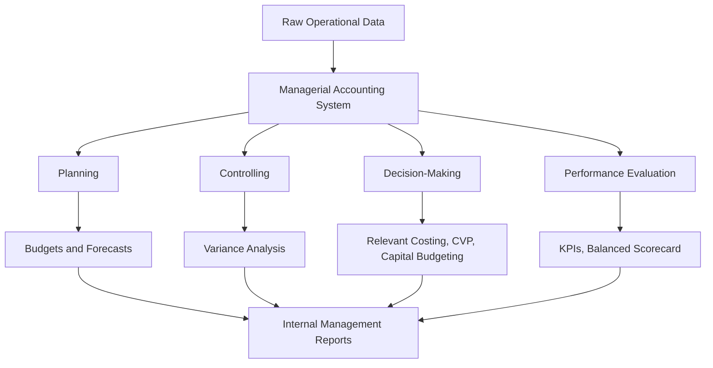

## Definition and Scope of Managerial Accounting

### Definition

Managerial accounting (also called management accounting or cost accounting in some contexts) is the process of identifying, measuring, analyzing, interpreting, and communicating financial and non-financial information to managers for use in planning, controlling, decision-making, and performance evaluation within an organization.

Unlike financial accounting, which produces standardized reports for external parties, managerial accounting is internally focused: it exists to help managers run the business, not to satisfy regulators, creditors, or shareholders directly.

A commonly cited formal definition, from the Institute of Management Accountants (IMA):

> Management accounting is a profession that involves partnering in management decision-making, devising planning and performance management systems, and providing expertise in financial reporting and control to assist management in the formulation and implementation of an organization's strategy. [Unverified — paraphrased from IMA's published definition; exact current wording should be checked against IMA's official materials.]

### Core Purpose

The central purpose of managerial accounting is to convert raw operational and financial data into actionable information that supports four managerial functions:

1. **Planning** — setting objectives and determining the means to achieve them (budgets, forecasts, strategic plans)
2. **Directing/Controlling** — overseeing daily operations and ensuring plans are carried out (variance analysis, responsibility accounting)
3. **Decision-Making** — choosing among alternative courses of action (relevant costing, make-or-buy, pricing)
4. **Performance Evaluation** — measuring how well managers, departments, or activities meet targets (KPIs, balanced scorecards, responsibility reports)

### Scope of Managerial Accounting

The scope spans the entire value chain of an organization, not just the accounting department. It typically includes:

**Cost Accounting**

- Determining product/service costs (direct materials, direct labor, overhead)
- Cost behavior analysis (fixed, variable, mixed, step costs)
- Cost allocation and cost driver identification
- Job order costing, process costing, activity-based costing (ABC)

**Budgeting and Forecasting**

- Master budgets, operating budgets, capital budgets
- Flexible budgeting
- Rolling forecasts
- Zero-based budgeting

**Planning and Decision Support**

- Cost-volume-profit (CVP) analysis
- Relevant costing for special decisions (special orders, make-or-buy, sell-or-process-further, segment elimination)
- Capital budgeting (NPV, IRR, payback period)
- Pricing decisions (cost-plus, target costing)

**Control and Performance Measurement**

- Standard costing and variance analysis
- Responsibility accounting (cost centers, profit centers, investment centers)
- Balanced scorecard and non-financial performance metrics
- Transfer pricing between divisions

**Strategic Management Accounting**

- Activity-based management (ABM)
- Total quality management (TQM) costing
- Value chain analysis
- Life-cycle costing
- Benchmarking and competitor cost analysis

### Managerial vs. Financial Accounting

| Dimension | Managerial Accounting | Financial Accounting |
| --- | --- | --- |
| Primary users | Internal (managers, employees) | External (investors, creditors, regulators) |
| Regulatory requirement | Not mandatory; no GAAP/IFRS requirement | Mandatory; must follow GAAP/IFRS |
| Time orientation | Future-oriented (forecasts, budgets) | Historical (past transactions) |
| Reporting frequency | As needed (daily, weekly, monthly) | Periodic (quarterly, annually) |
| Scope of reporting | Segments, products, departments | Entity-wide |
| Precision vs. timeliness | Favors timeliness and relevance | Favors precision and verifiability |
| Format | Flexible, tailored to decision | Standardized formats |
| Verification | No independent audit required | Subject to external audit |

### Key Points

- Managerial accounting information is **not constrained by GAAP or IFRS** — it is designed to be useful, not compliant.
- It draws on both **financial data** (costs, revenues) and **non-financial data** (defect rates, cycle time, customer satisfaction).
- It is **forward-looking**, emphasizing relevance for future decisions over strict historical accuracy.
- It operates at **multiple levels of granularity** — product line, department, project, customer segment — rather than only at the entity-wide level financial accounting uses.
- The discipline overlaps with, but is broader than, cost accounting; cost accounting is largely a subset focused on determining and controlling costs, while managerial accounting also covers planning, control systems, and strategic decision support.

### Illustrative Example

A furniture manufacturer's financial accountant reports total quarterly revenue of $2,000,000 to external stakeholders in a standardized income statement. A managerial accountant, by contrast, would break this down internally:

- Cost per unit for each chair model
- Contribution margin by product line
- Variance between budgeted and actual factory overhead
- Whether to continue producing a low-margin product line or outsource a component

This internal breakdown is never published externally — it exists purely to help management decide, for example, whether to discontinue the low-margin line or renegotiate a supplier contract.

### Conceptual Diagram

### Related Topics

- Cost Behavior and Cost Classification (fixed, variable, mixed)
- Cost-Volume-Profit (CVP) Analysis
- Job Order vs. Process Costing
- Activity-Based Costing (ABC)
- Budgeting: Master Budget Components
- Standard Costing and Variance Analysis
- Responsibility Accounting and Segment Reporting
- The Role of the Management Accountant in an Organization
- Ethical Standards in Managerial Accounting (IMA Statement of Ethical Professional Practice)