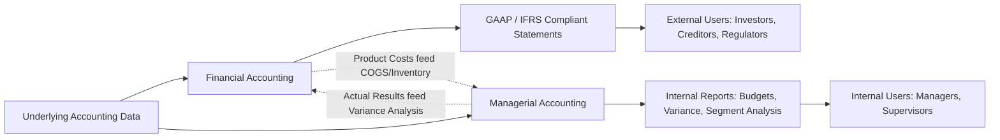

## Managerial Accounting versus Financial Accounting

### Overview

Managerial accounting and financial accounting are the two primary branches of the accounting discipline. Both draw from the same underlying transaction data, but they diverge sharply in audience, purpose, regulation, and format. Understanding these distinctions clarifies why an organization maintains two parallel (but interconnected) reporting systems.

### Core Distinctions

**Primary Users**

- Managerial accounting: internal users — executives, department managers, supervisors, operational staff who need information to run the business day to day.
- Financial accounting: external users — investors, creditors, regulators, tax authorities, analysts, and other stakeholders outside the organization's management structure.

**Regulatory Framework**

- Managerial accounting has **no mandatory reporting framework**. Organizations design internal reports however best supports decision-making.
- Financial accounting must comply with **GAAP** (Generally Accepted Accounting Principles) in the U.S. or **IFRS** (International Financial Reporting Standards) internationally, and is often subject to statutory audit requirements.

**Time Orientation**

- Managerial accounting is predominantly **future-oriented** — budgets, forecasts, projected cash flows, what-if scenarios.
- Financial accounting is predominantly **historical** — it reports on transactions and events that have already occurred.

**Reporting Unit and Scope**

- Managerial accounting can report at any level of granularity: by product, by customer, by department, by project, by geographic segment.
- Financial accounting reports at the **entity level** (or consolidated group level), aggregating all activity into standardized statements.

**Reporting Frequency**

- Managerial accounting reports are produced **as frequently as management needs** — daily production reports, weekly sales dashboards, monthly variance reports.
- Financial accounting reports follow **fixed periodic cycles** — quarterly and annual statements.

**Precision versus Timeliness**

- Managerial accounting favors **relevance and speed** over precision; a reasonably accurate estimate delivered today is often more useful than a precise figure delivered next month.
- Financial accounting favors **verifiability and precision**, since the numbers carry legal and contractual weight.

**Format and Structure**

- Managerial accounting reports have **no prescribed format** — they are tailored to the specific decision at hand (e.g., a segment contribution margin report, a make-or-buy analysis).
- Financial accounting follows **standardized statement formats**: income statement, balance sheet, statement of cash flows, statement of stockholders' equity.

**Verification**

- Managerial accounting reports are typically **not audited** by external parties.
- Financial accounting statements are **subject to independent audit** when required by regulation or lender/investor covenants.

**Behavioral Focus**

- Managerial accounting often incorporates **non-monetary and non-financial measures** — defect rates, employee turnover, machine downtime, customer satisfaction scores.
- Financial accounting is confined to **monetary transactions** that can be reliably measured in currency.

### Comparison Table

| Dimension | Managerial Accounting | Financial Accounting |
| --- | --- | --- |
| Users | Internal management | External stakeholders |
| Regulation | None (flexible) | GAAP / IFRS mandatory |
| Time focus | Future (forecasts, budgets) | Past (historical results) |
| Scope | Segment, product, department | Entire entity |
| Frequency | On-demand / continuous | Periodic (quarterly, annual) |
| Precision | Timeliness over precision | Precision and verifiability |
| Format | Flexible, decision-specific | Standardized statements |
| Audit | Not required | Often required |
| Measures | Financial + non-financial | Financial (monetary) only |
| Legal requirement | Optional | Mandatory for most entities |

### Where They Intersect

Despite their differences, the two disciplines are not isolated:

- Both originate from the **same underlying accounting data and transaction records**.
- Product costs computed under managerial accounting (direct materials, direct labor, manufacturing overhead) flow into **inventory valuation and cost of goods sold** on the financial statements — this is the direct link required by GAAP/IFRS inventory costing rules.
- Financial statement results (e.g., actual revenue and expenses) become **inputs into managerial variance analysis**, comparing actual performance to budgeted performance.
- Many management accountants hold credentials such as the **CMA (Certified Management Accountant)**, while financial accountants often hold the **CPA (Certified Public Accountant)** — though considerable overlap exists in practice, especially in smaller organizations where one team performs both functions.

### Illustrative Example

A mid-sized electronics company's financial accounting team prepares its annual 10-K filing, reporting total revenue of $50,000,000 and net income of $4,200,000, prepared strictly under GAAP and audited by an external firm for filing with regulators and investors.

In parallel, the managerial accounting team prepares an internal weekly report breaking that same revenue down by product line, showing that the wireless earbuds line is highly profitable while the smart-home hub line is operating at a loss due to high component costs — information never disclosed externally in that form, but essential for management's decision on whether to discontinue the hub line.

### Conceptual Diagram

### Key Points

- The two systems are **complementary, not competing** — financial accounting tells stakeholders what happened; managerial accounting helps management decide what to do next.
- Managerial accounting's lack of regulatory constraint is a feature, not a weakness — it allows reports to be **customized precisely to the decision being made**.
- A single transaction (e.g., a factory's overhead costs) can appear in **both systems simultaneously**, serving different purposes — GAAP-compliant inventory valuation on one side, cost control analysis on the other.
- Confusing the two can lead to poor decisions: applying GAAP's historical-cost rigidity to a forward-looking pricing decision, or using unaudited internal estimates in external financial disclosures, are both misapplications of the wrong framework.

### Related Topics

- Definition and Scope of Managerial Accounting
- Cost Classifications: Product Costs vs. Period Costs
- The Role of the Management Accountant in an Organization
- Generally Accepted Accounting Principles (GAAP) Overview
- Cost Accounting as a Subset of Managerial Accounting
- Ethical Standards: IMA Statement of Ethical Professional Practice vs. AICPA Code of Conduct
- Integration of Managerial and Financial Data in ERP Systems