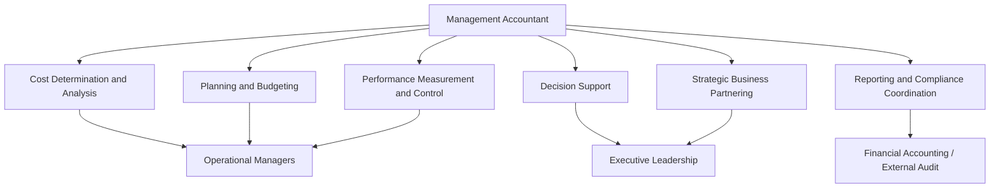

## Role and Responsibilities of the Management Accountant

### Overview

The management accountant serves as an internal business partner rather than a pure record-keeper. The role has evolved from historical bookkeeping and cost tallying toward strategic advisory work — the management accountant sits at the intersection of finance, operations, and strategy, translating data into insight that shapes decisions across the organization.

### Core Responsibilities

**Cost Determination and Analysis**

- Computing product, service, and process costs
- Classifying costs by behavior (fixed, variable, mixed) and by function (product vs. period)
- Analyzing cost drivers and cost pools, particularly under activity-based costing systems

**Planning and Budgeting**

- Coordinating preparation of the master budget (sales, production, cash, and capital budgets)
- Building flexible budgets and rolling forecasts
- Facilitating budget negotiations between departments and senior management

**Performance Measurement and Control**

- Designing and maintaining standard costing systems
- Conducting variance analysis (material, labor, overhead variances) and investigating significant deviations
- Establishing responsibility centers (cost, profit, investment centers) and reporting results against them
- Developing and tracking key performance indicators (KPIs), including balanced scorecard metrics

**Decision Support**

- Preparing relevant cost analyses for special decisions: make-or-buy, special orders, product line elimination, sell-or-process-further
- Conducting cost-volume-profit (CVP) analysis to support pricing and volume decisions
- Evaluating capital investment proposals using NPV, IRR, and payback methods
- Supporting pricing strategy (cost-plus, target costing, value-based pricing)

**Strategic Planning and Business Partnering**

- Participating in strategy formulation alongside operational and executive leadership
- Conducting value chain and competitor cost analysis
- Supporting mergers, acquisitions, and divestiture evaluations
- Advising on resource allocation across business units

**Financial Reporting Support and Compliance Coordination**

- Ensuring internal cost data reconciles appropriately with external financial reporting (e.g., inventory valuation under GAAP/IFRS)
- Supporting internal controls and risk management processes
- Coordinating with financial accounting and external audit teams where cost data intersects with statutory reporting

**Technology and Systems Stewardship**

- Maintaining and improving ERP-integrated costing and budgeting systems
- Ensuring data integrity across operational and financial systems
- Increasingly, applying data analytics and business intelligence tools to enhance forecasting and reporting

### Skills and Competencies

| Competency Area | Examples |
| --- | --- |
| Technical accounting | Cost systems, variance analysis, standard costing |
| Analytical/quantitative | CVP analysis, capital budgeting, statistical forecasting |
| Technology | ERP systems, data analytics, spreadsheet/BI tools |
| Strategic thinking | Value chain analysis, competitive benchmarking |
| Communication | Translating financial data for non-financial managers |
| Ethics and judgment | Objectivity, confidentiality, integrity in reporting |

### Organizational Positioning

Management accountants may be embedded within operational departments (a "business partner" model) or centralized within a corporate finance function, reporting to a Controller or CFO. In many organizations, the role has shifted toward **decentralized embedding** — placing management accountants directly within business units, product teams, or plants so they can respond faster to operational questions and build closer working relationships with non-finance managers.

Common titles associated with this role include: Management Accountant, Cost Accountant, FP&A (Financial Planning & Analysis) Analyst, Controller, and Business Partner/Finance Business Partner.

### Professional Certification

The primary credential for the profession is the **CMA (Certified Management Accountant)**, administered by the Institute of Management Accountants (IMA). It emphasizes financial planning, performance, analytics, and strategic financial management, distinguishing it from the CPA credential, which centers on external financial reporting and audit. [Unverified — CMA exam content and structure should be confirmed against IMA's current published exam syllabus, as certification requirements are periodically updated.]

### Ethical Responsibilities

Management accountants are expected to uphold professional ethical standards, commonly organized around four principles under the IMA's Statement of Ethical Professional Practice:

1. **Competence** — maintaining professional expertise and performing duties in accordance with relevant laws, regulations, and technical standards
2. **Confidentiality** — safeguarding sensitive internal information and not using it for personal advantage
3. **Integrity** — avoiding conflicts of interest and refraining from actions that would discredit the profession
4. **Credibility** — communicating information fairly, objectively, and completely, disclosing all relevant information that could influence decisions

[Unverified — exact principle names and wording should be verified against IMA's current published ethics statement, as these documents are periodically revised.]

### Illustrative Example

A management accountant at a mid-sized apparel manufacturer is asked to evaluate whether the company should continue manufacturing a low-margin product line in-house or outsource it to a contract manufacturer. Their responsibilities in this single engagement span multiple facets of the role:

- **Cost determination**: isolating relevant costs (avoidable fixed costs, variable costs) from sunk and unavoidable costs
- **Decision support**: building a make-or-buy relevant cost comparison
- **Strategic input**: assessing how outsourcing might affect quality control, lead times, and brand positioning
- **Communication**: presenting findings to operations and executive leadership in a format non-financial managers can act on

### Conceptual Diagram

### Key Points

- The role has shifted from **historical cost recording** toward **forward-looking strategic advisory work**.
- Management accountants operate as **internal consultants**, embedded within business operations rather than isolated in a back-office accounting function.
- Ethical conduct — particularly **objectivity and confidentiality** — is central to the credibility of the information management accountants provide, since that information directly shapes major business decisions.
- Effective management accountants combine **technical accounting skill with communication ability**, since their output is only useful if non-financial managers can understand and act on it.

### Related Topics

- Definition and Scope of Managerial Accounting
- Managerial Accounting versus Financial Accounting
- IMA Statement of Ethical Professional Practice
- Certified Management Accountant (CMA) Credential
- Responsibility Accounting and Organizational Structure
- Role of the Controller vs. CFO
- Financial Planning & Analysis (FP&A) Function