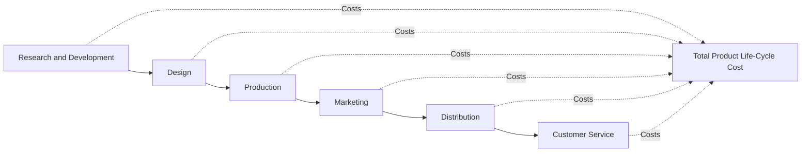

## The Value Chain and Business Functions

### Definition

The value chain is the sequence of business functions in which usefulness (value) is added to a company's products or services, from raw material acquisition through to customer support after the sale. Managerial accounting uses the value chain framework to understand where costs are incurred, where value is created, and where a company holds competitive advantage relative to rivals.

The concept originates from Michael Porter's value chain model but is adapted in managerial accounting specifically to trace **cost behavior and profitability across the full lifecycle of a product or service**, rather than stopping at the factory gate as traditional cost accounting often did.

### The Six Primary Business Functions

Managerial accounting typically decomposes the value chain into six sequential functions:

**1. Research and Development (R&D)**

- Generating and experimenting with ideas related to new products, services, or processes
- Costs: scientist and engineer salaries, prototype materials, testing equipment
- Example: a pharmaceutical company researching a new drug compound

**2. Design**

- Detailed planning, engineering, and testing of products or processes
- Translates R&D concepts into producible, marketable specifications
- Costs: design engineer time, CAD software, design prototyping
- Example: an automaker finalizing the engineering specifications of a new vehicle model

**3. Production (Manufacturing/Operations)**

- Acquiring, coordinating, and assembling resources to produce a product or deliver a service
- Costs: direct materials, direct labor, manufacturing overhead
- This is the function traditional cost accounting has historically emphasized most heavily
- Example: assembling the vehicle on the factory line

**4. Marketing (including Sales)**

- Promoting and selling products or services to customers or prospective customers
- Costs: advertising, sales commissions, promotional materials, market research
- Example: the automaker's advertising campaign and dealership sales incentives

**5. Distribution**

- Delivering products or services to customers
- Costs: transportation, warehousing, order processing, logistics
- Example: shipping vehicles from the factory to dealerships nationwide

**6. Customer Service**

- Providing after-sale support to customers
- Costs: warranty service, call centers, repair facilities, technical support staff
- Example: the automaker's dealership service departments and warranty claims processing

### Value Chain vs. Supply Chain

These terms are related but distinct:

| Concept | Focus |
| --- | --- |
| Value chain | All functions that add value, from R&D through customer service — internal and cross-organizational |
| Supply chain | The flow of resources and products from suppliers through production to customers — logistics-centered |

The supply chain is generally considered a subset of, or a lens onto, the value chain — specifically the flow of physical goods and materials, whereas the value chain also captures upstream innovation (R&D, design) and downstream relationship functions (marketing, service) that don't necessarily involve physical logistics.

### Why the Value Chain Matters in Managerial Accounting

**Cost Visibility Across the Full Lifecycle**

Traditional costing systems often focused narrowly on production costs, since those were the costs relevant to inventory valuation under GAAP/IFRS. The value chain framework pushes managers to recognize that R&D, design, marketing, distribution, and service costs are equally real and equally important to product profitability — even though they are expensed as period costs rather than capitalized into inventory.

**Strategic Cost Management**

By analyzing costs function-by-function, management can identify:

- Which functions represent the company's core competitive advantage (and deserve continued investment)
- Which functions could be outsourced, streamlined, or eliminated without harming competitiveness
- Where cost reduction efforts will have the greatest impact on overall profitability

**Cross-Functional Cost Trade-offs**

Decisions in one function often affect costs in another. For example, investing more in design (to build a more durable product) may reduce downstream customer service costs (fewer warranty claims) — a trade-off invisible if each function is analyzed in isolation.

**Target Costing and Life-Cycle Costing**

The value chain underlies techniques such as:

- **Target costing** — designing a product to meet a target cost across its whole lifecycle, working backward from a market-driven selling price
- **Life-cycle costing** — tracking and accumulating costs across a product's entire life, from R&D through disposal, rather than only during the production period

### Illustrative Example

A consumer electronics company launching a new wireless headphone product incurs costs across all six functions:

| Function | Example Cost |
| --- | --- |
| R&D | Engineer salaries developing noise-cancellation technology |
| Design | Industrial design of the headphone housing and ergonomics |
| Production | Components, assembly labor, factory overhead |
| Marketing | Influencer partnerships, digital ad campaigns |
| Distribution | Shipping to retail partners and fulfillment centers |
| Customer Service | Warranty repairs, support call center staffing |

If management only analyzes production costs, it will underestimate total product cost and may misprice the product or wrongly conclude the product line is more profitable than it actually is once R&D, marketing, and service costs are factored in across the product's full life.

### Conceptual Diagram



### SVG Illustration (svg_diagram)

<svg xmlns="http://www.w3.org/2000/svg" viewBox="0 0 900 260">
<text x="450" y="25" font-size="16" font-weight="bold" text-anchor="middle" fill="#1a1a1a">Value Chain Business Functions (svg_diagram)</text>
<g font-family="sans-serif" font-size="12">

<rect x="10" y="70" width="130" height="70" rx="6" fill="#dbe9ff" stroke="#3366cc" />
<text x="75" y="100" text-anchor="middle" font-weight="bold">R&amp;D</text>
<text x="75" y="118" text-anchor="middle" font-size="10">Idea generation</text>



```
<rect x="155" y="70" width="130" height="70" rx="6" fill="#dbe9ff" stroke="#3366cc" />
<text x="220" y="100" text-anchor="middle" font-weight="bold">Design</text>
<text x="220" y="118" text-anchor="middle" font-size="10">Product specs</text>

<rect x="300" y="70" width="130" height="70" rx="6" fill="#dbe9ff" stroke="#3366cc" />
<text x="365" y="100" text-anchor="middle" font-weight="bold">Production</text>
<text x="365" y="118" text-anchor="middle" font-size="10">Manufacturing</text>

<rect x="445" y="70" width="130" height="70" rx="6" fill="#dbe9ff" stroke="#3366cc" />
<text x="510" y="100" text-anchor="middle" font-weight="bold">Marketing</text>
<text x="510" y="118" text-anchor="middle" font-size="10">Promotion, sales</text>

<rect x="590" y="70" width="130" height="70" rx="6" fill="#dbe9ff" stroke="#3366cc" />
<text x="655" y="100" text-anchor="middle" font-weight="bold">Distribution</text>
<text x="655" y="118" text-anchor="middle" font-size="10">Delivery, logistics</text>

<rect x="735" y="70" width="130" height="70" rx="6" fill="#dbe9ff" stroke="#3366cc" />
<text x="800" y="100" text-anchor="middle" font-weight="bold">Customer</text>
<text x="800" y="115" text-anchor="middle" font-weight="bold">Service</text>
<text x="800" y="128" text-anchor="middle" font-size="10">Support, warranty</text>


<line x1="140" y1="105" x2="153" y2="105" stroke="#333" stroke-width="2" marker-end="url(#arrow)" />
<line x1="285" y1="105" x2="298" y2="105" stroke="#333" stroke-width="2" marker-end="url(#arrow)" />
<line x1="430" y1="105" x2="443" y2="105" stroke="#333" stroke-width="2" marker-end="url(#arrow)" />
<line x1="575" y1="105" x2="588" y2="105" stroke="#333" stroke-width="2" marker-end="url(#arrow)" />
<line x1="720" y1="105" x2="733" y2="105" stroke="#333" stroke-width="2" marker-end="url(#arrow)" />

<text x="450" y="185" text-anchor="middle" font-size="12" font-weight="bold" fill="#1a1a1a">All functions contribute to total life-cycle cost</text>
<text x="450" y="205" text-anchor="middle" font-size="11" fill="#555">Only Production costs are capitalized as inventory under GAAP/IFRS —</text>
<text x="450" y="222" text-anchor="middle" font-size="11" fill="#555">all six functions matter for true product profitability analysis</text>
```

</g>
</svg>

### Key Points

- The value chain spans **six functions**: R&D, Design, Production, Marketing, Distribution, and Customer Service.
- Traditional cost accounting historically emphasized **Production costs only**, since those are the costs capitalized into inventory under GAAP/IFRS — but true product profitability requires analyzing costs across **all six functions**.
- The value chain framework supports **strategic cost management**, target costing, and life-cycle costing.
- Cross-functional trade-offs (e.g., design investment reducing customer service costs) are only visible when the value chain is analyzed holistically rather than function-by-function in isolation.
- The value chain is broader than the supply chain — supply chain concerns the **flow of physical goods**, while the value chain also includes upstream innovation and downstream customer relationship functions.

### Related Topics

- Definition and Scope of Managerial Accounting
- Target Costing and Life-Cycle Costing
- Cost Classifications: Product Costs vs. Period Costs
- Strategic Cost Management
- Activity-Based Costing (ABC) and Activity-Based Management (ABM)
- Supply Chain Management and Logistics Costing
- Value Chain Analysis for Competitive Advantage (Porter's Model)