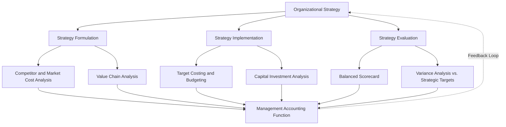

## Strategic Role of Management Accounting in Organizations

### Overview

Management accounting has evolved from a narrow, transaction-recording function into a core input to strategy formulation and execution. In this expanded role, the management accountant does not simply report what happened financially — they actively shape how an organization competes, allocates resources, and evaluates whether its strategy is working.

### From Scorekeeping to Strategic Partnership

Historically, management accounting emphasized three narrower activities: cost determination, budget variance reporting, and inventory valuation support. The strategic evolution of the field broadened this into:

- **Strategy formulation support** — providing cost, market, and competitor data that shapes strategic choices before they are made
- **Strategy implementation support** — translating strategic objectives into operational targets, budgets, and performance metrics
- **Strategy evaluation** — measuring whether the chosen strategy is achieving its intended results, and feeding that information back into the planning cycle

This shift reflects a broader move in the discipline known as **Strategic Management Accounting (SMA)** — the use of management accounting techniques to support strategic decision-making by incorporating external, competitor-focused, and market-oriented information alongside traditional internal cost data.

### Key Strategic Functions

**1. Supporting Competitive Strategy**

Management accounting informs whether a company should pursue a **cost leadership** strategy (competing on lowest cost) or a **differentiation** strategy (competing on unique value). Cost data reveals whether the organization's cost structure can sustain low prices, while profitability and margin analysis reveal whether premium pricing is being captured effectively.

**2. Strategic Cost Management**

Techniques used to align cost structure with strategic direction include:

- **Target costing** — setting cost targets based on market-driven prices to preserve desired margins
- **Life-cycle costing** — evaluating profitability across a product's entire life, not just current-period costs
- **Value chain analysis** — identifying which functions (R&D, design, production, marketing, distribution, service) create competitive advantage and deserve investment
- **Activity-based costing/management (ABC/ABM)** — revealing true cost drivers to support process redesign and resource reallocation

**3. Balanced Performance Measurement**

Strategic management accounting extends beyond financial metrics using frameworks such as the **Balanced Scorecard**, which evaluates performance across four perspectives:

- Financial (profitability, revenue growth)
- Customer (satisfaction, retention, market share)
- Internal business processes (quality, cycle time, efficiency)
- Learning and growth (employee capability, innovation capacity)

This multi-dimensional view prevents an overemphasis on short-term financial results at the expense of long-term strategic capability.

**4. Capital Allocation and Investment Strategy**

Management accountants evaluate major capital investments (new facilities, technology, acquisitions) using techniques such as net present value (NPV), internal rate of return (IRR), and payback period, ensuring capital is directed toward projects that support strategic priorities rather than purely operational convenience.

**5. Risk Management and Scenario Planning**

Strategic management accounting increasingly incorporates scenario analysis, sensitivity analysis, and risk-adjusted forecasting to help organizations stress-test strategic plans against uncertain future conditions (demand shifts, input cost volatility, competitive moves).

**6. Business Partnering Across the Organization**

Rather than operating as a centralized reporting function, strategically-oriented management accountants are embedded within business units and cross-functional teams, participating directly in strategic discussions with operations, marketing, and executive leadership rather than only reporting results after decisions are made.

### Strategic Frameworks Commonly Used

| Framework | Purpose |
| --- | --- |
| Balanced Scorecard | Multi-dimensional performance measurement aligned to strategy |
| Value Chain Analysis | Identifies where competitive advantage is created across business functions |
| Target Costing | Aligns product cost structure with market-driven pricing and margin goals |
| Activity-Based Management | Redesigns processes based on true cost driver behavior |
| SWOT-integrated cost analysis | Links internal cost/capability data to external competitive positioning |
| Benchmarking | Compares internal cost/performance metrics against competitors or best-in-class organizations |

### Illustrative Example

A mid-sized appliance manufacturer is deciding between two strategic paths: competing as a low-cost mass producer or repositioning as a premium, differentiated brand. The management accounting function supports this decision by:

- Modeling the cost structure required to sustain low-cost leadership (target costing analysis against competitor pricing)
- Estimating the margin uplift achievable through premium positioning (contribution margin analysis under different pricing scenarios)
- Evaluating the capital investment needed for either path (automation for cost leadership vs. R&D and design investment for differentiation) using NPV analysis
- Recommending balanced scorecard metrics to track execution post-decision — e.g., unit cost trends for the cost-leadership path, or customer satisfaction and brand perception metrics for the differentiation path

The final strategic choice rests with executive leadership, but the decision is shaped substantially by the quantitative and qualitative analysis the management accounting function provides.

### Conceptual Diagram

### Key Points

- Strategic management accounting extends the discipline beyond internal cost tracking to include **external, market, and competitor-focused analysis**.
- The **Balanced Scorecard** exemplifies the shift toward multi-dimensional performance measurement that supports long-term strategic capability, not just short-term financial results.
- Techniques like **target costing** and **value chain analysis** directly link cost management to competitive strategy (cost leadership vs. differentiation).
- The management accountant's role in strategy is **iterative** — supporting formulation, enabling implementation through budgets and targets, and closing the loop through evaluation and feedback.
- This strategic orientation requires management accountants to develop **competencies beyond traditional accounting**, including market analysis, cross-functional communication, and long-term financial modeling.

### Related Topics

- Role and Responsibilities of the Management Accountant
- The Value Chain and Business Functions
- Balanced Scorecard: Design and Implementation
- Target Costing and Life-Cycle Costing
- Cost Leadership vs. Differentiation Strategy (Porter's Generic Strategies)
- Activity-Based Costing and Activity-Based Management
- Capital Budgeting Techniques (NPV, IRR, Payback)
- Strategic Management Accounting (SMA) as a Discipline