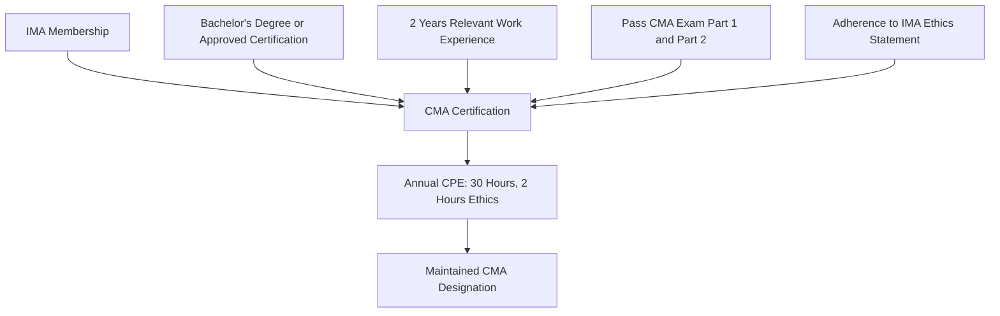

## Certified Management Accountant Credential and Professional Pathways

### Overview

The Certified Management Accountant (CMA) is a globally recognized professional credential administered by the Institute of Management Accountants (IMA) through its certifying body, the Institute of Certified Management Accountants (ICMA). It is the primary professional designation for practitioners of management accounting, distinguishing itself from the CPA by focusing on internal financial planning, performance management, analytics, and strategic financial decision-making rather than external audit and financial reporting.

### Purpose of the Credential

The CMA exists to:

- Validate a practitioner's competence in cost management, budgeting, performance analysis, risk management, and strategic decision support
- Signal to employers that a candidate can operate as a business partner to management, not solely as a transaction processor
- Provide a structured, internationally portable career pathway for management accountants, financial analysts, controllers, and finance business partners

### Eligibility Requirements

To earn the CMA designation, a candidate must satisfy several parallel requirements, which can generally be completed in any order but must all be fulfilled within set timeframes:

**IMA Membership**

Active membership in the Institute of Management Accountants is required to register for and sit the exam. This includes holding a bachelor's degree or a related certification, having work experience in management accounting or financial management, passing the two-part CMA exam, and adhering to ethical standards. [Big 4 Accounting Firms](https://big4accountingfirms.org/cma-exam-requirements-and-fees/)

**Educational Requirement**

A bachelor's degree from an accredited institution is generally required, though the IMA does accept some professional certifications, such as the Certified Public Accountant (CPA) license, in place of a bachelor's degree. Proof of education or certification must be submitted within seven years of completing the CMA exam. [UWorld](https://accounting.uworld.com/cma-review/cma-requirements/)[UWorld](https://accounting.uworld.com/cma-review/cma-exam/)

**Work Experience Requirement**

Two years of relevant working experience in a financial management or management accounting role is required to obtain the CMA. This experience can be completed prior to or within seven years of passing the exam, and part-time work counts proportionally — roughly one year of credit for every two years of qualifying part-time employment. [Unverified — specific part-time credit ratios and qualifying role definitions should be confirmed against IMA's current published policy, as administrative rules are subject to change.] [UWorld](https://accounting.uworld.com/cma-review/cma-exam/)[UWorld](https://accounting.uworld.com/cma-review/cma-requirements/)

**Ethics Requirement**

Candidates must adhere to the **IMA Statement of Ethical Professional Practice** throughout their certification and career.

**Exam Requirement**

Candidates must pass both parts of the CMA exam. Once a candidate signs up for the exam, they have three years to pass both parts. [UWorld](https://accounting.uworld.com/cma-review/cma-requirements/)

### Exam Structure

The CMA exam consists of two parts, each testing distinct content areas:

| Element | Detail |
| --- | --- |
| Number of parts | 2 (Part 1 and Part 2) |
| Format per part | 100 multiple-choice questions plus two case-based questions (CBQs) |
| Scoring weight | MCQs carry 75% of the score, CBQs/essays carry 25% |
| Time per part | Four hours per part — 3 hours for MCQs, 1 hour for the application section |
| Passing score | A minimum scaled score of 360 out of 500 on each part |
| MCQ gating rule | Candidates must score at least 50% on the MCQ section to unlock the case-based/application section |
| Testing windows | Offered three times a year — January–February, May–June, and September–October |

**2026 Format Change**

Starting with the September/October 2026 testing window, the traditional essay section is being replaced by two case-based questions (CBQs) per exam part. Each CBQ presents a short business case of roughly 250 words followed by up to seven questions using formats such as drag-and-drop, fill-in-the-blank, select-from-a-list, and calculations. The CBQ section carries the same 25% weight the essays previously carried, the 50% MCQ threshold still applies, and the underlying knowledge tested has not changed. [CMA Exam Academy](https://cmaexamacademy.com/certified-management-accountant-certification/)[CMA Exam Academy](https://cmaexamacademy.com/cma-part-2/)

### Part 1: Financial Planning, Performance, and Analytics

Part 1 emphasizes the operational and internal side of management accounting — planning, budgeting, cost management, controls, and analytics.

| Content Area | Approximate Weight |
| --- | --- |
| External Financial Reporting Decisions | 15% |
| Planning, Budgeting, and Forecasting | 20% |
| Performance Management | 20% |
| Cost Management | 15% |
| Internal Controls | 15% |
| Technology and Analytics | 15% (some sources report an increase to 25% for 2026) [Unverified — sources conflict; confirm against the IMA's current official Content Specification Outline (CSO)] |

The highest-weighted topics in Part 1 are Planning, Budgeting & Forecasting and Performance Management, each carrying substantial weight — together accounting for roughly 40% of the Part 1 score. [Simandhar Education](https://www.simandhareducation.com/blogs/what-is-the-us-cma-exam-pattern-in-2026)

### Part 2: Strategic Financial Management

Part 2 shifts toward strategic, forward-looking financial analysis and decision-making.

| Content Area | Approximate Weight |
| --- | --- |
| Financial Statement Analysis | 20% |
| Corporate Finance | 20% |
| Business Decision Analysis | 25% |
| Enterprise Risk Management | 10% |
| Capital Investment Decisions | 10% |
| Professional Ethics | 15% |

Business Decision Analysis is the single highest-weighted topic in the entire CMA syllabus. Financial Statement Analysis, Corporate Finance, and Business Decision Analysis together make up roughly 65% of the Part 2 exam. [Eduyush](https://eduyush.com/en-us/blogs/cima/cma-usa-syllabus)[CMA Exam Academy](https://cmaexamacademy.com/cma-part-2/)

[Unverified — content area weightings and the specific 2026 syllabus update details (e.g., Technology & Analytics weighting, ESG content additions) vary across secondary sources; candidates should confirm exact current weightings directly against IMA's official Content Specification Outline before building a study plan.]

### Maintaining the Certification

Once earned, the CMA designation requires ongoing maintenance:

- CMAs are required to complete 30 hours of Continuing Professional Education (CPE) each year to maintain certified status. [CMA Exam Academy](https://cmaexamacademy.com/cma-certification-requirements/)
- A minimum of two of those 30 hours must specifically cover ethics. [CMA Exam Academy](https://cmaexamacademy.com/cma-certification-requirements/)
- Qualifying CPE subjects include accounting, financial management, economics, business applications of mathematics and statistics, and ethics. [CMA Exam Academy](https://cmaexamacademy.com/cma-certification-requirements/)

### CMA vs. Related Credentials

| Credential | Primary Focus | Administering Body |
| --- | --- | --- |
| CMA | Internal management accounting, planning, strategy, decision support | IMA (USA) |
| CPA | External financial reporting, audit, tax, assurance | State boards of accountancy (USA) |
| CFA | Investment analysis, portfolio management, capital markets | CFA Institute |
| CIA | Internal audit and controls | Institute of Internal Auditors |

Content overlap exists between the CMA and other credentials: Part 1's external reporting section overlaps conceptually with the Financial Accounting and Reporting section of the CPA exam, and its internal controls content overlaps with the CPA's Auditing and Attestation section, though the CMA approaches these topics from a reporting and internal-control-design perspective rather than an external auditor's perspective. [IPassTheCMAExam](https://ipassthecmaexam.com/cma-exam-part-1/)

### Professional Pathways Enabled by the CMA

Common career trajectories associated with the credential include:

- **Cost/Management Accountant** → **Senior Cost Analyst** → **Controller**
- **Financial Analyst** → **FP&A Manager** → **VP of Finance / CFO**
- **Internal Audit** → **Risk and Compliance Leadership**
- **Corporate Finance / Treasury** roles in multinational organizations

CMAs are frequently recruited by major professional services firms for roles in risk advisory, management consulting, and internal audit, particularly within multinational organizations and Global Capability Centers. [Unverified — specific employer hiring patterns and compensation figures vary by region, industry, and economic conditions, and should be validated against current regional salary survey data.] [Zell Education](https://www.zelleducation.com/blog/cma-exam-part-1-vs-part-2/)

### Illustrative Example

A cost accountant at a manufacturing firm, holding a bachelor's degree in accounting and two years of relevant experience, decides to pursue the CMA to move into an FP&A role. They join the IMA, register for the exam, and prepare using a review course. After passing Part 1 (Financial Planning, Performance, and Analytics) and Part 2 (Strategic Financial Management) with scores above 360 on each, they submit proof of their degree and work experience to the ICMA and receive their CMA designation. To maintain it, they complete 30 hours of CPE annually, including at least 2 hours of ethics training, and use the credential to support a subsequent promotion into a Senior FP&A Analyst role.

### Conceptual Diagram

### Key Points

- The CMA requires **IMA membership, a bachelor's degree (or approved equivalent), two years of relevant experience, and passing both exam parts** — these can generally be completed in any order but within IMA's stated timeframes.
- The CMA syllabus covers two parts and twelve total content areas (six per part), unchanged in substance for 2026 — only the exam application-section format has changed, from essays to case-based questions. [Eduyush](https://eduyush.com/en-us/blogs/cima/cma-usa-syllabus)
- Passing requires a **scaled score of 360/500 on each part**, with a 50% MCQ threshold that must be cleared to unlock the application section.
- The credential must be **actively maintained** through annual continuing education, including a mandatory ethics component.
- The CMA is distinct from but complementary to the CPA — CMA emphasizes **internal, forward-looking management accounting**, while CPA emphasizes **external, historical financial reporting and audit**.

### Related Topics

- Role and Responsibilities of the Management Accountant
- IMA Statement of Ethical Professional Practice
- Strategic Role of Management Accounting in Organizations
- CMA vs. CPA: Career Pathway Comparison
- Financial Planning & Analysis (FP&A) as a Career Track
- Continuing Professional Education (CPE) Requirements in Accounting