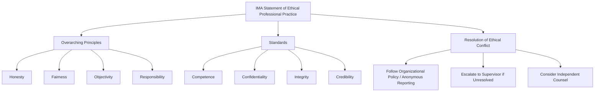

## IMA Statement of Ethical Professional Practice

### Overview

The IMA Statement of Ethical Professional Practice is the codified ethics framework published by the Institute of Management Accountants (IMA) that governs the professional conduct of its members and, more broadly, practitioners of management accounting and financial management. While specifically developed for IMA members to guide member conduct, the principles and standards serve as a guide that all accountants can follow to maintain ethics in management accounting. [IMA](https://www.imanet.org/career-resources/ethics-center/statement)

The statement traces back to earlier IMA ethics guidance developed in response to the business and regulatory climate of its time, and was revised in 2017 to be more concise, simpler to understand and apply, and to more fully reflect the global scope of the management accounting profession. The 2017 revision also added a requirement for members to contribute to a positive ethical culture in their organization and to place the integrity of the profession above personal interests. [Imanet](https://prodcm.imanet.org/-/media/IMA/Files/Home/IMA-Certifications/CSCA-Certification/IMA-Statement-of-Ethical-Professional-Practice.ashx)[Imanet](https://prodcm.imanet.org/-/media/IMA/Files/Home/IMA-Certifications/CSCA-Certification/IMA-Statement-of-Ethical-Professional-Practice.ashx)

### Structure

The IMA Statement of Ethical Professional Practice consists of two parts: guidelines for ethical behavior, and guidelines for resolving an ethical conflict. Members of IMA shall behave ethically, and a commitment to ethical professional practice includes overarching principles that express the profession's values, along with standards that guide member conduct. [Slideshare](https://www.slideshare.net/slideshow/ima-resolutions/47554803)[IMA](https://www.imanet.org/career-resources/ethics-center/statement)

### Overarching Principles

IMA's overarching ethical principles include Honesty, Fairness, Objectivity, and Responsibility. Members shall act in accordance with these principles and shall encourage others within their organizations to adhere to them. [IMA](https://www.imanet.org/career-resources/ethics-center/statement)

| Principle | Description |
| --- | --- |
| Honesty | Acting truthfully in professional dealings and reporting |
| Fairness | Treating all parties (employer, colleagues, stakeholders) equitably |
| Objectivity | Basing judgments on facts rather than bias or personal interest |
| Responsibility | Accepting accountability for professional duties and their consequences |

These four principles function as the philosophical foundation beneath the more specific, actionable standards that follow.

### The Four Standards

IMA members have a responsibility to comply with and uphold the standards of Competence, Confidentiality, Integrity, and Credibility. Failure to comply may result in disciplinary action. [IMA](https://www.imanet.org/career-resources/ethics-center/statement)

**I. Competence**

Members must maintain an appropriate level of professional leadership and expertise by enhancing their knowledge and skills. Related duties include: [IMA](https://www.imanet.org/career-resources/ethics-center/statement)

- Performing professional duties in accordance with relevant laws, regulations, and technical standards [IMA](https://www.imanet.org/career-resources/ethics-center/statement)
- Providing decision support information and recommendations that are accurate, clear, concise, and timely [IMA](https://www.imanet.org/career-resources/ethics-center/statement)
- Recognizing and helping to manage risk [IMA](https://www.imanet.org/career-resources/ethics-center/statement)

**II. Confidentiality**

Members must safeguard sensitive organizational information. Core duties include:

- Keeping information confidential except when disclosure is authorized or legally required [IMA](https://www.imanet.org/career-resources/ethics-center/statement)
- Ensuring subordinates comply with confidentiality requirements
- Refraining from using confidential information for unethical or illegal advantage

**III. Integrity**

Integrity centers on managing conflicts of interest and maintaining conduct that reflects well on the profession. Duties include:

- Mitigating actual conflicts of interest, regularly communicating with business associates to avoid apparent conflicts of interest, and advising all parties of any potential conflicts [Scribd](https://www.scribd.com/doc/315910012/IMA-Statement-of-Ethical-Professional-Practice)
- Refraining from engaging in any conduct that would prejudice carrying out duties ethically [Scribd](https://www.scribd.com/doc/315910012/IMA-Statement-of-Ethical-Professional-Practice)
- Abstaining from engaging in or supporting any activity that might discredit the profession [Pressbooks](https://pressbooks.pub/professionalethicsforaccountants/chapter/chapter-5/)

**IV. Credibility**

Credibility governs how information is communicated to others. Duties include:

- Communicating information fairly and objectively [Amazonaws](https://higherlogicdownload.s3.amazonaws.com/IMANET/24361e24-d3b5-459e-9fc7-43e0e3e6429a/UploadedImages/IMA%20Statement%20of%20Ethical%20Professional%20Practice.pdf)
- Providing all relevant information that could reasonably be expected to influence a decision [Amazonaws](https://higherlogicdownload.s3.amazonaws.com/IMANET/24361e24-d3b5-459e-9fc7-43e0e3e6429a/UploadedImages/IMA%20Statement%20of%20Ethical%20Professional%20Practice.pdf)
- Disclosing delays or deficiencies in information timeliness, processing, or internal controls in accordance with organizational policy or applicable law

### Resolving Ethical Conflicts

When applying the Standards of Ethical Professional Practice, a member may encounter unethical issues or behavior. In such situations, the member should not ignore the issue but should actively seek resolution. In determining which steps to follow, the member should consider all risks involved and whether protections exist against retaliation. [IMA](https://www.imanet.org/career-resources/ethics-center/statement)[IMA](https://www.imanet.org/career-resources/ethics-center/statement)

When faced with unethical issues, the member should follow the established policies of their organization, including use of an anonymous reporting system if available. If the organization does not have established policies, the member should consider a resolution process that could include a discussion with the member's immediate supervisor, escalating further within the organization if the issue remains unresolved, and, where necessary, consulting independent counsel to understand rights and obligations. [Inference — the full escalation sequence (e.g., audit committee, board, external counsel, resignation as a last resort) is described in the complete IMA document; only the initial steps are directly reflected in available excerpts, so the full sequence should be verified against IMA's current published statement.] [IMA](https://www.imanet.org/career-resources/ethics-center/statement)[IMA](https://www.imanet.org/career-resources/ethics-center/statement)

### Distinction from the AICPA Code (CPA Ethics)

A notable structural difference between IMA's principles and the AICPA's ethical principles for CPAs:

- The AICPA principle of serving the public interest is not present in the IMA principles — the management accountant's primary loyalty rests with their employer, not the public interest, though this does not mean the management accountant should disregard the public interest, only that it is secondary to the loyalty owed the employer. [Pressbooks](https://pressbooks.pub/professionalethicsforaccountants/chapter/chapter-5/)
- Any substantial violation of the public interest would likely also violate the IMA's specific requirements to perform professional duties in accordance with relevant laws, regulations, and technical standards, and to abstain from activity that might discredit the profession. [Pressbooks](https://pressbooks.pub/professionalethicsforaccountants/chapter/chapter-5/)
- The AICPA principle of exercising due care is also not stated as a distinct IMA principle, though due care is inherently required under the IMA standard on competence. [Pressbooks](https://pressbooks.pub/professionalethicsforaccountants/chapter/chapter-5/)

This distinction reflects the differing audiences the two professions serve: the CPA's external, public-facing assurance role versus the management accountant's internal, employer-facing advisory role.

### Illustrative Example

A management accountant at a manufacturing company discovers that a senior operations manager has been consistently understating scrap costs in monthly reports to make the department appear more efficient than it actually is. Applying the Statement:

- **Competence** requires the accountant to ensure the figures they report are accurate, not merely convenient.
- **Integrity** requires them not to participate in or condone conduct that would discredit the profession.
- **Credibility** requires them to communicate the discrepancy fairly and provide all relevant information to decision-makers, even though doing so may create friction with the operations manager.
- Under the **conflict resolution guidance**, rather than ignoring the issue, the accountant should raise it through the organization's established channels — first typically with their immediate supervisor, or an anonymous reporting system if one exists — rather than either staying silent or escalating externally without first exhausting internal channels.

### Conceptual Diagram

### Key Points

- The Statement rests on **four overarching principles** (Honesty, Fairness, Objectivity, Responsibility) and **four enforceable standards** (Competence, Confidentiality, Integrity, Credibility).
- Unlike the AICPA Code for CPAs, the IMA framework does **not include an explicit "public interest" principle** — the management accountant's primary duty runs to their employer, though this does not license disregard for the public interest.
- The Statement provides **explicit guidance on resolving ethical conflicts**, emphasizing use of internal organizational channels and anonymous reporting systems before escalation.
- The 2017 revision emphasized that members must contribute to a positive ethical culture within their organization and place the integrity of the profession above personal interests, reflecting the profession's move toward proactive ethical leadership rather than passive compliance. [Imanet](https://prodcm.imanet.org/-/media/IMA/Files/Home/IMA-Certifications/CSCA-Certification/IMA-Statement-of-Ethical-Professional-Practice.ashx)
- Failure to comply with the standards **may result in disciplinary action** by the IMA.

### Related Topics

- Role and Responsibilities of the Management Accountant
- Certified Management Accountant Credential and Professional Pathways
- Ethical Conflict Resolution Frameworks in Accounting
- AICPA Code of Professional Conduct (Comparative Study)
- Corporate Governance and the Management Accountant's Role
- Whistleblower Protections in Financial Reporting