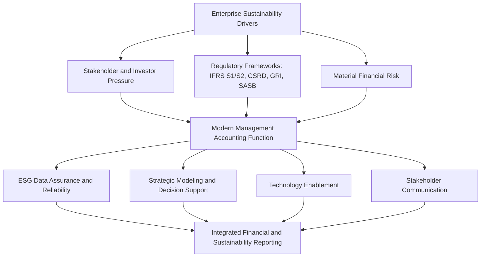

## Enterprise Sustainability and the Modern Accounting Function

### Overview

Enterprise sustainability refers to an organization's management of environmental, social, and governance (ESG) factors alongside traditional financial performance, in recognition that long-term value creation depends on more than short-term profitability. The modern accounting function — and management accounting in particular — has expanded to encompass sustainability measurement, reporting, assurance, and strategic decision support, reflecting a broader shift in the profession from "how much profit did we make?" toward "how responsibly did we make it?"

This expansion is not peripheral to management accounting's traditional scope; it extends the same core competencies — cost measurement, performance management, risk analysis, and decision support — to non-financial and long-horizon dimensions of business performance.

### Why Sustainability Entered the Accounting Function

**Stakeholder and Investor Pressure**

The percentage of S&P 500 companies issuing sustainability reports increased from 20% to 92% between 2011 and 2020, reflecting a dramatic shift in investor and stakeholder expectations for non-financial disclosure.

**Regulatory Momentum**

Global regulatory frameworks have accelerated adoption of standardized sustainability reporting. Key developments include the International Sustainability Standards Board's (ISSB) issuance of **IFRS S1** (general sustainability-related disclosure requirements) and **IFRS S2** (climate-specific disclosures), alongside the EU's Corporate Sustainability Reporting Directive (CSRD) and standards from bodies such as the Global Reporting Initiative (GRI) and the Sustainability Accounting Standards Board (SASB).

**Material Financial Risk**

Climate-related risks — increased drought and water crises, extreme weather events, more frequent wildfires, and more severe tropical storms — represent material economic threats to organizational sustainability, meaning ESG factors increasingly intersect directly with financial risk management, not just reputational concerns.

**Momentum with Headwinds**

Global momentum continues to build for international adoption of IFRS S1 and S2, even as ESG investing enthusiasm has fluctuated since peaking around mid-2022, with market regulators in the UK, EU, and US maintaining close scrutiny of sustainability claims and disclosures. [Unverified — the pace and direction of regulatory and market sentiment shifts are politically and economically contested and continue to evolve; current status should be verified against up-to-date sources.]

### The Three ESG Pillars

| Pillar | Focus Areas |
| --- | --- |
| Environmental | Greenhouse gas emissions, energy and water consumption, waste management, biodiversity impact |
| Social | Diverse hiring practices, inclusive workplace culture, human rights across supply chains |
| Governance | Ethical business conduct, board diversity, risk management practices |

### Where Management Accounting Fits

Management accountants possess the skills and training to participate directly in ESG data gathering, report preparation, and analysis of information, positioning sustainability as a natural extension of the profession's existing competencies rather than an entirely separate discipline. Specific contributions include:

**Assurance and Reliability**

Providing assurance that ESG reporting is reliable, applying the same rigor traditionally used for financial internal controls to non-financial data.

**Strategic Modeling**

Applying understanding of assumptions and modeling to help organizations meet strategy and performance expectations tied to sustainability targets.

**Decision-Useful Information**

Preparing decision-useful information for investors, employees, customers, and the broader community — extending the traditional decision-support role of management accounting to a wider stakeholder base.

**Technology Enablement**

Ensuring sustainability information is consistent and structured through appropriate technology systems, so ESG data achieves the same reliability standards as financial data.

**Trust, Accountability, and Transparency**

Supporting trust, accountability, and transparency across all ESG reporting, reinforcing the credibility standard already central to management accounting ethics.

### Integration into Management Accounting Frameworks

Professional bodies have formally incorporated sustainability into existing competency frameworks rather than treating it as a standalone add-on. The IMA Management Accounting Competency Framework addresses governance and control (ensuring information is useful, reliable, and trustworthy), strategy, business acumen, and technology — with leadership at the top and ethics at its core — and this same framework now explicitly extends to supporting an organization's sustainable business information and management efforts.

This integration reflects **integrated thinking** — the practice of understanding the diverse needs and expectations of stakeholders (investors, customers, employees, communities) and incorporating that understanding into strategic and operational decision-making, rather than treating financial and non-financial performance as separate reporting tracks.

### Key Skills for the Modern Accounting Function

- **Data analytics** for collecting and analyzing ESG data, improving reporting accuracy and transparency
- **Cross-functional collaboration**, since sustainability data originates across operations, HR, procurement, and facilities — not solely within finance
- **Complex regulatory literacy**, given the proliferation of overlapping frameworks (IFRS S1/S2, GRI, SASB, CSRD)
- **Stakeholder communication**, translating technical sustainability data into narratives meaningful to diverse audiences — a capability directly extending the traditional management accounting responsibility to communicate financial information clearly to non-financial managers

### Practical Application: Integrating ESG into Managerial Decision Tools

Sustainability considerations extend into traditional managerial accounting techniques:

- **Cost-volume-profit analysis** can incorporate carbon costs or environmental compliance costs as part of variable or fixed cost structures
- **Capital budgeting** increasingly evaluates projects using ESG-adjusted discount rates or requires climate risk scenario analysis alongside traditional NPV/IRR calculations
- **Balanced scorecard** frameworks commonly add a sustainability or ESG perspective alongside the traditional financial, customer, internal process, and learning/growth perspectives
- **Value chain analysis** now often traces environmental and social impact (e.g., supply chain labor practices, emissions) alongside traditional cost data across the same six business functions (R&D, design, production, marketing, distribution, service)

### Illustrative Example

A consumer goods company's management accounting team is asked to evaluate a proposed switch to a lower-carbon packaging supplier. The team applies traditional relevant costing techniques (comparing incremental costs of the new supplier against the current one) while also incorporating:

- Projected reduction in Scope 3 emissions, relevant for upcoming IFRS S2 climate disclosure requirements
- Risk-adjusted modeling of potential future carbon taxation or regulatory compliance costs avoided by switching suppliers
- Reputational and customer-retention impact estimates, translated into a balanced scorecard sustainability metric
- A recommendation packaged for both operational decision-makers (cost impact) and the sustainability reporting team (disclosure-ready data)

This reflects the extension of core managerial accounting decision tools — relevant costing, risk analysis, and performance measurement — into the sustainability domain, rather than a wholly separate analytical process.

### Conceptual Diagram

### Key Points

- Sustainability accounting is a **natural extension of existing management accounting competencies** — measurement, analysis, control, and decision support — applied to environmental, social, and governance dimensions.
- Regulatory frameworks such as **IFRS S1 and IFRS S2** are driving standardization of sustainability disclosure globally, alongside frameworks like GRI, SASB, and the EU's CSRD.
- Management accountants contribute across the sustainability value chain: **data assurance, strategic modeling, technology enablement, and stakeholder communication**.
- Traditional managerial accounting tools — **CVP analysis, capital budgeting, balanced scorecard, value chain analysis** — are increasingly adapted to incorporate ESG and climate-related factors.
- Market and regulatory momentum around ESG has been uneven in recent years, and the accounting profession's role continues to evolve alongside shifting political, regulatory, and investor sentiment. [Unverified — treat current market sentiment and regulatory trajectory as subject to change; verify against up-to-date sources when precision matters.]

### Related Topics

- Strategic Role of Management Accounting in Organizations
- The Value Chain and Business Functions
- Balanced Scorecard: Design and Implementation
- Capital Budgeting Techniques (NPV, IRR, Payback)
- IMA Statement of Ethical Professional Practice
- IFRS Sustainability Disclosure Standards (S1 and S2)
- Risk Management and Scenario Planning in Managerial Accounting