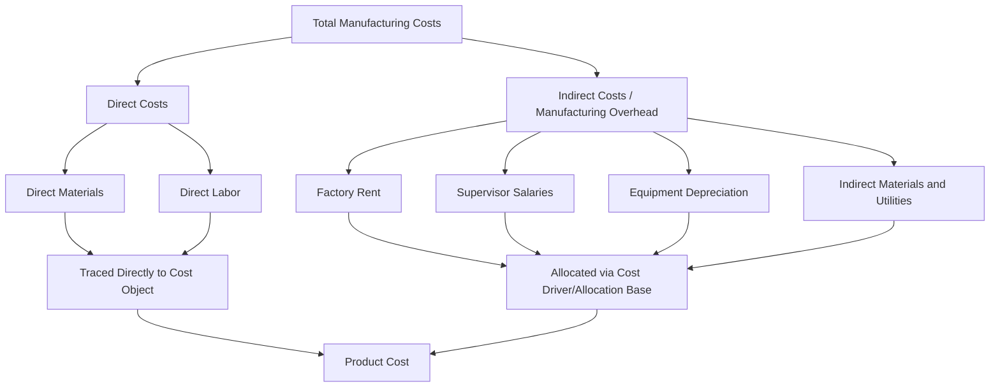

## Direct Costs versus Indirect Costs

### Definition

The distinction between direct and indirect costs is based on **traceability** — whether a cost can be conveniently and economically traced to a specific cost object (a product, department, project, customer, or activity).

- **Direct costs** can be traced to a specific cost object in an economically feasible (cost-effective) way.
- **Indirect costs** cannot be conveniently or economically traced to a specific cost object and must instead be **allocated** using a reasonable basis.

This classification is distinct from — though often confused with — the fixed/variable cost classification, which is based on cost *behavior* relative to activity level rather than traceability.

### The Cost Object Concept

Direct and indirect classification is always relative to a specified **cost object**. The same cost can be direct with respect to one cost object and indirect with respect to another.

**Example:** A factory supervisor's salary is:

- **Indirect** with respect to an individual unit of product (cannot be traced to one specific unit)
- **Direct** with respect to the factory as a whole (the salary is incurred specifically for that factory)

This relativity is a critical conceptual point: asking "is this cost direct or indirect?" is incomplete without first asking "direct or indirect *with respect to what*?"

### Direct Costs

**Definition:** Costs that can be traced to a specific cost object economically and unambiguously.

**Common Examples in Manufacturing**

| Cost | Cost Object | Why It's Direct |
| --- | --- | --- |
| Wood used in a chair | The chair (product) | Can be measured and traced per unit produced |
| Assembly line worker's wages | The product line | Time can be tracked to specific production |
| Steel for a specific customer order | That customer's job | Purchased and used for a single identifiable order |

**Two Common Categories**

- **Direct Materials (DM)** — raw materials that become a physical, identifiable part of the finished product (e.g., lumber in furniture, fabric in clothing)
- **Direct Labor (DL)** — wages of workers whose time is directly and traceably spent converting materials into finished products (e.g., machine operators, assembly workers)

### Indirect Costs

**Definition:** Costs that benefit multiple cost objects simultaneously and cannot be traced to any single one without arbitrary allocation.

**Common Examples in Manufacturing**

| Cost | Why It's Indirect |
| --- | --- |
| Factory rent | Benefits all products made in the factory, not traceable to one |
| Factory supervisor's salary | Oversees multiple production lines/products |
| Depreciation on factory equipment | Equipment used across many different products |
| Factory utilities | Shared across the entire production facility |
| Indirect materials (glue, lubricants) | Used across many units, too costly to trace individually |

Indirect costs in a manufacturing context are collectively referred to as **manufacturing overhead** (also called factory overhead or indirect manufacturing costs), and are assigned to products using a **cost allocation base** (also called a cost driver) — such as direct labor hours, machine hours, or units produced.

### Direct vs. Indirect Cost Comparison

| Dimension | Direct Costs | Indirect Costs |
| --- | --- | --- |
| Traceability | Economically traceable to a specific cost object | Not economically traceable; must be allocated |
| Assignment method | Traced directly | Allocated using a cost driver/allocation base |
| Common examples | Direct materials, direct labor | Factory rent, supervisor salaries, utilities |
| Precision of cost assignment | High (measured directly) | Lower (estimated via allocation, inherently more arbitrary) |
| Dependence on cost object | Relative — depends on what is designated as the cost object | Relative — same dependence applies |

### Why This Distinction Matters

**Product Costing Accuracy**

Direct costs can be assigned to products with confidence and precision. Indirect costs require allocation methods (traditional overhead rates or activity-based costing) that introduce estimation and potential distortion — the choice of allocation base can materially affect reported product costs and profitability.

**Cost Control and Responsibility**

Managers are typically held more directly accountable for direct costs within their control, since these costs can be traced specifically to their area of responsibility. Indirect/shared costs raise questions of fair allocation across responsibility centers.

**Pricing and Profitability Decisions**

Systematically underestimating indirect cost allocation can lead a company to underprice products that consume a disproportionate share of overhead resources, or overprice simpler products — a key motivation behind activity-based costing (ABC), which seeks more accurate tracing of indirect costs to the activities that actually drive them.

**External Financial Reporting**

Under GAAP/IFRS, both direct and indirect manufacturing costs (direct materials, direct labor, and manufacturing overhead) must be included in inventory valuation and cost of goods sold — indirect costs cannot simply be expensed as incurred if they relate to production, reinforcing the need for a defensible allocation method.

### Direct/Indirect Costs Outside Manufacturing

The concept extends beyond manufacturing to service businesses, projects, and departments:

| Context | Direct Cost Example | Indirect Cost Example |
| --- | --- | --- |
| Consulting firm (cost object: client engagement) | Consultant hours billed to that client | Office rent, firm-wide software licenses |
| Hospital (cost object: patient) | Medications administered to that patient | Hospital administration salaries |
| University (cost object: a specific course) | Instructor's salary for that course | Campus security, library operations |
| Construction (cost object: a specific project) | Materials and labor for that site | Project manager overseeing multiple sites |

### Illustrative Example

A furniture manufacturer produces two products: wooden chairs and wooden tables, in the same factory.

**Direct costs traceable to each product:**

- Wood used (measured per unit) — direct material
- Assembly labor hours tracked per product — direct labor

**Indirect costs shared across both products:**

- Factory rent ($10,000/month)
- Factory supervisor's salary ($6,000/month)
- Equipment depreciation ($4,000/month)

Total indirect (overhead) costs of $20,000/month must be allocated to chairs and tables using a chosen allocation base — for example, direct labor hours. If chairs consume 3,000 direct labor hours and tables consume 1,000 direct labor hours in a month (4,000 total), the overhead rate would be:

$$\text{Overhead Rate} = \frac{\$20{,}000}{4{,}000 \text{ DLH}} = \$5 \text{ per DLH}$$

Chairs would then be allocated $3{,}000 \times \$5 = \$15{,}000$ of overhead, and tables would be allocated $1{,}000 \times \$5 = \$5{,}000$ — an allocation, not a direct trace, since no single unit of overhead cost is uniquely attributable to either product line.

### Conceptual Diagram

### Key Points

- The direct/indirect distinction is based on **traceability**, not cost behavior (fixed/variable) — the two classifications are independent dimensions and a cost can be, for example, both indirect and variable (indirect materials that vary with production volume).
- Classification as direct or indirect is **always relative to the chosen cost object** — the same cost can shift categories depending on what is being costed.
- Direct costs are **traced**; indirect costs are **allocated**, and the allocation process inherently introduces estimation and potential distortion.
- The distinction directly affects **product costing accuracy, pricing decisions, cost control accountability, and inventory valuation** under GAAP/IFRS.
- Activity-based costing (ABC) emerged specifically to improve the accuracy of assigning indirect costs by tracing them to the activities that actually drive their incurrence, rather than relying on a single broad allocation base.

### Related Topics

- Cost Classifications: Product Costs vs. Period Costs
- Manufacturing Overhead and Overhead Allocation
- Activity-Based Costing (ABC)
- Cost Behavior: Fixed, Variable, and Mixed Costs
- Job Order Costing vs. Process Costing
- Cost Drivers and Allocation Bases
- Responsibility Accounting and Cost Centers