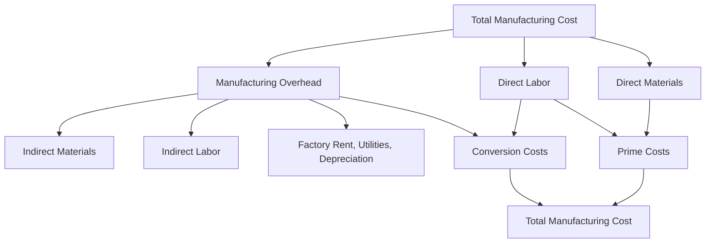

## Manufacturing Costs (Direct Materials, Direct Labor, Manufacturing Overhead)


### Definition

Manufacturing costs are all costs incurred to convert raw materials into a finished, saleable product. Under both managerial and financial accounting frameworks, manufacturing costs are traditionally classified into three categories: **Direct Materials (DM)**, **Direct Labor (DL)**, and **Manufacturing Overhead (MOH)**. Together, these three elements comprise the total cost of manufacturing a product and form the foundation of product costing systems used in job order costing, process costing, and standard costing.

### 1. Direct Materials (DM)

**Definition:** Raw materials that become a physical, identifiable, and traceable part of the finished product, where the cost of tracing that material to the specific unit is economically feasible.

**Characteristics**

- Physically incorporated into the finished product
- Cost is significant enough and traceable enough to justify direct tracking
- Quantity used is typically measurable per unit or per batch

**Examples**

- Lumber in furniture manufacturing
- Steel in automobile production
- Fabric in clothing manufacturing
- Flour in bread baking

**Direct Materials vs. Indirect Materials**

Not all materials used in production qualify as direct materials. **Indirect materials** — such as glue, lubricants, cleaning supplies, or small fasteners — are used in production but are either immaterial in cost or impractical to trace to individual units. These are classified as part of manufacturing overhead rather than direct materials.

### 2. Direct Labor (DL)

**Definition:** The wages and related compensation of workers whose time can be economically and specifically traced to converting raw materials into finished products.

**Characteristics**

- Labor time is directly identifiable with specific units, batches, or jobs
- Typically involves hands-on production work (machine operation, assembly)
- Time is often tracked via timesheets, job cards, or labor time tickets

**Examples**

- Assembly line workers building a product
- Machine operators cutting and shaping materials
- Bakers mixing and baking bread

**Direct Labor vs. Indirect Labor**

**Indirect labor** refers to labor costs that support production but cannot be traced to specific units — such as factory supervisors, quality control inspectors, maintenance staff, and material handlers. Indirect labor is classified as part of manufacturing overhead, not direct labor.

### 3. Manufacturing Overhead (MOH)

**Definition:** All manufacturing costs other than direct materials and direct labor — essentially, all production costs that cannot be economically traced to specific units of product and must instead be allocated using a cost driver.

**Components**

- **Indirect materials** (glue, lubricants, cleaning supplies)
- **Indirect labor** (supervisors, maintenance, quality control, material handlers)
- **Factory-related costs**: rent, utilities, insurance, property taxes on the factory
- **Depreciation** on factory equipment and buildings
- **Factory supplies** not classified as direct materials

**Allocation Requirement**

Because manufacturing overhead cannot be traced directly to specific units, it must be **allocated** using a predetermined overhead rate based on a chosen cost driver (allocation base), such as direct labor hours, machine hours, or direct labor cost.

$$\text{Predetermined Overhead Rate} = \frac{\text{Estimated Total Manufacturing Overhead}}{\text{Estimated Total Allocation Base}}$$

### Categorization Frameworks

Manufacturing costs are commonly grouped into two alternative but overlapping frameworks:

**Prime Costs**

$$\text{Prime Costs} = \text{Direct Materials} + \text{Direct Labor}$$

Prime costs represent the primary, directly traceable inputs to production.

**Conversion Costs**

$$\text{Conversion Costs} = \text{Direct Labor} + \text{Manufacturing Overhead}$$

Conversion costs represent the costs required to convert raw materials into a finished product — this framing is especially useful in process costing environments, where materials are often added at the start of production while labor and overhead are incurred more evenly throughout the process.

Note that direct labor appears in **both** categories, since it is both a primary traceable input and part of the conversion effort.

### Total Manufacturing Cost Formula

$$\text{Total Manufacturing Cost} = \text{Direct Materials} + \text{Direct Labor} + \text{Manufacturing Overhead}$$

This total becomes the basis for computing **Cost of Goods Manufactured (COGM)** and, subsequently, **Cost of Goods Sold (COGS)** for external financial reporting.

### Comparison Table

| Cost Element | Traceable to Units? | Examples | Classified Under |
| --- | --- | --- | --- |
| Direct Materials | Yes | Wood, steel, fabric | Prime Cost |
| Direct Labor | Yes | Assembly worker wages | Prime Cost and Conversion Cost |
| Manufacturing Overhead | No (allocated) | Rent, supervisor salary, depreciation | Conversion Cost |

### Illustrative Example

A furniture manufacturer produces a batch of 500 wooden chairs during the month. The costs incurred are:

| Cost Item | Amount | Classification |
| --- | --- | --- |
| Lumber for chairs | $7,500 | Direct Materials |
| Wood glue and varnish (shared across products) | $400 | Manufacturing Overhead (indirect materials) |
| Assembly worker wages (traced to chair production) | $6,000 | Direct Labor |
| Factory supervisor salary | $3,000 | Manufacturing Overhead (indirect labor) |
| Factory rent (allocated portion) | $2,000 | Manufacturing Overhead |
| Equipment depreciation | $1,000 | Manufacturing Overhead |

**Calculations:**

$$\text{Prime Costs} = \$7{,}500 + \$6{,}000 = \$13{,}500$$


$$\text{Manufacturing Overhead} = \$400 + \$3{,}000 + \$2{,}000 + \$1{,}000 = \$6{,}400$$


$$\text{Conversion Costs} = \$6{,}000 + \$6{,}400 = \$12{,}400$$


$$\text{Total Manufacturing Cost} = \$7{,}500 + \$6{,}000 + \$6{,}400 = \$19{,}900$$


$$\text{Cost per Chair} = \frac{\$19{,}900}{500} = \$39.80$$

### Conceptual Diagram



### SVG Illustration (svg_diagram)

<svg xmlns="http://www.w3.org/2000/svg" viewBox="0 0 800 300">
<text x="400" y="25" font-size="16" font-weight="bold" text-anchor="middle" fill="#1a1a1a">Prime Costs vs. Conversion Costs (svg_diagram)</text>
<g font-family="sans-serif" font-size="13">
<rect x="40" y="70" width="220" height="70" rx="6" fill="#dbe9ff" stroke="#3366cc" />
<text x="150" y="100" text-anchor="middle" font-weight="bold">Direct Materials</text>
<text x="150" y="120" text-anchor="middle" font-size="11">e.g., Lumber, Steel</text>



```
<rect x="290" y="70" width="220" height="70" rx="6" fill="#d9f2d9" stroke="#339933" />
<text x="400" y="100" text-anchor="middle" font-weight="bold">Direct Labor</text>
<text x="400" y="120" text-anchor="middle" font-size="11">e.g., Assembly workers</text>

<rect x="540" y="70" width="220" height="70" rx="6" fill="#ffe6cc" stroke="#cc7a00" />
<text x="650" y="100" text-anchor="middle" font-weight="bold">Manufacturing Overhead</text>
<text x="650" y="120" text-anchor="middle" font-size="11">e.g., Rent, Depreciation</text>


<path d="M40,155 L510,155" stroke="#3366cc" stroke-width="2" fill="none" />
<text x="275" y="175" text-anchor="middle" font-weight="bold" fill="#3366cc">Prime Costs = DM + DL</text>


<path d="M290,200 L760,200" stroke="#339933" stroke-width="2" fill="none" />
<text x="525" y="220" text-anchor="middle" font-weight="bold" fill="#339933">Conversion Costs = DL + MOH</text>

<text x="400" y="260" text-anchor="middle" font-size="12" fill="#555">Total Manufacturing Cost = DM + DL + MOH</text>
```

</g>
</svg>

### Key Points

- Manufacturing costs consist of **three elements**: Direct Materials, Direct Labor, and Manufacturing Overhead.
- Direct Materials and Direct Labor are **traceable** to specific units; Manufacturing Overhead must be **allocated** using a cost driver.
- **Prime Costs (DM + DL)** capture the primary traceable inputs; **Conversion Costs (DL + MOH)** capture the effort to convert materials into finished goods — direct labor is part of both.
- Materials and labor that support production but cannot be traced to specific units (glue, supervisors, maintenance) are reclassified as **indirect materials/labor**, both falling under manufacturing overhead.
- These three cost elements form the foundation for **product costing systems** (job order, process, standard costing) and flow into **Cost of Goods Manufactured** and **Cost of Goods Sold** for external financial reporting.

### Related Topics

- Direct Costs versus Indirect Costs
- Manufacturing Overhead and Overhead Allocation
- Prime Costs and Conversion Costs
- Job Order Costing vs. Process Costing
- Cost of Goods Manufactured and Cost of Goods Sold
- Predetermined Overhead Rates and Allocation Bases
- Activity-Based Costing (ABC)