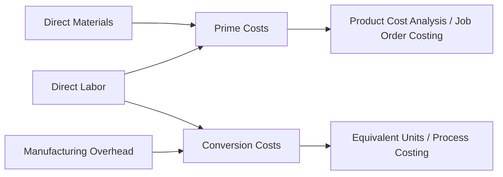

## Prime Costs and Conversion Costs

### Definition

Prime costs and conversion costs are two alternative groupings of manufacturing costs, each combining two of the three fundamental manufacturing cost elements (Direct Materials, Direct Labor, Manufacturing Overhead) to highlight a different economic perspective on production.

$$\text{Prime Costs} = \text{Direct Materials (DM)} + \text{Direct Labor (DL)}$$

$$\text{Conversion Costs} = \text{Direct Labor (DL)} + \text{Manufacturing Overhead (MOH)}$$

Direct labor appears in **both** groupings, since it functions simultaneously as a primary traceable input to the product and as a core component of the effort required to convert raw materials into a finished good.

### Prime Costs

**Conceptual Basis**

Prime costs represent the primary, directly traceable inputs that go into making a product — the costs most closely and unambiguously associated with the physical creation of a specific unit or batch.

**Composition**

- Direct Materials — raw materials physically incorporated into and traceable to the finished product
- Direct Labor — wages of workers whose time is directly and economically traceable to production

**Why It Matters**

- Prime costs are typically the most **controllable and visible** manufacturing costs, since both components can be tracked and traced with precision (unlike overhead, which requires allocation).
- Prime cost is often used as a quick approximation of a product's "core" cost before accounting for shared/indirect production costs.
- In labor-intensive or materials-intensive industries, prime cost can represent the majority of total product cost.

### Conversion Costs

**Conceptual Basis**

Conversion costs represent the costs incurred to **convert** raw materials into a finished product — i.e., the transformation effort, encompassing both the direct labor performing that transformation and the overhead resources supporting it (equipment, facilities, indirect labor, utilities).

**Composition**

- Direct Labor — the direct transformation effort
- Manufacturing Overhead — indirect materials, indirect labor, factory rent, utilities, depreciation, and other production-support costs

**Why It Matters**

- Conversion cost is a central concept in **process costing** environments (e.g., chemicals, food processing, oil refining), where raw materials are often added entirely at the beginning of the production process, while labor and overhead (conversion effort) are incurred relatively evenly as the product moves through production stages.
- In process costing, **equivalent units of production** are frequently calculated separately for materials and for conversion costs, since the two are typically added to the product at different rates or points in the process.
- Conversion cost also highlights the level of **automation and capital intensity** of a production process — highly automated processes tend to have low direct labor but high manufacturing overhead (depreciation on machinery), while labor-intensive processes show the reverse pattern.

### Comparison Table

| Dimension | Prime Costs | Conversion Costs |
| --- | --- | --- |
| Formula | DM + DL | DL + MOH |
| Shared component | Direct Labor | Direct Labor |
| Conceptual focus | Direct, traceable inputs to the product | Effort to transform materials into a finished good |
| Most relevant in | Job order costing, product cost analysis | Process costing, equivalent unit calculations |
| Traceability | Fully traceable (no allocation involved) | Partially allocated (MOH requires an allocation base) |

### Why Overlap Matters: The Role of Direct Labor

Direct labor sits at the intersection of both categories, which reflects an important conceptual point: direct labor is simultaneously a **direct, traceable input** (like materials) and a **conversion effort** (like overhead, which also supports transformation). This dual classification is intentional — it allows analysts to view the same cost from two different angles depending on whether they are focused on cost traceability (prime cost lens) or production process efficiency (conversion cost lens).

### Illustrative Example

A textile manufacturer produces a batch of 1,000 shirts with the following costs:

| Cost Item | Amount |
| --- | --- |
| Fabric (Direct Materials) | $4,000 |
| Sewing labor (Direct Labor) | $3,000 |
| Factory rent, utilities, depreciation, supervisor salary (Manufacturing Overhead) | $2,500 |

**Prime Costs:**

$$\text{Prime Costs} = \$4{,}000 + \$3{,}000 = \$7{,}000$$

**Conversion Costs:**

$$\text{Conversion Costs} = \$3{,}000 + \$2{,}500 = \$5{,}500$$

**Total Manufacturing Cost:**

$$\text{Total Manufacturing Cost} = \$4{,}000 + \$3{,}000 + \$2{,}500 = \$9{,}500$$

Note that prime costs ($7,000) and conversion costs ($5,500) sum to $12,500 — more than the total manufacturing cost of $9,500 — because direct labor ($3,000) is counted once within each grouping. This double-counting is expected and does not indicate an error; prime costs and conversion costs are two overlapping lenses on the same underlying cost data, not mutually exclusive partitions.

### Conceptual Diagram

### Key Points

- Prime costs = **Direct Materials + Direct Labor**; Conversion costs = **Direct Labor + Manufacturing Overhead**.
- **Direct labor is the shared element** between both groupings — it represents both a traceable input and part of the transformation effort.
- Prime costs and conversion costs are **not mutually exclusive categories** that partition total manufacturing cost; they overlap by design and will sum to more than total manufacturing cost.
- Conversion cost is especially important in **process costing**, where materials and conversion costs are frequently tracked separately using equivalent units of production due to differing points of cost incurrence during the production process.
- The relative weight of prime cost versus conversion cost in a given industry offers insight into whether production is **labor-intensive** or **capital/overhead-intensive**.

### Related Topics

- Manufacturing Costs (Direct Materials, Direct Labor, Manufacturing Overhead)
- Direct Costs versus Indirect Costs
- Job Order Costing vs. Process Costing
- Equivalent Units of Production
- Cost of Goods Manufactured and Cost of Goods Sold
- Manufacturing Overhead and Overhead Allocation