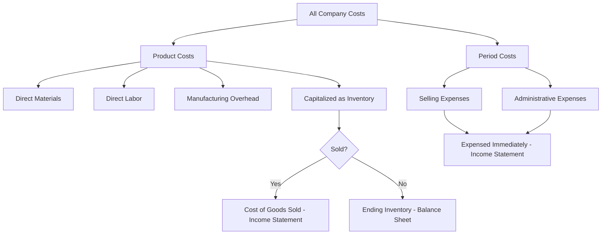

## Product Costs versus Period Costs

### Definition

The product cost versus period cost classification is based on **when a cost is recognized as an expense** on the income statement — specifically, whether a cost is initially capitalized as an asset (inventory) and expensed only when the related product is sold, or expensed immediately in the period incurred, regardless of sales activity.

- **Product costs** (also called inventoriable costs) are capitalized as part of inventory and expensed as **Cost of Goods Sold (COGS)** only when the product is sold.
- **Period costs** are expensed in the period incurred, regardless of production or sales volume, and never appear as part of inventory value.

This classification governs external financial reporting under GAAP/IFRS and is distinct from the direct/indirect and fixed/variable classifications, which address different questions (traceability and behavior, respectively).

### Product Costs

**Definition:** All costs involved in acquiring or manufacturing a product, which are capitalized into inventory until the product is sold.

**Composition (Manufacturing Context)**

$$\text{Product Costs} = \text{Direct Materials} + \text{Direct Labor} + \text{Manufacturing Overhead}$$

Product costs correspond exactly to the three manufacturing cost elements — all costs incurred inside the factory to produce inventory.

**Flow Through the Financial Statements**

1. Costs are incurred during production and capitalized as **Work in Process (WIP) Inventory**
2. Upon completion, costs move to **Finished Goods Inventory**
3. Upon sale, costs are transferred from Finished Goods Inventory to **Cost of Goods Sold (COGS)** on the income statement

Until the sale occurs, product costs remain on the **balance sheet** as an asset (inventory), not on the income statement as an expense.

### Period Costs

**Definition:** All costs that are not related to manufacturing a product and are expensed in the period incurred, regardless of when (or whether) related products are sold.

**Composition**

- **Selling expenses** — sales salaries and commissions, advertising, shipping to customers, sales office expenses
- **Administrative (General & Administrative / G&A) expenses** — executive salaries, corporate office rent, accounting and legal department costs, general office supplies

**Flow Through the Financial Statements**

Period costs are expensed directly on the income statement in the period they are incurred — they never pass through inventory accounts and are never included in the cost of a manufactured product.

### Comparison Table

| Dimension | Product Costs | Period Costs |
| --- | --- | --- |
| Relationship to production | Directly tied to manufacturing the product | Not related to production |
| Initial treatment | Capitalized as inventory (asset) | Expensed immediately |
| When expensed | Only when the product is sold (as COGS) | In the period incurred |
| Balance sheet impact | Appears in inventory until sold | Never appears in inventory |
| Examples | Direct materials, direct labor, manufacturing overhead | Sales commissions, advertising, executive salaries, office rent |
| GAAP/IFRS treatment | Required to be capitalized (matching principle) | Expensed as incurred |

### Why This Distinction Matters

**Matching Principle**

The product/period distinction operationalizes the accounting **matching principle** — the idea that costs should be recognized as expenses in the same period as the revenue they help generate. Product costs are matched with the revenue from the sale of the related units; period costs are matched with the period in which they support general operations, since they do not directly generate specific units of inventory.

**Impact on Reported Profitability**

Because product costs are deferred (capitalized) until sale, a company that produces more units than it sells in a given period will report **higher net income** than one that expenses all its manufacturing costs immediately — since some product costs remain on the balance sheet as unsold inventory rather than flowing through the income statement. This dynamic is central to the distinction between **absorption costing** (which capitalizes all manufacturing costs, including fixed MOH, as product costs) and **variable costing** (which treats fixed MOH as a period cost) — a distinction covered separately as a managerial accounting topic.

**Inventory Valuation**

Because product costs determine what is capitalized as inventory, the classification directly affects the **balance sheet value of inventory** reported under GAAP/IFRS — misclassifying a period cost as a product cost (or vice versa) would misstate both inventory and net income.

**Managerial Relevance**

While product/period cost classification is primarily an external reporting concept, management accountants must understand it because:

- It affects how product profitability is measured on external financial statements
- It underlies the difference between absorption costing (required for external reporting) and variable/direct costing (often preferred internally for decision-making, since it isolates cost behavior more clearly)

### Illustrative Example

A furniture manufacturer incurs the following costs in a month, producing 1,000 chairs but selling only 800 of them:

| Cost Item | Amount | Classification |
| --- | --- | --- |
| Lumber (Direct Materials) | $8,000 | Product Cost |
| Assembly labor (Direct Labor) | $6,000 | Product Cost |
| Factory rent and depreciation (Manufacturing Overhead) | $4,000 | Product Cost |
| Sales commissions | $2,000 | Period Cost |
| Advertising | $1,500 | Period Cost |
| Corporate office rent | $1,000 | Period Cost |

**Total Product Costs (manufacturing):**

$$\$8{,}000 + \$6{,}000 + \$4{,}000 = \$18{,}000 \text{ for } 1{,}000 \text{ chairs} = \$18 \text{ per chair}$$

Since only 800 of the 1,000 chairs were sold:

$$\text{COGS} = 800 \times \$18 = \$14{,}400 \text{ (expensed this period)}$$

$$\text{Ending Inventory} = 200 \times \$18 = \$3{,}600 \text{ (remains on balance sheet)}$$

**Total Period Costs (expensed regardless of units sold):**

$$\$2{,}000 + \$1{,}500 + \$1{,}000 = \$4{,}500 \text{ (fully expensed this period)}$$

Notice that $3,600 of manufacturing cost is deferred on the balance sheet as inventory, while all $4,500 of period costs are expensed immediately — illustrating why the classification directly affects reported net income for the period.

### Conceptual Diagram

### Key Points

- Product costs are **capitalized into inventory** and expensed as COGS only upon sale; period costs are **expensed immediately** regardless of sales activity.
- Product costs correspond exactly to the **three manufacturing cost elements** (DM, DL, MOH); period costs consist of **selling and administrative expenses**.
- This classification operationalizes the **matching principle** in financial accounting, aligning cost recognition with related revenue recognition.
- When production exceeds sales in a period, some product costs remain **deferred in ending inventory**, which can materially affect reported net income compared to a scenario where all manufacturing costs were expensed immediately.
- The distinction underlies the difference between **absorption costing** (GAAP/IFRS-required, treats fixed MOH as a product cost) and **variable costing** (commonly used internally, treats fixed MOH as a period cost) — a key comparison in managerial decision-making.

### Related Topics

- Manufacturing Costs (Direct Materials, Direct Labor, Manufacturing Overhead)
- Absorption Costing versus Variable (Direct) Costing
- Cost of Goods Manufactured and Cost of Goods Sold
- The Matching Principle in Financial Accounting
- Inventory Valuation Methods
- Direct Costs versus Indirect Costs